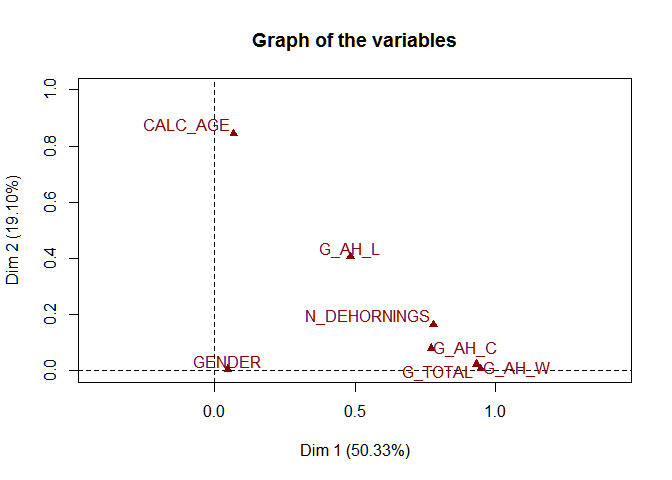
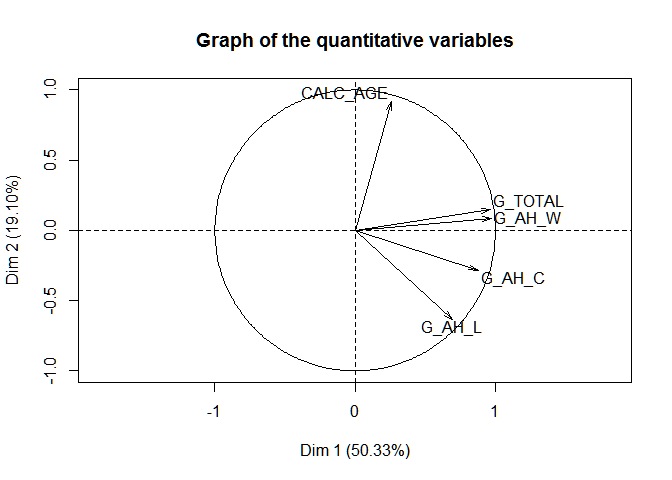
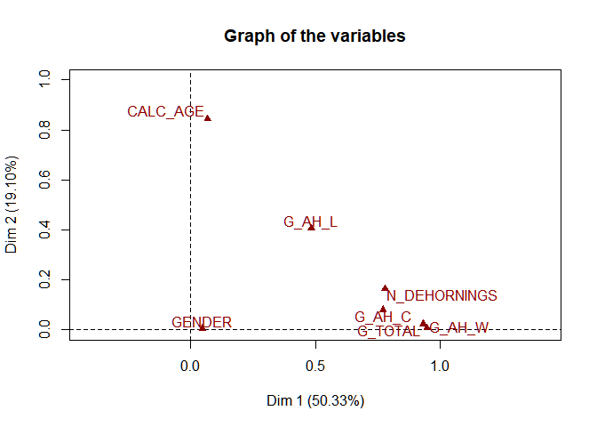

The effect of dehorning and other potential factors influencing horn growth in game-ranched white rhinoceroses (Ceratotherium simum simum)
================

This is a notebook for the dehorning data of Ververs et al. (2018). When you execute code within the notebook, the results appear beneath the code.

Statistical analysis preface
----------------------------

Currently the following R packages were loaded

    ## Loading required package: openxlsx

    ## Loading required package: effects

    ## Loading required package: carData

    ## lattice theme set by effectsTheme()
    ## See ?effectsTheme for details.

    ## Loading required package: psych

    ## Loading required package: lsmeans

    ## The 'lsmeans' package is being deprecated.
    ## Users are encouraged to switch to 'emmeans'.
    ## See help('transition') for more information, including how
    ## to convert 'lsmeans' objects and scripts to work with 'emmeans'.

    ## Loading required package: FactoMineR

    ## Loading required package: factoextra

    ## Loading required package: ggplot2

    ## 
    ## Attaching package: 'ggplot2'

    ## The following objects are masked from 'package:psych':
    ## 
    ##     %+%, alpha

    ## Welcome! Related Books: `Practical Guide To Cluster Analysis in R` at https://goo.gl/13EFCZ

Data extraction, transformation and loading
-------------------------------------------

The data was read from the excel file containing all dehorings, and some

This has a first larger dataset is loaded in memory to start from.

Descriptive statistics
======================

A summary is requested holding [descriptive statistics](%5Bhttps://en.wikipedia.org/wiki/Descriptive_statistics).

All sexes together
------------------

``` r
summary(df.cv.final)
```

    ##   GENDER         AH_W_G         PH_W_G        SHAVINGS_W_G  
    ##  F   :1297   Min.   :   5   Min.   :   2.0   Min.   :  6.0  
    ##  M   : 747   1st Qu.: 849   1st Qu.: 142.0   1st Qu.: 61.0  
    ##  NA's:   1   Median :1263   Median : 259.0   Median : 99.0  
    ##              Mean   :1339   Mean   : 308.9   Mean   :103.9  
    ##              3rd Qu.:1670   3rd Qu.: 406.0   3rd Qu.:139.0  
    ##              Max.   :5900   Max.   :2336.0   Max.   :495.0  
    ##              NA's   :4      NA's   :216      NA's   :175    
    ##      TOTAL           AH_L            AH_C         AH_STUMP_L    
    ##  Min.   :   5   Min.   : 15.0   Min.   : 55.0   Min.   : 10.00  
    ##  1st Qu.:1017   1st Qu.:119.0   1st Qu.:505.0   1st Qu.: 75.00  
    ##  Median :1610   Median :145.0   Median :590.0   Median : 80.00  
    ##  Mean   :1708   Mean   :168.8   Mean   :572.7   Mean   : 84.74  
    ##  3rd Qu.:2173   3rd Qu.:185.0   3rd Qu.:645.0   3rd Qu.: 90.00  
    ##  Max.   :8166   Max.   :835.0   Max.   :870.0   Max.   :145.00  
    ##                 NA's   :37      NA's   :90      NA's   :185     
    ##       PH_L            PH_C         PH_STUMP_L        CALC_AGE   
    ##  Min.   :  5.0   Min.   : 20.0   Min.   :  5.00   Min.   :  58  
    ##  1st Qu.: 40.0   1st Qu.:420.0   1st Qu.: 20.00   1st Qu.: 924  
    ##  Median : 50.0   Median :510.0   Median : 25.00   Median :1379  
    ##  Mean   : 56.6   Mean   :491.2   Mean   : 27.25   Mean   :1555  
    ##  3rd Qu.: 65.0   3rd Qu.:575.0   3rd Qu.: 30.00   3rd Qu.:1967  
    ##  Max.   :250.0   Max.   :960.0   Max.   :100.00   Max.   :5909  
    ##  NA's   :222     NA's   :129     NA's   :343      NA's   :956   
    ##   CALC_ARRIVAL       DH_YEAR       DH_MONTH   DH_QUARTER     W_DIFF    
    ##  Min.   :-318.0   2014   :548   11     :316   1:283      Min.   :-498  
    ##  1st Qu.: 479.0   2015   :531   9      :309   2:553      1st Qu.: 796  
    ##  Median : 786.0   2013   :340   5      :251   3:542      Median :1050  
    ##  Mean   : 882.2   2012   :319   6      :195   4:667      Mean   :1126  
    ##  3rd Qu.:1274.5   2011   :252   12     :192              3rd Qu.:1335  
    ##  Max.   :5468.0   2010   : 44   7      :167              Max.   :5313  
    ##  NA's   :498      (Other): 11   (Other):615              NA's   :220   
    ##      L_DIFF           C_DIFF            B_YEAR       B_MONTH    B_QUARTER 
    ##  Min.   :-106.0   Min.   :-840.00   2010   :201   3      :169   1   :400  
    ##  1st Qu.:  70.0   1st Qu.:  50.00   2008   :191   4      :124   2   :313  
    ##  Median :  90.0   Median :  80.00   2011   :190   1      :116   3   :183  
    ##  Mean   : 113.4   Mean   :  85.44   2012   :137   6      :116   4   :193  
    ##  3rd Qu.: 135.0   3rd Qu.: 120.00   2009   : 98   2      :115   NA's:956  
    ##  Max.   : 630.0   Max.   : 608.00   (Other):272   (Other):449             
    ##  NA's   :226      NA's   :134       NA's   :956   NA's   :956             
    ##    DIM_DEHORN       INT_DEHORN     CALC_PARITY     C_YEAR    
    ##  Min.   :   1.0   Min.   :   0.0   0   :1447   2011   : 132  
    ##  1st Qu.: 285.8   1st Qu.: 453.0   1   : 356   2012   : 122  
    ##  Median : 487.0   Median : 587.0   2   : 187   2013   : 114  
    ##  Mean   : 546.3   Mean   : 589.9   3   :  47   2014   :  99  
    ##  3rd Qu.: 721.5   3rd Qu.: 715.0   4   :   6   2010   :  79  
    ##  Max.   :2070.0   Max.   :1335.0   NA's:   2   (Other):  50  
    ##  NA's   :1449     NA's   :1060                 NA's   :1449  
    ##     C_MONTH     C_QUARTER   N_DEHORNINGS    GR_DAYS      
    ##  2      :  94   1   : 258   1   :1058    Min.   :   0.0  
    ##  3      :  93   2   : 152   2   : 648    1st Qu.: 540.0  
    ##  4      :  82   3   : 120   3   : 284    Median : 692.0  
    ##  1      :  71   4   :  66   4   :  48    Mean   : 832.9  
    ##  12     :  66   NA's:1449   5   :   5    3rd Qu.: 914.8  
    ##  (Other): 190               NA's:   2    Max.   :4892.0  
    ##  NA's   :1449                            NA's   :463     
    ##     G_TOTAL             G_AH_W             G_AH_L       
    ##  Min.   :  0.0090   Min.   :  0.0090   Min.   : 0.0145  
    ##  1st Qu.:  0.9284   1st Qu.:  0.8188   1st Qu.: 0.1728  
    ##  Median :  2.1526   Median :  1.7057   Median : 0.2165  
    ##  Mean   :  3.0904   Mean   :  2.3942   Mean   : 0.2515  
    ##  3rd Qu.:  3.2135   3rd Qu.:  2.4829   3rd Qu.: 0.2612  
    ##  Max.   :332.6667   Max.   :246.3333   Max.   :18.3333  
    ##  NA's   :465        NA's   :469        NA's   :491      
    ##      G_AH_C             G_PH_W            G_PH_L            G_PH_C       
    ##  Min.   :  0.0731   Min.   : 0.0098   Min.   : 0.0073   Min.   : 0.0195  
    ##  1st Qu.:  0.5434   1st Qu.: 0.1119   1st Qu.: 0.0456   1st Qu.: 0.4062  
    ##  Median :  0.8126   Median : 0.3198   Median : 0.0669   Median : 0.6739  
    ##  Mean   :  1.0452   Mean   : 0.6213   Mean   : 0.0881   Mean   : 0.8797  
    ##  3rd Qu.:  1.0843   3rd Qu.: 0.5513   3rd Qu.: 0.0900   3rd Qu.: 0.9430  
    ##  Max.   :111.6667   Max.   :86.3333   Max.   :10.0000   Max.   :86.6667  
    ##  NA's   :522        NA's   :660       NA's   :659       NA's   :550

``` r
describe(df.cv.final)
```

    ##               vars    n    mean     sd  median trimmed    mad     min
    ## GENDER*          1 2044    1.37   0.48    1.00    1.33   0.00    1.00
    ## AH_W_G           2 2041 1338.94 738.70 1263.00 1267.16 609.35    5.00
    ## PH_W_G           3 1829  308.93 246.84  259.00  275.47 192.74    2.00
    ## SHAVINGS_W_G     4 1870  103.89  57.64   99.00   99.87  57.82    6.00
    ## TOTAL            5 2045 1707.62 984.53 1610.00 1616.93 856.94    5.00
    ## AH_L             6 2008  168.81  91.64  145.00  151.88  51.89   15.00
    ## AH_C             7 1955  572.67 108.74  590.00  578.41  96.37   55.00
    ## AH_STUMP_L       8 1860   84.74  14.57   80.00   83.94  14.83   10.00
    ## PH_L             9 1823   56.60  30.79   50.00   51.62  22.24    5.00
    ## PH_C            10 1916  491.24 127.77  510.00  498.75 103.78   20.00
    ## PH_STUMP_L      11 1702   27.25  10.09   25.00   26.70   7.41    5.00
    ## CALC_AGE        12 1089 1554.74 839.96 1379.00 1452.76 748.71   58.00
    ## CALC_ARRIVAL    13 1547  882.22 612.32  786.00  843.47 590.07 -318.00
    ## DH_YEAR*        14 2045    4.34   1.45    5.00    4.44   1.48    1.00
    ## DH_MONTH*       15 2045    7.48   3.22    8.00    7.64   4.45    1.00
    ## DH_QUARTER*     16 2045    2.78   1.05    3.00    2.85   1.48    1.00
    ## W_DIFF          17 1825 1125.98 514.80 1050.00 1067.21 398.82 -498.00
    ## L_DIFF          18 1819  113.44  73.81   90.00  101.23  44.48 -106.00
    ## C_DIFF          19 1911   85.44  62.89   80.00   84.73  59.30 -840.00
    ## B_YEAR*         20 1089   10.55   2.49   11.00   10.76   2.97    1.00
    ## B_MONTH*        21 1089    5.58   3.45    5.00    5.37   4.45    1.00
    ## B_QUARTER*      22 1089    2.16   1.11    2.00    2.07   1.48    1.00
    ## DIM_DEHORN      23  596  546.29 339.53  487.00  511.57 316.54    1.00
    ## INT_DEHORN      24  985  589.93 206.17  587.00  587.22 195.70    0.00
    ## CALC_PARITY*    25 2043    1.44   0.78    1.00    1.26   0.00    1.00
    ## C_YEAR*         26  596    6.04   1.57    6.00    6.06   1.48    1.00
    ## C_MONTH*        27  596    5.38   3.74    4.00    5.11   2.97    1.00
    ## C_QUARTER*      28  596    1.99   1.04    2.00    1.86   1.48    1.00
    ## N_DEHORNINGS*   29 2043    1.68   0.82    1.00    1.56   0.00    1.00
    ## GR_DAYS         30 1582  832.91 602.41  692.00  722.57 269.83    0.00
    ## G_TOTAL         31 1580    3.09  11.76    2.15    2.13   1.75    0.01
    ## G_AH_W          32 1576    2.39   8.69    1.71    1.69   1.27    0.01
    ## G_AH_L          33 1554    0.25   0.58    0.22    0.22   0.07    0.01
    ## G_AH_C          34 1523    1.05   4.00    0.81    0.82   0.40    0.07
    ## G_PH_W          35 1385    0.62   2.86    0.32    0.35   0.32    0.01
    ## G_PH_L          36 1386    0.09   0.31    0.07    0.07   0.03    0.01
    ## G_PH_C          37 1495    0.88   3.22    0.67    0.69   0.40    0.02
    ##                   max   range  skew kurtosis    se
    ## GENDER*          2.00    1.00  0.56    -1.69  0.01
    ## AH_W_G        5900.00 5895.00  1.50     4.47 16.35
    ## PH_W_G        2336.00 2334.00  1.94     7.04  5.77
    ## SHAVINGS_W_G   495.00  489.00  0.91     2.01  1.33
    ## TOTAL         8166.00 8161.00  1.29     3.45 21.77
    ## AH_L           835.00  820.00  2.76    10.17  2.05
    ## AH_C           870.00  815.00 -0.84     1.98  2.46
    ## AH_STUMP_L     145.00  135.00  0.47     1.53  0.34
    ## PH_L           250.00  245.00  2.17     6.48  0.72
    ## PH_C           960.00  940.00 -0.62     0.46  2.92
    ## PH_STUMP_L     100.00   95.00  0.97     2.69  0.24
    ## CALC_AGE      5909.00 5851.00  1.30     2.32 25.45
    ## CALC_ARRIVAL  5468.00 5786.00  0.80     2.27 15.57
    ## DH_YEAR*         8.00    7.00 -0.45    -0.89  0.03
    ## DH_MONTH*       12.00   11.00 -0.30    -1.06  0.07
    ## DH_QUARTER*      4.00    3.00 -0.27    -1.18  0.02
    ## W_DIFF        5313.00 5811.00  1.96     7.82 12.05
    ## L_DIFF         630.00  736.00  2.22     7.45  1.73
    ## C_DIFF         608.00 1448.00 -1.14    27.34  1.44
    ## B_YEAR*         16.00   15.00 -0.83     0.78  0.08
    ## B_MONTH*        12.00   11.00  0.46    -1.01  0.10
    ## B_QUARTER*       4.00    3.00  0.48    -1.13  0.03
    ## DIM_DEHORN    2070.00 2069.00  1.05     1.38 13.91
    ## INT_DEHORN    1335.00 1335.00  0.12     0.74  6.57
    ## CALC_PARITY*     5.00    4.00  1.79     2.65  0.02
    ## C_YEAR*          9.00    8.00 -0.13    -0.55  0.06
    ## C_MONTH*        12.00   11.00  0.60    -1.11  0.15
    ## C_QUARTER*       4.00    3.00  0.61    -0.91  0.04
    ## N_DEHORNINGS*    5.00    4.00  1.02     0.42  0.02
    ## GR_DAYS       4892.00 4892.00  2.98    11.58 15.15
    ## G_TOTAL        332.67  332.66 24.17   638.75  0.30
    ## G_AH_W         246.33  246.32 24.25   641.86  0.22
    ## G_AH_L          18.33   18.32 25.62   727.69  0.01
    ## G_AH_C         111.67  111.59 26.06   700.90  0.10
    ## G_PH_W          86.33   86.32 23.35   638.99  0.08
    ## G_PH_L          10.00    9.99 26.54   788.65  0.01
    ## G_PH_C          86.67   86.65 25.43   672.70  0.08

Males
-----

``` r
summary(df.cv.final[df.cv.final$GENDER == "M", ])
```

    ##   GENDER        AH_W_G           PH_W_G        SHAVINGS_W_G  
    ##  F   :  0   Min.   :  18.0   Min.   :   8.0   Min.   :  6.0  
    ##  M   :747   1st Qu.: 853.5   1st Qu.: 101.8   1st Qu.: 55.0  
    ##  NA's:  1   Median :1302.0   Median : 263.0   Median :100.0  
    ##             Mean   :1400.5   Mean   : 329.9   Mean   :108.8  
    ##             3rd Qu.:1788.5   3rd Qu.: 468.8   3rd Qu.:148.0  
    ##             Max.   :5830.0   Max.   :2336.0   Max.   :372.0  
    ##             NA's   :1        NA's   :70       NA's   :47     
    ##      TOTAL           AH_L          AH_C         AH_STUMP_L    
    ##  Min.   :  18   Min.   : 15   Min.   : 80.0   Min.   : 35.00  
    ##  1st Qu.:1000   1st Qu.:120   1st Qu.:496.2   1st Qu.: 80.00  
    ##  Median :1675   Median :160   Median :575.0   Median : 85.00  
    ##  Mean   :1802   Mean   :174   Mean   :580.0   Mean   : 89.57  
    ##  3rd Qu.:2361   3rd Qu.:200   3rd Qu.:680.0   3rd Qu.:100.00  
    ##  Max.   :8166   Max.   :600   Max.   :870.0   Max.   :145.00  
    ##  NA's   :1      NA's   :7     NA's   :26      NA's   :49      
    ##       PH_L             PH_C         PH_STUMP_L        CALC_AGE   
    ##  Min.   : 10.00   Min.   : 20.0   Min.   :  5.00   Min.   :  58  
    ##  1st Qu.: 38.75   1st Qu.:400.0   1st Qu.: 20.00   1st Qu.: 928  
    ##  Median : 50.00   Median :540.0   Median : 30.00   Median :1406  
    ##  Mean   : 54.53   Mean   :519.5   Mean   : 28.29   Mean   :1576  
    ##  3rd Qu.: 65.00   3rd Qu.:636.2   3rd Qu.: 35.00   3rd Qu.:2053  
    ##  Max.   :235.00   Max.   :800.0   Max.   :100.00   Max.   :5468  
    ##  NA's   :72       NA's   :36      NA's   :105      NA's   :160   
    ##   CALC_ARRIVAL       DH_YEAR       DH_MONTH   DH_QUARTER     W_DIFF      
    ##  Min.   :   0.0   2014   :206   11     :128   1   :113   Min.   :-498.0  
    ##  1st Qu.: 418.8   2015   :196   9      :108   2   :175   1st Qu.: 825.2  
    ##  Median : 745.5   2012   :120   6      : 84   3   :193   Median :1083.5  
    ##  Mean   : 820.7   2013   :112   12     : 84   4   :266   Mean   :1158.8  
    ##  3rd Qu.:1169.8   2011   : 84   5      : 68   NA's:  1   3rd Qu.:1400.0  
    ##  Max.   :5468.0   (Other): 29   (Other):275              Max.   :3709.0  
    ##  NA's   :246      NA's   :  1   NA's   :  1              NA's   :70      
    ##      L_DIFF          C_DIFF            B_YEAR       B_MONTH    B_QUARTER 
    ##  Min.   :-65.0   Min.   :-140.00   2008   :133   3      : 84   1   :176  
    ##  1st Qu.: 75.0   1st Qu.:  20.00   2011   : 90   4      : 67   2   :177  
    ##  Median :110.0   Median :  60.00   2010   : 81   9      : 66   3   :135  
    ##  Mean   :122.2   Mean   :  64.03   2012   : 71   1      : 62   4   :100  
    ##  3rd Qu.:156.2   3rd Qu.: 100.00   2009   : 53   6      : 61   NA's:160  
    ##  Max.   :418.0   Max.   : 409.00   (Other):160   (Other):248             
    ##  NA's   :72      NA's   :37        NA's   :160   NA's   :160             
    ##    DIM_DEHORN    INT_DEHORN     CALC_PARITY     C_YEAR       C_MONTH   
    ##  Min.   : 86   Min.   :  35.0   0   :743    2011   :  1   2      :  1  
    ##  1st Qu.:137   1st Qu.: 433.0   1   :  1    2013   :  1   3      :  1  
    ##  Median :188   Median : 560.0   2   :  1    2007   :  0   1      :  0  
    ##  Mean   :188   Mean   : 544.2   3   :  0    2008   :  0   4      :  0  
    ##  3rd Qu.:239   3rd Qu.: 653.0   4   :  0    2009   :  0   5      :  0  
    ##  Max.   :290   Max.   :1267.0   NA's:  3    (Other):  0   (Other):  0  
    ##  NA's   :746   NA's   :394                  NA's   :746   NA's   :746  
    ##  C_QUARTER  N_DEHORNINGS    GR_DAYS          G_TOTAL       
    ##  1   :  2   1   :391     Min.   :  35.0   Min.   : 0.2136  
    ##  2   :  0   2   :218     1st Qu.: 546.5   1st Qu.: 0.9866  
    ##  3   :  0   3   :108     Median : 672.0   Median : 2.0951  
    ##  4   :  0   4   : 26     Mean   : 849.5   Mean   : 2.7944  
    ##  NA's:746   5   :  2     3rd Qu.: 932.5   3rd Qu.: 3.7049  
    ##             NA's:  3     Max.   :4697.0   Max.   :39.5676  
    ##                          NA's   :81       NA's   :81       
    ##      G_AH_W            G_AH_L            G_AH_C            G_PH_W        
    ##  Min.   : 0.2136   Min.   :0.02181   Min.   : 0.0779   Min.   : 0.01020  
    ##  1st Qu.: 0.8555   1st Qu.:0.19410   1st Qu.: 0.5202   1st Qu.: 0.08737  
    ##  Median : 1.6907   Median :0.23309   Median : 0.7977   Median : 0.32456  
    ##  Mean   : 2.1541   Mean   :0.24009   Mean   : 0.9128   Mean   : 0.53851  
    ##  3rd Qu.: 2.8556   3rd Qu.:0.26881   3rd Qu.: 1.1688   3rd Qu.: 0.69767  
    ##  Max.   :28.3784   Max.   :2.71429   Max.   :13.2857   Max.   :11.18919  
    ##  NA's   :81        NA's   :86        NA's   :101       NA's   :147       
    ##      G_PH_L            G_PH_C        
    ##  Min.   :0.00860   Min.   : 0.01947  
    ##  1st Qu.:0.04320   1st Qu.: 0.41370  
    ##  Median :0.06807   Median : 0.68516  
    ##  Mean   :0.07710   Mean   : 0.81241  
    ##  3rd Qu.:0.09511   3rd Qu.: 1.07997  
    ##  Max.   :1.28571   Max.   :13.14286  
    ##  NA's   :148       NA's   :110

``` r
describe(df.cv.final[df.cv.final$GENDER == "M", ])
```

    ##               vars   n    mean      sd  median trimmed     mad     min
    ## GENDER*          1 747    2.00    0.00    2.00    2.00    0.00    2.00
    ## AH_W_G           2 747 1400.51  776.26 1302.00 1323.66  687.93   18.00
    ## PH_W_G           3 678  329.86  300.33  263.00  285.08  261.68    8.00
    ## SHAVINGS_W_G     4 701  108.82   66.53  100.00  102.62   69.68    6.00
    ## TOTAL            5 747 1802.02 1089.14 1675.00 1689.71 1005.20   18.00
    ## AH_L             6 741  174.02   75.46  160.00  164.05   59.30   15.00
    ## AH_C             7 722  580.01  124.90  575.00  582.18  140.85   80.00
    ## AH_STUMP_L       8 699   89.57   17.11   85.00   88.68   14.83   35.00
    ## PH_L             9 676   54.53   27.73   50.00   50.59   22.24   10.00
    ## PH_C            10 712  519.45  144.12  540.00  527.10  163.09   20.00
    ## PH_STUMP_L      11 643   28.29   11.02   30.00   27.57   14.83    5.00
    ## CALC_AGE        12 588 1576.42  812.36 1405.50 1494.02  779.85   58.00
    ## CALC_ARRIVAL    13 502  820.66  627.11  745.50  766.32  571.54    0.00
    ## DH_YEAR*        14 747    4.37    1.47    5.00    4.48    1.48    1.00
    ## DH_MONTH*       15 747    7.66    3.30    9.00    7.86    2.97    1.00
    ## DH_QUARTER*     16 747    2.82    1.08    3.00    2.90    1.48    1.00
    ## W_DIFF          17 678 1158.75  507.86 1083.50 1105.41  414.39 -498.00
    ## L_DIFF          18 676  122.24   62.78  110.00  114.97   59.30  -65.00
    ## C_DIFF          19 711   64.03   63.31   60.00   61.80   59.30 -140.00
    ## B_YEAR*         20 588   10.31    2.51   11.00   10.46    2.97    2.00
    ## B_MONTH*        21 588    5.93    3.36    6.00    5.82    4.45    1.00
    ## B_QUARTER*      22 588    2.27    1.07    2.00    2.21    1.48    1.00
    ## DIM_DEHORN      23   2  188.00  144.25  188.00  188.00  151.23   86.00
    ## INT_DEHORN      24 354  544.23  161.20  560.00  546.75  158.64   35.00
    ## CALC_PARITY*    25 745    1.00    0.08    1.00    1.00    0.00    1.00
    ## C_YEAR*         26   2    6.00    1.41    6.00    6.00    1.48    5.00
    ## C_MONTH*        27   2    2.50    0.71    2.50    2.50    0.74    2.00
    ## C_QUARTER*      28   2    1.00    0.00    1.00    1.00    0.00    1.00
    ## N_DEHORNINGS*   29 745    1.70    0.86    1.00    1.57    0.00    1.00
    ## GR_DAYS         30 667  849.48  596.98  672.00  736.92  295.04   35.00
    ## G_TOTAL         31 667    2.79    3.21    2.10    2.31    1.85    0.21
    ## G_AH_W          32 667    2.15    2.31    1.69    1.82    1.34    0.21
    ## G_AH_L          33 662    0.24    0.15    0.23    0.23    0.06    0.02
    ## G_AH_C          34 647    0.91    0.70    0.80    0.84    0.46    0.08
    ## G_PH_W          35 601    0.54    0.92    0.32    0.38    0.38    0.01
    ## G_PH_L          36 600    0.08    0.07    0.07    0.07    0.04    0.01
    ## G_PH_C          37 638    0.81    0.69    0.69    0.74    0.46    0.02
    ##                   max   range  skew kurtosis     se
    ## GENDER*          2.00    0.00   NaN      NaN   0.00
    ## AH_W_G        5830.00 5812.00  1.41     3.76  28.40
    ## PH_W_G        2336.00 2328.00  1.99     6.58  11.53
    ## SHAVINGS_W_G   372.00  366.00  0.89     0.76   2.51
    ## TOTAL         8166.00 8148.00  1.38     3.55  39.85
    ## AH_L           600.00  585.00  1.76     5.01   2.77
    ## AH_C           870.00  790.00 -0.39     0.60   4.65
    ## AH_STUMP_L     145.00  110.00  0.44     0.20   0.65
    ## PH_L           235.00  225.00  2.17     7.73   1.07
    ## PH_C           800.00  780.00 -0.49    -0.38   5.40
    ## PH_STUMP_L     100.00   95.00  0.99     2.76   0.43
    ## CALC_AGE      5468.00 5410.00  1.01     1.24  33.50
    ## CALC_ARRIVAL  5468.00 5468.00  1.58     7.68  27.99
    ## DH_YEAR*         7.00    6.00 -0.48    -0.83   0.05
    ## DH_MONTH*       12.00   11.00 -0.41    -0.98   0.12
    ## DH_QUARTER*      4.00    3.00 -0.36    -1.19   0.04
    ## W_DIFF        3709.00 4207.00  1.43     3.89  19.50
    ## L_DIFF         418.00  483.00  1.11     1.54   2.41
    ## C_DIFF         409.00  549.00  0.60     2.32   2.37
    ## B_YEAR*         16.00   14.00 -0.51     0.04   0.10
    ## B_MONTH*        12.00   11.00  0.25    -1.09   0.14
    ## B_QUARTER*       4.00    3.00  0.29    -1.17   0.04
    ## DIM_DEHORN     290.00  204.00  0.00    -2.75 102.00
    ## INT_DEHORN    1267.00 1232.00 -0.05     1.12   8.57
    ## CALC_PARITY*     3.00    2.00 21.86   500.38   0.00
    ## C_YEAR*          7.00    2.00  0.00    -2.75   1.00
    ## C_MONTH*         3.00    1.00  0.00    -2.75   0.50
    ## C_QUARTER*       1.00    0.00   NaN      NaN   0.00
    ## N_DEHORNINGS*    5.00    4.00  1.05     0.34   0.03
    ## GR_DAYS       4697.00 4662.00  2.51     7.76  23.12
    ## G_TOTAL         39.57   39.35  5.68    48.78   0.12
    ## G_AH_W          28.38   28.16  5.74    49.77   0.09
    ## G_AH_L           2.71    2.69  9.67   133.84   0.01
    ## G_AH_C          13.29   13.21  8.87   146.69   0.03
    ## G_PH_W          11.19   11.18  6.48    56.82   0.04
    ## G_PH_L           1.29    1.28  9.69   135.22   0.00
    ## G_PH_C          13.14   13.12  9.31   155.91   0.03

Females
-------

``` r
summary(df.cv.final[df.cv.final$GENDER == "F", ])
```

    ##   GENDER         AH_W_G         PH_W_G        SHAVINGS_W_G  
    ##  F   :1297   Min.   :   5   Min.   :   2.0   Min.   : 10.0  
    ##  M   :   0   1st Qu.: 845   1st Qu.: 156.0   1st Qu.: 65.0  
    ##  NA's:   1   Median :1242   Median : 257.0   Median : 99.0  
    ##              Mean   :1304   Mean   : 296.6   Mean   :100.9  
    ##              3rd Qu.:1593   3rd Qu.: 386.5   3rd Qu.:133.0  
    ##              Max.   :5900   Max.   :1348.0   Max.   :495.0  
    ##              NA's   :5      NA's   :147      NA's   :129    
    ##      TOTAL           AH_L            AH_C         AH_STUMP_L    
    ##  Min.   :   5   Min.   : 20.0   Min.   : 55.0   Min.   : 10.00  
    ##  1st Qu.:1038   1st Qu.:110.0   1st Qu.:515.0   1st Qu.: 75.00  
    ##  Median :1594   Median :140.0   Median :600.0   Median : 80.00  
    ##  Mean   :1655   Mean   :165.8   Mean   :568.4   Mean   : 81.84  
    ##  3rd Qu.:2089   3rd Qu.:175.0   3rd Qu.:635.0   3rd Qu.: 90.00  
    ##  Max.   :6696   Max.   :835.0   Max.   :780.0   Max.   :130.00  
    ##  NA's   :1      NA's   :31      NA's   :65      NA's   :137     
    ##       PH_L             PH_C         PH_STUMP_L       CALC_AGE   
    ##  Min.   :  5.00   Min.   : 30.0   Min.   :10.00   Min.   :  94  
    ##  1st Qu.: 40.00   1st Qu.:423.8   1st Qu.:20.00   1st Qu.: 896  
    ##  Median : 50.00   Median :500.0   Median :25.00   Median :1349  
    ##  Mean   : 57.82   Mean   :474.5   Mean   :26.62   Mean   :1529  
    ##  3rd Qu.: 65.00   3rd Qu.:550.0   3rd Qu.:30.00   3rd Qu.:1880  
    ##  Max.   :250.00   Max.   :960.0   Max.   :80.00   Max.   :5909  
    ##  NA's   :151      NA's   :94      NA's   :239     NA's   :797   
    ##   CALC_ARRIVAL       DH_YEAR       DH_MONTH   DH_QUARTER     W_DIFF      
    ##  Min.   :-318.0   2014   :341   9      :201   1   :170   Min.   :  83.0  
    ##  1st Qu.: 517.0   2015   :335   11     :188   2   :377   1st Qu.: 779.5  
    ##  Median : 824.0   2013   :228   5      :183   3   :349   Median :1023.0  
    ##  Mean   : 911.8   2012   :199   6      :111   4   :401   Mean   :1106.6  
    ##  3rd Qu.:1331.0   2011   :168   12     :108   NA's:  1   3rd Qu.:1301.0  
    ##  Max.   :2636.0   (Other): 26   (Other):506              Max.   :5313.0  
    ##  NA's   :253      NA's   :  1   NA's   :  1              NA's   :151     
    ##      L_DIFF           C_DIFF            B_YEAR       B_MONTH    B_QUARTER 
    ##  Min.   :-106.0   Min.   :-840.00   2010   :120   2      : 85   1   :224  
    ##  1st Qu.:  65.0   1st Qu.:  60.00   2011   :100   3      : 85   2   :136  
    ##  Median :  85.0   Median :  95.00   2012   : 66   4      : 57   3   : 48  
    ##  Mean   : 108.2   Mean   :  98.12   2008   : 58   6      : 55   4   : 93  
    ##  3rd Qu.: 120.0   3rd Qu.: 130.00   2009   : 45   1      : 54   NA's:797  
    ##  Max.   : 630.0   Max.   : 608.00   (Other):112   (Other):165             
    ##  NA's   :155      NA's   :98        NA's   :797   NA's   :797             
    ##    DIM_DEHORN       INT_DEHORN     CALC_PARITY     C_YEAR       C_MONTH   
    ##  Min.   :   1.0   Min.   :   0.0   0   :703    2011   :131   2      : 93  
    ##  1st Qu.: 286.0   1st Qu.: 467.0   1   :355    2012   :122   3      : 92  
    ##  Median : 487.0   Median : 616.0   2   :186    2013   :113   4      : 82  
    ##  Mean   : 547.5   Mean   : 615.6   3   : 47    2014   : 99   1      : 71  
    ##  3rd Qu.: 722.5   3rd Qu.: 754.0   4   :  6    2010   : 79   12     : 66  
    ##  Max.   :2070.0   Max.   :1335.0   NA's:  1    (Other): 50   (Other):190  
    ##  NA's   :704      NA's   :667                  NA's   :704   NA's   :704  
    ##  C_QUARTER  N_DEHORNINGS    GR_DAYS          G_TOTAL        
    ##  1   :256   1   :666     Min.   :   0.0   Min.   :  0.0090  
    ##  2   :152   2   :430     1st Qu.: 539.0   1st Qu.:  0.8115  
    ##  3   :120   3   :176     Median : 702.0   Median :  2.1719  
    ##  4   : 66   4   : 22     Mean   : 820.8   Mean   :  3.3066  
    ##  NA's:704   5   :  3     3rd Qu.: 888.5   3rd Qu.:  2.8868  
    ##             NA's:  1     Max.   :4892.0   Max.   :332.6667  
    ##                          NA's   :383      NA's   :385       
    ##      G_AH_W            G_AH_L            G_AH_C             G_PH_W       
    ##  Min.   :  0.009   Min.   : 0.0145   Min.   :  0.0731   Min.   : 0.0098  
    ##  1st Qu.:  0.743   1st Qu.: 0.1623   1st Qu.:  0.5595   1st Qu.: 0.1364  
    ##  Median :  1.713   Median : 0.2004   Median :  0.8206   Median : 0.3166  
    ##  Mean   :  2.570   Mean   : 0.2601   Mean   :  1.1430   Mean   : 0.6847  
    ##  3rd Qu.:  2.272   3rd Qu.: 0.2493   3rd Qu.:  1.0250   3rd Qu.: 0.4729  
    ##  Max.   :246.333   Max.   :18.3333   Max.   :111.6667   Max.   :86.3333  
    ##  NA's   :389       NA's   :406       NA's   :422        NA's   :514      
    ##      G_PH_L            G_PH_C       
    ##  Min.   : 0.0073   Min.   : 0.0274  
    ##  1st Qu.: 0.0472   1st Qu.: 0.3927  
    ##  Median : 0.0660   Median : 0.6723  
    ##  Mean   : 0.0964   Mean   : 0.9298  
    ##  3rd Qu.: 0.0849   3rd Qu.: 0.8602  
    ##  Max.   :10.0000   Max.   :86.6667  
    ##  NA's   :512       NA's   :441

``` r
describe(df.cv.final[df.cv.final$GENDER == "F", ])
```

    ##               vars    n    mean     sd  median trimmed    mad     min
    ## GENDER*          1 1297    1.00   0.00    1.00    1.00   0.00    1.00
    ## AH_W_G           2 1293 1304.37 713.42 1242.00 1236.49 551.53    5.00
    ## PH_W_G           3 1151  296.61 208.19  257.00  271.27 163.09    2.00
    ## SHAVINGS_W_G     4 1169  100.93  51.38   99.00   98.91  50.41   10.00
    ## TOTAL            5 1297 1654.54 914.23 1594.00 1580.59 779.85    5.00
    ## AH_L             6 1267  165.77  99.80  140.00  144.77  44.48   20.00
    ## AH_C             7 1233  568.38  97.85  600.00  579.56  74.13   55.00
    ## AH_STUMP_L       8 1161   81.84  11.90   80.00   81.87  14.83   10.00
    ## PH_L             9 1147   57.82  32.40   50.00   52.25  14.83    5.00
    ## PH_C            10 1204  474.55 113.84  500.00  487.80  88.96   30.00
    ## PH_STUMP_L      11 1059   26.62   9.44   25.00   26.17   7.41   10.00
    ## CALC_AGE        12  501 1529.31 871.36 1349.00 1404.41 722.03   94.00
    ## CALC_ARRIVAL    13 1045  911.79 603.16  824.00  881.29 598.97 -318.00
    ## DH_YEAR*        14 1297    4.32   1.43    5.00    4.42   1.48    1.00
    ## DH_MONTH*       15 1297    7.39   3.17    7.00    7.52   4.45    1.00
    ## DH_QUARTER*     16 1297    2.76   1.03    3.00    2.82   1.48    1.00
    ## W_DIFF          17 1147 1106.60 518.11 1023.00 1044.93 382.51   83.00
    ## L_DIFF          18 1143  108.24  79.19   85.00   93.02  37.06 -106.00
    ## C_DIFF          19 1200   98.12  59.12   95.00   96.78  51.89 -840.00
    ## B_YEAR*         20  501   10.83   2.45   11.00   11.10   1.48    1.00
    ## B_MONTH*        21  501    5.16   3.52    4.00    4.83   2.97    1.00
    ## B_QUARTER*      22  501    2.02   1.13    2.00    1.90   1.48    1.00
    ## DIM_DEHORN      23  594  547.50 339.41  487.00  512.77 316.54    1.00
    ## INT_DEHORN      24  631  615.57 223.60  616.00  614.64 212.01    0.00
    ## CALC_PARITY*    25 1297    1.69   0.88    1.00    1.55   0.00    1.00
    ## C_YEAR*         26  594    6.04   1.57    6.00    6.06   1.48    1.00
    ## C_MONTH*        27  594    5.39   3.74    4.00    5.12   2.97    1.00
    ## C_QUARTER*      28  594    1.99   1.04    2.00    1.87   1.48    1.00
    ## N_DEHORNINGS*   29 1297    1.66   0.79    1.00    1.55   0.00    1.00
    ## GR_DAYS         30  915  820.83 606.38  702.00  714.67 259.45    0.00
    ## G_TOTAL         31  913    3.31  15.23    2.17    2.02   1.52    0.01
    ## G_AH_W          32  909    2.57  11.27    1.71    1.62   1.09    0.01
    ## G_AH_L          33  892    0.26   0.76    0.20    0.21   0.06    0.01
    ## G_AH_C          34  876    1.14   5.24    0.82    0.81   0.34    0.07
    ## G_PH_W          35  784    0.68   3.72    0.32    0.32   0.24    0.01
    ## G_PH_L          36  786    0.10   0.41    0.07    0.07   0.03    0.01
    ## G_PH_C          37  857    0.93   4.21    0.67    0.66   0.34    0.03
    ##                   max   range  skew kurtosis    se
    ## GENDER*          1.00    0.00   NaN      NaN  0.00
    ## AH_W_G        5900.00 5895.00  1.55     4.96 19.84
    ## PH_W_G        1348.00 1346.00  1.42     2.92  6.14
    ## SHAVINGS_W_G   495.00  485.00  0.77     3.00  1.50
    ## TOTAL         6696.00 6691.00  1.12     2.69 25.39
    ## AH_L           835.00  815.00  2.99    10.57  2.80
    ## AH_C           780.00  725.00 -1.45     3.29  2.79
    ## AH_STUMP_L     130.00  120.00 -0.21     2.00  0.35
    ## PH_L           250.00  245.00  2.13     5.75  0.96
    ## PH_C           960.00  930.00 -1.07     1.22  3.28
    ## PH_STUMP_L      80.00   70.00  0.87     2.19  0.29
    ## CALC_AGE      5909.00 5815.00  1.58     3.30 38.93
    ## CALC_ARRIVAL  2636.00 2954.00  0.40    -0.49 18.66
    ## DH_YEAR*         8.00    7.00 -0.43    -0.93  0.04
    ## DH_MONTH*       12.00   11.00 -0.24    -1.09  0.09
    ## DH_QUARTER*      4.00    3.00 -0.22    -1.17  0.03
    ## W_DIFF        5313.00 5230.00  2.27    10.13 15.30
    ## L_DIFF         630.00  736.00  2.61     8.98  2.34
    ## C_DIFF         608.00 1448.00 -2.51    56.71  1.71
    ## B_YEAR*         15.00   14.00 -1.25     2.09  0.11
    ## B_MONTH*        12.00   11.00  0.72    -0.77  0.16
    ## B_QUARTER*       4.00    3.00  0.72    -0.93  0.05
    ## DIM_DEHORN    2070.00 2069.00  1.05     1.38 13.93
    ## INT_DEHORN    1335.00 1335.00 -0.01     0.44  8.90
    ## CALC_PARITY*     5.00    4.00  1.13     0.56  0.02
    ## C_YEAR*          9.00    8.00 -0.13    -0.55  0.06
    ## C_MONTH*        12.00   11.00  0.59    -1.12  0.15
    ## C_QUARTER*       4.00    3.00  0.61    -0.91  0.04
    ## N_DEHORNINGS*    5.00    4.00  0.99     0.41  0.02
    ## GR_DAYS       4892.00 4892.00  3.31    14.26 20.05
    ## G_TOTAL        332.67  332.66 19.20   391.14  0.50
    ## G_AH_W         246.33  246.32 19.20   391.03  0.37
    ## G_AH_L          18.33   18.32 20.22   441.43  0.03
    ## G_AH_C         111.67  111.59 20.10   411.45  0.18
    ## G_PH_W          86.33   86.32 18.69   393.65  0.13
    ## G_PH_L          10.00    9.99 20.66   467.61  0.01
    ## G_PH_C          86.67   86.64 19.77   398.97  0.14

Only first dehoring descriptives
--------------------------------

``` r
summary(df.cv.final[df.cv.final$N_DEHORNINGS == "1", ])
```

    ##   GENDER        AH_W_G           PH_W_G        SHAVINGS_W_G   
    ##  F   :666   Min.   :  12.0   Min.   :   2.0   Min.   :  6.00  
    ##  M   :391   1st Qu.: 667.2   1st Qu.:  69.0   1st Qu.: 40.00  
    ##  NA's:  3   Median :1075.5   Median : 246.0   Median : 75.00  
    ##             Mean   :1243.8   Mean   : 287.7   Mean   : 85.23  
    ##             3rd Qu.:1578.2   3rd Qu.: 408.0   3rd Qu.:118.00  
    ##             Max.   :5900.0   Max.   :2336.0   Max.   :495.00  
    ##             NA's   :4        NA's   :191      NA's   :82      
    ##      TOTAL           AH_L            AH_C         AH_STUMP_L    
    ##  Min.   :  12   Min.   : 15.0   Min.   : 55.0   Min.   : 10.00  
    ##  1st Qu.: 740   1st Qu.:135.0   1st Qu.:470.0   1st Qu.: 75.00  
    ##  Median :1330   Median :170.0   Median :550.0   Median : 80.00  
    ##  Mean   :1557   Mean   :202.6   Mean   :544.5   Mean   : 80.83  
    ##  3rd Qu.:2067   3rd Qu.:230.0   3rd Qu.:630.0   3rd Qu.: 90.00  
    ##  Max.   :8166   Max.   :835.0   Max.   :870.0   Max.   :140.00  
    ##  NA's   :2      NA's   :20      NA's   :59      NA's   :91      
    ##       PH_L             PH_C         PH_STUMP_L        CALC_AGE   
    ##  Min.   :  5.00   Min.   : 20.0   Min.   :  5.00   Min.   :  58  
    ##  1st Qu.: 40.00   1st Qu.:360.0   1st Qu.: 20.00   1st Qu.: 760  
    ##  Median : 55.00   Median :495.0   Median : 25.00   Median : 966  
    ##  Mean   : 65.54   Mean   :461.9   Mean   : 25.51   Mean   :1234  
    ##  3rd Qu.: 80.00   3rd Qu.:560.0   3rd Qu.: 30.00   3rd Qu.:1415  
    ##  Max.   :250.00   Max.   :960.0   Max.   :100.00   Max.   :4892  
    ##  NA's   :198      NA's   :98      NA's   :243      NA's   :463   
    ##   CALC_ARRIVAL        DH_YEAR       DH_MONTH   DH_QUARTER     W_DIFF    
    ##  Min.   :-318.00   2014   :250   11     :211   1   :141   Min.   :-498  
    ##  1st Qu.:  66.75   2011   :236   9      :164   2   :236   1st Qu.: 722  
    ##  Median : 520.00   2012   :197   5      :116   3   :290   Median : 954  
    ##  Mean   : 489.74   2015   :168   10     : 93   4   :391   Mean   :1107  
    ##  3rd Qu.: 760.50   2013   :162   12     : 87   NA's:  2   3rd Qu.:1324  
    ##  Max.   :4697.00   (Other): 45   (Other):387              Max.   :5313  
    ##  NA's   :314       NA's   :  2   NA's   :  2              NA's   :193   
    ##      L_DIFF           C_DIFF            B_YEAR       B_MONTH    B_QUARTER 
    ##  Min.   :-106.0   Min.   :-840.00   2011   :109   3      : 90   1   :228  
    ##  1st Qu.:  80.0   1st Qu.:  50.00   2012   :102   4      : 70   2   :159  
    ##  Median : 130.0   Median :  90.00   2013   : 88   1      : 69   3   : 91  
    ##  Mean   : 145.9   Mean   :  89.59   2010   : 86   2      : 69   4   :119  
    ##  3rd Qu.: 190.0   3rd Qu.: 127.00   2008   : 66   12     : 56   NA's:463  
    ##  Max.   : 630.0   Max.   : 300.00   (Other):146   (Other):243             
    ##  NA's   :200      NA's   :101       NA's   :463   NA's   :463             
    ##    DIM_DEHORN       INT_DEHORN   CALC_PARITY     C_YEAR       C_MONTH   
    ##  Min.   :   3.0   Min.   : NA    0   :831    2011   : 72   3      : 34  
    ##  1st Qu.: 336.0   1st Qu.: NA    1   :174    2010   : 63   2      : 31  
    ##  Median : 518.0   Median : NA    2   : 48    2012   : 31   4      : 29  
    ##  Mean   : 571.6   Mean   :NaN    3   :  4    2013   : 21   1      : 22  
    ##  3rd Qu.: 731.0   3rd Qu.: NA    4   :  1    2014   : 20   12     : 22  
    ##  Max.   :1785.0   Max.   : NA    NA's:  2    (Other): 20   (Other): 89  
    ##  NA's   :833      NA's   :1060               NA's   :833   NA's   :833  
    ##  C_QUARTER  N_DEHORNINGS    GR_DAYS        G_TOTAL           G_AH_W      
    ##  1   : 87   1   :1058    Min.   :  58   Min.   :0.0119   Min.   :0.1148  
    ##  2   : 69   2   :   0    1st Qu.: 760   1st Qu.:0.5909   1st Qu.:0.5255  
    ##  3   : 49   3   :   0    Median : 966   Median :0.7870   Median :0.6866  
    ##  4   : 22   4   :   0    Mean   :1234   Mean   :0.8446   Mean   :0.7390  
    ##  NA's:833   5   :   0    3rd Qu.:1415   3rd Qu.:1.0322   3rd Qu.:0.9116  
    ##             NA's:   2    Max.   :4892   Max.   :3.9301   Max.   :2.8694  
    ##                          NA's   :463    NA's   :463      NA's   :465     
    ##      G_AH_L           G_AH_C           G_PH_W           G_PH_L      
    ##  Min.   :0.0145   Min.   :0.0731   Min.   :0.0098   Min.   :0.0073  
    ##  1st Qu.:0.1476   1st Qu.:0.3517   1st Qu.:0.0364   1st Qu.:0.0257  
    ##  Median :0.2020   Median :0.4867   Median :0.0648   Median :0.0359  
    ##  Mean   :0.1920   Mean   :0.4823   Mean   :0.0927   Mean   :0.0390  
    ##  3rd Qu.:0.2369   3rd Qu.:0.5797   3rd Qu.:0.1154   3rd Qu.:0.0488  
    ##  Max.   :0.5714   Max.   :1.6489   Max.   :0.9409   Max.   :0.1117  
    ##  NA's   :470      NA's   :487      NA's   :631      NA's   :631     
    ##      G_PH_C      
    ##  Min.   :0.0195  
    ##  1st Qu.:0.2676  
    ##  Median :0.3463  
    ##  Mean   :0.3578  
    ##  3rd Qu.:0.4440  
    ##  Max.   :1.2381  
    ##  NA's   :515

``` r
describe(df.cv.final[df.cv.final$N_DEHORNINGS == "1", ])
```

    ## Warning in FUN(newX[, i], ...): no non-missing arguments to min; returning
    ## Inf

    ## Warning in FUN(newX[, i], ...): no non-missing arguments to max; returning
    ## -Inf

    ##               vars    n    mean      sd  median trimmed    mad     min
    ## GENDER*          1 1057    1.37    0.48    1.00    1.34   0.00    1.00
    ## AH_W_G           2 1056 1243.84  849.85 1075.50 1123.93 655.31   12.00
    ## PH_W_G           3  869  287.70  261.93  246.00  249.70 255.01    2.00
    ## SHAVINGS_W_G     4  978   85.23   58.54   75.00   78.42  57.82    6.00
    ## TOTAL            5 1058 1556.58 1110.01 1330.50 1405.26 962.21   12.00
    ## AH_L             6 1040  202.61  112.72  170.00  182.58  59.30   15.00
    ## AH_C             7 1001  544.46  117.93  550.00  550.06 118.61   55.00
    ## AH_STUMP_L       8  969   80.83   12.49   80.00   80.69   7.41   10.00
    ## PH_L             9  862   65.54   39.50   55.00   59.29  29.65    5.00
    ## PH_C            10  962  461.87  138.34  495.00  467.58 133.43   20.00
    ## PH_STUMP_L      11  817   25.51    9.50   25.00   24.75   7.41    5.00
    ## CALC_AGE        12  597 1233.80  796.19  966.00 1089.28 378.06   58.00
    ## CALC_ARRIVAL    13  746  489.74  419.62  520.00  455.92 487.78 -318.00
    ## DH_YEAR*        14 1058    3.80    1.52    4.00    3.80   1.48    1.00
    ## DH_MONTH*       15 1058    7.73    3.24    9.00    7.98   2.97    1.00
    ## DH_QUARTER*     16 1058    2.88    1.05    3.00    2.97   1.48    1.00
    ## W_DIFF          17  867 1107.20  623.75  954.00 1016.94 415.13 -498.00
    ## L_DIFF          18  860  145.95   92.60  130.00  134.63  74.13 -106.00
    ## C_DIFF          19  959   89.59   67.46   90.00   88.88  59.30 -840.00
    ## B_YEAR*         20  597   11.09    2.60   12.00   11.39   2.97    1.00
    ## B_MONTH*        21  597    5.58    3.57    5.00    5.37   4.45    1.00
    ## B_QUARTER*      22  597    2.17    1.14    2.00    2.09   1.48    1.00
    ## DIM_DEHORN      23  227  571.60  327.64  518.00  541.40 292.07    3.00
    ## INT_DEHORN      24    0     NaN      NA      NA     NaN     NA     Inf
    ## CALC_PARITY*    25 1058    1.27    0.57    1.00    1.14   0.00    1.00
    ## C_YEAR*         26  227    5.12    1.48    5.00    5.06   1.48    1.00
    ## C_MONTH*        27  227    5.53    3.55    4.00    5.30   2.97    1.00
    ## C_QUARTER*      28  227    2.03    1.00    2.00    1.91   1.48    1.00
    ## N_DEHORNINGS*   29 1058    1.00    0.00    1.00    1.00   0.00    1.00
    ## GR_DAYS         30  597 1233.80  796.19  966.00 1089.28 378.06   58.00
    ## G_TOTAL         31  597    0.84    0.38    0.79    0.81   0.32    0.01
    ## G_AH_W          32  595    0.74    0.31    0.69    0.71   0.28    0.11
    ## G_AH_L          33  590    0.19    0.08    0.20    0.19   0.06    0.01
    ## G_AH_C          34  573    0.48    0.20    0.49    0.47   0.17    0.07
    ## G_PH_W          35  429    0.09    0.10    0.06    0.08   0.05    0.01
    ## G_PH_L          36  429    0.04    0.02    0.04    0.04   0.02    0.01
    ## G_PH_C          37  545    0.36    0.13    0.35    0.35   0.13    0.02
    ##                   max   range  skew kurtosis    se
    ## GENDER*          2.00    1.00  0.54    -1.71  0.01
    ## AH_W_G        5900.00 5888.00  1.75     4.47 26.15
    ## PH_W_G        2336.00 2334.00  1.83     6.40  8.89
    ## SHAVINGS_W_G   495.00  489.00  1.48     4.23  1.87
    ## TOTAL         8166.00 8154.00  1.55     3.57 34.13
    ## AH_L           835.00  820.00  2.04     5.04  3.50
    ## AH_C           870.00  815.00 -0.75     1.74  3.73
    ## AH_STUMP_L     140.00  130.00  0.22     3.57  0.40
    ## PH_L           250.00  245.00  1.54     2.53  1.35
    ## PH_C           960.00  940.00 -0.42    -0.07  4.46
    ## PH_STUMP_L     100.00   95.00  1.43     5.65  0.33
    ## CALC_AGE      4892.00 4834.00  1.93     4.09 32.59
    ## CALC_ARRIVAL  4697.00 5015.00  1.76    12.91 15.36
    ## DH_YEAR*         8.00    7.00 -0.04    -1.21  0.05
    ## DH_MONTH*       12.00   11.00 -0.49    -0.94  0.10
    ## DH_QUARTER*      4.00    3.00 -0.44    -1.08  0.03
    ## W_DIFF        5313.00 5811.00  2.07     6.78 21.18
    ## L_DIFF         630.00  736.00  1.40     3.11  3.16
    ## C_DIFF         300.00 1140.00 -2.55    36.96  2.18
    ## B_YEAR*         16.00   15.00 -1.02     0.93  0.11
    ## B_MONTH*        12.00   11.00  0.46    -1.11  0.15
    ## B_QUARTER*       4.00    3.00  0.47    -1.22  0.05
    ## DIM_DEHORN    1785.00 1782.00  0.88     0.71 21.75
    ## INT_DEHORN       -Inf    -Inf    NA       NA    NA
    ## CALC_PARITY*     5.00    4.00  2.24     5.18  0.02
    ## C_YEAR*          9.00    8.00  0.30    -0.09  0.10
    ## C_MONTH*        12.00   11.00  0.53    -1.06  0.24
    ## C_QUARTER*       4.00    3.00  0.54    -0.87  0.07
    ## N_DEHORNINGS*    1.00    0.00   NaN      NaN  0.00
    ## GR_DAYS       4892.00 4834.00  1.93     4.09 32.59
    ## G_TOTAL          3.93    3.92  1.96    10.01  0.02
    ## G_AH_W           2.87    2.75  1.42     5.17  0.01
    ## G_AH_L           0.57    0.56  0.22     0.96  0.00
    ## G_AH_C           1.65    1.58  1.29     4.98  0.01
    ## G_PH_W           0.94    0.93  3.93    24.11  0.00
    ## G_PH_L           0.11    0.10  1.01     1.28  0.00
    ## G_PH_C           1.24    1.22  0.78     3.26  0.01

Data analyis
============

Next, subsets are constructed for the separate hypothesis.

Factors influencing the total growth of the horn in reproducing females
-----------------------------------------------------------------------

### Data preparation

We now have a subset of animals which hold the following information

``` r
summary(na.omit(df.cv[, c("CALC_ARRIVAL", "DH_QUARTER", "DIM_DEHORN", "CALC_PARITY", "C_QUARTER", "N_DEHORNINGS", "G_TOTAL", "DAYSDUE")]))
```

    ##   CALC_ARRIVAL  DH_QUARTER   DIM_DEHORN     CALC_PARITY C_QUARTER
    ##  Min.   : 151   1:18       Min.   :  43.0   0:  0       1:69     
    ##  1st Qu.: 961   2:44       1st Qu.: 404.0   1:101       2:39     
    ##  Median :1319   3:54       Median : 581.0   2: 48       3:35     
    ##  Mean   :1311   4:45       Mean   : 598.6   3: 11       4:18     
    ##  3rd Qu.:1683              3rd Qu.: 770.0   4:  1                
    ##  Max.   :2454              Max.   :1675.0                        
    ##  N_DEHORNINGS    G_TOTAL           DAYSDUE     
    ##  1:  2        Min.   : 0.0603   Min.   :  3.0  
    ##  2:135        1st Qu.: 2.0981   1st Qu.:161.0  
    ##  3: 20        Median : 2.4707   Median :278.0  
    ##  4:  4        Mean   : 2.6313   Mean   :345.7  
    ##  5:  0        3rd Qu.: 3.0751   3rd Qu.:495.0  
    ##               Max.   :12.5602   Max.   :996.0

``` r
#Histogram to explore days due
hist(df.cv[, c("DAYSDUE")],
     main = "Days due",
     xlab ="")
```


After data mining the aforementioned dataset, we decided to create a subset of COWS (number of dehornings larger than 1 with non-missing data for the following features:

1.  Days since arrival at the farm at dehorning (proxy for age)
2.  Quarter of dehorning (proxy for season)
3.  Days since calving at dehorning
4.  Calculated number of calvings
5.  Quarter at calving
6.  Number of dehornings
7.  Total growth

``` r
df.cv.cows <- na.omit(df.cv[!df.cv$N_DEHORNINGS == "1", c("CALC_ARRIVAL", "DH_QUARTER", "DIM_DEHORN", "CALC_PARITY", "C_QUARTER", "N_DEHORNINGS", "G_TOTAL")])
summary(df.cv.cows)
```

    ##   CALC_ARRIVAL  DH_QUARTER   DIM_DEHORN     CALC_PARITY C_QUARTER
    ##  Min.   : 252   1: 56      Min.   :   1.0   0:  0       1:169    
    ##  1st Qu.:1004   2:129      1st Qu.: 267.0   1:180       2: 83    
    ##  Median :1409   3: 94      Median : 462.0   2:139       3: 71    
    ##  Mean   :1398   4: 88      Mean   : 531.4   3: 43       4: 44    
    ##  3rd Qu.:1761              3rd Qu.: 717.0   4:  5                
    ##  Max.   :2636              Max.   :2070.0                        
    ##  N_DEHORNINGS    G_TOTAL        
    ##  1:  0        Min.   : 0.00899  
    ##  2:243        1st Qu.: 2.16535  
    ##  3:111        Median : 2.62069  
    ##  4: 11        Mean   : 3.78089  
    ##  5:  2        3rd Qu.: 3.32012  
    ##               Max.   :60.06250

``` r
#Set all number of dehornings larger then 3 equal to 3 
df.cv.cows[df.cv.cows$N_DEHORNINGS == "4",]$N_DEHORNINGS <- "3"
df.cv.cows[df.cv.cows$N_DEHORNINGS == "5",]$N_DEHORNINGS <- "3"
```

Some histograms to increase interpretation of the current dataset

``` r
op = par(mfrow=c(1, 2))
hist(df.cv.cows$G_TOTAL,
     main = "Total growth (g/day)",
     xlab ="")
hist(log10(df.cv.cows$G_TOTAL),
     main = "Log10(Total growth (g/day))",
     xlab = "")
```


``` r
op = par(mfrow=c(1, 1))
hist(df.cv.cows$CALC_ARRIVAL,
     main = "Days since arrival at the farm",
     xlab ="")
```


``` r
op = par(mfrow=c(2, 2))
hist(df.cv.cows[df.cv.cows$N_DEHORNINGS == "2",]$CALC_ARRIVAL,
     main = "Days since arrival at the farm",
     xlab ="Dehorning 2")
hist(df.cv.cows[df.cv.cows$N_DEHORNINGS == "3",]$CALC_ARRIVAL,
     main = "Days since arrival at the farm",
     xlab ="Dehorning 3")
hist(log10(df.cv.cows[df.cv.cows$N_DEHORNINGS == "2",]$G_TOTAL),
     main = "Log10(Total growth (g/day))",
     xlab ="Dehorning 2")
hist(log10(df.cv.cows[df.cv.cows$N_DEHORNINGS == "3",]$G_TOTAL),
     main = "Log10(Total growth (g/day))",
     xlab ="Dehorning 3")
```


### Model building

A [generalised linear model](https://en.wikipedia.org/wiki/Generalized_linear_model) is constructed, using [family="log"](http://stats.stackexchange.com/questions/47840/linear-model-with-log-transformed-response-vs-generalized-linear-model-with-log) function.

First the baseline model is build, and next [univariate models](https://en.wikipedia.org/wiki/Univariate) are constructed for each of the variables.

    ## 
    ## Call:
    ## glm(formula = G_TOTAL ~ 1, family = gaussian(link = "log"), data = df.cv.cows)
    ## 
    ## Deviance Residuals: 
    ##    Min      1Q  Median      3Q     Max  
    ## -3.772  -1.616  -1.160  -0.461  56.282  
    ## 
    ## Coefficients:
    ##             Estimate Std. Error t value Pr(>|t|)    
    ## (Intercept)  1.32996    0.07722   17.22   <2e-16 ***
    ## ---
    ## Signif. codes:  0 '***' 0.001 '**' 0.01 '*' 0.05 '.' 0.1 ' ' 1
    ## 
    ## (Dispersion parameter for gaussian family taken to be 31.28438)
    ## 
    ##     Null deviance: 11450  on 366  degrees of freedom
    ## Residual deviance: 11450  on 366  degrees of freedom
    ## AIC: 2308.1
    ## 
    ## Number of Fisher Scoring iterations: 7

    ## 
    ## Call:
    ## glm(formula = G_TOTAL ~ N_DEHORNINGS, family = gaussian(link = "log"), 
    ##     data = df.cv.cows)
    ## 
    ## Deviance Residuals: 
    ##    Min      1Q  Median      3Q     Max  
    ## -4.776  -1.866  -0.975  -0.187  55.277  
    ## 
    ## Coefficients:
    ##               Estimate Std. Error t value Pr(>|t|)    
    ## (Intercept)     1.1843     0.1090  10.863   <2e-16 ***
    ## N_DEHORNINGS3   0.3812     0.1508   2.527   0.0119 *  
    ## ---
    ## Signif. codes:  0 '***' 0.001 '**' 0.01 '*' 0.05 '.' 0.1 ' ' 1
    ## 
    ## (Dispersion parameter for gaussian family taken to be 30.85296)
    ## 
    ##     Null deviance: 11450  on 366  degrees of freedom
    ## Residual deviance: 11261  on 365  degrees of freedom
    ## AIC: 2304
    ## 
    ## Number of Fisher Scoring iterations: 7

    ## 
    ## Call:
    ## glm(formula = G_TOTAL ~ CALC_ARRIVAL, family = gaussian(link = "log"), 
    ##     data = df.cv.cows)
    ## 
    ## Deviance Residuals: 
    ##    Min      1Q  Median      3Q     Max  
    ## -4.879  -1.745  -0.994  -0.186  55.333  
    ## 
    ## Coefficients:
    ##                Estimate Std. Error t value Pr(>|t|)    
    ## (Intercept)   1.8806835  0.1993211   9.435   <2e-16 ***
    ## CALC_ARRIVAL -0.0004095  0.0001545  -2.650   0.0084 ** 
    ## ---
    ## Signif. codes:  0 '***' 0.001 '**' 0.01 '*' 0.05 '.' 0.1 ' ' 1
    ## 
    ## (Dispersion parameter for gaussian family taken to be 30.77076)
    ## 
    ##     Null deviance: 11450  on 366  degrees of freedom
    ## Residual deviance: 11231  on 365  degrees of freedom
    ## AIC: 2303
    ## 
    ## Number of Fisher Scoring iterations: 7

    ## 
    ## Call:
    ## glm(formula = G_TOTAL ~ CALC_PARITY, family = gaussian(link = "log"), 
    ##     data = df.cv.cows)
    ## 
    ## Deviance Residuals: 
    ##    Min      1Q  Median      3Q     Max  
    ## -3.916  -1.629  -1.157  -0.446  56.180  
    ## 
    ## Coefficients:
    ##              Estimate Std. Error t value Pr(>|t|)    
    ## (Intercept)    1.3565     0.1076  12.602   <2e-16 ***
    ## CALC_PARITY2   0.0108     0.1621   0.067    0.947    
    ## CALC_PARITY3  -0.2431     0.3008  -0.808    0.419    
    ## CALC_PARITY4  -0.4608     1.0296  -0.448    0.655    
    ## ---
    ## Signif. codes:  0 '***' 0.001 '**' 0.01 '*' 0.05 '.' 0.1 ' ' 1
    ## 
    ## (Dispersion parameter for gaussian family taken to be 31.44149)
    ## 
    ##     Null deviance: 11450  on 366  degrees of freedom
    ## Residual deviance: 11413  on 363  degrees of freedom
    ## AIC: 2312.9
    ## 
    ## Number of Fisher Scoring iterations: 7

    ## 
    ## Call:
    ## glm(formula = G_TOTAL ~ DIM_DEHORN, family = gaussian(link = "log"), 
    ##     data = df.cv.cows)
    ## 
    ## Deviance Residuals: 
    ##    Min      1Q  Median      3Q     Max  
    ## -4.336  -1.680  -1.134  -0.296  55.952  
    ## 
    ## Coefficients:
    ##               Estimate Std. Error t value Pr(>|t|)    
    ## (Intercept)  1.5197426  0.1387852   10.95   <2e-16 ***
    ## DIM_DEHORN  -0.0003752  0.0002552   -1.47    0.142    
    ## ---
    ## Signif. codes:  0 '***' 0.001 '**' 0.01 '*' 0.05 '.' 0.1 ' ' 1
    ## 
    ## (Dispersion parameter for gaussian family taken to be 31.20519)
    ## 
    ##     Null deviance: 11450  on 366  degrees of freedom
    ## Residual deviance: 11389  on 365  degrees of freedom
    ## AIC: 2308.2
    ## 
    ## Number of Fisher Scoring iterations: 10

    ## 
    ## Call:
    ## glm(formula = G_TOTAL ~ DH_QUARTER, family = gaussian(link = "log"), 
    ##     data = df.cv.cows)
    ## 
    ## Deviance Residuals: 
    ##    Min      1Q  Median      3Q     Max  
    ## -5.664  -1.543  -0.848  -0.093  54.338  
    ## 
    ## Coefficients:
    ##             Estimate Std. Error t value Pr(>|t|)    
    ## (Intercept)   1.7448     0.1295  13.472  < 2e-16 ***
    ## DH_QUARTER2  -0.5176     0.1931  -2.681  0.00768 ** 
    ## DH_QUARTER3  -0.6247     0.2272  -2.750  0.00626 ** 
    ## DH_QUARTER4  -0.3967     0.2009  -1.975  0.04908 *  
    ## ---
    ## Signif. codes:  0 '***' 0.001 '**' 0.01 '*' 0.05 '.' 0.1 ' ' 1
    ## 
    ## (Dispersion parameter for gaussian family taken to be 30.78024)
    ## 
    ##     Null deviance: 11450  on 366  degrees of freedom
    ## Residual deviance: 11172  on 363  degrees of freedom
    ## AIC: 2305.1
    ## 
    ## Number of Fisher Scoring iterations: 7

    ## 
    ## Call:
    ## glm(formula = G_TOTAL ~ C_QUARTER, family = gaussian(link = "log"), 
    ##     data = df.cv.cows)
    ## 
    ## Deviance Residuals: 
    ##    Min      1Q  Median      3Q     Max  
    ## -4.153  -1.614  -1.148  -0.369  55.615  
    ## 
    ## Coefficients:
    ##             Estimate Std. Error t value Pr(>|t|)    
    ## (Intercept)  1.29250    0.11837  10.919   <2e-16 ***
    ## C_QUARTER2   0.19988    0.18204   1.098    0.273    
    ## C_QUARTER3  -0.02706    0.22186  -0.122    0.903    
    ## C_QUARTER4  -0.05751    0.27275  -0.211    0.833    
    ## ---
    ## Signif. codes:  0 '***' 0.001 '**' 0.01 '*' 0.05 '.' 0.1 ' ' 1
    ## 
    ## (Dispersion parameter for gaussian family taken to be 31.40776)
    ## 
    ##     Null deviance: 11450  on 366  degrees of freedom
    ## Residual deviance: 11401  on 363  degrees of freedom
    ## AIC: 2312.5
    ## 
    ## Number of Fisher Scoring iterations: 7

### Model comparison

``` r
## Comparison of basemodel and single variate models
anova(baseline, glm2, glm3, glm4, glm5, glm6, glm7,  test = "Chisq")
```

    ## Analysis of Deviance Table
    ## 
    ## Model 1: G_TOTAL ~ 1
    ## Model 2: G_TOTAL ~ N_DEHORNINGS
    ## Model 3: G_TOTAL ~ CALC_ARRIVAL
    ## Model 4: G_TOTAL ~ CALC_PARITY
    ## Model 5: G_TOTAL ~ DIM_DEHORN
    ## Model 6: G_TOTAL ~ DH_QUARTER
    ## Model 7: G_TOTAL ~ C_QUARTER
    ##   Resid. Df Resid. Dev Df Deviance Pr(>Chi)  
    ## 1       366      11450                       
    ## 2       365      11261  1  188.843  0.01426 *
    ## 3       365      11231  0   29.894           
    ## 4       363      11413  2 -181.823           
    ## 5       365      11390 -2   23.647           
    ## 6       363      11172  2  217.189  0.03162 *
    ## 7       363      11401  0 -228.457           
    ## ---
    ## Signif. codes:  0 '***' 0.001 '**' 0.01 '*' 0.05 '.' 0.1 ' ' 1

We select the variables that significantly ameliorate the model fit.

``` r
summary(glm8 <- glm(G_TOTAL~ N_DEHORNINGS + CALC_ARRIVAL + DH_QUARTER, 
                    df.cv.cows, 
                    family = gaussian(link="log")))
```

    ## 
    ## Call:
    ## glm(formula = G_TOTAL ~ N_DEHORNINGS + CALC_ARRIVAL + DH_QUARTER, 
    ##     family = gaussian(link = "log"), data = df.cv.cows)
    ## 
    ## Deviance Residuals: 
    ##     Min       1Q   Median       3Q      Max  
    ## -11.161   -1.612   -0.325    0.799   50.129  
    ## 
    ## Coefficients:
    ##                 Estimate Std. Error t value Pr(>|t|)    
    ## (Intercept)    2.4205722  0.1940466  12.474  < 2e-16 ***
    ## N_DEHORNINGS3  0.8278346  0.1512858   5.472 8.34e-08 ***
    ## CALC_ARRIVAL  -0.0009119  0.0001585  -5.755 1.85e-08 ***
    ## DH_QUARTER2   -0.4567904  0.1810561  -2.523   0.0121 *  
    ## DH_QUARTER3   -0.3355781  0.2136329  -1.571   0.1171    
    ## DH_QUARTER4   -0.1197857  0.1750960  -0.684   0.4943    
    ## ---
    ## Signif. codes:  0 '***' 0.001 '**' 0.01 '*' 0.05 '.' 0.1 ' ' 1
    ## 
    ## (Dispersion parameter for gaussian family taken to be 28.52446)
    ## 
    ##     Null deviance: 11450  on 366  degrees of freedom
    ## Residual deviance: 10297  on 361  degrees of freedom
    ## AIC: 2279.2
    ## 
    ## Number of Fisher Scoring iterations: 9

``` r
anova(baseline, glm8, test = "Chisq")
```

    ## Analysis of Deviance Table
    ## 
    ## Model 1: G_TOTAL ~ 1
    ## Model 2: G_TOTAL ~ N_DEHORNINGS + CALC_ARRIVAL + DH_QUARTER
    ##   Resid. Df Resid. Dev Df Deviance  Pr(>Chi)    
    ## 1       366      11450                          
    ## 2       361      10297  5   1152.9 1.229e-07 ***
    ## ---
    ## Signif. codes:  0 '***' 0.001 '**' 0.01 '*' 0.05 '.' 0.1 ' ' 1

### Interaction

After exploration a one way interaction was found to significantly increase the model fit.

``` r
summary(glm9 <- glm(G_TOTAL~ N_DEHORNINGS:CALC_ARRIVAL + DH_QUARTER, 
                    df.cv.cows, 
                    family = gaussian(link="log")))
```

    ## 
    ## Call:
    ## glm(formula = G_TOTAL ~ N_DEHORNINGS:CALC_ARRIVAL + DH_QUARTER, 
    ##     family = gaussian(link = "log"), data = df.cv.cows)
    ## 
    ## Deviance Residuals: 
    ##    Min      1Q  Median      3Q     Max  
    ## -7.960  -1.702  -0.506   0.600  51.218  
    ## 
    ## Coefficients:
    ##                              Estimate Std. Error t value Pr(>|t|)    
    ## (Intercept)                 2.5520931  0.2030575  12.568  < 2e-16 ***
    ## DH_QUARTER2                -0.4855800  0.1856152  -2.616  0.00927 ** 
    ## DH_QUARTER3                -0.4630011  0.2214015  -2.091  0.03721 *  
    ## DH_QUARTER4                -0.1738372  0.1876728  -0.926  0.35492    
    ## N_DEHORNINGS2:CALC_ARRIVAL -0.0009053  0.0002141  -4.228 2.99e-05 ***
    ## N_DEHORNINGS3:CALC_ARRIVAL -0.0004665  0.0001454  -3.208  0.00146 ** 
    ## ---
    ## Signif. codes:  0 '***' 0.001 '**' 0.01 '*' 0.05 '.' 0.1 ' ' 1
    ## 
    ## (Dispersion parameter for gaussian family taken to be 29.45858)
    ## 
    ##     Null deviance: 11450  on 366  degrees of freedom
    ## Residual deviance: 10634  on 361  degrees of freedom
    ## AIC: 2291
    ## 
    ## Number of Fisher Scoring iterations: 10

``` r
anova(baseline, glm9, test = "Chisq")
```

    ## Analysis of Deviance Table
    ## 
    ## Model 1: G_TOTAL ~ 1
    ## Model 2: G_TOTAL ~ N_DEHORNINGS:CALC_ARRIVAL + DH_QUARTER
    ##   Resid. Df Resid. Dev Df Deviance  Pr(>Chi)    
    ## 1       366      11450                          
    ## 2       361      10634  5    815.9 4.173e-05 ***
    ## ---
    ## Signif. codes:  0 '***' 0.001 '**' 0.01 '*' 0.05 '.' 0.1 ' ' 1

To understand the effect of the interaction, an effects plot was created

``` r
plot(effect("N_DEHORNINGS:CALC_ARRIVAL", 
            glm9, 
            #xlevels=list(CALC_ARRIVAL=900:2000), 
            multiline=TRUE),
     main = "Interaction between number of dehornings and days at farm",
     xlab = "Days since arrival",
     ylab = "Total growth (g/day)")
```


### Final model least square means

The [least square means](https://en.wikipedia.org/wiki/Least_squares) are constructed for the final variables.

This is the overal P-value per variables

    ## Analysis of Deviance Table
    ## 
    ## Model: gaussian, link: log
    ## 
    ## Response: G_TOTAL
    ## 
    ## Terms added sequentially (first to last)
    ## 
    ## 
    ##                           Df Deviance Resid. Df Resid. Dev  Pr(>Chi)    
    ## NULL                                        366      11450              
    ## DH_QUARTER                 3   277.75       363      11172 0.0241047 *  
    ## N_DEHORNINGS:CALC_ARRIVAL  2   538.15       361      10634 0.0001079 ***
    ## ---
    ## Signif. codes:  0 '***' 0.001 '**' 0.01 '*' 0.05 '.' 0.1 ' ' 1

Least square means, Tukey adjusted

    ## NOTE: Results may be misleading due to involvement in interactions

    ## $lsmeans
    ##  N_DEHORNINGS response        SE df asymp.LCL asymp.UCL
    ##  2            2.735232 0.4143694 NA  2.032558  3.680828
    ##  3            5.050468 0.5283637 NA  4.114164  6.199856
    ## 
    ## Results are averaged over the levels of: DH_QUARTER 
    ## Confidence level used: 0.95 
    ## Intervals are back-transformed from the log scale 
    ## 
    ## $contrasts
    ##  contrast response.ratio        SE df z.ratio p.value
    ##  2 - 3         0.5415799 0.1043803 NA  -3.182  0.0015
    ## 
    ## Results are averaged over the levels of: DH_QUARTER 
    ## Tests are performed on the log scale

    ## NOTE: Results may be misleading due to involvement in interactions

    ##  CALC_ARRIVAL response        SE df asymp.LCL asymp.UCL
    ##      1397.586 3.716746 0.3253149 NA  3.130833  4.412308
    ## 
    ## Results are averaged over the levels of: N_DEHORNINGS, DH_QUARTER 
    ## Confidence level used: 0.95 
    ## Intervals are back-transformed from the log scale

    ## $lsmeans
    ##  DH_QUARTER response        SE df asymp.LCL asymp.UCL
    ##  1          4.920712 0.6835420 NA  3.747887  6.460548
    ##  2          3.027912 0.4495565 NA  2.263417  4.050623
    ##  3          3.097056 0.5771455 NA  2.149439  4.462446
    ##  4          4.135532 0.6008756 NA  3.110680  5.498034
    ## 
    ## Results are averaged over the levels of: N_DEHORNINGS 
    ## Confidence level used: 0.95 
    ## Intervals are back-transformed from the log scale 
    ## 
    ## $contrasts
    ##  contrast response.ratio        SE df z.ratio p.value
    ##  1 - 2         1.6251172 0.3016464 NA   2.616  0.0441
    ##  1 - 3         1.5888352 0.3517704 NA   2.091  0.1559
    ##  1 - 4         1.1898619 0.2233048 NA   0.926  0.7908
    ##  2 - 3         0.9776742 0.2273825 NA  -0.097  0.9997
    ##  2 - 4         0.7321699 0.1474131 NA  -1.548  0.4085
    ##  3 - 4         0.7488894 0.1721098 NA  -1.258  0.5897
    ## 
    ## Results are averaged over the levels of: N_DEHORNINGS 
    ## P value adjustment: tukey method for comparing a family of 4 estimates 
    ## Tests are performed on the log scale

Factors influencing the total growth of the horn in males and females
---------------------------------------------------------------------

### Data preparation

From the previous model we learned that the moment of calving has no influence on the growth of the horn. Can we hence build a model accros sexes to increase the number of animals and get other insights.

``` r
#Make sure to drop the extemely low growth which are caused by dirty data
df.cv.all <- na.omit(df.cv[df.cv$G_TOTAL < 100,
                           (names(df.cv) %in% c("CALC_AGE", 
                                                "DH_QUARTER", 
                                                "GENDER", 
                                                "G_TOTAL",
                                                "N_DEHORNINGS",
                                                "B_QUARTER"))])
summary(df.cv.all)
```

    ##  GENDER     CALC_AGE      DH_QUARTER B_QUARTER N_DEHORNINGS
    ##  F:498   Min.   :  58.0   1:154      1:397     1:597       
    ##  M:588   1st Qu.: 921.8   2:297      2:313     2:315       
    ##          Median :1375.0   3:275      3:183     3:140       
    ##          Mean   :1552.5   4:360      4:193     4: 31       
    ##          3rd Qu.:1964.0                        5:  3       
    ##          Max.   :5909.0                                    
    ##     G_TOTAL        
    ##  Min.   : 0.01195  
    ##  1st Qu.: 0.73166  
    ##  Median : 1.27254  
    ##  Mean   : 1.99431  
    ##  3rd Qu.: 2.74384  
    ##  Max.   :33.02857

``` r
df.cv.all[df.cv.all$N_DEHORNINGS == "4",]$N_DEHORNINGS <- "3"
df.cv.all[df.cv.all$N_DEHORNINGS == "5",]$N_DEHORNINGS <- "3"
```

### Univariate model building

    ## 
    ## Call:
    ## glm(formula = G_TOTAL ~ 1, family = gaussian(link = "log"), data = df.cv.all)
    ## 
    ## Deviance Residuals: 
    ##     Min       1Q   Median       3Q      Max  
    ## -1.9824  -1.2626  -0.7218   0.7495  31.0343  
    ## 
    ## Coefficients:
    ##             Estimate Std. Error t value Pr(>|t|)    
    ## (Intercept)  0.69030    0.03049   22.64   <2e-16 ***
    ## ---
    ## Signif. codes:  0 '***' 0.001 '**' 0.01 '*' 0.05 '.' 0.1 ' ' 1
    ## 
    ## (Dispersion parameter for gaussian family taken to be 4.0144)
    ## 
    ##     Null deviance: 4355.6  on 1085  degrees of freedom
    ## Residual deviance: 4355.6  on 1085  degrees of freedom
    ## AIC: 4594.3
    ## 
    ## Number of Fisher Scoring iterations: 6

    ## 
    ## Call:
    ## glm(formula = G_TOTAL ~ N_DEHORNINGS, family = gaussian(link = "log"), 
    ##     data = df.cv.all)
    ## 
    ## Deviance Residuals: 
    ##     Min       1Q   Median       3Q      Max  
    ## -2.4931  -0.4617  -0.1506   0.2170  29.9951  
    ## 
    ## Coefficients:
    ##               Estimate Std. Error t value Pr(>|t|)    
    ## (Intercept)   -0.16885    0.07341   -2.30   0.0216 *  
    ## N_DEHORNINGS2  1.27856    0.07862   16.26   <2e-16 ***
    ## N_DEHORNINGS3  1.56944    0.07868   19.95   <2e-16 ***
    ## ---
    ## Signif. codes:  0 '***' 0.001 '**' 0.01 '*' 0.05 '.' 0.1 ' ' 1
    ## 
    ## (Dispersion parameter for gaussian family taken to be 2.29511)
    ## 
    ##     Null deviance: 4355.6  on 1085  degrees of freedom
    ## Residual deviance: 2485.6  on 1083  degrees of freedom
    ## AIC: 3989.2
    ## 
    ## Number of Fisher Scoring iterations: 6

    ## 
    ## Call:
    ## glm(formula = G_TOTAL ~ CALC_AGE, family = gaussian(link = "log"), 
    ##     data = df.cv.all)
    ## 
    ## Deviance Residuals: 
    ##     Min       1Q   Median       3Q      Max  
    ## -4.1416  -1.0126  -0.5214   0.6007  30.9956  
    ## 
    ## Coefficients:
    ##              Estimate Std. Error t value Pr(>|t|)    
    ## (Intercept) 2.870e-01  5.778e-02   4.967 7.89e-07 ***
    ## CALC_AGE    2.514e-04  2.487e-05  10.107  < 2e-16 ***
    ## ---
    ## Signif. codes:  0 '***' 0.001 '**' 0.01 '*' 0.05 '.' 0.1 ' ' 1
    ## 
    ## (Dispersion parameter for gaussian family taken to be 3.674654)
    ## 
    ##     Null deviance: 4355.6  on 1085  degrees of freedom
    ## Residual deviance: 3983.4  on 1084  degrees of freedom
    ## AIC: 4499.3
    ## 
    ## Number of Fisher Scoring iterations: 7

    ## 
    ## Call:
    ## glm(formula = G_TOTAL ~ DH_QUARTER, family = gaussian(link = "log"), 
    ##     data = df.cv.all)
    ## 
    ## Deviance Residuals: 
    ##    Min      1Q  Median      3Q     Max  
    ## -1.943  -1.269  -0.703   0.729  30.976  
    ## 
    ## Coefficients:
    ##             Estimate Std. Error t value Pr(>|t|)    
    ## (Intercept)  0.73329    0.07763   9.446   <2e-16 ***
    ## DH_QUARTER2 -0.06274    0.09782  -0.641    0.521    
    ## DH_QUARTER3 -0.01415    0.09745  -0.145    0.885    
    ## DH_QUARTER4 -0.06832    0.09477  -0.721    0.471    
    ## ---
    ## Signif. codes:  0 '***' 0.001 '**' 0.01 '*' 0.05 '.' 0.1 ' ' 1
    ## 
    ## (Dispersion parameter for gaussian family taken to be 4.022295)
    ## 
    ##     Null deviance: 4355.6  on 1085  degrees of freedom
    ## Residual deviance: 4352.1  on 1082  degrees of freedom
    ## AIC: 4599.5
    ## 
    ## Number of Fisher Scoring iterations: 7

    ## 
    ## Call:
    ## glm(formula = G_TOTAL ~ B_QUARTER, family = gaussian(link = "log"), 
    ##     data = df.cv.all)
    ## 
    ## Deviance Residuals: 
    ##     Min       1Q   Median       3Q      Max  
    ## -2.0861  -1.2225  -0.6711   0.7664  31.0625  
    ## 
    ## Coefficients:
    ##             Estimate Std. Error t value Pr(>|t|)    
    ## (Intercept)  0.59351    0.05539  10.715  < 2e-16 ***
    ## B_QUARTER2   0.12038    0.07827   1.538  0.12436    
    ## B_QUARTER3   0.25739    0.08394   3.066  0.00222 ** 
    ## B_QUARTER4   0.08251    0.09176   0.899  0.36872    
    ## ---
    ## Signif. codes:  0 '***' 0.001 '**' 0.01 '*' 0.05 '.' 0.1 ' ' 1
    ## 
    ## (Dispersion parameter for gaussian family taken to be 3.991866)
    ## 
    ##     Null deviance: 4355.6  on 1085  degrees of freedom
    ## Residual deviance: 4319.2  on 1082  degrees of freedom
    ## AIC: 4591.2
    ## 
    ## Number of Fisher Scoring iterations: 7

    ## 
    ## Call:
    ## glm(formula = G_TOTAL ~ GENDER, family = gaussian(link = "log"), 
    ##     data = df.cv.all)
    ## 
    ## Deviance Residuals: 
    ##     Min       1Q   Median       3Q      Max  
    ## -2.1285  -1.1594  -0.6841   0.8270  30.6865  
    ## 
    ## Coefficients:
    ##             Estimate Std. Error t value Pr(>|t|)    
    ## (Intercept)   0.4597     0.0557   8.254 4.43e-16 ***
    ## GENDERM       0.3913     0.0656   5.965 3.31e-09 ***
    ## ---
    ## Signif. codes:  0 '***' 0.001 '**' 0.01 '*' 0.05 '.' 0.1 ' ' 1
    ## 
    ## (Dispersion parameter for gaussian family taken to be 3.874997)
    ## 
    ##     Null deviance: 4355.6  on 1085  degrees of freedom
    ## Residual deviance: 4200.5  on 1084  degrees of freedom
    ## AIC: 4557
    ## 
    ## Number of Fisher Scoring iterations: 6

### Model comparison

    ## Analysis of Deviance Table
    ## 
    ## Model 1: G_TOTAL ~ 1
    ## Model 2: G_TOTAL ~ N_DEHORNINGS
    ## Model 3: G_TOTAL ~ CALC_AGE
    ## Model 4: G_TOTAL ~ DH_QUARTER
    ## Model 5: G_TOTAL ~ B_QUARTER
    ## Model 6: G_TOTAL ~ GENDER
    ##   Resid. Df Resid. Dev Df Deviance  Pr(>Chi)    
    ## 1      1085     4355.6                          
    ## 2      1083     2485.6  2  1869.99 < 2.2e-16 ***
    ## 3      1084     3983.4 -1 -1497.75 < 2.2e-16 ***
    ## 4      1082     4352.1  2  -368.77              
    ## 5      1082     4319.2  0    32.93              
    ## 6      1084     4200.5 -2   118.72              
    ## ---
    ## Signif. codes:  0 '***' 0.001 '**' 0.01 '*' 0.05 '.' 0.1 ' ' 1

    ## Analysis of Deviance Table
    ## 
    ## Model 1: G_TOTAL ~ 1
    ## Model 2: G_TOTAL ~ N_DEHORNINGS
    ##   Resid. Df Resid. Dev Df Deviance  Pr(>Chi)    
    ## 1      1085     4355.6                          
    ## 2      1083     2485.6  2     1870 < 2.2e-16 ***
    ## ---
    ## Signif. codes:  0 '***' 0.001 '**' 0.01 '*' 0.05 '.' 0.1 ' ' 1

    ## Analysis of Deviance Table
    ## 
    ## Model 1: G_TOTAL ~ 1
    ## Model 2: G_TOTAL ~ CALC_AGE
    ##   Resid. Df Resid. Dev Df Deviance  Pr(>Chi)    
    ## 1      1085     4355.6                          
    ## 2      1084     3983.4  1   372.24 < 2.2e-16 ***
    ## ---
    ## Signif. codes:  0 '***' 0.001 '**' 0.01 '*' 0.05 '.' 0.1 ' ' 1

    ## Analysis of Deviance Table
    ## 
    ## Model 1: G_TOTAL ~ 1
    ## Model 2: G_TOTAL ~ DH_QUARTER
    ##   Resid. Df Resid. Dev Df Deviance Pr(>Chi)
    ## 1      1085     4355.6                     
    ## 2      1082     4352.1  3   3.4655   0.8347

    ## Analysis of Deviance Table
    ## 
    ## Model 1: G_TOTAL ~ 1
    ## Model 2: G_TOTAL ~ B_QUARTER
    ##   Resid. Df Resid. Dev Df Deviance Pr(>Chi)  
    ## 1      1085     4355.6                       
    ## 2      1082     4319.2  3   36.393  0.02778 *
    ## ---
    ## Signif. codes:  0 '***' 0.001 '**' 0.01 '*' 0.05 '.' 0.1 ' ' 1

    ## Analysis of Deviance Table
    ## 
    ## Model 1: G_TOTAL ~ 1
    ## Model 2: G_TOTAL ~ GENDER
    ##   Resid. Df Resid. Dev Df Deviance  Pr(>Chi)    
    ## 1      1085     4355.6                          
    ## 2      1084     4200.5  1   155.11 2.503e-10 ***
    ## ---
    ## Signif. codes:  0 '***' 0.001 '**' 0.01 '*' 0.05 '.' 0.1 ' ' 1

### Model selection

    ## 
    ## Call:
    ## glm(formula = G_TOTAL ~ N_DEHORNINGS + CALC_AGE + GENDER, family = gaussian(link = "log"), 
    ##     data = df.cv.all)
    ## 
    ## Deviance Residuals: 
    ##     Min       1Q   Median       3Q      Max  
    ## -2.4434  -0.4522  -0.1100   0.2161  29.5909  
    ## 
    ## Coefficients:
    ##                 Estimate Std. Error t value Pr(>|t|)    
    ## (Intercept)   -4.727e-01  8.178e-02  -5.779 9.79e-09 ***
    ## N_DEHORNINGS2  1.232e+00  7.634e-02  16.140  < 2e-16 ***
    ## N_DEHORNINGS3  1.440e+00  7.917e-02  18.191  < 2e-16 ***
    ## CALC_AGE       9.878e-05  2.449e-05   4.034 5.86e-05 ***
    ## GENDERM        3.094e-01  4.098e-02   7.550 9.23e-14 ***
    ## ---
    ## Signif. codes:  0 '***' 0.001 '**' 0.01 '*' 0.05 '.' 0.1 ' ' 1
    ## 
    ## (Dispersion parameter for gaussian family taken to be 2.140349)
    ## 
    ##     Null deviance: 4355.6  on 1085  degrees of freedom
    ## Residual deviance: 2313.7  on 1081  degrees of freedom
    ## AIC: 3915.3
    ## 
    ## Number of Fisher Scoring iterations: 6

    ## Analysis of Deviance Table
    ## 
    ## Model: gaussian, link: log
    ## 
    ## Response: G_TOTAL
    ## 
    ## Terms added sequentially (first to last)
    ## 
    ## 
    ##              Df Deviance Resid. Df Resid. Dev  Pr(>Chi)    
    ## NULL                          1085     4355.6              
    ## N_DEHORNINGS  2  1869.99      1083     2485.6 < 2.2e-16 ***
    ## CALC_AGE      1    37.71      1082     2447.9 2.701e-05 ***
    ## GENDER        1   134.20      1081     2313.7 2.408e-15 ***
    ## ---
    ## Signif. codes:  0 '***' 0.001 '**' 0.01 '*' 0.05 '.' 0.1 ' ' 1

### Interaction

``` r
summary(glm8 <- glm(G_TOTAL~ N_DEHORNINGS*CALC_AGE + GENDER, df.cv.all, family = gaussian(link="log")))
```

    ## 
    ## Call:
    ## glm(formula = G_TOTAL ~ N_DEHORNINGS * CALC_AGE + GENDER, family = gaussian(link = "log"), 
    ##     data = df.cv.all)
    ## 
    ## Deviance Residuals: 
    ##     Min       1Q   Median       3Q      Max  
    ## -2.6138  -0.4478  -0.1080   0.1855  29.6003  
    ## 
    ## Coefficients:
    ##                          Estimate Std. Error t value Pr(>|t|)    
    ## (Intercept)            -3.030e-01  1.354e-01  -2.238   0.0254 *  
    ## N_DEHORNINGS2           1.056e+00  1.467e-01   7.197 1.15e-12 ***
    ## N_DEHORNINGS3           1.196e+00  1.748e-01   6.842 1.30e-11 ***
    ## CALC_AGE               -2.770e-05  9.437e-05  -0.294   0.7691    
    ## GENDERM                 3.044e-01  4.122e-02   7.386 3.01e-13 ***
    ## N_DEHORNINGS2:CALC_AGE  1.316e-04  9.909e-05   1.328   0.1846    
    ## N_DEHORNINGS3:CALC_AGE  1.598e-04  1.054e-04   1.515   0.1300    
    ## ---
    ## Signif. codes:  0 '***' 0.001 '**' 0.01 '*' 0.05 '.' 0.1 ' ' 1
    ## 
    ## (Dispersion parameter for gaussian family taken to be 2.138469)
    ## 
    ##     Null deviance: 4355.6  on 1085  degrees of freedom
    ## Residual deviance: 2307.4  on 1079  degrees of freedom
    ## AIC: 3916.4
    ## 
    ## Number of Fisher Scoring iterations: 6

``` r
anova(glm8, test = "Chisq")
```

    ## Analysis of Deviance Table
    ## 
    ## Model: gaussian, link: log
    ## 
    ## Response: G_TOTAL
    ## 
    ## Terms added sequentially (first to last)
    ## 
    ## 
    ##                       Df Deviance Resid. Df Resid. Dev  Pr(>Chi)    
    ## NULL                                   1085     4355.6              
    ## N_DEHORNINGS           2  1869.99      1083     2485.6 < 2.2e-16 ***
    ## CALC_AGE               1    37.71      1082     2447.9 2.680e-05 ***
    ## GENDER                 1   134.20      1081     2313.7 2.342e-15 ***
    ## N_DEHORNINGS:CALC_AGE  2     6.30      1079     2307.4    0.2291    
    ## ---
    ## Signif. codes:  0 '***' 0.001 '**' 0.01 '*' 0.05 '.' 0.1 ' ' 1

We conclude to drop the interaction in this model

### Final model least square means

    ## $lsmeans
    ##  N_DEHORNINGS response         SE df asymp.LCL asymp.UCL
    ##  1            0.848225 0.06004746 NA 0.7383341 0.9744718
    ##  2            2.907858 0.08378324 NA 2.7481968 3.0767956
    ##  3            3.581065 0.12456964 NA 3.3450495 3.8337319
    ## 
    ## Results are averaged over the levels of: GENDER 
    ## Confidence level used: 0.95 
    ## Intervals are back-transformed from the log scale 
    ## 
    ## $contrasts
    ##  contrast response.ratio         SE df z.ratio p.value
    ##  1 - 2         0.2917010 0.02226705 NA -16.140  <.0001
    ##  1 - 3         0.2368639 0.01875336 NA -18.191  <.0001
    ##  2 - 3         0.8120095 0.03225660 NA  -5.242  <.0001
    ## 
    ## Results are averaged over the levels of: GENDER 
    ## P value adjustment: tukey method for comparing a family of 3 estimates 
    ## Tests are performed on the log scale

    ##  CALC_AGE response         SE df asymp.LCL asymp.UCL
    ##  1552.464 2.067119 0.05959925 NA  1.953546  2.187295
    ## 
    ## Results are averaged over the levels of: N_DEHORNINGS, GENDER 
    ## Confidence level used: 0.95 
    ## Intervals are back-transformed from the log scale

    ## $lsmeans
    ##  GENDER response         SE df asymp.LCL asymp.UCL
    ##  F      1.770864 0.07024483 NA  1.638403  1.914035
    ##  M      2.412936 0.07353213 NA  2.273035  2.561447
    ## 
    ## Results are averaged over the levels of: N_DEHORNINGS 
    ## Confidence level used: 0.95 
    ## Intervals are back-transformed from the log scale 
    ## 
    ## $contrasts
    ##  contrast response.ratio         SE df z.ratio p.value
    ##  F - M         0.7339045 0.03007342 NA   -7.55  <.0001
    ## 
    ## Results are averaged over the levels of: N_DEHORNINGS 
    ## Tests are performed on the log scale

Hypothesis 3: Factors influencing the growth of the anterior horn weight in males and females
---------------------------------------------------------------------------------------------

### Data preparation

``` r
df.cv.all.f <- na.omit(df.cv[df.cv$G_AH_W < 100,
                             (names(df.cv) %in% c("CALC_AGE", 
                                                  "DH_QUARTER", 
                                                  "GENDER", 
                                                  "G_AH_W",
                                                  "N_DEHORNINGS",
                                                  "B_QUARTER"))])
summary(df.cv.all.f)
```

    ##  GENDER     CALC_AGE      DH_QUARTER B_QUARTER N_DEHORNINGS
    ##  F:495   Min.   :  58.0   1:154      1:395     1:595       
    ##  M:588   1st Qu.: 922.5   2:294      2:312     2:314       
    ##          Median :1376.0   3:275      3:183     3:140       
    ##          Mean   :1553.6   4:360      4:193     4: 31       
    ##          3rd Qu.:1965.5                        5:  3       
    ##          Max.   :5909.0                                    
    ##      G_AH_W       
    ##  Min.   : 0.1148  
    ##  1st Qu.: 0.6573  
    ##  Median : 1.1052  
    ##  Mean   : 1.5912  
    ##  3rd Qu.: 2.2017  
    ##  Max.   :23.4286

``` r
df.cv.all.f[df.cv.all.f$N_DEHORNINGS == "4",]$N_DEHORNINGS <- "3"
df.cv.all.f[df.cv.all.f$N_DEHORNINGS == "5",]$N_DEHORNINGS <- "3"
#create histogram of the front horn weiht
op = par(mfrow=c(1, 2))
hist((df.cv.all.f$G_AH_W), 
     main = "Anterior horn weight growth (g/day)",
     xlab ="")
hist(log10(df.cv.all.f$G_AH_W),
      main = "Log10",
     xlab ="")
```


### Model building

    ## 
    ## Call:
    ## glm(formula = G_AH_W ~ 1, family = gaussian(link = "log"), data = df.cv.all.f)
    ## 
    ## Deviance Residuals: 
    ##     Min       1Q   Median       3Q      Max  
    ## -1.4765  -0.9339  -0.4860   0.6105  21.8373  
    ## 
    ## Coefficients:
    ##             Estimate Std. Error t value Pr(>|t|)    
    ## (Intercept)  0.46451    0.02777   16.73   <2e-16 ***
    ## ---
    ## Signif. codes:  0 '***' 0.001 '**' 0.01 '*' 0.05 '.' 0.1 ' ' 1
    ## 
    ## (Dispersion parameter for gaussian family taken to be 2.115181)
    ## 
    ##     Null deviance: 2288.6  on 1082  degrees of freedom
    ## Residual deviance: 2288.6  on 1082  degrees of freedom
    ## AIC: 3887.7
    ## 
    ## Number of Fisher Scoring iterations: 6

    ## 
    ## Call:
    ## glm(formula = G_AH_W ~ N_DEHORNINGS, family = gaussian(link = "log"), 
    ##     data = df.cv.all.f)
    ## 
    ## Deviance Residuals: 
    ##     Min       1Q   Median       3Q      Max  
    ## -1.8056  -0.3797  -0.1146   0.1879  21.0315  
    ## 
    ## Coefficients:
    ##               Estimate Std. Error t value Pr(>|t|)    
    ## (Intercept)   -0.30239    0.06043  -5.004 6.55e-07 ***
    ## N_DEHORNINGS2  1.17664    0.06565  17.923  < 2e-16 ***
    ## N_DEHORNINGS3  1.41791    0.06622  21.413  < 2e-16 ***
    ## ---
    ## Signif. codes:  0 '***' 0.001 '**' 0.01 '*' 0.05 '.' 0.1 ' ' 1
    ## 
    ## (Dispersion parameter for gaussian family taken to be 1.186824)
    ## 
    ##     Null deviance: 2288.6  on 1082  degrees of freedom
    ## Residual deviance: 1281.8  on 1080  degrees of freedom
    ## AIC: 3263.9
    ## 
    ## Number of Fisher Scoring iterations: 6

    ## 
    ## Call:
    ## glm(formula = G_AH_W ~ CALC_AGE, family = gaussian(link = "log"), 
    ##     data = df.cv.all.f)
    ## 
    ## Deviance Residuals: 
    ##     Min       1Q   Median       3Q      Max  
    ## -3.0058  -0.7628  -0.3237   0.5048  21.8100  
    ## 
    ## Coefficients:
    ##              Estimate Std. Error t value Pr(>|t|)    
    ## (Intercept) 1.075e-01  5.349e-02   2.010   0.0447 *  
    ## CALC_AGE    2.225e-04  2.383e-05   9.338   <2e-16 ***
    ## ---
    ## Signif. codes:  0 '***' 0.001 '**' 0.01 '*' 0.05 '.' 0.1 ' ' 1
    ## 
    ## (Dispersion parameter for gaussian family taken to be 1.958526)
    ## 
    ##     Null deviance: 2288.6  on 1082  degrees of freedom
    ## Residual deviance: 2117.2  on 1081  degrees of freedom
    ## AIC: 3805.4
    ## 
    ## Number of Fisher Scoring iterations: 6

    ## 
    ## Call:
    ## glm(formula = G_AH_W ~ DH_QUARTER, family = gaussian(link = "log"), 
    ##     data = df.cv.all.f)
    ## 
    ## Deviance Residuals: 
    ##     Min       1Q   Median       3Q      Max  
    ## -1.4591  -0.9438  -0.4686   0.6210  21.8098  
    ## 
    ## Coefficients:
    ##             Estimate Std. Error t value Pr(>|t|)    
    ## (Intercept)  0.51315    0.07022   7.307 5.29e-13 ***
    ## DH_QUARTER2 -0.05966    0.08855  -0.674    0.501    
    ## DH_QUARTER3 -0.03149    0.08873  -0.355    0.723    
    ## DH_QUARTER4 -0.07457    0.08591  -0.868    0.386    
    ## ---
    ## Signif. codes:  0 '***' 0.001 '**' 0.01 '*' 0.05 '.' 0.1 ' ' 1
    ## 
    ## (Dispersion parameter for gaussian family taken to be 2.119406)
    ## 
    ##     Null deviance: 2288.6  on 1082  degrees of freedom
    ## Residual deviance: 2286.8  on 1079  degrees of freedom
    ## AIC: 3892.9
    ## 
    ## Number of Fisher Scoring iterations: 6

    ## 
    ## Call:
    ## glm(formula = G_AH_W ~ B_QUARTER, family = gaussian(link = "log"), 
    ##     data = df.cv.all.f)
    ## 
    ## Deviance Residuals: 
    ##     Min       1Q   Median       3Q      Max  
    ## -1.6240  -0.9250  -0.4547   0.5987  21.8543  
    ## 
    ## Coefficients:
    ##             Estimate Std. Error t value Pr(>|t|)    
    ## (Intercept)  0.39506    0.04922   8.027  2.6e-15 ***
    ## B_QUARTER2   0.08046    0.07095   1.134   0.2570    
    ## B_QUARTER3   0.19805    0.07708   2.569   0.0103 *  
    ## B_QUARTER4   0.05870    0.08265   0.710   0.4777    
    ## ---
    ## Signif. codes:  0 '***' 0.001 '**' 0.01 '*' 0.05 '.' 0.1 ' ' 1
    ## 
    ## (Dispersion parameter for gaussian family taken to be 2.108656)
    ## 
    ##     Null deviance: 2288.6  on 1082  degrees of freedom
    ## Residual deviance: 2275.2  on 1079  degrees of freedom
    ## AIC: 3887.4
    ## 
    ## Number of Fisher Scoring iterations: 7

    ## 
    ## Call:
    ## glm(formula = G_AH_W ~ GENDER, family = gaussian(link = "log"), 
    ##     data = df.cv.all.f)
    ## 
    ## Deviance Residuals: 
    ##     Min       1Q   Median       3Q      Max  
    ## -1.6154  -0.8705  -0.4967   0.6449  21.5996  
    ## 
    ## Coefficients:
    ##             Estimate Std. Error t value Pr(>|t|)    
    ## (Intercept)  0.26916    0.04917   5.474 5.45e-08 ***
    ## GENDERM      0.33458    0.05882   5.688 1.65e-08 ***
    ## ---
    ## Signif. codes:  0 '***' 0.001 '**' 0.01 '*' 0.05 '.' 0.1 ' ' 1
    ## 
    ## (Dispersion parameter for gaussian family taken to be 2.049889)
    ## 
    ##     Null deviance: 2288.6  on 1082  degrees of freedom
    ## Residual deviance: 2215.9  on 1081  degrees of freedom
    ## AIC: 3854.8
    ## 
    ## Number of Fisher Scoring iterations: 6

### Feature selection

    ## Analysis of Deviance Table
    ## 
    ## Model 1: G_AH_W ~ 1
    ## Model 2: G_AH_W ~ N_DEHORNINGS
    ## Model 3: G_AH_W ~ CALC_AGE
    ## Model 4: G_AH_W ~ DH_QUARTER
    ## Model 5: G_AH_W ~ B_QUARTER
    ## Model 6: G_AH_W ~ GENDER
    ##   Resid. Df Resid. Dev Df Deviance  Pr(>Chi)    
    ## 1      1082     2288.6                          
    ## 2      1080     1281.8  2  1006.85 < 2.2e-16 ***
    ## 3      1081     2117.2 -1  -835.39 < 2.2e-16 ***
    ## 4      1079     2286.8  2  -169.59              
    ## 5      1079     2275.2  0    11.52              
    ## 6      1081     2215.9 -2    59.31              
    ## ---
    ## Signif. codes:  0 '***' 0.001 '**' 0.01 '*' 0.05 '.' 0.1 ' ' 1

    ## Analysis of Deviance Table
    ## 
    ## Model 1: G_AH_W ~ 1
    ## Model 2: G_AH_W ~ N_DEHORNINGS
    ##   Resid. Df Resid. Dev Df Deviance  Pr(>Chi)    
    ## 1      1082     2288.6                          
    ## 2      1080     1281.8  2   1006.9 < 2.2e-16 ***
    ## ---
    ## Signif. codes:  0 '***' 0.001 '**' 0.01 '*' 0.05 '.' 0.1 ' ' 1

    ## Analysis of Deviance Table
    ## 
    ## Model 1: G_AH_W ~ 1
    ## Model 2: G_AH_W ~ CALC_AGE
    ##   Resid. Df Resid. Dev Df Deviance  Pr(>Chi)    
    ## 1      1082     2288.6                          
    ## 2      1081     2117.2  1   171.46 < 2.2e-16 ***
    ## ---
    ## Signif. codes:  0 '***' 0.001 '**' 0.01 '*' 0.05 '.' 0.1 ' ' 1

    ## Analysis of Deviance Table
    ## 
    ## Model 1: G_AH_W ~ 1
    ## Model 2: G_AH_W ~ DH_QUARTER
    ##   Resid. Df Resid. Dev Df Deviance Pr(>Chi)
    ## 1      1082     2288.6                     
    ## 2      1079     2286.8  3   1.8634   0.8304

    ## Analysis of Deviance Table
    ## 
    ## Model 1: G_AH_W ~ 1
    ## Model 2: G_AH_W ~ B_QUARTER
    ##   Resid. Df Resid. Dev Df Deviance Pr(>Chi)  
    ## 1      1082     2288.6                       
    ## 2      1079     2275.2  3   13.382  0.09593 .
    ## ---
    ## Signif. codes:  0 '***' 0.001 '**' 0.01 '*' 0.05 '.' 0.1 ' ' 1

    ## Analysis of Deviance Table
    ## 
    ## Model 1: G_AH_W ~ 1
    ## Model 2: G_AH_W ~ GENDER
    ##   Resid. Df Resid. Dev Df Deviance Pr(>Chi)    
    ## 1      1082     2288.6                         
    ## 2      1081     2215.9  1   72.694  2.6e-09 ***
    ## ---
    ## Signif. codes:  0 '***' 0.001 '**' 0.01 '*' 0.05 '.' 0.1 ' ' 1

### Model selection

    ## 
    ## Call:
    ## glm(formula = G_AH_W ~ N_DEHORNINGS + CALC_AGE + GENDER, family = gaussian(link = "log"), 
    ##     data = df.cv.all.f)
    ## 
    ## Deviance Residuals: 
    ##     Min       1Q   Median       3Q      Max  
    ## -1.7836  -0.3680  -0.0907   0.1817  20.7565  
    ## 
    ## Coefficients:
    ##                 Estimate Std. Error t value Pr(>|t|)    
    ## (Intercept)   -5.269e-01  6.992e-02  -7.535 1.03e-13 ***
    ## N_DEHORNINGS2  1.146e+00  6.479e-02  17.692  < 2e-16 ***
    ## N_DEHORNINGS3  1.330e+00  6.856e-02  19.403  < 2e-16 ***
    ## CALC_AGE       6.165e-05  2.388e-05   2.582  0.00995 ** 
    ## GENDERM        2.598e-01  3.749e-02   6.930 7.23e-12 ***
    ## ---
    ## Signif. codes:  0 '***' 0.001 '**' 0.01 '*' 0.05 '.' 0.1 ' ' 1
    ## 
    ## (Dispersion parameter for gaussian family taken to be 1.126531)
    ## 
    ##     Null deviance: 2288.6  on 1082  degrees of freedom
    ## Residual deviance: 1214.4  on 1078  degrees of freedom
    ## AIC: 3209.4
    ## 
    ## Number of Fisher Scoring iterations: 6

    ## Analysis of Deviance Table
    ## 
    ## Model: gaussian, link: log
    ## 
    ## Response: G_AH_W
    ## 
    ## Terms added sequentially (first to last)
    ## 
    ## 
    ##              Df Deviance Resid. Df Resid. Dev  Pr(>Chi)    
    ## NULL                          1082     2288.6              
    ## N_DEHORNINGS  2  1006.85      1080     1281.8 < 2.2e-16 ***
    ## CALC_AGE      1     9.18      1079     1272.6  0.004312 ** 
    ## GENDER        1    58.19      1078     1214.4 6.606e-13 ***
    ## ---
    ## Signif. codes:  0 '***' 0.001 '**' 0.01 '*' 0.05 '.' 0.1 ' ' 1

### Interaction

``` r
summary(glm8 <- glm(G_AH_W~ N_DEHORNINGS*CALC_AGE +
                      GENDER*CALC_AGE, df.cv.all.f, family = gaussian(link="log")))
```

    ## 
    ## Call:
    ## glm(formula = G_AH_W ~ N_DEHORNINGS * CALC_AGE + GENDER * CALC_AGE, 
    ##     family = gaussian(link = "log"), data = df.cv.all.f)
    ## 
    ## Deviance Residuals: 
    ##     Min       1Q   Median       3Q      Max  
    ## -2.0286  -0.3541  -0.0859   0.1601  20.7772  
    ## 
    ## Coefficients:
    ##                          Estimate Std. Error t value Pr(>|t|)    
    ## (Intercept)            -2.718e-01  1.278e-01  -2.127   0.0336 *  
    ## N_DEHORNINGS2           9.261e-01  1.281e-01   7.229 9.19e-13 ***
    ## N_DEHORNINGS3           1.046e+00  1.601e-01   6.538 9.63e-11 ***
    ## CALC_AGE               -1.231e-04  9.075e-05  -1.357   0.1751    
    ## GENDERM                 1.697e-01  9.764e-02   1.738   0.0825 .  
    ## N_DEHORNINGS2:CALC_AGE  1.691e-04  9.133e-05   1.852   0.0643 .  
    ## N_DEHORNINGS3:CALC_AGE  1.921e-04  9.877e-05   1.945   0.0520 .  
    ## CALC_AGE:GENDERM        4.389e-05  4.740e-05   0.926   0.3547    
    ## ---
    ## Signif. codes:  0 '***' 0.001 '**' 0.01 '*' 0.05 '.' 0.1 ' ' 1
    ## 
    ## (Dispersion parameter for gaussian family taken to be 1.122788)
    ## 
    ##     Null deviance: 2288.6  on 1082  degrees of freedom
    ## Residual deviance: 1207.0  on 1075  degrees of freedom
    ## AIC: 3208.8
    ## 
    ## Number of Fisher Scoring iterations: 7

``` r
anova(glm8, test = "Chisq")
```

    ## Analysis of Deviance Table
    ## 
    ## Model: gaussian, link: log
    ## 
    ## Response: G_AH_W
    ## 
    ## Terms added sequentially (first to last)
    ## 
    ## 
    ##                       Df Deviance Resid. Df Resid. Dev  Pr(>Chi)    
    ## NULL                                   1082     2288.6              
    ## N_DEHORNINGS           2  1006.85      1080     1281.8 < 2.2e-16 ***
    ## CALC_AGE               1     9.18      1079     1272.6  0.004248 ** 
    ## GENDER                 1    58.19      1078     1214.4 6.051e-13 ***
    ## N_DEHORNINGS:CALC_AGE  2     6.44      1076     1208.0  0.056912 .  
    ## CALC_AGE:GENDER        1     0.97      1075     1207.0  0.352644    
    ## ---
    ## Signif. codes:  0 '***' 0.001 '**' 0.01 '*' 0.05 '.' 0.1 ' ' 1

``` r
plot(effect("N_DEHORNINGS:CALC_AGE", 
            glm8, 
            #xlevels=list(CALC_ARRIVAL=900:2000), 
            multiline=TRUE),
     main= "Interaction between number of dehornings and age",
     ylab = "Anterior horn Weight growth (g/day)",
     xlab = "Age")
```


### Final model least square means

    ## NOTE: Results may be misleading due to involvement in interactions

    ## $lsmeans
    ##  N_DEHORNINGS  response         SE df asymp.LCL asymp.UCL
    ##  1            0.7087916 0.04899477 NA 0.6189846 0.8116286
    ##  2            2.3272105 0.06244837 NA 2.2079769 2.4528829
    ##  3            2.7203770 0.12365851 NA 2.4884937 2.9738677
    ## 
    ## Results are averaged over the levels of: GENDER 
    ## Confidence level used: 0.95 
    ## Intervals are back-transformed from the log scale 
    ## 
    ## $contrasts
    ##  contrast response.ratio         SE df z.ratio p.value
    ##  1 - 2         0.3045670 0.02245851 NA -16.123  <.0001
    ##  1 - 3         0.2605490 0.02143324 NA -16.350  <.0001
    ##  2 - 3         0.8554735 0.04469707 NA  -2.988  0.0079
    ## 
    ## Results are averaged over the levels of: GENDER 
    ## P value adjustment: tukey method for comparing a family of 3 estimates 
    ## Tests are performed on the log scale

    ## NOTE: Results may be misleading due to involvement in interactions

    ##  CALC_AGE response         SE df asymp.LCL asymp.UCL
    ##  1553.608 1.649407 0.04843013 NA  1.557165  1.747113
    ## 
    ## Results are averaged over the levels of: N_DEHORNINGS, GENDER 
    ## Confidence level used: 0.95 
    ## Intervals are back-transformed from the log scale

    ##  N_DEHORNINGS CALC_AGE  response         SE df asymp.LCL asymp.UCL
    ##  1            1553.608 0.7087916 0.04899477 NA 0.6189846 0.8116286
    ##  2            1553.608 2.3272105 0.06244837 NA 2.2079769 2.4528829
    ##  3            1553.608 2.7203770 0.12365851 NA 2.4884937 2.9738677
    ## 
    ## Results are averaged over the levels of: GENDER 
    ## Confidence level used: 0.95 
    ## Intervals are back-transformed from the log scale

    ## NOTE: Results may be misleading due to involvement in interactions

    ## $lsmeans
    ##  GENDER response         SE df asymp.LCL asymp.UCL
    ##  F      1.464446 0.05714883 NA  1.356613  1.580851
    ##  M      1.857728 0.06014383 NA  1.743510  1.979428
    ## 
    ## Results are averaged over the levels of: N_DEHORNINGS 
    ## Confidence level used: 0.95 
    ## Intervals are back-transformed from the log scale 
    ## 
    ## $contrasts
    ##  contrast response.ratio         SE df z.ratio p.value
    ##  F - M         0.7882999 0.03244028 NA   -5.78  <.0001
    ## 
    ## Results are averaged over the levels of: N_DEHORNINGS 
    ## Tests are performed on the log scale

Hypothesis 4: Factors influencing the growth of the anterior horn length in males and females
---------------------------------------------------------------------------------------------

### Data preparation

``` r
df.cv.all.f.l <- na.omit(df.cv[df.cv$G_AH_L < 10,
                               (names(df.cv) %in% c("CALC_AGE", 
                                                    "DH_QUARTER", 
                                                    "GENDER", 
                                                    "G_AH_L",
                                                    "N_DEHORNINGS",
                                                    "B_QUARTER"))])
summary(df.cv.all.f.l)
```

    ##  GENDER     CALC_AGE      DH_QUARTER B_QUARTER N_DEHORNINGS
    ##  F:494   Min.   :  58.0   1:152      1:394     1:590       
    ##  M:584   1st Qu.: 926.2   2:294      2:308     2:314       
    ##          Median :1381.0   3:273      3:183     3:140       
    ##          Mean   :1557.9   4:359      4:193     4: 31       
    ##          3rd Qu.:1966.8                        5:  3       
    ##          Max.   :5909.0                                    
    ##      G_AH_L       
    ##  Min.   :0.01447  
    ##  1st Qu.:0.18539  
    ##  Median :0.23081  
    ##  Mean   :0.22936  
    ##  3rd Qu.:0.26828  
    ##  Max.   :2.71429

``` r
df.cv.all.f.l[df.cv.all.f.l$N_DEHORNINGS == "4",]$N_DEHORNINGS <- "3"
df.cv.all.f.l[df.cv.all.f.l$N_DEHORNINGS == "5",]$N_DEHORNINGS <- "3"
op = par(mfrow=c(1, 2))
hist(df.cv.all.f.l$G_AH_L,
     main = "Anterior horn length growth (mm/day)",
     xlab ="")
hist(log10(df.cv.all.f.l$G_AH_L),
     main = "LOG10",
     xlab ="")
```


### Model building

    ## 
    ## Call:
    ## glm(formula = G_AH_L ~ 1, family = gaussian(link = "log"), data = df.cv.all.f.l)
    ## 
    ## Deviance Residuals: 
    ##      Min        1Q    Median        3Q       Max  
    ## -0.21489  -0.04397   0.00145   0.03892   2.48493  
    ## 
    ## Coefficients:
    ##             Estimate Std. Error t value Pr(>|t|)    
    ## (Intercept) -1.47247    0.01617  -91.06   <2e-16 ***
    ## ---
    ## Signif. codes:  0 '***' 0.001 '**' 0.01 '*' 0.05 '.' 0.1 ' ' 1
    ## 
    ## (Dispersion parameter for gaussian family taken to be 0.01482908)
    ## 
    ##     Null deviance: 15.971  on 1077  degrees of freedom
    ## Residual deviance: 15.971  on 1077  degrees of freedom
    ## AIC: -1477.4
    ## 
    ## Number of Fisher Scoring iterations: 5

    ## 
    ## Call:
    ## glm(formula = G_AH_L ~ N_DEHORNINGS, family = gaussian(link = "log"), 
    ##     data = df.cv.all.f.l)
    ## 
    ## Deviance Residuals: 
    ##      Min        1Q    Median        3Q       Max  
    ## -0.17756  -0.04458  -0.00398   0.03403   2.43691  
    ## 
    ## Coefficients:
    ##               Estimate Std. Error t value Pr(>|t|)    
    ## (Intercept)   -1.65007    0.02459 -67.092  < 2e-16 ***
    ## N_DEHORNINGS2  0.36770    0.03391  10.845  < 2e-16 ***
    ## N_DEHORNINGS3  0.33793    0.04060   8.324 2.56e-16 ***
    ## ---
    ## Signif. codes:  0 '***' 0.001 '**' 0.01 '*' 0.05 '.' 0.1 ' ' 1
    ## 
    ## (Dispersion parameter for gaussian family taken to be 0.01316085)
    ## 
    ##     Null deviance: 15.971  on 1077  degrees of freedom
    ## Residual deviance: 14.148  on 1075  degrees of freedom
    ## AIC: -1604.1
    ## 
    ## Number of Fisher Scoring iterations: 6

    ## 
    ## Call:
    ## glm(formula = G_AH_L ~ CALC_AGE, family = gaussian(link = "log"), 
    ##     data = df.cv.all.f.l)
    ## 
    ## Deviance Residuals: 
    ##      Min        1Q    Median        3Q       Max  
    ## -0.17340  -0.05523  -0.00348   0.04441   2.49038  
    ## 
    ## Coefficients:
    ##               Estimate Std. Error t value Pr(>|t|)    
    ## (Intercept) -1.257e+00  3.384e-02 -37.139  < 2e-16 ***
    ## CALC_AGE    -1.426e-04  2.166e-05  -6.585 7.09e-11 ***
    ## ---
    ## Signif. codes:  0 '***' 0.001 '**' 0.01 '*' 0.05 '.' 0.1 ' ' 1
    ## 
    ## (Dispersion parameter for gaussian family taken to be 0.01415496)
    ## 
    ##     Null deviance: 15.971  on 1077  degrees of freedom
    ## Residual deviance: 15.231  on 1076  degrees of freedom
    ## AIC: -1526.6
    ## 
    ## Number of Fisher Scoring iterations: 6

    ## 
    ## Call:
    ## glm(formula = G_AH_L ~ DH_QUARTER, family = gaussian(link = "log"), 
    ##     data = df.cv.all.f.l)
    ## 
    ## Deviance Residuals: 
    ##      Min        1Q    Median        3Q       Max  
    ## -0.21022  -0.04639   0.00033   0.03941   2.48683  
    ## 
    ## Coefficients:
    ##             Estimate Std. Error t value Pr(>|t|)    
    ## (Intercept) -1.40023    0.04005 -34.961   <2e-16 ***
    ## DH_QUARTER2 -0.09277    0.05102  -1.819   0.0693 .  
    ## DH_QUARTER3 -0.08059    0.05151  -1.564   0.1180    
    ## DH_QUARTER4 -0.08103    0.04902  -1.653   0.0986 .  
    ## ---
    ## Signif. codes:  0 '***' 0.001 '**' 0.01 '*' 0.05 '.' 0.1 ' ' 1
    ## 
    ## (Dispersion parameter for gaussian family taken to be 0.01482025)
    ## 
    ##     Null deviance: 15.971  on 1077  degrees of freedom
    ## Residual deviance: 15.917  on 1074  degrees of freedom
    ## AIC: -1475.1
    ## 
    ## Number of Fisher Scoring iterations: 6

    ## 
    ## Call:
    ## glm(formula = G_AH_L ~ B_QUARTER, family = gaussian(link = "log"), 
    ##     data = df.cv.all.f.l)
    ## 
    ## Deviance Residuals: 
    ##      Min        1Q    Median        3Q       Max  
    ## -0.21718  -0.04344   0.00136   0.03939   2.48281  
    ## 
    ## Coefficients:
    ##               Estimate Std. Error t value Pr(>|t|)    
    ## (Intercept) -1.4625120  0.0265117 -55.165   <2e-16 ***
    ## B_QUARTER2  -0.0127100  0.0403131  -0.315    0.753    
    ## B_QUARTER3  -0.0370174  0.0482954  -0.766    0.444    
    ## B_QUARTER4  -0.0007536  0.0462590  -0.016    0.987    
    ## ---
    ## Signif. codes:  0 '***' 0.001 '**' 0.01 '*' 0.05 '.' 0.1 ' ' 1
    ## 
    ## (Dispersion parameter for gaussian family taken to be 0.01486108)
    ## 
    ##     Null deviance: 15.971  on 1077  degrees of freedom
    ## Residual deviance: 15.961  on 1074  degrees of freedom
    ## AIC: -1472.1
    ## 
    ## Number of Fisher Scoring iterations: 6

    ## 
    ## Call:
    ## glm(formula = G_AH_L ~ GENDER, family = gaussian(link = "log"), 
    ##     data = df.cv.all.f.l)
    ## 
    ## Deviance Residuals: 
    ##      Min        1Q    Median        3Q       Max  
    ## -0.21377  -0.04322   0.00189   0.03817   2.47871  
    ## 
    ## Coefficients:
    ##             Estimate Std. Error t value Pr(>|t|)    
    ## (Intercept) -1.50506    0.02465 -61.050   <2e-16 ***
    ## GENDERM      0.05934    0.03262   1.819   0.0692 .  
    ## ---
    ## Signif. codes:  0 '***' 0.001 '**' 0.01 '*' 0.05 '.' 0.1 ' ' 1
    ## 
    ## (Dispersion parameter for gaussian family taken to be 0.01479734)
    ## 
    ##     Null deviance: 15.971  on 1077  degrees of freedom
    ## Residual deviance: 15.921  on 1076  degrees of freedom
    ## AIC: -1478.8
    ## 
    ## Number of Fisher Scoring iterations: 5

### Model selection

    ## Analysis of Deviance Table
    ## 
    ## Model 1: G_AH_L ~ 1
    ## Model 2: G_AH_L ~ N_DEHORNINGS
    ## Model 3: G_AH_L ~ CALC_AGE
    ## Model 4: G_AH_L ~ DH_QUARTER
    ## Model 5: G_AH_L ~ B_QUARTER
    ## Model 6: G_AH_L ~ GENDER
    ##   Resid. Df Resid. Dev Df Deviance  Pr(>Chi)    
    ## 1      1077     15.971                          
    ## 2      1075     14.148  2  1.82272 < 2.2e-16 ***
    ## 3      1076     15.231 -1 -1.08274 < 2.2e-16 ***
    ## 4      1074     15.917  2 -0.68628              
    ## 5      1074     15.961  0 -0.04377              
    ## 6      1076     15.921 -2  0.03937              
    ## ---
    ## Signif. codes:  0 '***' 0.001 '**' 0.01 '*' 0.05 '.' 0.1 ' ' 1

    ## Analysis of Deviance Table
    ## 
    ## Model 1: G_AH_L ~ 1
    ## Model 2: G_AH_L ~ N_DEHORNINGS
    ##   Resid. Df Resid. Dev Df Deviance  Pr(>Chi)    
    ## 1      1077     15.971                          
    ## 2      1075     14.148  2   1.8227 < 2.2e-16 ***
    ## ---
    ## Signif. codes:  0 '***' 0.001 '**' 0.01 '*' 0.05 '.' 0.1 ' ' 1

    ## Analysis of Deviance Table
    ## 
    ## Model 1: G_AH_L ~ 1
    ## Model 2: G_AH_L ~ CALC_AGE
    ##   Resid. Df Resid. Dev Df Deviance  Pr(>Chi)    
    ## 1      1077     15.971                          
    ## 2      1076     15.231  1  0.73998 4.819e-13 ***
    ## ---
    ## Signif. codes:  0 '***' 0.001 '**' 0.01 '*' 0.05 '.' 0.1 ' ' 1

    ## Analysis of Deviance Table
    ## 
    ## Model 1: G_AH_L ~ 1
    ## Model 2: G_AH_L ~ DH_QUARTER
    ##   Resid. Df Resid. Dev Df Deviance Pr(>Chi)
    ## 1      1077     15.971                     
    ## 2      1074     15.917  3 0.053701   0.3051

    ## Analysis of Deviance Table
    ## 
    ## Model 1: G_AH_L ~ 1
    ## Model 2: G_AH_L ~ B_QUARTER
    ##   Resid. Df Resid. Dev Df  Deviance Pr(>Chi)
    ## 1      1077     15.971                      
    ## 2      1074     15.961  3 0.0099274   0.8807

    ## Analysis of Deviance Table
    ## 
    ## Model 1: G_AH_L ~ 1
    ## Model 2: G_AH_L ~ GENDER
    ##   Resid. Df Resid. Dev Df Deviance Pr(>Chi)  
    ## 1      1077     15.971                       
    ## 2      1076     15.921  1 0.049302  0.06795 .
    ## ---
    ## Signif. codes:  0 '***' 0.001 '**' 0.01 '*' 0.05 '.' 0.1 ' ' 1

### Final model selection

    ## 
    ## Call:
    ## glm(formula = G_AH_L ~ N_DEHORNINGS + CALC_AGE + GENDER, family = gaussian(link = "log"), 
    ##     data = df.cv.all.f.l)
    ## 
    ## Deviance Residuals: 
    ##      Min        1Q    Median        3Q       Max  
    ## -0.17248  -0.04321  -0.01186   0.02387   2.43545  
    ## 
    ## Coefficients:
    ##                 Estimate Std. Error t value Pr(>|t|)    
    ## (Intercept)   -1.217e+00  3.726e-02  -32.66   <2e-16 ***
    ## N_DEHORNINGS2  5.326e-01  3.442e-02   15.47   <2e-16 ***
    ## N_DEHORNINGS3  7.036e-01  4.976e-02   14.14   <2e-16 ***
    ## CALC_AGE      -3.838e-04  2.975e-05  -12.90   <2e-16 ***
    ## GENDERM        5.222e-02  2.692e-02    1.94   0.0527 .  
    ## ---
    ## Signif. codes:  0 '***' 0.001 '**' 0.01 '*' 0.05 '.' 0.1 ' ' 1
    ## 
    ## (Dispersion parameter for gaussian family taken to be 0.01080129)
    ## 
    ##     Null deviance: 15.971  on 1077  degrees of freedom
    ## Residual deviance: 11.589  on 1073  degrees of freedom
    ## AIC: -1815.1
    ## 
    ## Number of Fisher Scoring iterations: 7

    ## Analysis of Deviance Table
    ## 
    ## Model: gaussian, link: log
    ## 
    ## Response: G_AH_L
    ## 
    ## Terms added sequentially (first to last)
    ## 
    ## 
    ##              Df Deviance Resid. Df Resid. Dev Pr(>Chi)    
    ## NULL                          1077     15.971             
    ## N_DEHORNINGS  2  1.82272      1075     14.148  < 2e-16 ***
    ## CALC_AGE      1  2.51740      1074     11.630  < 2e-16 ***
    ## GENDER        1  0.04102      1073     11.589  0.05131 .  
    ## ---
    ## Signif. codes:  0 '***' 0.001 '**' 0.01 '*' 0.05 '.' 0.1 ' ' 1

### Interaction

``` r
summary(glm8 <- glm(G_AH_L~ N_DEHORNINGS*CALC_AGE + 
                      GENDER, df.cv.all.f.l, family = gaussian(link="log")))
```

    ## 
    ## Call:
    ## glm(formula = G_AH_L ~ N_DEHORNINGS * CALC_AGE + GENDER, family = gaussian(link = "log"), 
    ##     data = df.cv.all.f.l)
    ## 
    ## Deviance Residuals: 
    ##      Min        1Q    Median        3Q       Max  
    ## -0.18121  -0.03726  -0.00993   0.01848   2.43027  
    ## 
    ## Coefficients:
    ##                          Estimate Std. Error t value Pr(>|t|)    
    ## (Intercept)            -9.875e-01  5.089e-02 -19.405  < 2e-16 ***
    ## N_DEHORNINGS2           4.118e-02  8.136e-02   0.506    0.613    
    ## N_DEHORNINGS3          -3.404e-03  1.429e-01  -0.024    0.981    
    ## CALC_AGE               -6.250e-04  5.204e-05 -12.010  < 2e-16 ***
    ## GENDERM                 3.807e-02  2.632e-02   1.446    0.148    
    ## N_DEHORNINGS2:CALC_AGE  4.165e-04  6.477e-05   6.431 1.91e-10 ***
    ## N_DEHORNINGS3:CALC_AGE  4.708e-04  7.946e-05   5.925 4.21e-09 ***
    ## ---
    ## Signif. codes:  0 '***' 0.001 '**' 0.01 '*' 0.05 '.' 0.1 ' ' 1
    ## 
    ## (Dispersion parameter for gaussian family taken to be 0.01032666)
    ## 
    ##     Null deviance: 15.971  on 1077  degrees of freedom
    ## Residual deviance: 11.060  on 1071  degrees of freedom
    ## AIC: -1861.5
    ## 
    ## Number of Fisher Scoring iterations: 6

``` r
anova(glm8, test = "Chisq")
```

    ## Analysis of Deviance Table
    ## 
    ## Model: gaussian, link: log
    ## 
    ## Response: G_AH_L
    ## 
    ## Terms added sequentially (first to last)
    ## 
    ## 
    ##                       Df Deviance Resid. Df Resid. Dev  Pr(>Chi)    
    ## NULL                                   1077     15.971              
    ## N_DEHORNINGS           2  1.82272      1075     14.148 < 2.2e-16 ***
    ## CALC_AGE               1  2.51740      1074     11.630 < 2.2e-16 ***
    ## GENDER                 1  0.04102      1073     11.589   0.04625 *  
    ## N_DEHORNINGS:CALC_AGE  2  0.52973      1071     11.060 7.259e-12 ***
    ## ---
    ## Signif. codes:  0 '***' 0.001 '**' 0.01 '*' 0.05 '.' 0.1 ' ' 1

``` r
plot(effect("N_DEHORNINGS:CALC_AGE", 
            glm8, 
            multiline=TRUE))
```


### Final model least square means

    ## NOTE: Results may be misleading due to involvement in interactions

    ## $lsmeans
    ##  N_DEHORNINGS  response          SE df asymp.LCL asymp.UCL
    ##  1            0.1433888 0.006034328 NA 0.1320364 0.1557173
    ##  2            0.2859036 0.005889743 NA 0.2745898 0.2976835
    ##  3            0.2975482 0.014046665 NA 0.2712525 0.3263931
    ## 
    ## Results are averaged over the levels of: GENDER 
    ## Confidence level used: 0.95 
    ## Intervals are back-transformed from the log scale 
    ## 
    ## $contrasts
    ##  contrast response.ratio         SE df z.ratio p.value
    ##  1 - 2         0.5015286 0.02348277 NA -14.739  <.0001
    ##  1 - 3         0.4819011 0.03048490 NA -11.540  <.0001
    ##  2 - 3         0.9608646 0.04950446 NA  -0.775  0.7185
    ## 
    ## Results are averaged over the levels of: GENDER 
    ## P value adjustment: tukey method for comparing a family of 3 estimates 
    ## Tests are performed on the log scale

    ## NOTE: Results may be misleading due to involvement in interactions

    ##  CALC_AGE  response         SE df asymp.LCL asymp.UCL
    ##  1557.904 0.2301958 0.00510341 NA 0.2204075 0.2404188
    ## 
    ## Results are averaged over the levels of: N_DEHORNINGS, GENDER 
    ## Confidence level used: 0.95 
    ## Intervals are back-transformed from the log scale

    ##  N_DEHORNINGS CALC_AGE  response          SE df asymp.LCL asymp.UCL
    ##  1            1557.904 0.1433888 0.006034328 NA 0.1320364 0.1557173
    ##  2            1557.904 0.2859036 0.005889743 NA 0.2745898 0.2976835
    ##  3            1557.904 0.2975482 0.014046665 NA 0.2712525 0.3263931
    ## 
    ## Results are averaged over the levels of: GENDER 
    ## Confidence level used: 0.95 
    ## Intervals are back-transformed from the log scale

    ## $lsmeans
    ##  GENDER  response          SE df asymp.LCL asymp.UCL
    ##  F      0.2258551 0.005893147 NA 0.2145952 0.2377059
    ##  M      0.2346199 0.005975375 NA 0.2231959 0.2466286
    ## 
    ## Results are averaged over the levels of: N_DEHORNINGS 
    ## Confidence level used: 0.95 
    ## Intervals are back-transformed from the log scale 
    ## 
    ## $contrasts
    ##  contrast response.ratio         SE df z.ratio p.value
    ##  F - M         0.9626428 0.02533976 NA  -1.446  0.1481
    ## 
    ## Results are averaged over the levels of: N_DEHORNINGS 
    ## Tests are performed on the log scale

Hypothesis 5: Factors influencing the growth of the anterior horn circumference (mm/day) in males and females
-------------------------------------------------------------------------------------------------------------

### Data preparation

``` r
df.cv.all.f.c <- na.omit(df.cv[df.cv$G_AH_C < 100,(names(df.cv) %in% c("CALC_AGE", 
                                                                     "DH_QUARTER", 
                                                                     "GENDER", 
                                                                     "G_AH_C",
                                                                     "N_DEHORNINGS",
                                                                     "B_QUARTER"))])
df.cv.all.f.c[df.cv.all.f.c$N_DEHORNINGS == "4",]$N_DEHORNINGS <- "3"
df.cv.all.f.c[df.cv.all.f.c$N_DEHORNINGS == "5",]$N_DEHORNINGS <- "3"
summary(df.cv.all.f.c)
```

    ##  GENDER     CALC_AGE      DH_QUARTER B_QUARTER N_DEHORNINGS
    ##  F:488   Min.   :  94.0   1:148      1:390     1:573       
    ##  M:572   1st Qu.: 932.8   2:290      2:304     2:314       
    ##          Median :1394.0   3:266      3:179     3:173       
    ##          Mean   :1567.0   4:356      4:187     4:  0       
    ##          3rd Qu.:1967.5                        5:  0       
    ##          Max.   :5909.0                                    
    ##      G_AH_C        
    ##  Min.   : 0.07313  
    ##  1st Qu.: 0.46831  
    ##  Median : 0.67344  
    ##  Mean   : 0.79161  
    ##  3rd Qu.: 0.99375  
    ##  Max.   :13.28571

``` r
op = par(mfrow=c(1, 2))
hist(df.cv.all.f.c$G_AH_C,
     main = "Anterior horn circumference growth(mm/day)",
     xlab ="")
hist(log10(df.cv.all.f.c$G_AH_C),
     main = "Log10",
     xlab ="")
```


### Model building

    ## 
    ## Call:
    ## glm(formula = G_AH_C ~ 1, family = gaussian(link = "log"), data = df.cv.all.f.c)
    ## 
    ## Deviance Residuals: 
    ##     Min       1Q   Median       3Q      Max  
    ## -0.7185  -0.3233  -0.1182   0.2021  12.4941  
    ## 
    ## Coefficients:
    ##             Estimate Std. Error t value Pr(>|t|)    
    ## (Intercept) -0.23368    0.02389   -9.78   <2e-16 ***
    ## ---
    ## Signif. codes:  0 '***' 0.001 '**' 0.01 '*' 0.05 '.' 0.1 ' ' 1
    ## 
    ## (Dispersion parameter for gaussian family taken to be 0.3792266)
    ## 
    ##     Null deviance: 401.6  on 1059  degrees of freedom
    ## Residual deviance: 401.6  on 1059  degrees of freedom
    ## AIC: 1983.4
    ## 
    ## Number of Fisher Scoring iterations: 6

    ## 
    ## Call:
    ## glm(formula = G_AH_C ~ N_DEHORNINGS, family = gaussian(link = "log"), 
    ##     data = df.cv.all.f.c)
    ## 
    ## Deviance Residuals: 
    ##     Min       1Q   Median       3Q      Max  
    ## -0.9903  -0.2164  -0.0506   0.1059  12.1381  
    ## 
    ## Coefficients:
    ##               Estimate Std. Error t value Pr(>|t|)    
    ## (Intercept)   -0.72912    0.04476  -16.29   <2e-16 ***
    ## N_DEHORNINGS2  0.86682    0.05147   16.84   <2e-16 ***
    ## N_DEHORNINGS3  0.88599    0.05595   15.83   <2e-16 ***
    ## ---
    ## Signif. codes:  0 '***' 0.001 '**' 0.01 '*' 0.05 '.' 0.1 ' ' 1
    ## 
    ## (Dispersion parameter for gaussian family taken to be 0.2670236)
    ## 
    ##     Null deviance: 401.60  on 1059  degrees of freedom
    ## Residual deviance: 282.24  on 1057  degrees of freedom
    ## AIC: 1613.5
    ## 
    ## Number of Fisher Scoring iterations: 6

    ## 
    ## Call:
    ## glm(formula = G_AH_C ~ CALC_AGE, family = gaussian(link = "log"), 
    ##     data = df.cv.all.f.c)
    ## 
    ## Deviance Residuals: 
    ##     Min       1Q   Median       3Q      Max  
    ## -0.8552  -0.2962  -0.0942   0.1779  12.4897  
    ## 
    ## Coefficients:
    ##               Estimate Std. Error t value Pr(>|t|)    
    ## (Intercept) -3.238e-01  5.020e-02  -6.451 1.69e-10 ***
    ## CALC_AGE     5.691e-05  2.676e-05   2.127   0.0337 *  
    ## ---
    ## Signif. codes:  0 '***' 0.001 '**' 0.01 '*' 0.05 '.' 0.1 ' ' 1
    ## 
    ## (Dispersion parameter for gaussian family taken to be 0.377804)
    ## 
    ##     Null deviance: 401.60  on 1059  degrees of freedom
    ## Residual deviance: 399.72  on 1058  degrees of freedom
    ## AIC: 1980.4
    ## 
    ## Number of Fisher Scoring iterations: 6

    ## 
    ## Call:
    ## glm(formula = G_AH_C ~ DH_QUARTER, family = gaussian(link = "log"), 
    ##     data = df.cv.all.f.c)
    ## 
    ## Deviance Residuals: 
    ##     Min       1Q   Median       3Q      Max  
    ## -0.7325  -0.3252  -0.1068   0.2030  12.4649  
    ## 
    ## Coefficients:
    ##             Estimate Std. Error t value Pr(>|t|)    
    ## (Intercept) -0.21618    0.06283  -3.441 0.000603 ***
    ## DH_QUARTER2  0.01238    0.07690   0.161 0.872176    
    ## DH_QUARTER3  0.01874    0.07787   0.241 0.809872    
    ## DH_QUARTER4 -0.07897    0.07661  -1.031 0.302880    
    ## ---
    ## Signif. codes:  0 '***' 0.001 '**' 0.01 '*' 0.05 '.' 0.1 ' ' 1
    ## 
    ## (Dispersion parameter for gaussian family taken to be 0.3791523)
    ## 
    ##     Null deviance: 401.60  on 1059  degrees of freedom
    ## Residual deviance: 400.38  on 1056  degrees of freedom
    ## AIC: 1986.1
    ## 
    ## Number of Fisher Scoring iterations: 7

    ## 
    ## Call:
    ## glm(formula = G_AH_C ~ B_QUARTER, family = gaussian(link = "log"), 
    ##     data = df.cv.all.f.c)
    ## 
    ## Deviance Residuals: 
    ##     Min       1Q   Median       3Q      Max  
    ## -0.7402  -0.3195  -0.1140   0.1962  12.5024  
    ## 
    ## Coefficients:
    ##             Estimate Std. Error t value Pr(>|t|)    
    ## (Intercept) -0.25833    0.04041  -6.394 2.43e-10 ***
    ## B_QUARTER2   0.02823    0.06010   0.470    0.639    
    ## B_QUARTER3   0.08094    0.06825   1.186    0.236    
    ## B_QUARTER4   0.01414    0.07030   0.201    0.841    
    ## ---
    ## Signif. codes:  0 '***' 0.001 '**' 0.01 '*' 0.05 '.' 0.1 ' ' 1
    ## 
    ## (Dispersion parameter for gaussian family taken to be 0.3797963)
    ## 
    ##     Null deviance: 401.60  on 1059  degrees of freedom
    ## Residual deviance: 401.06  on 1056  degrees of freedom
    ## AIC: 1987.9
    ## 
    ## Number of Fisher Scoring iterations: 7

    ## 
    ## Call:
    ## glm(formula = G_AH_C ~ GENDER, family = gaussian(link = "log"), 
    ##     data = df.cv.all.f.c)
    ## 
    ## Deviance Residuals: 
    ##     Min       1Q   Median       3Q      Max  
    ## -0.7722  -0.3295  -0.1140   0.2066  12.4356  
    ## 
    ## Coefficients:
    ##             Estimate Std. Error t value Pr(>|t|)    
    ## (Intercept) -0.32430    0.03837  -8.452  < 2e-16 ***
    ## GENDERM      0.16192    0.04879   3.319 0.000935 ***
    ## ---
    ## Signif. codes:  0 '***' 0.001 '**' 0.01 '*' 0.05 '.' 0.1 ' ' 1
    ## 
    ## (Dispersion parameter for gaussian family taken to be 0.3755656)
    ## 
    ##     Null deviance: 401.60  on 1059  degrees of freedom
    ## Residual deviance: 397.35  on 1058  degrees of freedom
    ## AIC: 1974.1
    ## 
    ## Number of Fisher Scoring iterations: 6

### Model selection

    ## Analysis of Deviance Table
    ## 
    ## Model 1: G_AH_C ~ 1
    ## Model 2: G_AH_C ~ N_DEHORNINGS
    ## Model 3: G_AH_C ~ CALC_AGE
    ## Model 4: G_AH_C ~ DH_QUARTER
    ## Model 5: G_AH_C ~ B_QUARTER
    ## Model 6: G_AH_C ~ GENDER
    ##   Resid. Df Resid. Dev Df Deviance  Pr(>Chi)    
    ## 1      1059     401.60                          
    ## 2      1057     282.24  2  119.357 < 2.2e-16 ***
    ## 3      1058     399.72 -1 -117.475 < 2.2e-16 ***
    ## 4      1056     400.38  2   -0.666              
    ## 5      1056     401.06  0   -0.680              
    ## 6      1058     397.35 -2    3.717              
    ## ---
    ## Signif. codes:  0 '***' 0.001 '**' 0.01 '*' 0.05 '.' 0.1 ' ' 1

    ## Analysis of Deviance Table
    ## 
    ## Model 1: G_AH_C ~ 1
    ## Model 2: G_AH_C ~ N_DEHORNINGS
    ##   Resid. Df Resid. Dev Df Deviance  Pr(>Chi)    
    ## 1      1059     401.60                          
    ## 2      1057     282.24  2   119.36 < 2.2e-16 ***
    ## ---
    ## Signif. codes:  0 '***' 0.001 '**' 0.01 '*' 0.05 '.' 0.1 ' ' 1

    ## Analysis of Deviance Table
    ## 
    ## Model 1: G_AH_C ~ 1
    ## Model 2: G_AH_C ~ CALC_AGE
    ##   Resid. Df Resid. Dev Df Deviance Pr(>Chi)  
    ## 1      1059     401.60                       
    ## 2      1058     399.72  1   1.8821  0.02562 *
    ## ---
    ## Signif. codes:  0 '***' 0.001 '**' 0.01 '*' 0.05 '.' 0.1 ' ' 1

    ## Analysis of Deviance Table
    ## 
    ## Model 1: G_AH_C ~ 1
    ## Model 2: G_AH_C ~ DH_QUARTER
    ##   Resid. Df Resid. Dev Df Deviance Pr(>Chi)
    ## 1      1059     401.60                     
    ## 2      1056     400.38  3    1.216   0.3608

    ## Analysis of Deviance Table
    ## 
    ## Model 1: G_AH_C ~ 1
    ## Model 2: G_AH_C ~ B_QUARTER
    ##   Resid. Df Resid. Dev Df Deviance Pr(>Chi)
    ## 1      1059     401.60                     
    ## 2      1056     401.06  3  0.53628   0.7027

    ## Analysis of Deviance Table
    ## 
    ## Model 1: G_AH_C ~ 1
    ## Model 2: G_AH_C ~ GENDER
    ##   Resid. Df Resid. Dev Df Deviance  Pr(>Chi)    
    ## 1      1059     401.60                          
    ## 2      1058     397.35  1   4.2532 0.0007648 ***
    ## ---
    ## Signif. codes:  0 '***' 0.001 '**' 0.01 '*' 0.05 '.' 0.1 ' ' 1

### Final model selection

    ## 
    ## Call:
    ## glm(formula = G_AH_C ~ N_DEHORNINGS + CALC_AGE + GENDER, family = gaussian(link = "log"), 
    ##     data = df.cv.all.f.c)
    ## 
    ## Deviance Residuals: 
    ##     Min       1Q   Median       3Q      Max  
    ## -0.6879  -0.1597  -0.0535   0.0764  12.0577  
    ## 
    ## Coefficients:
    ##                 Estimate Std. Error t value Pr(>|t|)    
    ## (Intercept)   -5.799e-01  5.869e-02  -9.881  < 2e-16 ***
    ## N_DEHORNINGS2  9.310e-01  5.251e-02  17.730  < 2e-16 ***
    ## N_DEHORNINGS3  1.032e+00  6.505e-02  15.860  < 2e-16 ***
    ## CALC_AGE      -1.744e-04  3.322e-05  -5.250 1.84e-07 ***
    ## GENDERM        1.475e-01  3.723e-02   3.963 7.90e-05 ***
    ## ---
    ## Signif. codes:  0 '***' 0.001 '**' 0.01 '*' 0.05 '.' 0.1 ' ' 1
    ## 
    ## (Dispersion parameter for gaussian family taken to be 0.2564954)
    ## 
    ##     Null deviance: 401.6  on 1059  degrees of freedom
    ## Residual deviance: 270.6  on 1055  degrees of freedom
    ## AIC: 1572.8
    ## 
    ## Number of Fisher Scoring iterations: 7

    ## Analysis of Deviance Table
    ## 
    ## Model: gaussian, link: log
    ## 
    ## Response: G_AH_C
    ## 
    ## Terms added sequentially (first to last)
    ## 
    ## 
    ##              Df Deviance Resid. Df Resid. Dev  Pr(>Chi)    
    ## NULL                          1059     401.60              
    ## N_DEHORNINGS  2  119.357      1057     282.24 < 2.2e-16 ***
    ## CALC_AGE      1    7.477      1056     274.77 6.690e-08 ***
    ## GENDER        1    4.166      1055     270.60 5.578e-05 ***
    ## ---
    ## Signif. codes:  0 '***' 0.001 '**' 0.01 '*' 0.05 '.' 0.1 ' ' 1

### Interaction

``` r
summary(glm8 <- glm(G_AH_C~ N_DEHORNINGS*CALC_AGE + GENDER
                      , df.cv.all.f.c, family = gaussian(link="log")))
```

    ## 
    ## Call:
    ## glm(formula = G_AH_C ~ N_DEHORNINGS * CALC_AGE + GENDER, family = gaussian(link = "log"), 
    ##     data = df.cv.all.f.c)
    ## 
    ## Deviance Residuals: 
    ##     Min       1Q   Median       3Q      Max  
    ## -0.6649  -0.1317  -0.0121   0.0679  12.0569  
    ## 
    ## Coefficients:
    ##                          Estimate Std. Error t value Pr(>|t|)    
    ## (Intercept)             0.0541441  0.1071084   0.506 0.613308    
    ## N_DEHORNINGS2           0.1367875  0.1251797   1.093 0.274763    
    ## N_DEHORNINGS3           0.1996959  0.1810393   1.103 0.270256    
    ## CALC_AGE               -0.0008225  0.0001181  -6.964 5.82e-12 ***
    ## GENDERM                 0.1389965  0.0364645   3.812 0.000146 ***
    ## N_DEHORNINGS2:CALC_AGE  0.0007488  0.0001238   6.046 2.06e-09 ***
    ## N_DEHORNINGS3:CALC_AGE  0.0007407  0.0001346   5.504 4.65e-08 ***
    ## ---
    ## Signif. codes:  0 '***' 0.001 '**' 0.01 '*' 0.05 '.' 0.1 ' ' 1
    ## 
    ## (Dispersion parameter for gaussian family taken to be 0.2472339)
    ## 
    ##     Null deviance: 401.60  on 1059  degrees of freedom
    ## Residual deviance: 260.34  on 1053  degrees of freedom
    ## AIC: 1535.9
    ## 
    ## Number of Fisher Scoring iterations: 7

``` r
anova(glm8, test = "Chisq")
```

    ## Analysis of Deviance Table
    ## 
    ## Model: gaussian, link: log
    ## 
    ## Response: G_AH_C
    ## 
    ## Terms added sequentially (first to last)
    ## 
    ## 
    ##                       Df Deviance Resid. Df Resid. Dev  Pr(>Chi)    
    ## NULL                                   1059     401.60              
    ## N_DEHORNINGS           2  119.357      1057     282.24 < 2.2e-16 ***
    ## CALC_AGE               1    7.477      1056     274.77 3.809e-08 ***
    ## GENDER                 1    4.166      1055     270.60 4.047e-05 ***
    ## N_DEHORNINGS:CALC_AGE  2   10.265      1053     260.34 9.636e-10 ***
    ## ---
    ## Signif. codes:  0 '***' 0.001 '**' 0.01 '*' 0.05 '.' 0.1 ' ' 1

``` r
plot(effect("N_DEHORNINGS:CALC_AGE", 
            glm8, 
            #xlevels=list(CALC_ARRIVAL=900:2000), 
            multiline=TRUE),
            main= "Interaction between number of dehornings and age",
            ylab = "Circular growth of the front horn",
            xlab = "Age")
```


### Final model least square means

    ## NOTE: Results may be misleading due to involvement in interactions

    ## $lsmeans
    ##  N_DEHORNINGS  response         SE df asymp.LCL asymp.UCL
    ##  1            0.3118471 0.03024745 NA 0.2578575 0.3771408
    ##  2            1.1559800 0.02895225 NA 1.1006049 1.2141412
    ##  3            1.2155102 0.06486600 NA 1.0947981 1.3495320
    ## 
    ## Results are averaged over the levels of: GENDER 
    ## Confidence level used: 0.95 
    ## Intervals are back-transformed from the log scale 
    ## 
    ## $contrasts
    ##  contrast response.ratio         SE df z.ratio p.value
    ##  1 - 2         0.2697686 0.02698305 NA -13.099  <.0001
    ##  1 - 3         0.2565565 0.02838728 NA -12.295  <.0001
    ##  2 - 3         0.9510245 0.05598836 NA  -0.853  0.6700
    ## 
    ## Results are averaged over the levels of: GENDER 
    ## P value adjustment: tukey method for comparing a family of 3 estimates 
    ## Tests are performed on the log scale

    ## NOTE: Results may be misleading due to involvement in interactions

    ##  CALC_AGE  response         SE df asymp.LCL asymp.UCL
    ##  1567.043 0.7595392 0.02879569 NA 0.7051466 0.8181275
    ## 
    ## Results are averaged over the levels of: N_DEHORNINGS, GENDER 
    ## Confidence level used: 0.95 
    ## Intervals are back-transformed from the log scale

    ##  N_DEHORNINGS CALC_AGE  response         SE df asymp.LCL asymp.UCL
    ##  1            1567.043 0.3118471 0.03024745 NA 0.2578575 0.3771408
    ##  2            1567.043 1.1559800 0.02895225 NA 1.1006049 1.2141412
    ##  3            1567.043 1.2155102 0.06486600 NA 1.0947981 1.3495320
    ## 
    ## Results are averaged over the levels of: GENDER 
    ## Confidence level used: 0.95 
    ## Intervals are back-transformed from the log scale

    ## $lsmeans
    ##  GENDER  response         SE df asymp.LCL asymp.UCL
    ##  F      0.7085451 0.03074814 NA 0.6507716 0.7714475
    ##  M      0.8142034 0.03313567 NA 0.7517813 0.8818085
    ## 
    ## Results are averaged over the levels of: N_DEHORNINGS 
    ## Confidence level used: 0.95 
    ## Intervals are back-transformed from the log scale 
    ## 
    ## $contrasts
    ##  contrast response.ratio         SE df z.ratio p.value
    ##  F - M         0.8702311 0.03173252 NA  -3.812  0.0001
    ## 
    ## Results are averaged over the levels of: N_DEHORNINGS 
    ## Tests are performed on the log scale

Multivariate analysis
=====================

### Data preparation

Data needs to be scaled and centered

``` r
df.cv.mfa <- na.omit(df.cv[,c("GENDER",
                      "N_DEHORNINGS", 
                      "G_TOTAL",
                      "G_AH_W",
                      "G_AH_L",
                      "G_AH_C",
                      "CALC_AGE")])
df.cv.mfa$G_TOTAL <- scale(log10(df.cv.mfa$G_TOTAL), center = TRUE, scale = TRUE)
df.cv.mfa$G_AH_W <- scale(log10(df.cv.mfa$G_AH_W), center = TRUE, scale = TRUE)
df.cv.mfa$G_AH_L <- scale(log10(df.cv.mfa$G_AH_L), center = TRUE, scale = TRUE)
df.cv.mfa$G_AH_C <- scale(log10(df.cv.mfa$G_AH_C), center = TRUE, scale = TRUE)
df.cv.mfa$CALC_AGE <- scale(df.cv.mfa$CALC_AGE, center = TRUE, scale = TRUE)
df.cv.mfa[df.cv.mfa$N_DEHORNINGS == "4",]$N_DEHORNINGS <- "3"
df.cv.mfa[df.cv.mfa$N_DEHORNINGS == "5",]$N_DEHORNINGS <- "3"
describe(df.cv.mfa)
```

    ##               vars    n mean   sd median trimmed  mad   min  max range
    ## GENDER*          1 1060 1.54 0.50   2.00    1.55 0.00  1.00 2.00  1.00
    ## N_DEHORNINGS*    2 1060 1.62 0.75   1.00    1.53 0.00  1.00 3.00  2.00
    ## G_TOTAL          3 1060 0.00 1.00  -0.12   -0.02 1.18 -3.09 6.49  9.58
    ## G_AH_W           4 1060 0.00 1.00  -0.08   -0.01 1.18 -3.09 6.81  9.90
    ## G_AH_L           5 1060 0.00 1.00   0.21    0.14 0.49 -5.03 8.49 13.52
    ## G_AH_C           6 1060 0.00 1.00   0.02    0.02 0.91 -3.57 8.20 11.77
    ## CALC_AGE         7 1060 0.00 1.00  -0.21   -0.13 0.90 -1.77 5.20  6.97
    ##                skew kurtosis   se
    ## GENDER*       -0.15    -1.98 0.02
    ## N_DEHORNINGS*  0.74    -0.87 0.02
    ## G_TOTAL        0.42     0.91 0.03
    ## G_AH_W         0.40     1.34 0.03
    ## G_AH_L        -0.84     8.71 0.03
    ## G_AH_C         0.29     4.79 0.03
    ## CALC_AGE       1.33     2.42 0.03

### Factor analysis

``` r
# www.sthda.com/english/articles/31-principal-component-methods-in-r-practical-guide/115-famd-factor-analysis-of-mixed-data-in-r-essentials/
cv.FAMD <- FAMD(df.cv.mfa)
```



Show the eigenvalues and variance and vizualize

``` r
eig.val <- get_eigenvalue(cv.FAMD)
head(eig.val)
```

    ##       eigenvalue variance.percent cumulative.variance.percent
    ## Dim.1  4.0264811        50.331014                    50.33101
    ## Dim.2  1.5276599        19.095748                    69.42676
    ## Dim.3  1.0291723        12.864654                    82.29142
    ## Dim.4  0.9260278        11.575348                    93.86676
    ## Dim.5  0.2350822         2.938528                    96.80529

``` r
fviz_screeplot(cv.FAMD)
```


Plot the variables and overall contribution

``` r
# Define the labels of tick marks
DIM1 <- c("Anterior horn growth",
          "Total growth",
          "Number of dehornings",
          "Anterior horn circumference",
          "Anterior horn length",
          "Age",
          "Sex")
fviz_famd_var(cv.FAMD, repel = TRUE)
```


``` r
# Contribution to the first dimension
fviz_contrib(cv.FAMD, "var", 
             axes = 1,
             x.lab = DIM1)
```


``` r
# Contribution to the second dimension
fviz_contrib(cv.FAMD, "var", 
             axes = 2)
```



Contribution of the quantitative variables on dimension 1 and 2

``` r
quanti.var <- get_famd_var(cv.FAMD, "quanti.var")
quanti.var 
```

    ## FAMD results for quantitative variables 
    ##  ===================================================
    ##   Name       Description                      
    ## 1 "$coord"   "Coordinates"                    
    ## 2 "$cos2"    "Cos2, quality of representation"
    ## 3 "$contrib" "Contributions"

``` r
fviz_famd_var(cv.FAMD, "quanti.var", repel = TRUE,
              col.var = "black")
```


``` r
fviz_famd_var(cv.FAMD, "quanti.var", col.var = "contrib", 
             gradient.cols = c("#00AFBB", "#E7B800", "#FC4E07"),
             repel = TRUE)
```


Contribution of the qualitative variables

``` r
fviz_famd_var(cv.FAMD, "quali.var", col.var = "contrib", 
             gradient.cols = c("#00AFBB", "#E7B800", "#FC4E07")
             )
```


Plot the individual observations

``` r
flabels <- c("Number of dehornings", "Sex")

fviz_ellipses(cv.FAMD, c("N_DEHORNINGS", "GENDER"), 
              addEllipses = TRUE, 
              ellipse.type = "confidence",
              geom = "point",
              main = "Qualitative variables"
              )
```


