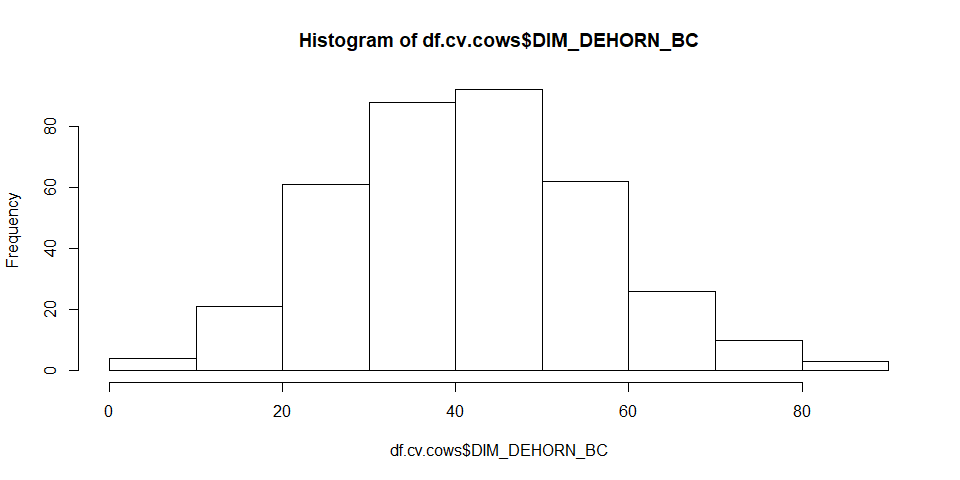
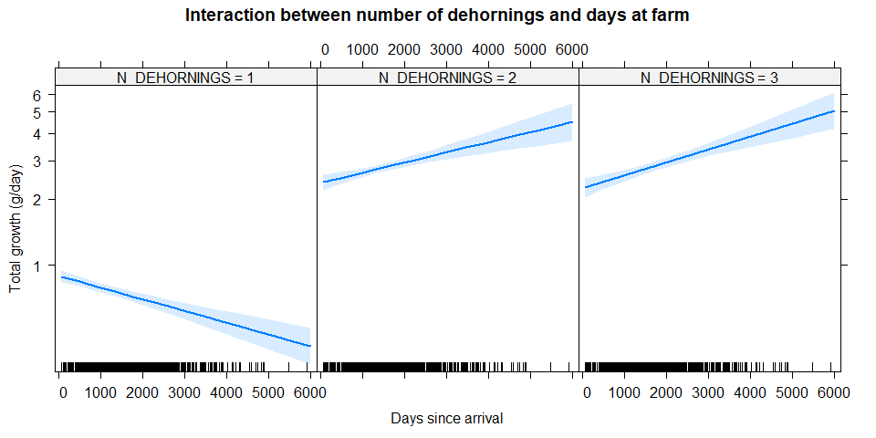
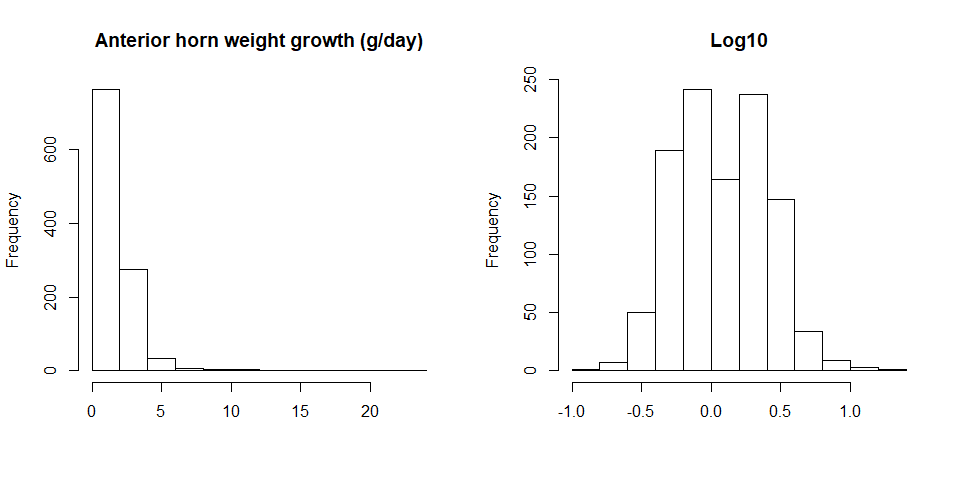
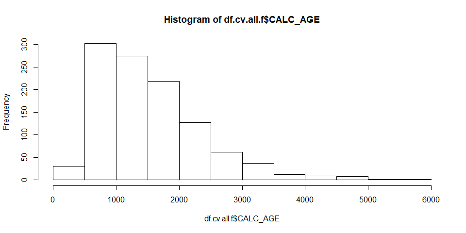

Ververs et al. (2018) - Reviewers request
================

-   [Statistical analysis preface](#statistical-analysis-preface)
-   [Main data extraction, transformation and loading](#main-data-extraction-transformation-and-loading)
-   [Hypothesis 1 - Factors influencing the total growth of the horn in reproducing females](#hypothesis-1---factors-influencing-the-total-growth-of-the-horn-in-reproducing-females)
    -   [Data preparation](#data-preparation)
    -   [Data transformations of continuous variables](#data-transformations-of-continuous-variables)
    -   [Model building](#model-building)
        -   [Generalized linear model](#generalized-linear-model)
        -   [Generalized Linear Mixed-Effects Models](#generalized-linear-mixed-effects-models)
        -   [GLM vs GLMM model comparison](#glm-vs-glmm-model-comparison)
        -   [Univariate models](#univariate-models)
        -   [Univariate model comparison](#univariate-model-comparison)
        -   [Multivariate model building](#multivariate-model-building)
    -   [Final model selection](#final-model-selection)
        -   [Interaction modelling](#interaction-modelling)
        -   [Least square means](#least-square-means)
-   [Hypothesis 2 - Factors influencing the total growth of the horn in males and females](#hypothesis-2---factors-influencing-the-total-growth-of-the-horn-in-males-and-females)
    -   [Data preparation](#data-preparation-1)
    -   [Data transformations of continuous variables](#data-transformations-of-continuous-variables-1)
    -   [Model building](#model-building-1)
        -   [Generalized linear model](#generalized-linear-model-1)
        -   [Generalized Linear Mixed-Effects Models](#generalized-linear-mixed-effects-models-1)
        -   [GLM vs GLMM model comparison](#glm-vs-glmm-model-comparison-1)
        -   [Univariate models](#univariate-models-1)
        -   [Univariate model comparison](#univariate-model-comparison-1)
        -   [Multivariate model building](#multivariate-model-building-1)
    -   [Final model selection](#final-model-selection-1)
        -   [Interaction modelling](#interaction-modelling-1)
        -   [Least square means](#least-square-means-1)
        -   [Interaction trends](#interaction-trends)
-   [Hypothesis 3 - Factors influencing the growth of the anterior horn weight in males and females](#hypothesis-3---factors-influencing-the-growth-of-the-anterior-horn-weight-in-males-and-females)
    -   [Data preparation](#data-preparation-2)
    -   [Data transformations of continuous variables](#data-transformations-of-continuous-variables-2)
    -   [Model building](#model-building-2)
        -   [Generalized linear model](#generalized-linear-model-2)
        -   [Generalized Linear Mixed-Effects Models](#generalized-linear-mixed-effects-models-2)
        -   [GLMM vs GLMM model comparison](#glmm-vs-glmm-model-comparison)
        -   [Univariate models](#univariate-models-2)
        -   [Univariate model comparison](#univariate-model-comparison-2)
        -   [Multivariate model building](#multivariate-model-building-2)
    -   [Final model selection](#final-model-selection-2)
        -   [Interaction modelling](#interaction-modelling-2)
        -   [Least square means](#least-square-means-2)
        -   [Interaction estimates](#interaction-estimates)
-   [Hypothesis 4 - Factors influencing the growth of the anterior horn length in males and females](#hypothesis-4---factors-influencing-the-growth-of-the-anterior-horn-length-in-males-and-females)
    -   [Data preparation](#data-preparation-3)
    -   [Data transformations of continuous variables](#data-transformations-of-continuous-variables-3)
    -   [Model building](#model-building-3)
        -   [Generalized linear model](#generalized-linear-model-3)
        -   [Generalized Linear Mixed-Effects Models](#generalized-linear-mixed-effects-models-3)
        -   [GLMM vs GLMM model comparison](#glmm-vs-glmm-model-comparison-1)
        -   [Univariate models](#univariate-models-3)
        -   [Univariate model comparison](#univariate-model-comparison-3)
        -   [Multivariate model building](#multivariate-model-building-3)
    -   [Final model selection](#final-model-selection-3)
        -   [Interaction modelling](#interaction-modelling-3)
        -   [Least square means](#least-square-means-3)
        -   [Interaction estimates](#interaction-estimates-1)
-   [Hypothesis 5 - Factors influencing the growth of the anterior horn circumference (mm/day) in males and females](#hypothesis-5---factors-influencing-the-growth-of-the-anterior-horn-circumference-mmday-in-males-and-females)
    -   [Data preparation](#data-preparation-4)
    -   [Data transformations of continuous variables](#data-transformations-of-continuous-variables-4)
    -   [Model building](#model-building-4)
        -   [Generalized linear model](#generalized-linear-model-4)
        -   [Generalized Linear Mixed-Effects Models](#generalized-linear-mixed-effects-models-4)
        -   [GLMM vs GLMM model comparison](#glmm-vs-glmm-model-comparison-2)
        -   [Univariate models](#univariate-models-4)
        -   [Univariate model comparison](#univariate-model-comparison-4)
        -   [Multivariate model building](#multivariate-model-building-4)
    -   [Final model selection](#final-model-selection-4)
        -   [Interaction modelling](#interaction-modelling-4)
        -   [Least square means](#least-square-means-4)
        -   [Interaction estimates](#interaction-estimates-2)

This is a notebook for the dehorning data of Ververs et al. (2018). This extra notebook shows the reviewers request to test random/repeated effects.

Statistical analysis preface
----------------------------

Currently the following R packages were loaded

    ## Loading required package: lme4

    ## Loading required package: Matrix

    ## Loading required package: effects

    ## Loading required package: carData

    ## lattice theme set by effectsTheme()
    ## See ?effectsTheme for details.

    ## Loading required package: car

    ## Loading required package: mvtnorm

    ## Loading required package: sjPlot

    ## Warning in checkMatrixPackageVersion(): Package version inconsistency detected.
    ## TMB was built with Matrix version 1.2.15
    ## Current Matrix version is 1.2.17
    ## Please re-install 'TMB' from source using install.packages('TMB', type = 'source') or ask CRAN for a binary version of 'TMB' matching CRAN's 'Matrix' package

    ## Loading required package: lsmeans

    ## Loading required package: emmeans

    ## The 'lsmeans' package is now basically a front end for 'emmeans'.
    ## Users are encouraged to switch the rest of the way.
    ## See help('transition') for more information, including how to
    ## convert old 'lsmeans' objects and scripts to work with 'emmeans'.

    ## Loading required package: EnvStats

    ## 
    ## Attaching package: 'EnvStats'

    ## The following object is masked from 'package:car':
    ## 
    ##     qqPlot

    ## The following object is masked from 'package:Matrix':
    ## 
    ##     print

    ## The following objects are masked from 'package:stats':
    ## 
    ##     predict, predict.lm

    ## The following object is masked from 'package:base':
    ## 
    ##     print.default

Main data extraction, transformation and loading
------------------------------------------------

The data was read from the excel file containing all dehornings, and some

Hypothesis 1 - Factors influencing the total growth of the horn in reproducing females
======================================================================================

Data preparation
----------------

``` r
df.cv.cows <- na.omit(df.cv[!df.cv$N_DEHORNINGS == "1", c("ANIMAL","CALC_ARRIVAL", "DH_QUARTER", "DIM_DEHORN", "CALC_PARITY", "C_QUARTER", "N_DEHORNINGS", "G_TOTAL")])

#Set all number of dehornings larger then 3 equal to 3 
df.cv.cows[df.cv.cows$N_DEHORNINGS == "4",]$N_DEHORNINGS <- "3"
df.cv.cows[df.cv.cows$N_DEHORNINGS == "5",]$N_DEHORNINGS <- "3"
df.cv.cows$N_DEHORNINGS <-  droplevels(df.cv.cows$N_DEHORNINGS)

#Not enough animals in the 4th parity
df.cv.cows[df.cv.cows$CALC_PARITY == "4",]$CALC_PARITY <- "3"
df.cv.cows$CALC_PARITY <- droplevels(df.cv.cows$CALC_PARITY)


df.cv.cows$ANIMAL <- as.factor(df.cv.cows$ANIMAL)

summary(df.cv.cows)
```

    ##      ANIMAL     CALC_ARRIVAL  DH_QUARTER   DIM_DEHORN     CALC_PARITY
    ##  5      :  2   Min.   : 252   1: 56      Min.   :   1.0   1:180      
    ##  32     :  2   1st Qu.:1004   2:129      1st Qu.: 267.0   2:139      
    ##  249    :  2   Median :1409   3: 94      Median : 462.0   3: 48      
    ##  862    :  2   Mean   :1398   4: 88      Mean   : 531.4              
    ##  894    :  2   3rd Qu.:1761              3rd Qu.: 717.0              
    ##  908    :  2   Max.   :2636              Max.   :2070.0              
    ##  (Other):355                                                         
    ##  C_QUARTER N_DEHORNINGS    G_TOTAL        
    ##  1:169     2:243        Min.   : 0.00899  
    ##  2: 83     3:124        1st Qu.: 2.16535  
    ##  3: 71                  Median : 2.62069  
    ##  4: 44                  Mean   : 3.78089  
    ##                         3rd Qu.: 3.32012  
    ##                         Max.   :60.06250  
    ## 

``` r
xtabs(~DH_QUARTER+N_DEHORNINGS, df.cv.cows)
```

    ##           N_DEHORNINGS
    ## DH_QUARTER  2  3
    ##          1 30 26
    ##          2 71 58
    ##          3 72 22
    ##          4 70 18

``` r
xtabs(~C_QUARTER+N_DEHORNINGS, df.cv.cows)
```

    ##          N_DEHORNINGS
    ## C_QUARTER   2   3
    ##         1 106  63
    ##         2  56  27
    ##         3  51  20
    ##         4  30  14

Data transformations of continuous variables
--------------------------------------------

``` r
df.cv.cows$CALC_ARRIVAL_BC <- boxcoxTransform(df.cv.cows$CALC_ARRIVAL, lambda = 1)
df.cv.cows$CALC_ARRIVAL_BC_STD <- scale(df.cv.cows$CALC_ARRIVAL_BC)
hist(df.cv.cows$CALC_ARRIVAL)
```


``` r
hist(df.cv.cows$CALC_ARRIVAL_BC)
```


``` r
hist(df.cv.cows$CALC_ARRIVAL_BC_STD)
```


``` r
df.cv.cows$DIM_DEHORN_BC <- boxcoxTransform(df.cv.cows$DIM_DEHORN, lambda = 0.5)
df.cv.cows$DIM_DEHORN_BC_STD <- scale(df.cv.cows$DIM_DEHORN_BC)
hist(df.cv.cows$DIM_DEHORN)
```


``` r
hist(df.cv.cows$DIM_DEHORN_BC)
```



``` r
hist(df.cv.cows$DIM_DEHORN_BC_STD)
```


A box-cox transformation was performed in order to make certain variables normally distributed. Otherwise models would not fit

Model building
--------------

### Generalized linear model

For more info (here)\[<https://en.wikipedia.org/wiki/Generalized_linear_model>\]

``` r
baselineGLM <- glm(G_TOTAL ~ 1, 
                         df.cv.cows, 
                         family = gaussian(link="log"))
```

This is the baseline model without random effect of the animal

### Generalized Linear Mixed-Effects Models

For more info [here](https://en.wikipedia.org/wiki/Generalized_linear_mixed_model)

We try to take into account the effect of the repeated measures (N\_DEHORNINGS) within each animal (ANIMAL). We first want to understand

``` r
baselineGLMM <- glmer(G_TOTAL ~ 1 + (1 | ANIMAL), 
                  df.cv.cows, 
                  family = gaussian(link="log"),
                  control=glmerControl(optimizer="bobyqa")
                  )
```

This is the baseline model with random effect of the animal

### GLM vs GLMM model comparison

``` r
anova(baselineGLMM, baselineGLM, test="Chisq")
```

    ## Data: df.cv.cows
    ## Models:
    ## baselineGLM: G_TOTAL ~ 1
    ## baselineGLMM: G_TOTAL ~ 1 + (1 | ANIMAL)
    ##              Df    AIC    BIC   logLik deviance  Chisq Chi Df Pr(>Chisq)
    ## baselineGLM   2 2308.1 2315.9 -1152.06   2304.1                         
    ## baselineGLMM  3 1125.5 1137.2  -559.73   1119.5 1184.7      1  < 2.2e-16
    ##                 
    ## baselineGLM     
    ## baselineGLMM ***
    ## ---
    ## Signif. codes:  0 '***' 0.001 '**' 0.01 '*' 0.05 '.' 0.1 ' ' 1

It seems that the random effect GLMM is increasing the model fit. Hence we will proceed.

### Univariate models

### Univariate model comparison

``` r
## Comparison of basemodel and single variate models
anova(baselineGLMM, glmer1 ,glmer2, glmer3, glmer4, glmer5, glmer6,  test = "Chisq")
```

    ## Data: df.cv.cows
    ## Models:
    ## baselineGLMM: G_TOTAL ~ 1 + (1 | ANIMAL)
    ## glmer1: G_TOTAL ~ N_DEHORNINGS + (1 | ANIMAL)
    ## glmer2: G_TOTAL ~ CALC_ARRIVAL_BC_STD + (1 | ANIMAL)
    ## glmer4: G_TOTAL ~ DIM_DEHORN_BC_STD + (1 | ANIMAL)
    ## glmer3: G_TOTAL ~ CALC_PARITY + (1 | ANIMAL)
    ## glmer5: G_TOTAL ~ DH_QUARTER + (1 | ANIMAL)
    ## glmer6: G_TOTAL ~ C_QUARTER + (1 | ANIMAL)
    ##              Df     AIC    BIC  logLik deviance    Chisq Chi Df Pr(>Chisq)
    ## baselineGLMM  3 1125.47 1137.2 -559.73  1119.47                           
    ## glmer1        4 1126.54 1142.2 -559.27  1118.54   0.9285      1     0.3353
    ## glmer2        4 1127.05 1142.7 -559.53  1119.05   0.0000      0     1.0000
    ## glmer4        4 1106.72 1122.3 -549.36  1098.72  20.3344      0     <2e-16
    ## glmer3        5 1125.01 1144.5 -557.51  1115.01   0.0000      1     1.0000
    ## glmer5        6  937.17  960.6 -462.58   925.17 189.8451      1     <2e-16
    ## glmer6        6 1119.57 1143.0 -553.78  1107.57   0.0000      0     1.0000
    ##                 
    ## baselineGLMM    
    ## glmer1          
    ## glmer2          
    ## glmer4       ***
    ## glmer3          
    ## glmer5       ***
    ## glmer6          
    ## ---
    ## Signif. codes:  0 '***' 0.001 '**' 0.01 '*' 0.05 '.' 0.1 ' ' 1

Only model glmer4 and glmer5 improve model fit, we proceed with those. For example in the text it could say "Days in milk after dehorning (P&lt;2e-16) and the quarter of dehorning (P&lt;2e-16) affected the total growth". Eventually we do not write this as we need to also explore a multivariate model which contains both variables.

### Multivariate model building

``` r
glmer7 <- glmer(G_TOTAL ~ DH_QUARTER + DIM_DEHORN_BC_STD    
                         +  (1 | ANIMAL), 
                df.cv.cows, 
                family = gaussian(link="log"),
                control=glmerControl(optimizer="bobyqa"))
```

    ## Warning in checkConv(attr(opt, "derivs"), opt$par, ctrl =
    ## control$checkConv, : Model failed to converge with max|grad| = 0.181008
    ## (tol = 0.001, component 1)

    ## Warning in checkConv(attr(opt, "derivs"), opt$par, ctrl = control$checkConv, : Model is nearly unidentifiable: very large eigenvalue
    ##  - Rescale variables?

However, the interaction between both variables should be explored.

``` r
glmer10 <- glmer(G_TOTAL ~ DH_QUARTER*DIM_DEHORN_BC_STD    
                         +  (1 | ANIMAL), 
                df.cv.cows, 
                family = gaussian(link="log"),
                control=glmerControl(optimizer="bobyqa"))
anova(glmer7, glmer10, test = "Chisq")
```

    ## Data: df.cv.cows
    ## Models:
    ## glmer7: G_TOTAL ~ DH_QUARTER + DIM_DEHORN_BC_STD + (1 | ANIMAL)
    ## glmer10: G_TOTAL ~ DH_QUARTER * DIM_DEHORN_BC_STD + (1 | ANIMAL)
    ##         Df    AIC    BIC  logLik deviance  Chisq Chi Df Pr(>Chisq)    
    ## glmer7   7 939.07 966.41 -462.54   925.07                             
    ## glmer10 10 752.53 791.58 -366.27   732.53 192.54      3  < 2.2e-16 ***
    ## ---
    ## Signif. codes:  0 '***' 0.001 '**' 0.01 '*' 0.05 '.' 0.1 ' ' 1

Final model selection
---------------------

We finally choose the model with interactions because of lowest AIC (752)

``` r
Anova(glmer10, test = "Chisq")
```

    ## Analysis of Deviance Table (Type II Wald chisquare tests)
    ## 
    ## Response: G_TOTAL
    ##                                 Chisq Df Pr(>Chisq)    
    ## DH_QUARTER                    85.5501  3     <2e-16 ***
    ## DIM_DEHORN_BC_STD              0.1803  1     0.6711    
    ## DH_QUARTER:DIM_DEHORN_BC_STD 258.0871  3     <2e-16 ***
    ## ---
    ## Signif. codes:  0 '***' 0.001 '**' 0.01 '*' 0.05 '.' 0.1 ' ' 1

In the text it will say that "the quarter of dehorning (P&lt;2e-16)" had on overall effect on the total growth". The LSMmeans (see further) can be used to show how this effect was. The "Days in milk" had an effect on the total growth within the quarter of dehorning. This effect can be explored using the effects plot.

### Interaction modelling

To understand the effect of the interaction, an effects plot was created

``` r
plot(effect("DH_QUARTER:DIM_DEHORN_BC_STD", 
            glmer10, 
            multiline=TRUE),
     main = "Interaction between dehorn season and bc_std days since last calving",
     xlab = "Days since last calving",
     ylab = "Total growth (g/day)")
```


Next piece is used to show it on non transformed scale

``` r
glmer10b <- glmer(G_TOTAL~ 
                        DH_QUARTER*DIM_DEHORN + 
                        (1|ANIMAL), 
                      df.cv.cows,
                      family = gaussian(link="log"),
                      control=glmerControl(optimizer="bobyqa", optCtrl=list(maxfun=2e5)),
                      nAGQ = 2
                      )
```

    ## Warning in checkConv(attr(opt, "derivs"), opt$par, ctrl =
    ## control$checkConv, : unable to evaluate scaled gradient

    ## Warning in checkConv(attr(opt, "derivs"), opt$par, ctrl =
    ## control$checkConv, : Model failed to converge: degenerate Hessian with 1
    ## negative eigenvalues

``` r
plot(effect("DH_QUARTER:DIM_DEHORN", 
            glmer10b, 
            multiline=TRUE),
     main = "Interaction between dehorn season and days since last calving",
     xlab = "Days since last calving",
     ylab = "Total growth (g/day)")
```


### Least square means

The [least square means](https://en.wikipedia.org/wiki/Least_squares) are constructed for the final variables.

This is the overal P-value per variables

    ## Analysis of Deviance Table (Type II Wald chisquare tests)
    ## 
    ## Response: G_TOTAL
    ##                                 Chisq Df Pr(>Chisq)    
    ## DH_QUARTER                    85.5501  3     <2e-16 ***
    ## DIM_DEHORN_BC_STD              0.1803  1     0.6711    
    ## DH_QUARTER:DIM_DEHORN_BC_STD 258.0871  3     <2e-16 ***
    ## ---
    ## Signif. codes:  0 '***' 0.001 '**' 0.01 '*' 0.05 '.' 0.1 ' ' 1

Least square means, Tukey adjusted

    ## NOTE: Results may be misleading due to involvement in interactions

    ## $lsmeans
    ##  DH_QUARTER response    SE  df asymp.LCL asymp.UCL
    ##  1              4.51 0.596 Inf      3.48      5.85
    ##  2              2.30 0.223 Inf      1.90      2.78
    ##  3              2.18 0.263 Inf      1.72      2.76
    ##  4              2.56 0.311 Inf      2.01      3.25
    ## 
    ## Confidence level used: 0.95 
    ## Intervals are back-transformed from the log scale 
    ## 
    ## $contrasts
    ##  contrast ratio    SE  df z.ratio p.value
    ##  1 / 2    1.962 0.279 Inf  4.730  <.0001 
    ##  1 / 3    2.070 0.348 Inf  4.326  0.0001 
    ##  1 / 4    1.765 0.298 Inf  3.366  0.0043 
    ##  2 / 3    1.055 0.161 Inf  0.351  0.9851 
    ##  2 / 4    0.900 0.146 Inf -0.650  0.9156 
    ##  3 / 4    0.853 0.147 Inf -0.921  0.7934 
    ## 
    ## P value adjustment: tukey method for comparing a family of 4 estimates 
    ## Tests are performed on the log scale

Hypothesis 2 - Factors influencing the total growth of the horn in males and females
====================================================================================

Data preparation
----------------

``` r
#Make sure to drop the extemely low growth which are caused by dirty data
df.cv.all <- na.omit(df.cv[df.cv$G_TOTAL < 100,
                           (names(df.cv) %in% c("ANIMAL",
                                                "CALC_AGE", 
                                                "DH_QUARTER", 
                                                "GENDER", 
                                                "G_TOTAL",
                                                "N_DEHORNINGS",
                                                "B_QUARTER"
                                                ))])
df.cv.all$ANIMAL <- as.factor(df.cv.all$ANIMAL)
df.cv.all[df.cv.all$N_DEHORNINGS == "4",]$N_DEHORNINGS <- "3"
df.cv.all[df.cv.all$N_DEHORNINGS == "5",]$N_DEHORNINGS <- "3"

summary(df.cv.all)
```

    ##      ANIMAL     GENDER     CALC_AGE      DH_QUARTER B_QUARTER N_DEHORNINGS
    ##  59     :   3   F:498   Min.   :  58.0   1:154      1:397     1:597       
    ##  91     :   3   M:588   1st Qu.: 921.8   2:297      2:313     2:315       
    ##  105    :   3           Median :1375.0   3:275      3:183     3:174       
    ##  120    :   3           Mean   :1552.5   4:360      4:193     4:  0       
    ##  168    :   3           3rd Qu.:1964.0                        5:  0       
    ##  281    :   3           Max.   :5909.0                                    
    ##  (Other):1068                                                             
    ##     G_TOTAL        
    ##  Min.   : 0.01195  
    ##  1st Qu.: 0.73166  
    ##  Median : 1.27254  
    ##  Mean   : 1.99431  
    ##  3rd Qu.: 2.74384  
    ##  Max.   :33.02857  
    ## 

``` r
xtabs(~DH_QUARTER+N_DEHORNINGS, df.cv.all)
```

    ##           N_DEHORNINGS
    ## DH_QUARTER   1   2   3   4   5
    ##          1  86  43  25   0   0
    ##          2 156 100  41   0   0
    ##          3 143  76  56   0   0
    ##          4 212  96  52   0   0

``` r
xtabs(~B_QUARTER+N_DEHORNINGS, df.cv.all)
```

    ##          N_DEHORNINGS
    ## B_QUARTER   1   2   3   4   5
    ##         1 228 110  59   0   0
    ##         2 159  93  61   0   0
    ##         3  91  58  34   0   0
    ##         4 119  54  20   0   0

Data transformations of continuous variables
--------------------------------------------

``` r
df.cv.all$CALC_AGE_BC <- boxcoxTransform(df.cv.all$CALC_AGE, lambda = .25)
df.cv.all$CALC_AGE_BC_STD <- scale(df.cv.all$CALC_AGE_BC)
hist(df.cv.all$CALC_AGE)
```


``` r
hist(df.cv.all$CALC_AGE_BC_STD)
```


Model building
--------------

### Generalized linear model

For more info [here](%5Bhttps://en.wikipedia.org/wiki/Generalized_linear_model)

``` r
baselineGLM <- glm(G_TOTAL ~ 1, 
                         df.cv.all, 
                         family = gaussian(link="log"))
```

### Generalized Linear Mixed-Effects Models

For more info [here](https://en.wikipedia.org/wiki/Generalized_linear_mixed_model)

We try to take into account the effect of the repeated measures (N\_DEHORNINGS) within each animal (ANIMAL). We first want to understand

``` r
baselineGLMM <- glmer(G_TOTAL ~ 1 + (1 | ANIMAL), 
                  df.cv.all, 
                  family = gaussian(link="log"),
                  control=glmerControl(optimizer="bobyqa")
                  )
```

### GLM vs GLMM model comparison

``` r
anova(baselineGLMM, baselineGLM, test="Chisq")
```

    ## Data: df.cv.all
    ## Models:
    ## baselineGLM: G_TOTAL ~ 1
    ## baselineGLMM: G_TOTAL ~ 1 + (1 | ANIMAL)
    ##              Df    AIC    BIC  logLik deviance  Chisq Chi Df Pr(>Chisq)
    ## baselineGLM   2 4594.3 4604.3 -2295.2   4590.3                         
    ## baselineGLMM  3 4225.9 4240.8 -2109.9   4219.9 370.47      1  < 2.2e-16
    ##                 
    ## baselineGLM     
    ## baselineGLMM ***
    ## ---
    ## Signif. codes:  0 '***' 0.001 '**' 0.01 '*' 0.05 '.' 0.1 ' ' 1

The GLMM performs better

### Univariate models

### Univariate model comparison

``` r
## Comparison of basemodel and single variate models
anova(baselineGLMM, glmer1 ,glmer2, glmer3, glmer4, glmer5, test = "Chisq")
```

    ## Data: df.cv.all
    ## Models:
    ## baselineGLMM: G_TOTAL ~ 1 + (1 | ANIMAL)
    ## glmer2: G_TOTAL ~ CALC_AGE_BC_STD + (1 | ANIMAL)
    ## glmer5: G_TOTAL ~ GENDER + (1 | ANIMAL)
    ## glmer1: G_TOTAL ~ N_DEHORNINGS + (1 | ANIMAL)
    ## glmer3: G_TOTAL ~ DH_QUARTER + (1 | ANIMAL)
    ## glmer4: G_TOTAL ~ B_QUARTER + (1 | ANIMAL)
    ##              Df    AIC    BIC  logLik deviance    Chisq Chi Df Pr(>Chisq)
    ## baselineGLMM  3 4225.9 4240.8 -2109.9   4219.9                           
    ## glmer2        4 3627.9 3647.9 -1810.0   3619.9  599.957      1     <2e-16
    ## glmer5        4 4185.0 4204.9 -2088.5   4177.0    0.000      0          1
    ## glmer1        5 2056.7 2081.7 -1023.4   2046.7 2130.230      1     <2e-16
    ## glmer3        6 4228.2 4258.2 -2108.1   4216.2    0.000      1          1
    ## glmer4        6 4208.9 4238.9 -2098.5   4196.9   19.298      0     <2e-16
    ##                 
    ## baselineGLMM    
    ## glmer2       ***
    ## glmer5          
    ## glmer1       ***
    ## glmer3          
    ## glmer4       ***
    ## ---
    ## Signif. codes:  0 '***' 0.001 '**' 0.01 '*' 0.05 '.' 0.1 ' ' 1

### Multivariate model building

``` r
glmer10 <- glmer(G_TOTAL ~ CALC_AGE_BC_STD + N_DEHORNINGS + B_QUARTER    
                         +  (1| ANIMAL), 
                df.cv.all, 
                family = gaussian(link="log"),
                control=glmerControl(optimizer="bobyqa"))
summary(glmer10)
```

    ## Generalized linear mixed model fit by maximum likelihood (Laplace
    ##   Approximation) [glmerMod]
    ##  Family: gaussian  ( log )
    ## Formula: 
    ## G_TOTAL ~ CALC_AGE_BC_STD + N_DEHORNINGS + B_QUARTER + (1 | ANIMAL)
    ##    Data: df.cv.all
    ## Control: glmerControl(optimizer = "bobyqa")
    ## 
    ##      AIC      BIC   logLik deviance df.resid 
    ##   2030.3   2075.2  -1006.2   2012.3     1077 
    ## 
    ## Scaled residuals: 
    ##     Min      1Q  Median      3Q     Max 
    ## -3.8994 -0.3564 -0.0099  0.3679  4.6312 
    ## 
    ## Random effects:
    ##  Groups   Name        Variance Std.Dev.
    ##  ANIMAL   (Intercept) 0.1224   0.3499  
    ##  Residual             0.2948   0.5430  
    ## Number of obs: 1086, groups:  ANIMAL, 758
    ## 
    ## Fixed effects:
    ##                 Estimate Std. Error t value Pr(>|z|)    
    ## (Intercept)     -0.22208    0.03062  -7.252 4.09e-13 ***
    ## CALC_AGE_BC_STD  0.05110    0.01668   3.063  0.00219 ** 
    ## N_DEHORNINGS2    1.29229    0.02844  45.444  < 2e-16 ***
    ## N_DEHORNINGS3    1.33154    0.03377  39.429  < 2e-16 ***
    ## B_QUARTER2      -0.13685    0.03055  -4.480 7.47e-06 ***
    ## B_QUARTER3      -0.01154    0.03805  -0.303  0.76166    
    ## B_QUARTER4      -0.08253    0.03681  -2.242  0.02496 *  
    ## ---
    ## Signif. codes:  0 '***' 0.001 '**' 0.01 '*' 0.05 '.' 0.1 ' ' 1
    ## 
    ## Correlation of Fixed Effects:
    ##               (Intr) CALC_A N_DEHORNINGS2 N_DEHORNINGS3 B_QUARTER2
    ## CALC_AGE_BC    0.264                                              
    ## N_DEHORNINGS2 -0.543 -0.451                                       
    ## N_DEHORNINGS3 -0.488 -0.589  0.768                                
    ## B_QUARTER2    -0.426  0.010 -0.045        -0.081                  
    ## B_QUARTER3    -0.397 -0.099  0.000         0.019         0.436    
    ## B_QUARTER4    -0.452 -0.072  0.071         0.104         0.466    
    ##               B_QUARTER3
    ## CALC_AGE_BC             
    ## N_DEHORNINGS2           
    ## N_DEHORNINGS3           
    ## B_QUARTER2              
    ## B_QUARTER3              
    ## B_QUARTER4     0.351

``` r
Anova(glmer10)
```

    ## Analysis of Deviance Table (Type II Wald chisquare tests)
    ## 
    ## Response: G_TOTAL
    ##                     Chisq Df Pr(>Chisq)    
    ## CALC_AGE_BC_STD    9.3817  1   0.002192 ** 
    ## N_DEHORNINGS    2114.9003  2  < 2.2e-16 ***
    ## B_QUARTER         23.7139  3  2.866e-05 ***
    ## ---
    ## Signif. codes:  0 '***' 0.001 '**' 0.01 '*' 0.05 '.' 0.1 ' ' 1

Final model selection
---------------------

### Interaction modelling

``` r
glmer11 <- glmer(G_TOTAL ~ N_DEHORNINGS*CALC_AGE_BC_STD + B_QUARTER    
                         +  (1| ANIMAL), 
                df.cv.all, 
                family = gaussian(link="log"),
                control=glmerControl(optimizer="bobyqa"))
summary(glmer11)
```

    ## Generalized linear mixed model fit by maximum likelihood (Laplace
    ##   Approximation) [glmerMod]
    ##  Family: gaussian  ( log )
    ## Formula: 
    ## G_TOTAL ~ N_DEHORNINGS * CALC_AGE_BC_STD + B_QUARTER + (1 | ANIMAL)
    ##    Data: df.cv.all
    ## Control: glmerControl(optimizer = "bobyqa")
    ## 
    ##      AIC      BIC   logLik deviance df.resid 
    ##   1972.7   2027.6   -975.4   1950.7     1075 
    ## 
    ## Scaled residuals: 
    ##     Min      1Q  Median      3Q     Max 
    ## -3.5356 -0.3275 -0.0175  0.3512  4.0980 
    ## 
    ## Random effects:
    ##  Groups   Name        Variance Std.Dev.
    ##  ANIMAL   (Intercept) 0.1179   0.3433  
    ##  Residual             0.2851   0.5339  
    ## Number of obs: 1086, groups:  ANIMAL, 758
    ## 
    ## Fixed effects:
    ##                               Estimate Std. Error t value Pr(>|z|)    
    ## (Intercept)                   -0.24619    0.03054  -8.061 7.57e-16 ***
    ## N_DEHORNINGS2                  1.24694    0.02905  42.919  < 2e-16 ***
    ## N_DEHORNINGS3                  1.18073    0.04035  29.261  < 2e-16 ***
    ## CALC_AGE_BC_STD               -0.02864    0.01977  -1.448   0.1475    
    ## B_QUARTER2                    -0.12281    0.02949  -4.165 3.12e-05 ***
    ## B_QUARTER3                    -0.03007    0.03761  -0.800   0.4239    
    ## B_QUARTER4                    -0.07226    0.03592  -2.012   0.0442 *  
    ## N_DEHORNINGS2:CALC_AGE_BC_STD  0.22954    0.03358   6.835 8.20e-12 ***
    ## N_DEHORNINGS3:CALC_AGE_BC_STD  0.27145    0.03836   7.077 1.47e-12 ***
    ## ---
    ## Signif. codes:  0 '***' 0.001 '**' 0.01 '*' 0.05 '.' 0.1 ' ' 1
    ## 
    ## Correlation of Fixed Effects:
    ##                (Intr) N_DEHORNINGS2 N_DEHORNINGS3 CALC_A B_QUARTER2
    ## N_DEHORNINGS2  -0.533                                              
    ## N_DEHORNINGS3  -0.367  0.689                                       
    ## CALC_AGE_BC     0.349 -0.350        -0.269                         
    ## B_QUARTER2     -0.415 -0.049        -0.072        -0.028           
    ## B_QUARTER3     -0.374  0.021         0.038        -0.054  0.414    
    ## B_QUARTER4     -0.434  0.077         0.033        -0.056  0.449    
    ## N_DEHORNINGS2: -0.138 -0.147        -0.238        -0.502  0.065    
    ## N_DEHORNINGS3: -0.147 -0.067        -0.504        -0.440  0.027    
    ##                B_QUARTER3 B_QUARTER4 N_DEHORNINGS2:
    ## N_DEHORNINGS2                                      
    ## N_DEHORNINGS3                                      
    ## CALC_AGE_BC                                        
    ## B_QUARTER2                                         
    ## B_QUARTER3                                         
    ## B_QUARTER4      0.325                              
    ## N_DEHORNINGS2: -0.076     -0.036                   
    ## N_DEHORNINGS3: -0.031      0.071      0.625

``` r
Anova(glmer11)
```

    ## Analysis of Deviance Table (Type II Wald chisquare tests)
    ## 
    ## Response: G_TOTAL
    ##                                 Chisq Df Pr(>Chisq)    
    ## N_DEHORNINGS                 1987.219  2  < 2.2e-16 ***
    ## CALC_AGE_BC_STD                 9.114  1  0.0025366 ** 
    ## B_QUARTER                      18.486  3  0.0003491 ***
    ## N_DEHORNINGS:CALC_AGE_BC_STD   59.630  2  1.126e-13 ***
    ## ---
    ## Signif. codes:  0 '***' 0.001 '**' 0.01 '*' 0.05 '.' 0.1 ' ' 1

Test interaction fit

``` r
anova(glmer10, glmer11, test="Chisq")
```

    ## Data: df.cv.all
    ## Models:
    ## glmer10: G_TOTAL ~ CALC_AGE_BC_STD + N_DEHORNINGS + B_QUARTER + (1 | ANIMAL)
    ## glmer11: G_TOTAL ~ N_DEHORNINGS * CALC_AGE_BC_STD + B_QUARTER + (1 | ANIMAL)
    ##         Df    AIC    BIC   logLik deviance  Chisq Chi Df Pr(>Chisq)    
    ## glmer10  9 2030.3 2075.2 -1006.15   2012.3                             
    ## glmer11 11 1972.7 2027.6  -975.37   1950.7 61.563      2  4.282e-14 ***
    ## ---
    ## Signif. codes:  0 '***' 0.001 '**' 0.01 '*' 0.05 '.' 0.1 ' ' 1

The model with the interaction fits best, lowest AIC

To understand the effect of the interaction, an effects plot was created

``` r
plot(effect("N_DEHORNINGS:CALC_AGE_BC_STD", 
            glmer11, 
            #xlevels=list(CALC_ARRIVAL=900:2000), 
            multiline=TRUE),
     main = "Interaction between number of dehornings and bc_std days at farm",
     xlab = "Days since arrival",
     ylab = "Total growth (g/day)")
```


Next piece is used to show it on non transformed scale

``` r
glmer11b <- glmer(G_TOTAL ~ N_DEHORNINGS*CALC_AGE + B_QUARTER    
                         +  (1| ANIMAL), 
                df.cv.all, 
                family = gaussian(link="log"),
                control=glmerControl(optimizer="bobyqa"))
```

    ## Warning in checkConv(attr(opt, "derivs"), opt$par, ctrl =
    ## control$checkConv, : Model failed to converge with max|grad| = 180.845 (tol
    ## = 0.001, component 1)

    ## Warning in checkConv(attr(opt, "derivs"), opt$par, ctrl = control$checkConv, : Model is nearly unidentifiable: very large eigenvalue
    ##  - Rescale variables?;Model is nearly unidentifiable: large eigenvalue ratio
    ##  - Rescale variables?

``` r
plot(effect("N_DEHORNINGS:CALC_AGE", 
            glmer11b, 
            #xlevels=list(CALC_ARRIVAL=900:2000), 
            multiline=TRUE),
     main = "Interaction between number of dehornings and days at farm",
     xlab = "Days since arrival",
     ylab = "Total growth (g/day)")
```



### Least square means

The [least square means](https://en.wikipedia.org/wiki/Least_squares) are constructed for the final variables.

This is the overal P-value per variables

    ## Analysis of Deviance Table (Type II Wald chisquare tests)
    ## 
    ## Response: G_TOTAL
    ##                           Chisq Df Pr(>Chisq)    
    ## N_DEHORNINGS          2280.5376  2    < 2e-16 ***
    ## CALC_AGE                 0.9772  1    0.32289    
    ## B_QUARTER                9.9686  3    0.01883 *  
    ## N_DEHORNINGS:CALC_AGE  270.2135  2    < 2e-16 ***
    ## ---
    ## Signif. codes:  0 '***' 0.001 '**' 0.01 '*' 0.05 '.' 0.1 ' ' 1

Least square means, Tukey adjusted

    ## NOTE: Results may be misleading due to involvement in interactions

    ## $lsmeans
    ##  N_DEHORNINGS response     SE  df asymp.LCL asymp.UCL
    ##  1               0.743 0.0193 Inf     0.706     0.781
    ##  2               2.816 0.0645 Inf     2.693     2.946
    ##  3               2.777 0.0774 Inf     2.629     2.932
    ## 
    ## Results are averaged over the levels of: B_QUARTER 
    ## Confidence level used: 0.95 
    ## Intervals are back-transformed from the log scale 
    ## 
    ## $contrasts
    ##  contrast ratio      SE  df z.ratio p.value
    ##  1 / 2    0.264 0.00732 Inf -48.013 <.0001 
    ##  1 / 3    0.267 0.00886 Inf -39.812 <.0001 
    ##  2 / 3    1.014 0.02202 Inf   0.657 0.7885 
    ## 
    ## Results are averaged over the levels of: B_QUARTER 
    ## P value adjustment: tukey method for comparing a family of 3 estimates 
    ## Tests are performed on the log scale

    ## $lsmeans
    ##  B_QUARTER response     SE  df asymp.LCL asymp.UCL
    ##  1             1.82 0.0462 Inf      1.73      1.91
    ##  2             1.70 0.0445 Inf      1.61      1.78
    ##  3             1.87 0.0646 Inf      1.75      2.00
    ##  4             1.81 0.0591 Inf      1.70      1.93
    ## 
    ## Results are averaged over the levels of: N_DEHORNINGS 
    ## Confidence level used: 0.95 
    ## Intervals are back-transformed from the log scale 
    ## 
    ## $contrasts
    ##  contrast ratio     SE  df z.ratio p.value
    ##  1 / 2    1.074 0.0318 Inf  2.397  0.0777 
    ##  1 / 3    0.972 0.0367 Inf -0.749  0.8771 
    ##  1 / 4    1.007 0.0362 Inf  0.194  0.9974 
    ##  2 / 3    0.905 0.0335 Inf -2.683  0.0366 
    ##  2 / 4    0.938 0.0323 Inf -1.861  0.2450 
    ##  3 / 4    1.036 0.0443 Inf  0.826  0.8424 
    ## 
    ## Results are averaged over the levels of: N_DEHORNINGS 
    ## P value adjustment: tukey method for comparing a family of 4 estimates 
    ## Tests are performed on the log scale

### Interaction trends

    ## Generalized linear mixed model fit by maximum likelihood (Laplace
    ##   Approximation) [glmerMod]
    ##  Family: gaussian  ( log )
    ## Formula: G_TOTAL ~ N_DEHORNINGS * CALC_AGE + B_QUARTER + (1 | ANIMAL)
    ##    Data: df.cv.all
    ## Control: glmerControl(optimizer = "bobyqa")
    ## 
    ##      AIC      BIC   logLik deviance df.resid 
    ##   1994.8   2049.7   -986.4   1972.8     1075 
    ## 
    ## Scaled residuals: 
    ##     Min      1Q  Median      3Q     Max 
    ## -3.8004 -0.3532 -0.0384  0.3357  3.9448 
    ## 
    ## Random effects:
    ##  Groups   Name        Variance Std.Dev.
    ##  ANIMAL   (Intercept) 0.1180   0.3436  
    ##  Residual             0.2788   0.5281  
    ## Number of obs: 1086, groups:  ANIMAL, 758
    ## 
    ## Fixed effects:
    ##                          Estimate Std. Error t value Pr(>|z|)    
    ## (Intercept)            -9.375e-02  3.486e-02  -2.689  0.00716 ** 
    ## N_DEHORNINGS2           9.765e-01  3.974e-02  24.570  < 2e-16 ***
    ## N_DEHORNINGS3           9.165e-01  4.566e-02  20.072  < 2e-16 ***
    ## CALC_AGE               -1.233e-04  1.934e-05  -6.372 1.86e-10 ***
    ## B_QUARTER2             -7.108e-02  2.965e-02  -2.397  0.01654 *  
    ## B_QUARTER3              2.831e-02  3.779e-02   0.749  0.45385    
    ## B_QUARTER4             -6.982e-03  3.596e-02  -0.194  0.84607    
    ## N_DEHORNINGS2:CALC_AGE  2.296e-04  1.980e-05  11.599  < 2e-16 ***
    ## N_DEHORNINGS3:CALC_AGE  2.591e-04  1.839e-05  14.088  < 2e-16 ***
    ## ---
    ## Signif. codes:  0 '***' 0.001 '**' 0.01 '*' 0.05 '.' 0.1 ' ' 1
    ## 
    ## Correlation of Fixed Effects:
    ##                (Intr) N_DEHORNINGS2 N_DEHORNINGS3 CALC_A B_QUARTER2
    ## N_DEHORNINGS2  -0.266                                              
    ## N_DEHORNINGS3  -0.064  0.460                                       
    ## CALC_AGE       -0.558 -0.032        -0.258                         
    ## B_QUARTER2     -0.371 -0.032        -0.048        -0.009           
    ## B_QUARTER3     -0.273  0.042         0.032        -0.086  0.418    
    ## B_QUARTER4     -0.357  0.109         0.038        -0.045  0.463    
    ## N_DEHORNINGS2:  0.224 -0.718        -0.109        -0.339  0.025    
    ## N_DEHORNINGS3:  0.113 -0.170        -0.691        -0.208  0.002    
    ##                B_QUARTER3 B_QUARTER4 N_DEHORNINGS2:
    ## N_DEHORNINGS2                                      
    ## N_DEHORNINGS3                                      
    ## CALC_AGE                                           
    ## B_QUARTER2                                         
    ## B_QUARTER3                                         
    ## B_QUARTER4      0.329                              
    ## N_DEHORNINGS2: -0.046     -0.071                   
    ## N_DEHORNINGS3: -0.012      0.047      0.240        
    ## convergence code: 0
    ## Model failed to converge with max|grad| = 180.845 (tol = 0.001, component 1)
    ## Model is nearly unidentifiable: very large eigenvalue
    ##  - Rescale variables?
    ## Model is nearly unidentifiable: large eigenvalue ratio
    ##  - Rescale variables?

    ## $emtrends
    ##  N_DEHORNINGS CALC_AGE.trend       SE  df asymp.LCL asymp.UCL
    ##  1                 -0.000123 1.93e-05 Inf -1.61e-04 -8.53e-05
    ##  2                  0.000106 2.25e-05 Inf  6.23e-05  1.51e-04
    ##  3                  0.000136 2.38e-05 Inf  8.93e-05  1.82e-04
    ## 
    ## Results are averaged over the levels of: B_QUARTER 
    ## Trends are based on the log (transformed) scale 
    ## Confidence level used: 0.95 
    ## 
    ## $contrasts
    ##  contrast  estimate       SE  df z.ratio p.value
    ##  1 - 2    -2.30e-04 1.98e-05 Inf -11.599 <.0001 
    ##  1 - 3    -2.59e-04 1.84e-05 Inf -14.088 <.0001 
    ##  2 - 3    -2.94e-05 2.36e-05 Inf  -1.249 0.4242 
    ## 
    ## Results are averaged over the levels of: B_QUARTER 
    ## P value adjustment: tukey method for comparing a family of 3 estimates

Hypothesis 3 - Factors influencing the growth of the anterior horn weight in males and females
==============================================================================================

Data preparation
----------------

``` r
df.cv.all.f <- na.omit(df.cv[df.cv$G_AH_W < 100,
                             (names(df.cv) %in% c("ANIMAL",
                                                  "CALC_AGE",
                                                  "DH_QUARTER", 
                                                  "GENDER", 
                                                  "G_AH_W",
                                                  "N_DEHORNINGS",
                                                  "B_QUARTER"))])
summary(df.cv.all.f)
```

    ##      ANIMAL       GENDER     CALC_AGE      DH_QUARTER B_QUARTER
    ##  Min.   :   7.0   F:495   Min.   :  58.0   1:154      1:395    
    ##  1st Qu.: 350.0   M:588   1st Qu.: 922.5   2:294      2:312    
    ##  Median : 551.0           Median :1376.0   3:275      3:183    
    ##  Mean   : 543.4           Mean   :1553.6   4:360      4:193    
    ##  3rd Qu.: 754.0           3rd Qu.:1965.5                       
    ##  Max.   :1021.0           Max.   :5909.0                       
    ##  N_DEHORNINGS     G_AH_W       
    ##  1:595        Min.   : 0.1148  
    ##  2:314        1st Qu.: 0.6573  
    ##  3:140        Median : 1.1052  
    ##  4: 31        Mean   : 1.5912  
    ##  5:  3        3rd Qu.: 2.2017  
    ##               Max.   :23.4286

``` r
df.cv.all.f[df.cv.all.f$N_DEHORNINGS == "4",]$N_DEHORNINGS <- "3"
df.cv.all.f[df.cv.all.f$N_DEHORNINGS == "5",]$N_DEHORNINGS <- "3"
#create histogram of the front horn weiht
op = par(mfrow=c(1, 2))
hist((df.cv.all.f$G_AH_W), 
     main = "Anterior horn weight growth (g/day)",
     xlab ="")
hist(log10(df.cv.all.f$G_AH_W),
      main = "Log10",
     xlab ="")
```



Data transformations of continuous variables
--------------------------------------------

``` r
df.cv.all.f$CALC_AGE_BC <- boxcoxTransform(df.cv.all.f$CALC_AGE, lambda = .25)
df.cv.all.f$CALC_AGE_BC_STD <- scale(df.cv.all.f$CALC_AGE_BC)
hist(df.cv.all.f$CALC_AGE)
```



``` r
hist(df.cv.all.f$CALC_AGE_BC_STD)
```


Model building
--------------

### Generalized linear model

For more info [here](%5Bhttps://en.wikipedia.org/wiki/Generalized_linear_model)

``` r
baselineGLM <- glm(G_AH_W ~ 1, 
                         df.cv.all.f, 
                         family = gaussian(link="log"))
```

### Generalized Linear Mixed-Effects Models

For more info [here](https://en.wikipedia.org/wiki/Generalized_linear_mixed_model)

We try to take into account the effect of the repeated measures (N\_DEHORNINGS) within each animal (ANIMAL). We first want to understand

``` r
baselineGLMM <- glmer(G_AH_W ~ 1 + (1 | ANIMAL), 
                  df.cv.all.f, 
                  family = gaussian(link="log"),
                  control=glmerControl(optimizer="bobyqa")
                  )
```

### GLMM vs GLMM model comparison

``` r
anova(baselineGLMM, baselineGLM, test="Chisq")
```

    ## Data: df.cv.all.f
    ## Models:
    ## baselineGLM: G_AH_W ~ 1
    ## baselineGLMM: G_AH_W ~ 1 + (1 | ANIMAL)
    ##              Df    AIC    BIC  logLik deviance  Chisq Chi Df Pr(>Chisq)
    ## baselineGLM   2 3887.7 3897.7 -1941.9   3883.7                         
    ## baselineGLMM  3 3318.1 3333.1 -1656.0   3312.1 571.65      1  < 2.2e-16
    ##                 
    ## baselineGLM     
    ## baselineGLMM ***
    ## ---
    ## Signif. codes:  0 '***' 0.001 '**' 0.01 '*' 0.05 '.' 0.1 ' ' 1

The GLMM performs better

### Univariate models

### Univariate model comparison

    ## Data: df.cv.all.f
    ## Models:
    ## baselineGLMM: G_AH_W ~ 1 + (1 | ANIMAL)
    ## glmer2: G_AH_W ~ CALC_AGE_BC_STD + (1 | ANIMAL)
    ## glmer5: G_AH_W ~ GENDER + (1 | ANIMAL)
    ## glmer1: G_AH_W ~ N_DEHORNINGS + (1 | ANIMAL)
    ## glmer3: G_AH_W ~ DH_QUARTER + (1 | ANIMAL)
    ## glmer4: G_AH_W ~ B_QUARTER + (1 | ANIMAL)
    ##              Df    AIC    BIC   logLik deviance    Chisq Chi Df Pr(>Chisq)
    ## baselineGLMM  3 3318.1 3333.1 -1656.05   3312.1                           
    ## glmer2        4 2840.3 2860.3 -1416.17   2832.3  479.745      1     <2e-16
    ## glmer5        4 3290.3 3310.3 -1641.17   3282.3    0.000      0          1
    ## glmer1        5 1324.6 1349.6  -657.31   1314.6 1967.717      1     <2e-16
    ## glmer3        6 3321.0 3351.0 -1654.52   3309.0    0.000      1          1
    ## glmer4        6 3310.1 3340.0 -1649.03   3298.1   10.978      0     <2e-16
    ##                 
    ## baselineGLMM    
    ## glmer2       ***
    ## glmer5          
    ## glmer1       ***
    ## glmer3          
    ## glmer4       ***
    ## ---
    ## Signif. codes:  0 '***' 0.001 '**' 0.01 '*' 0.05 '.' 0.1 ' ' 1

### Multivariate model building

    ## Generalized linear mixed model fit by maximum likelihood (Laplace
    ##   Approximation) [glmerMod]
    ##  Family: gaussian  ( log )
    ## Formula: 
    ## G_AH_W ~ N_DEHORNINGS + CALC_AGE_BC_STD + B_QUARTER + (1 | ANIMAL)
    ##    Data: df.cv.all.f
    ## 
    ##      AIC      BIC   logLik deviance df.resid 
    ##   1318.6   1363.5   -650.3   1300.6     1074 
    ## 
    ## Scaled residuals: 
    ##     Min      1Q  Median      3Q     Max 
    ## -3.7697 -0.3758 -0.0284  0.3939  3.9382 
    ## 
    ## Random effects:
    ##  Groups   Name        Variance Std.Dev.
    ##  ANIMAL   (Intercept) 0.09744  0.3122  
    ##  Residual             0.17828  0.4222  
    ## Number of obs: 1083, groups:  ANIMAL, 757
    ## 
    ## Fixed effects:
    ##                   Estimate Std. Error t value Pr(>|z|)    
    ## (Intercept)     -0.3653147  0.0282290 -12.941  < 2e-16 ***
    ## N_DEHORNINGS2    1.2023676  0.0264450  45.467  < 2e-16 ***
    ## N_DEHORNINGS3    1.2716419  0.0319387  39.815  < 2e-16 ***
    ## CALC_AGE_BC_STD  0.0009531  0.0151674   0.063 0.949892    
    ## B_QUARTER2      -0.1051341  0.0289732  -3.629 0.000285 ***
    ## B_QUARTER3      -0.0257381  0.0357430  -0.720 0.471471    
    ## B_QUARTER4      -0.0567243  0.0343045  -1.654 0.098218 .  
    ## ---
    ## Signif. codes:  0 '***' 0.001 '**' 0.01 '*' 0.05 '.' 0.1 ' ' 1
    ## 
    ## Correlation of Fixed Effects:
    ##               (Intr) N_DEHORNINGS2 N_DEHORNINGS3 CALC_A B_QUARTER2
    ## N_DEHORNINGS2 -0.539                                              
    ## N_DEHORNINGS3 -0.479  0.746                                       
    ## CALC_AGE_BC    0.313 -0.499        -0.608                         
    ## B_QUARTER2    -0.445 -0.028        -0.078         0.008           
    ## B_QUARTER3    -0.409  0.013         0.019        -0.103  0.423    
    ## B_QUARTER4    -0.469  0.087         0.106        -0.088  0.454    
    ##               B_QUARTER3
    ## N_DEHORNINGS2           
    ## N_DEHORNINGS3           
    ## CALC_AGE_BC             
    ## B_QUARTER2              
    ## B_QUARTER3              
    ## B_QUARTER4     0.349

    ## Analysis of Deviance Table (Type II Wald chisquare tests)
    ## 
    ## Response: G_AH_W
    ##                     Chisq Df Pr(>Chisq)    
    ## N_DEHORNINGS    2145.7874  2  < 2.2e-16 ***
    ## CALC_AGE_BC_STD    0.0039  1   0.949892    
    ## B_QUARTER         14.0138  3   0.002886 ** 
    ## ---
    ## Signif. codes:  0 '***' 0.001 '**' 0.01 '*' 0.05 '.' 0.1 ' ' 1

Final model selection
---------------------

### Interaction modelling

``` r
summary(glmer7 <- glmer(G_AH_W ~ 
                          N_DEHORNINGS*CALC_AGE_BC_STD +
                          B_QUARTER +
                          (1|ANIMAL), 
                        df.cv.all.f, 
                        family = gaussian(link="log")))
```

    ## Warning in checkConv(attr(opt, "derivs"), opt$par, ctrl =
    ## control$checkConv, : Model failed to converge with max|grad| = 1.15535 (tol
    ## = 0.001, component 1)

    ## Generalized linear mixed model fit by maximum likelihood (Laplace
    ##   Approximation) [glmerMod]
    ##  Family: gaussian  ( log )
    ## Formula: 
    ## G_AH_W ~ N_DEHORNINGS * CALC_AGE_BC_STD + B_QUARTER + (1 | ANIMAL)
    ##    Data: df.cv.all.f
    ## 
    ##      AIC      BIC   logLik deviance df.resid 
    ##   1256.5   1311.4   -617.3   1234.5     1072 
    ## 
    ## Scaled residuals: 
    ##     Min      1Q  Median      3Q     Max 
    ## -3.9586 -0.3459 -0.0084  0.3818  4.0679 
    ## 
    ## Random effects:
    ##  Groups   Name        Variance Std.Dev.
    ##  ANIMAL   (Intercept) 0.09427  0.3070  
    ##  Residual             0.17087  0.4134  
    ## Number of obs: 1083, groups:  ANIMAL, 757
    ## 
    ## Fixed effects:
    ##                               Estimate Std. Error t value Pr(>|z|)    
    ## (Intercept)                   -0.40554    0.02833 -14.314  < 2e-16 ***
    ## N_DEHORNINGS2                  1.17739    0.02690  43.767  < 2e-16 ***
    ## N_DEHORNINGS3                  1.15483    0.03867  29.860  < 2e-16 ***
    ## CALC_AGE_BC_STD               -0.08061    0.01800  -4.479 7.51e-06 ***
    ## B_QUARTER2                    -0.08598    0.02796  -3.075  0.00211 ** 
    ## B_QUARTER3                    -0.02258    0.03523  -0.641  0.52158    
    ## B_QUARTER4                    -0.05622    0.03351  -1.678  0.09341 .  
    ## N_DEHORNINGS2:CALC_AGE_BC_STD  0.22827    0.03084   7.403 1.34e-13 ***
    ## N_DEHORNINGS3:CALC_AGE_BC_STD  0.24231    0.03725   6.506 7.74e-11 ***
    ## ---
    ## Signif. codes:  0 '***' 0.001 '**' 0.01 '*' 0.05 '.' 0.1 ' ' 1
    ## 
    ## Correlation of Fixed Effects:
    ##                (Intr) N_DEHORNINGS2 N_DEHORNINGS3 CALC_A B_QUARTER2
    ## N_DEHORNINGS2  -0.536                                              
    ## N_DEHORNINGS3  -0.359  0.655                                       
    ## CALC_AGE_BC     0.388 -0.400        -0.294                         
    ## B_QUARTER2     -0.435 -0.025        -0.057        -0.021           
    ## B_QUARTER3     -0.388  0.038         0.046        -0.058  0.408    
    ## B_QUARTER4     -0.445  0.096         0.048        -0.057  0.440    
    ## N_DEHORNINGS2: -0.145 -0.123        -0.204        -0.498  0.043    
    ## N_DEHORNINGS3: -0.142 -0.048        -0.522        -0.409  0.009    
    ##                B_QUARTER3 B_QUARTER4 N_DEHORNINGS2:
    ## N_DEHORNINGS2                                      
    ## N_DEHORNINGS3                                      
    ## CALC_AGE_BC                                        
    ## B_QUARTER2                                         
    ## B_QUARTER3                                         
    ## B_QUARTER4      0.327                              
    ## N_DEHORNINGS2: -0.074     -0.057                   
    ## N_DEHORNINGS3: -0.040      0.046      0.579        
    ## convergence code: 0
    ## Model failed to converge with max|grad| = 1.15535 (tol = 0.001, component 1)

``` r
Anova(glmer7, test = "Chisq")
```

    ## Analysis of Deviance Table (Type II Wald chisquare tests)
    ## 
    ## Response: G_AH_W
    ##                                  Chisq Df Pr(>Chisq)    
    ## N_DEHORNINGS                 2064.2379  2  < 2.2e-16 ***
    ## CALC_AGE_BC_STD                 0.2093  1    0.64735    
    ## B_QUARTER                      10.1449  3    0.01737 *  
    ## N_DEHORNINGS:CALC_AGE_BC_STD   62.2116  2  3.097e-14 ***
    ## ---
    ## Signif. codes:  0 '***' 0.001 '**' 0.01 '*' 0.05 '.' 0.1 ' ' 1

``` r
plot(effect("N_DEHORNINGS:CALC_AGE_BC_STD", 
            glmer7, 
            #xlevels=list(CALC_ARRIVAL=900:2000), 
            multiline=TRUE),
     main= "Interaction between number of dehornings and bc_std age",
     ylab = "Anterior horn Weight growth (g/day)",
     xlab = "Age")
```


Next piece is used to show it on non transformed scale

``` r
glmer7b <- glmer(G_AH_W~ 
                        N_DEHORNINGS*CALC_AGE + 
                        B_QUARTER + 
                        (1|ANIMAL), 
                      df.cv.all.f, 
                      family = gaussian(link="log"),
                      control=glmerControl(optimizer="bobyqa")
                      )
```

    ## Warning in checkConv(attr(opt, "derivs"), opt$par, ctrl =
    ## control$checkConv, : Model failed to converge with max|grad| = 168.364 (tol
    ## = 0.001, component 1)

    ## Warning in checkConv(attr(opt, "derivs"), opt$par, ctrl = control$checkConv, : Model is nearly unidentifiable: very large eigenvalue
    ##  - Rescale variables?;Model is nearly unidentifiable: large eigenvalue ratio
    ##  - Rescale variables?

``` r
plot(effect("N_DEHORNINGS:CALC_AGE", 
            glmer7b, 
            #xlevels=list(CALC_ARRIVAL=900:2000), 
            multiline=TRUE),
     main= "Interaction between number of dehornings and age",
     ylab = "Anterior horn Weight growth (g/day)",
     xlab = "Age")
```


### Least square means

    ## NOTE: Results may be misleading due to involvement in interactions

    ## $lsmeans
    ##  N_DEHORNINGS response     SE  df asymp.LCL asymp.UCL
    ##  1               0.642 0.0150 Inf     0.613     0.672
    ##  2               2.227 0.0467 Inf     2.137     2.320
    ##  3               2.247 0.0575 Inf     2.137     2.363
    ## 
    ## Results are averaged over the levels of: B_QUARTER 
    ## Confidence level used: 0.95 
    ## Intervals are back-transformed from the log scale 
    ## 
    ## $contrasts
    ##  contrast ratio      SE  df z.ratio p.value
    ##  1 / 2    0.288 0.00721 Inf -49.754 <.0001 
    ##  1 / 3    0.286 0.00861 Inf -41.560 <.0001 
    ##  2 / 3    0.991 0.02086 Inf  -0.433 0.9020 
    ## 
    ## Results are averaged over the levels of: B_QUARTER 
    ## P value adjustment: tukey method for comparing a family of 3 estimates 
    ## Tests are performed on the log scale

    ## $lsmeans
    ##  B_QUARTER response     SE  df asymp.LCL asymp.UCL
    ##  1             1.49 0.0349 Inf      1.43      1.56
    ##  2             1.40 0.0340 Inf      1.34      1.47
    ##  3             1.51 0.0481 Inf      1.42      1.61
    ##  4             1.50 0.0450 Inf      1.41      1.59
    ## 
    ## Results are averaged over the levels of: N_DEHORNINGS 
    ## Confidence level used: 0.95 
    ## Intervals are back-transformed from the log scale 
    ## 
    ## $contrasts
    ##  contrast ratio     SE  df z.ratio p.value
    ##  1 / 2    1.063 0.0296 Inf  2.208  0.1211 
    ##  1 / 3    0.990 0.0348 Inf -0.295  0.9911 
    ##  1 / 4    0.997 0.0332 Inf -0.085  0.9998 
    ##  2 / 3    0.931 0.0325 Inf -2.059  0.1668 
    ##  2 / 4    0.938 0.0303 Inf -1.988  0.1924 
    ##  3 / 4    1.008 0.0400 Inf  0.190  0.9976 
    ## 
    ## Results are averaged over the levels of: N_DEHORNINGS 
    ## P value adjustment: tukey method for comparing a family of 4 estimates 
    ## Tests are performed on the log scale

### Interaction estimates

    ## Generalized linear mixed model fit by maximum likelihood (Laplace
    ##   Approximation) [glmerMod]
    ##  Family: gaussian  ( log )
    ## Formula: G_AH_W ~ N_DEHORNINGS * CALC_AGE + B_QUARTER + (1 | ANIMAL)
    ##    Data: df.cv.all.f
    ## Control: glmerControl(optimizer = "bobyqa")
    ## 
    ##      AIC      BIC   logLik deviance df.resid 
    ##   1261.1   1315.9   -619.5   1239.1     1072 
    ## 
    ## Scaled residuals: 
    ##     Min      1Q  Median      3Q     Max 
    ## -4.0580 -0.3866 -0.0252  0.3614  4.0183 
    ## 
    ## Random effects:
    ##  Groups   Name        Variance Std.Dev.
    ##  ANIMAL   (Intercept) 0.09338  0.3056  
    ##  Residual             0.16538  0.4067  
    ## Number of obs: 1083, groups:  ANIMAL, 757
    ## 
    ## Fixed effects:
    ##                          Estimate Std. Error t value Pr(>|z|)    
    ## (Intercept)            -1.457e-01  3.053e-02  -4.772 1.82e-06 ***
    ## N_DEHORNINGS2           8.517e-01  3.527e-02  24.152  < 2e-16 ***
    ## N_DEHORNINGS3           8.197e-01  4.283e-02  19.138  < 2e-16 ***
    ## CALC_AGE               -1.839e-04  1.700e-05 -10.817  < 2e-16 ***
    ## B_QUARTER2             -6.147e-02  2.784e-02  -2.208   0.0273 *  
    ## B_QUARTER3              1.036e-02  3.513e-02   0.295   0.7681    
    ## B_QUARTER4              2.827e-03  3.325e-02   0.085   0.9322    
    ## N_DEHORNINGS2:CALC_AGE  2.525e-04  1.772e-05  14.253  < 2e-16 ***
    ## N_DEHORNINGS3:CALC_AGE  2.790e-04  1.776e-05  15.712  < 2e-16 ***
    ## ---
    ## Signif. codes:  0 '***' 0.001 '**' 0.01 '*' 0.05 '.' 0.1 ' ' 1
    ## 
    ## Correlation of Fixed Effects:
    ##                (Intr) N_DEHORNINGS2 N_DEHORNINGS3 CALC_A B_QUARTER2
    ## N_DEHORNINGS2  -0.253                                              
    ## N_DEHORNINGS3  -0.057  0.419                                       
    ## CALC_AGE       -0.522 -0.055        -0.254                         
    ## B_QUARTER2     -0.402 -0.023        -0.051        -0.003           
    ## B_QUARTER3     -0.294  0.040         0.024        -0.084  0.405    
    ## B_QUARTER4     -0.377  0.117         0.041        -0.052  0.451    
    ## N_DEHORNINGS2:  0.208 -0.709        -0.088        -0.326  0.020    
    ## N_DEHORNINGS3:  0.093 -0.141        -0.714        -0.181  0.000    
    ##                B_QUARTER3 B_QUARTER4 N_DEHORNINGS2:
    ## N_DEHORNINGS2                                      
    ## N_DEHORNINGS3                                      
    ## CALC_AGE                                           
    ## B_QUARTER2                                         
    ## B_QUARTER3                                         
    ## B_QUARTER4      0.328                              
    ## N_DEHORNINGS2: -0.043     -0.071                   
    ## N_DEHORNINGS3: -0.012      0.036      0.201        
    ## convergence code: 0
    ## Model failed to converge with max|grad| = 168.364 (tol = 0.001, component 1)
    ## Model is nearly unidentifiable: very large eigenvalue
    ##  - Rescale variables?
    ## Model is nearly unidentifiable: large eigenvalue ratio
    ##  - Rescale variables?

    ## $emtrends
    ##  N_DEHORNINGS CALC_AGE.trend       SE  df asymp.LCL asymp.UCL
    ##  1                 -1.84e-04 1.70e-05 Inf -2.17e-04 -0.000151
    ##  2                  6.86e-05 2.02e-05 Inf  2.91e-05  0.000108
    ##  3                  9.52e-05 2.23e-05 Inf  5.15e-05  0.000139
    ## 
    ## Results are averaged over the levels of: B_QUARTER 
    ## Trends are based on the log (transformed) scale 
    ## Confidence level used: 0.95 
    ## 
    ## $contrasts
    ##  contrast  estimate       SE  df z.ratio p.value
    ##  1 - 2    -2.53e-04 1.77e-05 Inf -14.253 <.0001 
    ##  1 - 3    -2.79e-04 1.78e-05 Inf -15.712 <.0001 
    ##  2 - 3    -2.65e-05 2.24e-05 Inf  -1.182 0.4640 
    ## 
    ## Results are averaged over the levels of: B_QUARTER 
    ## P value adjustment: tukey method for comparing a family of 3 estimates

Hypothesis 4 - Factors influencing the growth of the anterior horn length in males and females
==============================================================================================

Data preparation
----------------

``` r
df.cv.all.f.l <- na.omit(df.cv[df.cv$G_AH_L < 10,
                               (names(df.cv) %in% c("ANIMAL",
                                                    "CALC_AGE", 
                                                    "DH_QUARTER", 
                                                    "GENDER", 
                                                    "G_AH_L",
                                                    "N_DEHORNINGS",
                                                    "B_QUARTER"
                                                    ))])
df.cv.all.f.l[df.cv.all.f.l$N_DEHORNINGS == "4",]$N_DEHORNINGS <- "3"
df.cv.all.f.l[df.cv.all.f.l$N_DEHORNINGS == "5",]$N_DEHORNINGS <- "3"
summary(df.cv.all.f.l)
```

    ##      ANIMAL       GENDER     CALC_AGE      DH_QUARTER B_QUARTER
    ##  Min.   :   7.0   F:494   Min.   :  58.0   1:152      1:394    
    ##  1st Qu.: 351.2   M:584   1st Qu.: 926.2   2:294      2:308    
    ##  Median : 551.5           Median :1381.0   3:273      3:183    
    ##  Mean   : 544.1           Mean   :1557.9   4:359      4:193    
    ##  3rd Qu.: 754.0           3rd Qu.:1966.8                       
    ##  Max.   :1021.0           Max.   :5909.0                       
    ##  N_DEHORNINGS     G_AH_L       
    ##  1:590        Min.   :0.01447  
    ##  2:314        1st Qu.:0.18539  
    ##  3:174        Median :0.23081  
    ##  4:  0        Mean   :0.22936  
    ##  5:  0        3rd Qu.:0.26828  
    ##               Max.   :2.71429

``` r
op = par(mfrow=c(1, 2))
hist(df.cv.all.f.l$G_AH_L,
     main = "Anterior horn length growth (mm/day)",
     xlab ="")
hist(log10(df.cv.all.f.l$G_AH_L),
     main = "LOG10",
     xlab ="")
```


Data transformations of continuous variables
--------------------------------------------

``` r
df.cv.all.f.l$CALC_AGE_BC <- boxcoxTransform(df.cv.all.f.l$CALC_AGE, lambda = .25)
df.cv.all.f.l$CALC_AGE_BC_STD <- scale(df.cv.all.f.l$CALC_AGE_BC)
hist(df.cv.all.f.l$CALC_AGE)
```


``` r
hist(df.cv.all.f.l$CALC_AGE_BC_STD)
```


Model building
--------------

### Generalized linear model

For more info [here](%5Bhttps://en.wikipedia.org/wiki/Generalized_linear_model)

``` r
baselineGLM <- glm(G_AH_L ~ 1, 
                         df.cv.all.f.l, 
                         family = gaussian(link="log"))
```

### Generalized Linear Mixed-Effects Models

For more info [here](https://en.wikipedia.org/wiki/Generalized_linear_mixed_model)

We try to take into account the effect of the repeated measures (N\_DEHORNINGS) within each animal (ANIMAL). We first want to understand

``` r
baselineGLMM <- glmer(G_AH_L ~ 1 + (1 | ANIMAL), 
                  df.cv.all.f.l, 
                  family = gaussian(link="log"),
                  control=glmerControl(optimizer="bobyqa")
                  )
```

### GLMM vs GLMM model comparison

``` r
anova(baselineGLMM, baselineGLM, test="Chisq")
```

    ## Data: df.cv.all.f.l
    ## Models:
    ## baselineGLM: G_AH_L ~ 1
    ## baselineGLMM: G_AH_L ~ 1 + (1 | ANIMAL)
    ##              Df     AIC     BIC  logLik deviance  Chisq Chi Df Pr(>Chisq)
    ## baselineGLM   2 -1477.4 -1467.5  740.71  -1481.4                         
    ## baselineGLMM  3 -2593.6 -2578.7 1299.82  -2599.6 1118.2      1  < 2.2e-16
    ##                 
    ## baselineGLM     
    ## baselineGLMM ***
    ## ---
    ## Signif. codes:  0 '***' 0.001 '**' 0.01 '*' 0.05 '.' 0.1 ' ' 1

The GLMM performs better

### Univariate models

### Univariate model comparison

    ## Data: df.cv.all.f.l
    ## Models:
    ## baselineGLMM: G_AH_L ~ 1 + (1 | ANIMAL)
    ## glmer2: G_AH_L ~ CALC_AGE_BC_STD + (1 | ANIMAL)
    ## glmer5: G_AH_L ~ GENDER + (1 | ANIMAL)
    ## glmer1: G_AH_L ~ N_DEHORNINGS + (1 | ANIMAL)
    ## glmer3: G_AH_L ~ DH_QUARTER + (1 | ANIMAL)
    ## glmer4: G_AH_L ~ B_QUARTER + (1 | ANIMAL)
    ##              Df     AIC     BIC logLik deviance    Chisq Chi Df Pr(>Chisq)
    ## baselineGLMM  3 -2593.6 -2578.7 1299.8  -2599.6                           
    ## glmer2        4 -2639.2 -2619.2 1323.6  -2647.2  47.5347      1  5.404e-12
    ## glmer5        4 -2596.2 -2576.3 1302.1  -2604.2   0.0000      0          1
    ## glmer1        5 -2796.4 -2771.4 1403.2  -2806.4 202.1773      1  < 2.2e-16
    ## glmer3        6 -2592.7 -2562.8 1302.3  -2604.7   0.0000      1          1
    ## glmer4        6 -2597.8 -2567.9 1304.9  -2609.8   5.1753      0  < 2.2e-16
    ##                 
    ## baselineGLMM    
    ## glmer2       ***
    ## glmer5          
    ## glmer1       ***
    ## glmer3          
    ## glmer4       ***
    ## ---
    ## Signif. codes:  0 '***' 0.001 '**' 0.01 '*' 0.05 '.' 0.1 ' ' 1

### Multivariate model building

    ## Generalized linear mixed model fit by maximum likelihood (Laplace
    ##   Approximation) [glmerMod]
    ##  Family: gaussian  ( log )
    ## Formula: 
    ## G_AH_L ~ N_DEHORNINGS + CALC_AGE_BC_STD + B_QUARTER + (1 | ANIMAL)
    ##    Data: df.cv.all.f.l
    ## Control: glmerControl(optimizer = "bobyqa")
    ## 
    ##      AIC      BIC   logLik deviance df.resid 
    ##  -3367.3  -3322.5   1692.7  -3385.3     1069 
    ## 
    ## Scaled residuals: 
    ##     Min      1Q  Median      3Q     Max 
    ## -2.7186 -0.4604 -0.0042  0.4222  3.2317 
    ## 
    ## Random effects:
    ##  Groups   Name        Variance Std.Dev.
    ##  ANIMAL   (Intercept) 0.037709 0.19419 
    ##  Residual             0.002736 0.05231 
    ## Number of obs: 1078, groups:  ANIMAL, 754
    ## 
    ## Fixed effects:
    ##                 Estimate Std. Error t value Pr(>|z|)    
    ## (Intercept)     -1.81042    0.01948 -92.925   <2e-16 ***
    ## N_DEHORNINGS2    0.54722    0.01968  27.806   <2e-16 ***
    ## N_DEHORNINGS3    0.69141    0.02643  26.162   <2e-16 ***
    ## CALC_AGE_BC_STD -0.28760    0.01132 -25.402   <2e-16 ***
    ## B_QUARTER2      -0.04151    0.02106  -1.971   0.0487 *  
    ## B_QUARTER3      -0.00965    0.02559  -0.377   0.7061    
    ## B_QUARTER4      -0.04189    0.02487  -1.685   0.0920 .  
    ## ---
    ## Signif. codes:  0 '***' 0.001 '**' 0.01 '*' 0.05 '.' 0.1 ' ' 1
    ## 
    ## Correlation of Fixed Effects:
    ##               (Intr) N_DEHORNINGS2 N_DEHORNINGS3 CALC_A B_QUARTER2
    ## N_DEHORNINGS2 -0.538                                              
    ## N_DEHORNINGS3 -0.479  0.589                                       
    ## CALC_AGE_BC    0.426 -0.574        -0.630                         
    ## B_QUARTER2    -0.468  0.011        -0.042        -0.018           
    ## B_QUARTER3    -0.436  0.064         0.029        -0.111  0.368    
    ## B_QUARTER4    -0.466  0.073         0.069        -0.023  0.426    
    ##               B_QUARTER3
    ## N_DEHORNINGS2           
    ## N_DEHORNINGS3           
    ## CALC_AGE_BC             
    ## B_QUARTER2              
    ## B_QUARTER3              
    ## B_QUARTER4     0.347

    ## Analysis of Deviance Table (Type II Wald chisquare tests)
    ## 
    ## Response: G_AH_L
    ##                    Chisq Df Pr(>Chisq)    
    ## N_DEHORNINGS    919.9907  2     <2e-16 ***
    ## CALC_AGE_BC_STD 645.2374  1     <2e-16 ***
    ## B_QUARTER         5.1201  3     0.1632    
    ## ---
    ## Signif. codes:  0 '***' 0.001 '**' 0.01 '*' 0.05 '.' 0.1 ' ' 1

Final model selection
---------------------

### Interaction modelling

``` r
summary(glmer8 <- glmer(G_AH_L~ 
                        N_DEHORNINGS*CALC_AGE_BC_STD + 
                        (1|ANIMAL), 
                      df.cv.all.f.l, 
                      family = gaussian(link="log"),
                      control=glmerControl(optimizer="bobyqa")
                      ))
```

    ## Generalized linear mixed model fit by maximum likelihood (Laplace
    ##   Approximation) [glmerMod]
    ##  Family: gaussian  ( log )
    ## Formula: G_AH_L ~ N_DEHORNINGS * CALC_AGE_BC_STD + (1 | ANIMAL)
    ##    Data: df.cv.all.f.l
    ## Control: glmerControl(optimizer = "bobyqa")
    ## 
    ##      AIC      BIC   logLik deviance df.resid 
    ##  -3452.8  -3412.9   1734.4  -3468.8     1070 
    ## 
    ## Scaled residuals: 
    ##     Min      1Q  Median      3Q     Max 
    ## -3.0259 -0.4425  0.0036  0.3939  4.2335 
    ## 
    ## Random effects:
    ##  Groups   Name        Variance Std.Dev.
    ##  ANIMAL   (Intercept) 0.036656 0.19146 
    ##  Residual             0.002655 0.05153 
    ## Number of obs: 1078, groups:  ANIMAL, 754
    ## 
    ## Fixed effects:
    ##                               Estimate Std. Error  t value Pr(>|z|)    
    ## (Intercept)                   -1.87299    0.01615 -115.983  < 2e-16 ***
    ## N_DEHORNINGS2                  0.54605    0.01940   28.152  < 2e-16 ***
    ## N_DEHORNINGS3                  0.58851    0.03491   16.856  < 2e-16 ***
    ## CALC_AGE_BC_STD               -0.33937    0.01263  -26.868  < 2e-16 ***
    ## N_DEHORNINGS2:CALC_AGE_BC_STD  0.20409    0.02301    8.870  < 2e-16 ***
    ## N_DEHORNINGS3:CALC_AGE_BC_STD  0.21704    0.03545    6.122 9.24e-10 ***
    ## ---
    ## Signif. codes:  0 '***' 0.001 '**' 0.01 '*' 0.05 '.' 0.1 ' ' 1
    ## 
    ## Correlation of Fixed Effects:
    ##                (Intr) N_DEHORNINGS2 N_DEHORNINGS3 CALC_A N_DEHORNINGS2:
    ## N_DEHORNINGS2  -0.614                                                  
    ## N_DEHORNINGS3  -0.343  0.417                                           
    ## CALC_AGE_BC     0.572 -0.538        -0.305                             
    ## N_DEHORNINGS2: -0.295 -0.002        -0.016        -0.449               
    ## N_DEHORNINGS3: -0.193  0.055        -0.645        -0.295  0.292

``` r
Anova(glmer8, test = "Chisq")
```

    ## Analysis of Deviance Table (Type II Wald chisquare tests)
    ## 
    ## Response: G_AH_L
    ##                                Chisq Df Pr(>Chisq)    
    ## N_DEHORNINGS                 914.893  2  < 2.2e-16 ***
    ## CALC_AGE_BC_STD              643.858  1  < 2.2e-16 ***
    ## N_DEHORNINGS:CALC_AGE_BC_STD  92.329  2  < 2.2e-16 ***
    ## ---
    ## Signif. codes:  0 '***' 0.001 '**' 0.01 '*' 0.05 '.' 0.1 ' ' 1

``` r
plot(effect("N_DEHORNINGS:CALC_AGE_BC_STD", 
            glmer8, 
            multiline=TRUE),
     main = "Interaction between number of dehornings and bc_std days at farm",
     xlab = "Days at farm",
     ylab = "Total growth in length (g/day)")
```


Next piece is used to show it on non transformed scale

``` r
glmer8b <- glmer(G_AH_L~ 
                        N_DEHORNINGS*CALC_AGE + 
                        (1|ANIMAL), 
                      df.cv.all.f.l, 
                      family = gaussian(link="log"),
                      control=glmerControl(optimizer="bobyqa")
                      )
```

    ## Warning in checkConv(attr(opt, "derivs"), opt$par, ctrl =
    ## control$checkConv, : Model failed to converge with max|grad| = 276.962 (tol
    ## = 0.001, component 1)

    ## Warning in checkConv(attr(opt, "derivs"), opt$par, ctrl = control$checkConv, : Model is nearly unidentifiable: very large eigenvalue
    ##  - Rescale variables?;Model is nearly unidentifiable: large eigenvalue ratio
    ##  - Rescale variables?

``` r
plot(effect("N_DEHORNINGS:CALC_AGE", 
            glmer8b, 
            #xlevels=list(CALC_ARRIVAL=900:2000), 
            multiline=TRUE),
     main = "Interaction between number of dehornings and days at farm",
     xlab = "Days at farm",
     ylab = "Total growth in length (g/day)")
```


### Least square means

    ## CALC_AGE = 1558:
    ##  N_DEHORNINGS response      SE  df asymp.LCL asymp.UCL
    ##  1               0.141 0.00208 Inf     0.137     0.145
    ##  2               0.267 0.00376 Inf     0.260     0.274
    ##  3               0.277 0.00499 Inf     0.267     0.287
    ## 
    ## Confidence level used: 0.95 
    ## Intervals are back-transformed from the log scale

### Interaction estimates

    ## Generalized linear mixed model fit by maximum likelihood (Laplace
    ##   Approximation) [glmerMod]
    ##  Family: gaussian  ( log )
    ## Formula: G_AH_L ~ N_DEHORNINGS * CALC_AGE + (1 | ANIMAL)
    ##    Data: df.cv.all.f.l
    ## Control: glmerControl(optimizer = "bobyqa")
    ## 
    ##      AIC      BIC   logLik deviance df.resid 
    ##  -3564.6  -3524.7   1790.3  -3580.6     1070 
    ## 
    ## Scaled residuals: 
    ##     Min      1Q  Median      3Q     Max 
    ## -3.3665 -0.4290 -0.0377  0.3463  4.4883 
    ## 
    ## Random effects:
    ##  Groups   Name        Variance Std.Dev.
    ##  ANIMAL   (Intercept) 0.034444 0.18559 
    ##  Residual             0.002383 0.04881 
    ## Number of obs: 1078, groups:  ANIMAL, 754
    ## 
    ## Fixed effects:
    ##                          Estimate Std. Error t value Pr(>|z|)    
    ## (Intercept)            -9.714e-01  1.463e-02 -66.377  < 2e-16 ***
    ## N_DEHORNINGS2          -4.710e-02  2.269e-02  -2.076  0.03789 *  
    ## N_DEHORNINGS3          -9.611e-02  3.262e-02  -2.946  0.00322 ** 
    ## CALC_AGE               -6.340e-04  9.693e-06 -65.407  < 2e-16 ***
    ## N_DEHORNINGS2:CALC_AGE  4.401e-04  1.290e-05  34.120  < 2e-16 ***
    ## N_DEHORNINGS3:CALC_AGE  4.946e-04  1.473e-05  33.575  < 2e-16 ***
    ## ---
    ## Signif. codes:  0 '***' 0.001 '**' 0.01 '*' 0.05 '.' 0.1 ' ' 1
    ## 
    ## Correlation of Fixed Effects:
    ##                (Intr) N_DEHORNINGS2 N_DEHORNINGS3 CALC_A N_DEHORNINGS2:
    ## N_DEHORNINGS2  -0.211                                                  
    ## N_DEHORNINGS3  -0.104  0.193                                           
    ## CALC_AGE       -0.508 -0.078        -0.168                             
    ## N_DEHORNINGS2:  0.081 -0.727        -0.008        -0.213               
    ## N_DEHORNINGS3:  0.048 -0.035        -0.773        -0.136  0.069        
    ## convergence code: 0
    ## Model failed to converge with max|grad| = 276.962 (tol = 0.001, component 1)
    ## Model is nearly unidentifiable: very large eigenvalue
    ##  - Rescale variables?
    ## Model is nearly unidentifiable: large eigenvalue ratio
    ##  - Rescale variables?

    ## $emtrends
    ##  N_DEHORNINGS CALC_AGE.trend       SE  df asymp.LCL asymp.UCL
    ##  1                 -0.000634 9.69e-06 Inf -0.000653 -0.000615
    ##  2                 -0.000194 1.44e-05 Inf -0.000222 -0.000166
    ##  3                 -0.000139 1.65e-05 Inf -0.000172 -0.000107
    ## 
    ## Trends are based on the log (transformed) scale 
    ## Confidence level used: 0.95 
    ## 
    ## $contrasts
    ##  contrast  estimate       SE  df z.ratio p.value
    ##  1 - 2    -4.40e-04 1.29e-05 Inf -34.120 <.0001 
    ##  1 - 3    -4.95e-04 1.47e-05 Inf -33.575 <.0001 
    ##  2 - 3    -5.46e-05 1.89e-05 Inf  -2.887 0.0109 
    ## 
    ## P value adjustment: tukey method for comparing a family of 3 estimates

Hypothesis 5 - Factors influencing the growth of the anterior horn circumference (mm/day) in males and females
==============================================================================================================

Data preparation
----------------

``` r
df.cv.all.f.c <- na.omit(df.cv[df.cv$G_AH_C < 100,(names(df.cv) %in% c(
                                                                     "ANIMAL",
                                                                     "CALC_AGE", 
                                                                     "DH_QUARTER", 
                                                                     "GENDER", 
                                                                     "G_AH_C",
                                                                     "N_DEHORNINGS",
                                                                     "B_QUARTER"
                                                                     ))])
df.cv.all.f.c[df.cv.all.f.c$N_DEHORNINGS == "4",]$N_DEHORNINGS <- "3"
df.cv.all.f.c[df.cv.all.f.c$N_DEHORNINGS == "5",]$N_DEHORNINGS <- "3"
summary(df.cv.all.f.c)
```

    ##      ANIMAL       GENDER     CALC_AGE      DH_QUARTER B_QUARTER
    ##  Min.   :   7.0   F:488   Min.   :  94.0   1:148      1:390    
    ##  1st Qu.: 350.8   M:572   1st Qu.: 932.8   2:290      2:304    
    ##  Median : 551.0           Median :1394.0   3:266      3:179    
    ##  Mean   : 543.2           Mean   :1567.0   4:356      4:187    
    ##  3rd Qu.: 752.0           3rd Qu.:1967.5                       
    ##  Max.   :1021.0           Max.   :5909.0                       
    ##  N_DEHORNINGS     G_AH_C        
    ##  1:573        Min.   : 0.07313  
    ##  2:314        1st Qu.: 0.46831  
    ##  3:173        Median : 0.67344  
    ##  4:  0        Mean   : 0.79161  
    ##  5:  0        3rd Qu.: 0.99375  
    ##               Max.   :13.28571

``` r
op = par(mfrow=c(1, 2))
hist(df.cv.all.f.c$G_AH_C,
     main = "Anterior horn circumference growth(mm/day)",
     xlab ="")
hist(log10(df.cv.all.f.c$G_AH_C),
     main = "Log10",
     xlab ="")
```


Data transformations of continuous variables
--------------------------------------------

``` r
df.cv.all.f.c$CALC_AGE_BC <- boxcoxTransform(df.cv.all.f.c$CALC_AGE, lambda = .25)
df.cv.all.f.c$CALC_AGE_BC_STD <- scale(df.cv.all.f.c$CALC_AGE_BC)
hist(df.cv.all.f.c$CALC_AGE)
```


``` r
hist(df.cv.all.f.c$CALC_AGE_BC_STD)
```


Model building
--------------

### Generalized linear model

For more info [here](%5Bhttps://en.wikipedia.org/wiki/Generalized_linear_model)

``` r
baselineGLM <- glm(G_AH_C ~ 1, 
                         df.cv.all.f.c, 
                         family = gaussian(link="log"))
```

### Generalized Linear Mixed-Effects Models

For more info [here](https://en.wikipedia.org/wiki/Generalized_linear_mixed_model)

We try to take into account the effect of the repeated measures (N\_DEHORNINGS) within each animal (ANIMAL). We first want to understand

``` r
baselineGLMM <- glmer(G_AH_C ~ 1 + (1 | ANIMAL), 
                  df.cv.all.f.c, 
                  family = gaussian(link="log"),
                  control=glmerControl(optimizer="bobyqa")
                  )
```

### GLMM vs GLMM model comparison

``` r
anova(baselineGLMM, baselineGLM, test="Chisq")
```

    ## Data: df.cv.all.f.c
    ## Models:
    ## baselineGLM: G_AH_C ~ 1
    ## baselineGLMM: G_AH_C ~ 1 + (1 | ANIMAL)
    ##              Df     AIC    BIC  logLik deviance  Chisq Chi Df Pr(>Chisq)
    ## baselineGLM   2 1983.35 1993.3 -989.68  1979.35                         
    ## baselineGLMM  3  999.68 1014.6 -496.84   993.68 985.67      1  < 2.2e-16
    ##                 
    ## baselineGLM     
    ## baselineGLMM ***
    ## ---
    ## Signif. codes:  0 '***' 0.001 '**' 0.01 '*' 0.05 '.' 0.1 ' ' 1

The GLMM performs better

### Univariate models

    ## Warning in checkConv(attr(opt, "derivs"), opt$par, ctrl =
    ## control$checkConv, : Model failed to converge with max|grad| = 0.0744355
    ## (tol = 0.001, component 1)

    ## Warning in checkConv(attr(opt, "derivs"), opt$par, ctrl = control$checkConv, : Model is nearly unidentifiable: very large eigenvalue
    ##  - Rescale variables?

### Univariate model comparison

    ## Data: df.cv.all.f.c
    ## Models:
    ## baselineGLMM: G_AH_C ~ 1 + (1 | ANIMAL)
    ## glmer2: G_AH_C ~ CALC_AGE_BC_STD + (1 | ANIMAL)
    ## glmer5: G_AH_C ~ GENDER + (1 | ANIMAL)
    ## glmer1: G_AH_C ~ N_DEHORNINGS + (1 | ANIMAL)
    ## glmer3: G_AH_C ~ DH_QUARTER + (1 | ANIMAL)
    ## glmer4: G_AH_C ~ B_QUARTER + (1 | ANIMAL)
    ##              Df    AIC     BIC  logLik deviance    Chisq Chi Df Pr(>Chisq)
    ## baselineGLMM  3 999.68 1014.58 -496.84   993.68                           
    ## glmer2        4 940.60  960.46 -466.30   932.60   61.083      1  5.472e-15
    ## glmer5        4 991.66 1011.52 -491.83   983.66    0.000      0          1
    ## glmer1        5  -7.65   17.18    8.83   -17.65 1001.311      1  < 2.2e-16
    ## glmer3        6 989.13 1018.93 -488.57   977.13    0.000      1          1
    ## glmer4        6 997.37 1027.17 -492.69   985.37    0.000      0          1
    ##                 
    ## baselineGLMM    
    ## glmer2       ***
    ## glmer5          
    ## glmer1       ***
    ## glmer3          
    ## glmer4          
    ## ---
    ## Signif. codes:  0 '***' 0.001 '**' 0.01 '*' 0.05 '.' 0.1 ' ' 1

### Multivariate model building

    ## Generalized linear mixed model fit by maximum likelihood (Laplace
    ##   Approximation) [glmerMod]
    ##  Family: gaussian  ( log )
    ## Formula: G_AH_C ~ N_DEHORNINGS + CALC_AGE_BC_STD + (1 | ANIMAL)
    ##    Data: df.cv.all.f.c
    ## Control: glmerControl(optimizer = "bobyqa")
    ## 
    ##      AIC      BIC   logLik deviance df.resid 
    ##   -331.6   -301.8    171.8   -343.6     1054 
    ## 
    ## Scaled residuals: 
    ##     Min      1Q  Median      3Q     Max 
    ## -3.2635 -0.3211  0.0115  0.3396  4.3418 
    ## 
    ## Random effects:
    ##  Groups   Name        Variance Std.Dev.
    ##  ANIMAL   (Intercept) 0.06490  0.2548  
    ##  Residual             0.04313  0.2077  
    ## Number of obs: 1060, groups:  ANIMAL, 746
    ## 
    ## Fixed effects:
    ##                 Estimate Std. Error t value Pr(>|z|)    
    ## (Intercept)     -0.95581    0.02194  -43.57   <2e-16 ***
    ## N_DEHORNINGS2    1.07628    0.02630   40.92   <2e-16 ***
    ## N_DEHORNINGS3    1.24961    0.03344   37.37   <2e-16 ***
    ## CALC_AGE_BC_STD -0.26172    0.01390  -18.83   <2e-16 ***
    ## ---
    ## Signif. codes:  0 '***' 0.001 '**' 0.01 '*' 0.05 '.' 0.1 ' ' 1
    ## 
    ## Correlation of Fixed Effects:
    ##               (Intr) N_DEHORNINGS2 N_DEHORNINGS3
    ## N_DEHORNINGS2 -0.691                            
    ## N_DEHORNINGS3 -0.647  0.723                     
    ## CALC_AGE_BC    0.498 -0.622        -0.677

    ## Analysis of Deviance Table (Type II Wald chisquare tests)
    ## 
    ## Response: G_AH_C
    ##                  Chisq Df Pr(>Chisq)    
    ## N_DEHORNINGS    1802.0  2  < 2.2e-16 ***
    ## CALC_AGE_BC_STD  354.4  1  < 2.2e-16 ***
    ## ---
    ## Signif. codes:  0 '***' 0.001 '**' 0.01 '*' 0.05 '.' 0.1 ' ' 1

Final model selection
---------------------

### Interaction modelling

``` r
summary(glmer8 <- glmer(G_AH_C~ 
                          N_DEHORNINGS*CALC_AGE_BC_STD + 
                          (1|ANIMAL), 
                        df.cv.all.f.c, 
                        family = gaussian(link="log"),
                        control=glmerControl(optimizer="bobyqa")
                        ))
```

    ## Generalized linear mixed model fit by maximum likelihood (Laplace
    ##   Approximation) [glmerMod]
    ##  Family: gaussian  ( log )
    ## Formula: G_AH_C ~ N_DEHORNINGS * CALC_AGE_BC_STD + (1 | ANIMAL)
    ##    Data: df.cv.all.f.c
    ## Control: glmerControl(optimizer = "bobyqa")
    ## 
    ##      AIC      BIC   logLik deviance df.resid 
    ##   -543.9   -504.2    280.0   -559.9     1052 
    ## 
    ## Scaled residuals: 
    ##     Min      1Q  Median      3Q     Max 
    ## -3.0672 -0.2623  0.0814  0.3104  4.2950 
    ## 
    ## Random effects:
    ##  Groups   Name        Variance Std.Dev.
    ##  ANIMAL   (Intercept) 0.05831  0.2415  
    ##  Residual             0.03818  0.1954  
    ## Number of obs: 1060, groups:  ANIMAL, 746
    ## 
    ## Fixed effects:
    ##                               Estimate Std. Error t value Pr(>|z|)    
    ## (Intercept)                   -1.06004    0.02298 -46.126  < 2e-16 ***
    ## N_DEHORNINGS2                  1.10284    0.02534  43.525  < 2e-16 ***
    ## N_DEHORNINGS3                  1.35069    0.03964  34.073  < 2e-16 ***
    ## CALC_AGE_BC_STD               -0.39473    0.01733 -22.778  < 2e-16 ***
    ## N_DEHORNINGS2:CALC_AGE_BC_STD  0.38641    0.02713  14.242  < 2e-16 ***
    ## N_DEHORNINGS3:CALC_AGE_BC_STD  0.11753    0.03789   3.102  0.00192 ** 
    ## ---
    ## Signif. codes:  0 '***' 0.001 '**' 0.01 '*' 0.05 '.' 0.1 ' ' 1
    ## 
    ## Correlation of Fixed Effects:
    ##                (Intr) N_DEHORNINGS2 N_DEHORNINGS3 CALC_A N_DEHORNINGS2:
    ## N_DEHORNINGS2  -0.716                                                  
    ## N_DEHORNINGS3  -0.477  0.579                                           
    ## CALC_AGE_BC     0.657 -0.630        -0.405                             
    ## N_DEHORNINGS2: -0.427  0.195         0.064        -0.625               
    ## N_DEHORNINGS3: -0.266  0.131        -0.484        -0.420  0.486

``` r
Anova(glmer8, test = "Chisq")
```

    ## Analysis of Deviance Table (Type II Wald chisquare tests)
    ## 
    ## Response: G_AH_C
    ##                                Chisq Df Pr(>Chisq)    
    ## N_DEHORNINGS                 1846.13  2  < 2.2e-16 ***
    ## CALC_AGE_BC_STD               353.10  1  < 2.2e-16 ***
    ## N_DEHORNINGS:CALC_AGE_BC_STD  221.86  2  < 2.2e-16 ***
    ## ---
    ## Signif. codes:  0 '***' 0.001 '**' 0.01 '*' 0.05 '.' 0.1 ' ' 1

``` r
plot(effect("N_DEHORNINGS:CALC_AGE_BC_STD", 
            glmer8, 
            #xlevels=list(CALC_ARRIVAL=900:2000), 
            multiline=TRUE),
            main= "Interaction between number of dehornings and bc_std age",
            ylab = "Circular growth of the front horn",
            xlab = "Age")
```


Next piece is used to show it on non transformed scale

``` r
glmer8b <- glmer(G_AH_C~ 
                        N_DEHORNINGS*CALC_AGE + 
                        B_QUARTER + 
                        (1|ANIMAL), 
                      df.cv.all.f.c, 
                      family = gaussian(link="log"),
                      control=glmerControl(optimizer="bobyqa")
                      )
```

    ## Warning in checkConv(attr(opt, "derivs"), opt$par, ctrl =
    ## control$checkConv, : Model failed to converge with max|grad| = 138.599 (tol
    ## = 0.001, component 1)

    ## Warning in checkConv(attr(opt, "derivs"), opt$par, ctrl = control$checkConv, : Model is nearly unidentifiable: very large eigenvalue
    ##  - Rescale variables?;Model is nearly unidentifiable: large eigenvalue ratio
    ##  - Rescale variables?

``` r
plot(effect("N_DEHORNINGS:CALC_AGE", 
            glmer8b, 
            #xlevels=list(CALC_ARRIVAL=900:2000), 
            multiline=TRUE),
            main= "Interaction between number of dehornings and age",
            ylab = "Circular growth of the front horn",
            xlab = "Age")
```


### Least square means

    ## NOTE: Results may be misleading due to involvement in interactions

    ## $lsmeans
    ##  N_DEHORNINGS response      SE  df asymp.LCL asymp.UCL
    ##  1               0.298 0.00633 Inf     0.285      0.31
    ##  2               1.066 0.01891 Inf     1.029      1.10
    ##  3               1.214 0.02738 Inf     1.161      1.27
    ## 
    ## Results are averaged over the levels of: B_QUARTER 
    ## Confidence level used: 0.95 
    ## Intervals are back-transformed from the log scale 
    ## 
    ## $contrasts
    ##  contrast ratio      SE  df z.ratio p.value
    ##  1 / 2    0.279 0.00612 Inf -58.211 <.0001 
    ##  1 / 3    0.245 0.00684 Inf -50.390 <.0001 
    ##  2 / 3    0.878 0.01905 Inf  -6.001 <.0001 
    ## 
    ## Results are averaged over the levels of: B_QUARTER 
    ## P value adjustment: tukey method for comparing a family of 3 estimates 
    ## Tests are performed on the log scale

### Interaction estimates

    ## Generalized linear mixed model fit by maximum likelihood (Laplace
    ##   Approximation) [glmerMod]
    ##  Family: gaussian  ( log )
    ## Formula: G_AH_C ~ N_DEHORNINGS * CALC_AGE + B_QUARTER + (1 | ANIMAL)
    ##    Data: df.cv.all.f.c
    ## Control: glmerControl(optimizer = "bobyqa")
    ## 
    ##      AIC      BIC   logLik deviance df.resid 
    ##   -473.3   -418.7    247.7   -495.3     1049 
    ## 
    ## Scaled residuals: 
    ##     Min      1Q  Median      3Q     Max 
    ## -3.0629 -0.2741  0.0639  0.3842  3.9308 
    ## 
    ## Random effects:
    ##  Groups   Name        Variance Std.Dev.
    ##  ANIMAL   (Intercept) 0.05937  0.2437  
    ##  Residual             0.03874  0.1968  
    ## Number of obs: 1060, groups:  ANIMAL, 746
    ## 
    ## Fixed effects:
    ##                          Estimate Std. Error t value Pr(>|z|)    
    ## (Intercept)             8.238e-02  2.414e-02   3.412 0.000644 ***
    ## N_DEHORNINGS2           1.236e-01  2.877e-02   4.296 1.74e-05 ***
    ## N_DEHORNINGS3           4.455e-01  4.142e-02  10.755  < 2e-16 ***
    ## CALC_AGE               -8.134e-04  1.382e-05 -58.865  < 2e-16 ***
    ## B_QUARTER2             -6.703e-02  2.556e-02  -2.623 0.008728 ** 
    ## B_QUARTER3              2.050e-02  3.182e-02   0.644 0.519322    
    ## B_QUARTER4             -3.241e-02  3.017e-02  -1.074 0.282787    
    ## N_DEHORNINGS2:CALC_AGE  7.351e-04  1.500e-05  48.990  < 2e-16 ***
    ## N_DEHORNINGS3:CALC_AGE  6.127e-04  1.748e-05  35.051  < 2e-16 ***
    ## ---
    ## Signif. codes:  0 '***' 0.001 '**' 0.01 '*' 0.05 '.' 0.1 ' ' 1
    ## 
    ## Correlation of Fixed Effects:
    ##                (Intr) N_DEHORNINGS2 N_DEHORNINGS3 CALC_A B_QUARTER2
    ## N_DEHORNINGS2  -0.218                                              
    ## N_DEHORNINGS3  -0.058  0.309                                       
    ## CALC_AGE       -0.420 -0.124        -0.257                         
    ## B_QUARTER2     -0.443 -0.017        -0.088         0.013           
    ## B_QUARTER3     -0.327  0.011        -0.021        -0.064  0.389    
    ## B_QUARTER4     -0.402  0.068         0.017        -0.047  0.434    
    ## N_DEHORNINGS2:  0.145 -0.665         0.001        -0.305 -0.020    
    ## N_DEHORNINGS3:  0.048 -0.072        -0.744        -0.146  0.036    
    ##                B_QUARTER3 B_QUARTER4 N_DEHORNINGS2:
    ## N_DEHORNINGS2                                      
    ## N_DEHORNINGS3                                      
    ## CALC_AGE                                           
    ## B_QUARTER2                                         
    ## B_QUARTER3                                         
    ## B_QUARTER4      0.324                              
    ## N_DEHORNINGS2: -0.044     -0.058                   
    ## N_DEHORNINGS3: -0.008      0.017      0.128        
    ## convergence code: 0
    ## Model failed to converge with max|grad| = 138.599 (tol = 0.001, component 1)
    ## Model is nearly unidentifiable: very large eigenvalue
    ##  - Rescale variables?
    ## Model is nearly unidentifiable: large eigenvalue ratio
    ##  - Rescale variables?

    ## $emtrends
    ##  N_DEHORNINGS CALC_AGE.trend       SE  df asymp.LCL asymp.UCL
    ##  1                 -8.13e-04 1.38e-05 Inf -0.000841 -0.000786
    ##  2                 -7.83e-05 1.70e-05 Inf -0.000112 -0.000045
    ##  3                 -2.01e-04 2.06e-05 Inf -0.000241 -0.000160
    ## 
    ## Results are averaged over the levels of: B_QUARTER 
    ## Trends are based on the log (transformed) scale 
    ## Confidence level used: 0.95 
    ## 
    ## $contrasts
    ##  contrast  estimate       SE  df z.ratio p.value
    ##  1 - 2    -0.000735 1.50e-05 Inf -48.990 <.0001 
    ##  1 - 3    -0.000613 1.75e-05 Inf -35.051 <.0001 
    ##  2 - 3     0.000122 2.15e-05 Inf   5.681 <.0001 
    ## 
    ## Results are averaged over the levels of: B_QUARTER 
    ## P value adjustment: tukey method for comparing a family of 3 estimates
