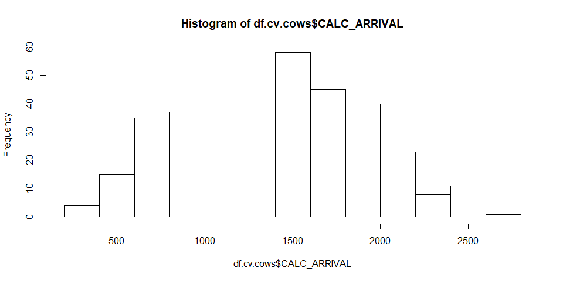
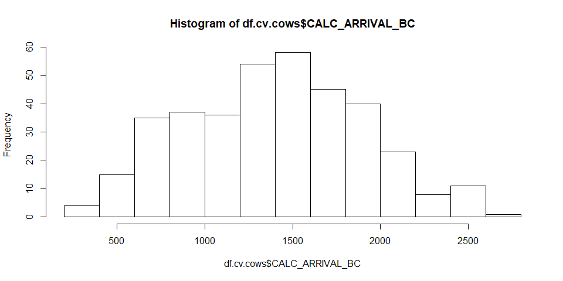
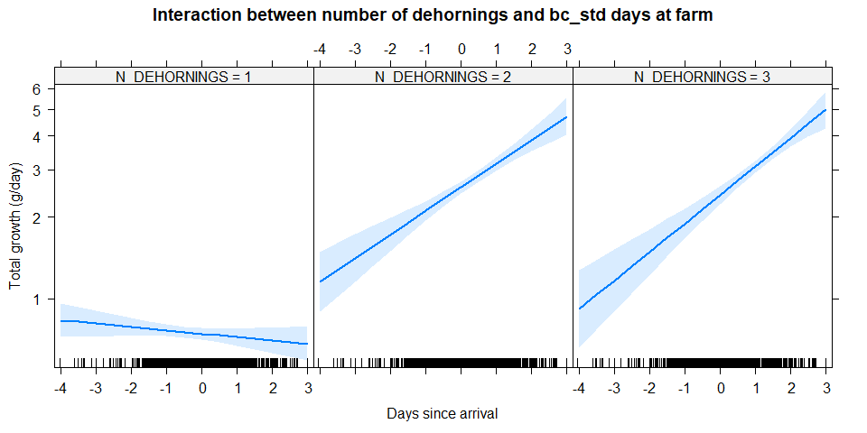
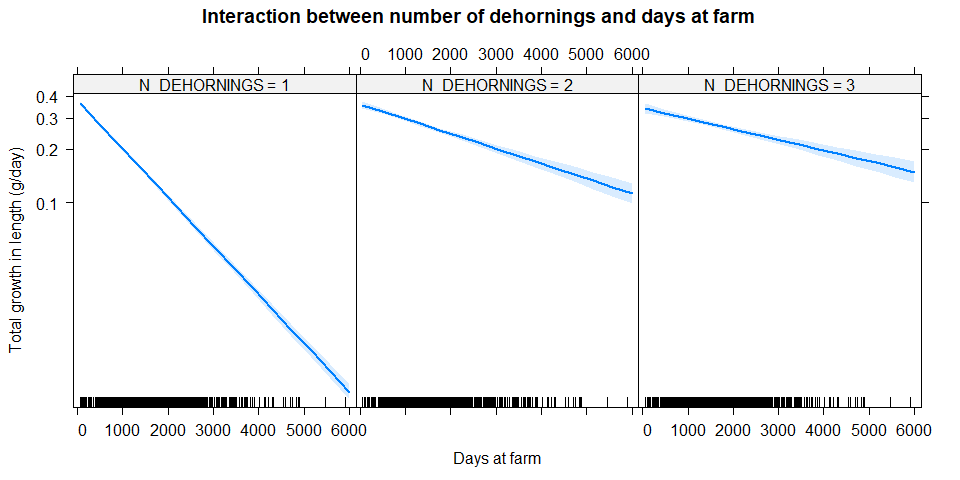

Ververs et al. (2018) - Reviewers request
================

-   [Statistical analysis preface](#statistical-analysis-preface)
-   [Main data extraction, transformation and loading](#main-data-extraction-transformation-and-loading)
-   [Hypothesis 1 - Factors influencing the total growth of the horn in reproducing females](#hypothesis-1---factors-influencing-the-total-growth-of-the-horn-in-reproducing-females)
    -   [Data preparation](#data-preparation)
    -   [Data transformations of continuous variables](#data-transformations-of-continuous-variables)
    -   [Model building](#model-building)
        -   [Generalized linear model](#generalized-linear-model)
        -   [Generalized Linear Mixed-Effects Models](#generalized-linear-mixed-effects-models)
        -   [GLM vs GLMM model comparison](#glm-vs-glmm-model-comparison)
        -   [Univariate models](#univariate-models)
        -   [Univariate model comparison](#univariate-model-comparison)
        -   [Multivariate model building](#multivariate-model-building)
    -   [Final model selection](#final-model-selection)
        -   [Interaction modelling](#interaction-modelling)
        -   [Least square means](#least-square-means)
-   [Hypothesis 2 - Factors influencing the total growth of the horn in males and females](#hypothesis-2---factors-influencing-the-total-growth-of-the-horn-in-males-and-females)
    -   [Data preparation](#data-preparation-1)
    -   [Data transformations of continuous variables](#data-transformations-of-continuous-variables-1)
    -   [Model building](#model-building-1)
        -   [Generalized linear model](#generalized-linear-model-1)
        -   [Generalized Linear Mixed-Effects Models](#generalized-linear-mixed-effects-models-1)
        -   [GLM vs GLMM model comparison](#glm-vs-glmm-model-comparison-1)
        -   [Univariate models](#univariate-models-1)
        -   [Univariate model comparison](#univariate-model-comparison-1)
        -   [Multivariate model building](#multivariate-model-building-1)
    -   [Final model selection](#final-model-selection-1)
        -   [Interaction modelling](#interaction-modelling-1)
        -   [Least square means](#least-square-means-1)
-   [Hypothesis 3 - Factors influencing the growth of the anterior horn weight in males and females](#hypothesis-3---factors-influencing-the-growth-of-the-anterior-horn-weight-in-males-and-females)
    -   [Data preparation](#data-preparation-2)
    -   [Data transformations of continuous variables](#data-transformations-of-continuous-variables-2)
    -   [Model building](#model-building-2)
        -   [Generalized linear model](#generalized-linear-model-2)
        -   [Generalized Linear Mixed-Effects Models](#generalized-linear-mixed-effects-models-2)
        -   [GLMM vs GLMM model comparison](#glmm-vs-glmm-model-comparison)
        -   [Univariate models](#univariate-models-2)
        -   [Univariate model comparison](#univariate-model-comparison-2)
        -   [Multivariate model building](#multivariate-model-building-2)
    -   [Final model selection](#final-model-selection-2)
        -   [Interaction modelling](#interaction-modelling-2)
        -   [Least square means](#least-square-means-2)
-   [Hypothesis 4 - Factors influencing the growth of the anterior horn length in males and females](#hypothesis-4---factors-influencing-the-growth-of-the-anterior-horn-length-in-males-and-females)
    -   [Data preparation](#data-preparation-3)
    -   [Data transformations of continuous variables](#data-transformations-of-continuous-variables-3)
    -   [Model building](#model-building-3)
        -   [Generalized linear model](#generalized-linear-model-3)
        -   [Generalized Linear Mixed-Effects Models](#generalized-linear-mixed-effects-models-3)
        -   [GLMM vs GLMM model comparison](#glmm-vs-glmm-model-comparison-1)
        -   [Univariate models](#univariate-models-3)
        -   [Univariate model comparison](#univariate-model-comparison-3)
        -   [Multivariate model building](#multivariate-model-building-3)
    -   [Final model selection](#final-model-selection-3)
        -   [Interaction modelling](#interaction-modelling-3)
        -   [Least square means](#least-square-means-3)
-   [Hypothesis 5 - Factors influencing the growth of the anterior horn circumference (mm/day) in males and females](#hypothesis-5---factors-influencing-the-growth-of-the-anterior-horn-circumference-mmday-in-males-and-females)
    -   [Data preparation](#data-preparation-4)
    -   [Data transformations of continuous variables](#data-transformations-of-continuous-variables-4)
    -   [Model building](#model-building-4)
        -   [Generalized linear model](#generalized-linear-model-4)
        -   [Generalized Linear Mixed-Effects Models](#generalized-linear-mixed-effects-models-4)
        -   [GLMM vs GLMM model comparison](#glmm-vs-glmm-model-comparison-2)
        -   [Univariate models](#univariate-models-4)
        -   [Univariate model comparison](#univariate-model-comparison-4)
        -   [Multivariate model building](#multivariate-model-building-4)
    -   [Final model selection](#final-model-selection-4)
        -   [Interaction modelling](#interaction-modelling-4)
        -   [Least square means](#least-square-means-4)

This is a notebook for the dehorning data of Ververs et al. (2018). This extra notebook shows the reviewers request to test random/repeated effects.

Statistical analysis preface
----------------------------

Currently the following R packages were loaded

    ## Loading required package: lme4

    ## Loading required package: Matrix

    ## Loading required package: effects

    ## Loading required package: carData

    ## lattice theme set by effectsTheme()
    ## See ?effectsTheme for details.

    ## Loading required package: car

    ## Loading required package: sjPlot

    ## #refugeeswelcome

    ## Loading required package: lsmeans

    ## The 'lsmeans' package is being deprecated.
    ## Users are encouraged to switch to 'emmeans'.
    ## See help('transition') for more information, including how
    ## to convert 'lsmeans' objects and scripts to work with 'emmeans'.

    ## Loading required package: EnvStats

    ## 
    ## Attaching package: 'EnvStats'

    ## The following object is masked from 'package:car':
    ## 
    ##     qqPlot

    ## The following object is masked from 'package:Matrix':
    ## 
    ##     print

    ## The following objects are masked from 'package:stats':
    ## 
    ##     predict, predict.lm

    ## The following object is masked from 'package:base':
    ## 
    ##     print.default

Main data extraction, transformation and loading
------------------------------------------------

The data was read from the excel file containing all dehornings, and some

Hypothesis 1 - Factors influencing the total growth of the horn in reproducing females
======================================================================================

Data preparation
----------------

``` r
df.cv.cows <- na.omit(df.cv[!df.cv$N_DEHORNINGS == "1", c("ANIMAL","CALC_ARRIVAL", "DH_QUARTER", "DIM_DEHORN", "CALC_PARITY", "C_QUARTER", "N_DEHORNINGS", "G_TOTAL")])

#Set all number of dehornings larger then 3 equal to 3 
df.cv.cows[df.cv.cows$N_DEHORNINGS == "4",]$N_DEHORNINGS <- "3"
df.cv.cows[df.cv.cows$N_DEHORNINGS == "5",]$N_DEHORNINGS <- "3"
#Not enough animals in the 4th parity
df.cv.cows[df.cv.cows$CALC_PARITY == "4",]$CALC_PARITY <- "3"
df.cv.cows$ANIMAL <- as.factor(df.cv.cows$ANIMAL)

summary(df.cv.cows)
```

    ##      ANIMAL     CALC_ARRIVAL  DH_QUARTER   DIM_DEHORN     CALC_PARITY
    ##  5      :  2   Min.   : 252   1: 56      Min.   :   1.0   0:  0      
    ##  32     :  2   1st Qu.:1004   2:129      1st Qu.: 267.0   1:180      
    ##  249    :  2   Median :1409   3: 94      Median : 462.0   2:139      
    ##  862    :  2   Mean   :1398   4: 88      Mean   : 531.4   3: 48      
    ##  894    :  2   3rd Qu.:1761              3rd Qu.: 717.0   4:  0      
    ##  908    :  2   Max.   :2636              Max.   :2070.0              
    ##  (Other):355                                                         
    ##  C_QUARTER N_DEHORNINGS    G_TOTAL        
    ##  1:169     1:  0        Min.   : 0.00899  
    ##  2: 83     2:243        1st Qu.: 2.16535  
    ##  3: 71     3:124        Median : 2.62069  
    ##  4: 44     4:  0        Mean   : 3.78089  
    ##            5:  0        3rd Qu.: 3.32012  
    ##                         Max.   :60.06250  
    ## 

``` r
xtabs(~DH_QUARTER+N_DEHORNINGS, df.cv.cows)
```

    ##           N_DEHORNINGS
    ## DH_QUARTER  1  2  3  4  5
    ##          1  0 30 26  0  0
    ##          2  0 71 58  0  0
    ##          3  0 72 22  0  0
    ##          4  0 70 18  0  0

``` r
xtabs(~C_QUARTER+N_DEHORNINGS, df.cv.cows)
```

    ##          N_DEHORNINGS
    ## C_QUARTER   1   2   3   4   5
    ##         1   0 106  63   0   0
    ##         2   0  56  27   0   0
    ##         3   0  51  20   0   0
    ##         4   0  30  14   0   0

Data transformations of continuous variables
--------------------------------------------

``` r
df.cv.cows$CALC_ARRIVAL_BC <- boxcoxTransform(df.cv.cows$CALC_ARRIVAL, lambda = 1)
df.cv.cows$CALC_ARRIVAL_STD <- scale(df.cv.cows$CALC_ARRIVAL)
hist(df.cv.cows$CALC_ARRIVAL)
```



``` r
hist(df.cv.cows$CALC_ARRIVAL_STD)
```



``` r
hist(df.cv.cows$CALC_ARRIVAL_BC)
```


``` r
df.cv.cows$DIM_DEHORN_BC <- boxcoxTransform(df.cv.cows$DIM_DEHORN, lambda = 0.5)
df.cv.cows$DIM_DEHORN_BC_STD <- scale(df.cv.cows$DIM_DEHORN_BC)
hist(df.cv.cows$DIM_DEHORN)
```


``` r
hist(df.cv.cows$DIM_DEHORN_BC)
```


``` r
hist(df.cv.cows$DIM_DEHORN_BC_STD)
```


Model building
--------------

### Generalized linear model

For more info (here)\[<https://en.wikipedia.org/wiki/Generalized_linear_model>\]

``` r
baselineGLM <- glm(G_TOTAL ~ 1, 
                         df.cv.cows, 
                         family = gaussian(link="log"))
```

### Generalized Linear Mixed-Effects Models

For more info [here](https://en.wikipedia.org/wiki/Generalized_linear_mixed_model)

We try to take into account the effect of the repeated measures (N\_DEHORNINGS) within each animal (ANIMAL). We first want to understand

``` r
baselineGLMM <- glmer(G_TOTAL ~ 1 + (1 | ANIMAL), 
                  df.cv.cows, 
                  family = gaussian(link="log"),
                  control=glmerControl(optimizer="bobyqa")
                  )
```

### GLM vs GLMM model comparison

``` r
anova(baselineGLMM, baselineGLM, test="Chisq")
```

    ## Data: df.cv.cows
    ## Models:
    ## baselineGLM: G_TOTAL ~ 1
    ## baselineGLMM: G_TOTAL ~ 1 + (1 | ANIMAL)
    ##              Df    AIC    BIC   logLik deviance  Chisq Chi Df Pr(>Chisq)
    ## baselineGLM   2 2308.1 2315.9 -1152.06   2304.1                         
    ## baselineGLMM  3 1125.5 1137.2  -559.73   1119.5 1184.7      1  < 2.2e-16
    ##                 
    ## baselineGLM     
    ## baselineGLMM ***
    ## ---
    ## Signif. codes:  0 '***' 0.001 '**' 0.01 '*' 0.05 '.' 0.1 ' ' 1

It seems that the random effect GLMM is increasing the model fit. Hence we will proceed.

### Univariate models

    ## Generalized linear mixed model fit by maximum likelihood (Laplace
    ##   Approximation) [glmerMod]
    ##  Family: gaussian  ( log )
    ## Formula: G_TOTAL ~ N_DEHORNINGS + (1 | ANIMAL)
    ##    Data: df.cv.cows
    ## Control: glmerControl(optimizer = "bobyqa")
    ## 
    ##      AIC      BIC   logLik deviance df.resid 
    ##   1126.5   1142.2   -559.3   1118.5      363 
    ## 
    ## Scaled residuals: 
    ##     Min      1Q  Median      3Q     Max 
    ## -4.5187 -0.0994  0.0249  0.1465  4.6797 
    ## 
    ## Random effects:
    ##  Groups   Name        Variance Std.Dev.
    ##  ANIMAL   (Intercept) 0.3877   0.6226  
    ##  Residual             0.5789   0.7609  
    ## Number of obs: 367, groups:  ANIMAL, 360
    ## 
    ## Fixed effects:
    ##               Estimate Std. Error t value Pr(>|z|)    
    ## (Intercept)    0.90167    0.03678  24.513   <2e-16 ***
    ## N_DEHORNINGS3  0.05310    0.05510   0.964    0.335    
    ## ---
    ## Signif. codes:  0 '***' 0.001 '**' 0.01 '*' 0.05 '.' 0.1 ' ' 1
    ## 
    ## Correlation of Fixed Effects:
    ##             (Intr)
    ## N_DEHORNING -0.468

    ## Generalized linear mixed model fit by maximum likelihood (Laplace
    ##   Approximation) [glmerMod]
    ##  Family: gaussian  ( log )
    ## Formula: G_TOTAL ~ CALC_ARRIVAL_STD + (1 | ANIMAL)
    ##    Data: df.cv.cows
    ## Control: glmerControl(optimizer = "bobyqa")
    ## 
    ##      AIC      BIC   logLik deviance df.resid 
    ##   1127.1   1142.7   -559.5   1119.1      363 
    ## 
    ## Scaled residuals: 
    ##     Min      1Q  Median      3Q     Max 
    ## -4.5126 -0.0977  0.0278  0.1498  4.7306 
    ## 
    ## Random effects:
    ##  Groups   Name        Variance Std.Dev.
    ##  ANIMAL   (Intercept) 0.3875   0.6225  
    ##  Residual             0.5784   0.7605  
    ## Number of obs: 367, groups:  ANIMAL, 360
    ## 
    ## Fixed effects:
    ##                  Estimate Std. Error t value Pr(>|z|)    
    ## (Intercept)       0.91984    0.03263  28.193   <2e-16 ***
    ## CALC_ARRIVAL_STD -0.01789    0.02771  -0.646    0.519    
    ## ---
    ## Signif. codes:  0 '***' 0.001 '**' 0.01 '*' 0.05 '.' 0.1 ' ' 1
    ## 
    ## Correlation of Fixed Effects:
    ##             (Intr)
    ## CALC_ARRIVA -0.074

    ## Generalized linear mixed model fit by maximum likelihood (Laplace
    ##   Approximation) [glmerMod]
    ##  Family: gaussian  ( log )
    ## Formula: G_TOTAL ~ CALC_PARITY + (1 | ANIMAL)
    ##    Data: df.cv.cows
    ## Control: glmerControl(optimizer = "bobyqa")
    ## 
    ##      AIC      BIC   logLik deviance df.resid 
    ##   1125.0   1144.5   -557.5   1115.0      362 
    ## 
    ## Scaled residuals: 
    ##     Min      1Q  Median      3Q     Max 
    ## -4.5090 -0.1142  0.0343  0.1403  4.7256 
    ## 
    ## Random effects:
    ##  Groups   Name        Variance Std.Dev.
    ##  ANIMAL   (Intercept) 0.3946   0.6281  
    ##  Residual             0.5744   0.7579  
    ## Number of obs: 367, groups:  ANIMAL, 360
    ## 
    ## Fixed effects:
    ##              Estimate Std. Error t value Pr(>|z|)    
    ## (Intercept)   0.94566    0.04584  20.628   <2e-16 ***
    ## CALC_PARITY2 -0.10048    0.06479  -1.551    0.121    
    ## CALC_PARITY3  0.07440    0.09491   0.784    0.433    
    ## ---
    ## Signif. codes:  0 '***' 0.001 '**' 0.01 '*' 0.05 '.' 0.1 ' ' 1
    ## 
    ## Correlation of Fixed Effects:
    ##              (Intr) CALC_PARITY2
    ## CALC_PARITY2 -0.644             
    ## CALC_PARITY3 -0.488  0.357

    ## Generalized linear mixed model fit by maximum likelihood (Laplace
    ##   Approximation) [glmerMod]
    ##  Family: gaussian  ( log )
    ## Formula: G_TOTAL ~ DIM_DEHORN_BC_STD + (1 | ANIMAL)
    ##    Data: df.cv.cows
    ## Control: glmerControl(optimizer = "bobyqa")
    ## 
    ##      AIC      BIC   logLik deviance df.resid 
    ##   1106.7   1122.3   -549.4   1098.7      363 
    ## 
    ## Scaled residuals: 
    ##     Min      1Q  Median      3Q     Max 
    ## -4.6083 -0.1072  0.0341  0.1449  4.2016 
    ## 
    ## Random effects:
    ##  Groups   Name        Variance Std.Dev.
    ##  ANIMAL   (Intercept) 0.4277   0.6540  
    ##  Residual             0.5387   0.7339  
    ## Number of obs: 367, groups:  ANIMAL, 360
    ## 
    ## Fixed effects:
    ##                   Estimate Std. Error t value Pr(>|z|)    
    ## (Intercept)        0.90301    0.03442  26.236  < 2e-16 ***
    ## DIM_DEHORN_BC_STD  0.13445    0.03023   4.447  8.7e-06 ***
    ## ---
    ## Signif. codes:  0 '***' 0.001 '**' 0.01 '*' 0.05 '.' 0.1 ' ' 1
    ## 
    ## Correlation of Fixed Effects:
    ##             (Intr)
    ## DIM_DEHORN_ -0.092

    ## Generalized linear mixed model fit by maximum likelihood (Laplace
    ##   Approximation) [glmerMod]
    ##  Family: gaussian  ( log )
    ## Formula: G_TOTAL ~ DH_QUARTER + (1 | ANIMAL)
    ##    Data: df.cv.cows
    ## Control: glmerControl(optimizer = "bobyqa")
    ## 
    ##      AIC      BIC   logLik deviance df.resid 
    ##    937.2    960.6   -462.6    925.2      361 
    ## 
    ## Scaled residuals: 
    ##     Min      1Q  Median      3Q     Max 
    ## -3.6003 -0.0344  0.0734  0.1564  1.5285 
    ## 
    ## Random effects:
    ##  Groups   Name        Variance Std.Dev.
    ##  ANIMAL   (Intercept) 0.4649   0.6818  
    ##  Residual             0.3197   0.5654  
    ## Number of obs: 367, groups:  ANIMAL, 360
    ## 
    ## Fixed effects:
    ##             Estimate Std. Error t value Pr(>|z|)    
    ## (Intercept)  1.74075    0.07462  23.327   <2e-16 ***
    ## DH_QUARTER2 -1.13169    0.07714 -14.671   <2e-16 ***
    ## DH_QUARTER3 -0.89118    0.08269 -10.778   <2e-16 ***
    ## DH_QUARTER4 -1.01910    0.10926  -9.327   <2e-16 ***
    ## ---
    ## Signif. codes:  0 '***' 0.001 '**' 0.01 '*' 0.05 '.' 0.1 ' ' 1
    ## 
    ## Correlation of Fixed Effects:
    ##             (Intr) DH_QUARTER2 DH_QUARTER3
    ## DH_QUARTER2 -0.775                        
    ## DH_QUARTER3 -0.734  0.703                 
    ## DH_QUARTER4 -0.738  0.707       0.582

    ## Generalized linear mixed model fit by maximum likelihood (Laplace
    ##   Approximation) [glmerMod]
    ##  Family: gaussian  ( log )
    ## Formula: G_TOTAL ~ C_QUARTER + (1 | ANIMAL)
    ##    Data: df.cv.cows
    ## Control: glmerControl(optimizer = "bobyqa")
    ## 
    ##      AIC      BIC   logLik deviance df.resid 
    ##   1119.6   1143.0   -553.8   1107.6      361 
    ## 
    ## Scaled residuals: 
    ##     Min      1Q  Median      3Q     Max 
    ## -4.5932 -0.0988  0.0321  0.1404  4.7218 
    ## 
    ## Random effects:
    ##  Groups   Name        Variance Std.Dev.
    ##  ANIMAL   (Intercept) 0.3945   0.6281  
    ##  Residual             0.5645   0.7514  
    ## Number of obs: 367, groups:  ANIMAL, 360
    ## 
    ## Fixed effects:
    ##             Estimate Std. Error t value Pr(>|z|)    
    ## (Intercept)  0.83571    0.04382  19.072  < 2e-16 ***
    ## C_QUARTER2   0.08285    0.08002   1.035  0.30047    
    ## C_QUARTER3   0.21494    0.06820   3.152  0.00162 ** 
    ## C_QUARTER4   0.17187    0.09111   1.886  0.05925 .  
    ## ---
    ## Signif. codes:  0 '***' 0.001 '**' 0.01 '*' 0.05 '.' 0.1 ' ' 1
    ## 
    ## Correlation of Fixed Effects:
    ##            (Intr) C_QUARTER2 C_QUARTER3
    ## C_QUARTER2 -0.524                      
    ## C_QUARTER3 -0.444  0.225               
    ## C_QUARTER4 -0.371  0.198      0.162

### Univariate model comparison

``` r
## Comparison of basemodel and single variate models
anova(baselineGLMM, glmer1 ,glmer2, glmer3, glmer4, glmer5, glmer6,  test = "Chisq")
```

    ## Data: df.cv.cows
    ## Models:
    ## baselineGLMM: G_TOTAL ~ 1 + (1 | ANIMAL)
    ## glmer1: G_TOTAL ~ N_DEHORNINGS + (1 | ANIMAL)
    ## glmer2: G_TOTAL ~ CALC_ARRIVAL_STD + (1 | ANIMAL)
    ## glmer4: G_TOTAL ~ DIM_DEHORN_BC_STD + (1 | ANIMAL)
    ## glmer3: G_TOTAL ~ CALC_PARITY + (1 | ANIMAL)
    ## glmer5: G_TOTAL ~ DH_QUARTER + (1 | ANIMAL)
    ## glmer6: G_TOTAL ~ C_QUARTER + (1 | ANIMAL)
    ##              Df     AIC    BIC  logLik deviance    Chisq Chi Df Pr(>Chisq)
    ## baselineGLMM  3 1125.47 1137.2 -559.73  1119.47                           
    ## glmer1        4 1126.54 1142.2 -559.27  1118.54   0.9285      1     0.3353
    ## glmer2        4 1127.05 1142.7 -559.53  1119.05   0.0000      0     1.0000
    ## glmer4        4 1106.72 1122.3 -549.36  1098.72  20.3344      0     <2e-16
    ## glmer3        5 1125.01 1144.5 -557.51  1115.01   0.0000      1     1.0000
    ## glmer5        6  937.17  960.6 -462.58   925.17 189.8451      1     <2e-16
    ## glmer6        6 1119.57 1143.0 -553.78  1107.57   0.0000      0     1.0000
    ##                 
    ## baselineGLMM    
    ## glmer1          
    ## glmer2          
    ## glmer4       ***
    ## glmer3          
    ## glmer5       ***
    ## glmer6          
    ## ---
    ## Signif. codes:  0 '***' 0.001 '**' 0.01 '*' 0.05 '.' 0.1 ' ' 1

### Multivariate model building

``` r
summary(glmer10 <- glmer(G_TOTAL ~ DH_QUARTER*DIM_DEHORN_BC_STD    
                         +  (1 | ANIMAL), 
                df.cv.cows, 
                family = gaussian(link="log"),
                control=glmerControl(optimizer="bobyqa")))
```

    ## Generalized linear mixed model fit by maximum likelihood (Laplace
    ##   Approximation) [glmerMod]
    ##  Family: gaussian  ( log )
    ## Formula: G_TOTAL ~ DH_QUARTER * DIM_DEHORN_BC_STD + (1 | ANIMAL)
    ##    Data: df.cv.cows
    ## Control: glmerControl(optimizer = "bobyqa")
    ## 
    ##      AIC      BIC   logLik deviance df.resid 
    ##    752.5    791.6   -366.3    732.5      357 
    ## 
    ## Scaled residuals: 
    ##      Min       1Q   Median       3Q      Max 
    ## -1.51125 -0.00239  0.06177  0.09828  1.35443 
    ## 
    ## Random effects:
    ##  Groups   Name        Variance Std.Dev.
    ##  ANIMAL   (Intercept) 0.9786   0.9893  
    ##  Residual             0.1598   0.3998  
    ## Number of obs: 367, groups:  ANIMAL, 360
    ## 
    ## Fixed effects:
    ##                               Estimate Std. Error t value Pr(>|z|)    
    ## (Intercept)                     2.3037     0.1048  21.992  < 2e-16 ***
    ## DH_QUARTER2                    -1.5818     0.1027 -15.400  < 2e-16 ***
    ## DH_QUARTER3                    -2.0024     0.1113 -17.997  < 2e-16 ***
    ## DH_QUARTER4                    -1.8939     0.1362 -13.903  < 2e-16 ***
    ## DIM_DEHORN_BC_STD              -1.4370     0.1432 -10.031  < 2e-16 ***
    ## DH_QUARTER2:DIM_DEHORN_BC_STD   1.7712     0.1524  11.624  < 2e-16 ***
    ## DH_QUARTER3:DIM_DEHORN_BC_STD   1.5820     0.2326   6.801 1.04e-11 ***
    ## DH_QUARTER4:DIM_DEHORN_BC_STD   1.6950     0.1867   9.080  < 2e-16 ***
    ## ---
    ## Signif. codes:  0 '***' 0.001 '**' 0.01 '*' 0.05 '.' 0.1 ' ' 1
    ## 
    ## Correlation of Fixed Effects:
    ##              (Intr) DH_QUARTER2 DH_QUARTER3 DH_QUARTER4 DIM_DE
    ## DH_QUARTER2  -0.741                                           
    ## DH_QUARTER3  -0.705  0.824                                    
    ## DH_QUARTER4  -0.693  0.701       0.692                        
    ## DIM_DEHORN_  -0.404  0.427       0.704       0.420            
    ## DH_QUARTER2:  0.374 -0.357      -0.709      -0.404      -0.980
    ## DH_QUARTER3:  0.231 -0.214      -0.494      -0.255      -0.957
    ## DH_QUARTER4:  0.219 -0.364      -0.563       0.016      -0.763
    ##              DH_QUARTER2: DH_QUARTER3:
    ## DH_QUARTER2                           
    ## DH_QUARTER3                           
    ## DH_QUARTER4                           
    ## DIM_DEHORN_                           
    ## DH_QUARTER2:                          
    ## DH_QUARTER3:  0.931                   
    ## DH_QUARTER4:  0.750        0.719

``` r
Anova(glmer10)
```

    ## Analysis of Deviance Table (Type II Wald chisquare tests)
    ## 
    ## Response: G_TOTAL
    ##                                 Chisq Df Pr(>Chisq)    
    ## DH_QUARTER                    85.5501  3     <2e-16 ***
    ## DIM_DEHORN_BC_STD              0.1803  1     0.6711    
    ## DH_QUARTER:DIM_DEHORN_BC_STD 258.0871  3     <2e-16 ***
    ## ---
    ## Signif. codes:  0 '***' 0.001 '**' 0.01 '*' 0.05 '.' 0.1 ' ' 1

``` r
summary(glmer11 <- glmer(G_TOTAL ~ N_DEHORNINGS + DH_QUARTER*CALC_ARRIVAL_STD 
                         +  (1|ANIMAL), 
                df.cv.cows, 
                family = gaussian(link="log"),
                control=glmerControl(optimizer="bobyqa")))
```

    ## Generalized linear mixed model fit by maximum likelihood (Laplace
    ##   Approximation) [glmerMod]
    ##  Family: gaussian  ( log )
    ## Formula: G_TOTAL ~ N_DEHORNINGS + DH_QUARTER * CALC_ARRIVAL_STD + (1 |  
    ##     ANIMAL)
    ##    Data: df.cv.cows
    ## Control: glmerControl(optimizer = "bobyqa")
    ## 
    ##      AIC      BIC   logLik deviance df.resid 
    ##    516.6    559.6   -247.3    494.6      356 
    ## 
    ## Scaled residuals: 
    ##      Min       1Q   Median       3Q      Max 
    ## -0.95621  0.00960  0.03183  0.05917  0.62381 
    ## 
    ## Random effects:
    ##  Groups   Name        Variance Std.Dev.
    ##  ANIMAL   (Intercept) 2.08973  1.446   
    ##  Residual             0.07455  0.273   
    ## Number of obs: 367, groups:  ANIMAL, 360
    ## 
    ## Fixed effects:
    ##                              Estimate Std. Error t value Pr(>|z|)    
    ## (Intercept)                   2.92698    0.12520  23.379  < 2e-16 ***
    ## N_DEHORNINGS3                -0.54820    0.11744  -4.668 3.05e-06 ***
    ## DH_QUARTER2                  -2.87424    0.08410 -34.178  < 2e-16 ***
    ## DH_QUARTER3                  -2.54567    0.08622 -29.525  < 2e-16 ***
    ## DH_QUARTER4                  -2.94462    0.18833 -15.635  < 2e-16 ***
    ## CALC_ARRIVAL_STD              1.57967    0.06425  24.588  < 2e-16 ***
    ## DH_QUARTER2:CALC_ARRIVAL_STD -0.87258    0.05220 -16.716  < 2e-16 ***
    ## DH_QUARTER3:CALC_ARRIVAL_STD -1.60701    0.11157 -14.404  < 2e-16 ***
    ## DH_QUARTER4:CALC_ARRIVAL_STD -2.43438    0.19355 -12.577  < 2e-16 ***
    ## ---
    ## Signif. codes:  0 '***' 0.001 '**' 0.01 '*' 0.05 '.' 0.1 ' ' 1
    ## 
    ## Correlation of Fixed Effects:
    ##              (Intr) N_DEHO DH_QUARTER2 DH_QUARTER3 DH_QUARTER4 CALC_A
    ## N_DEHORNING  -0.222                                                  
    ## DH_QUARTER2  -0.378 -0.312                                           
    ## DH_QUARTER3  -0.354 -0.369  0.985                                    
    ## DH_QUARTER4  -0.451  0.098  0.330       0.311                        
    ## CALC_ARRIVA   0.494 -0.660 -0.486      -0.444      -0.341            
    ## DH_QUARTER2: -0.368 -0.256  0.919       0.945       0.302      -0.530
    ## DH_QUARTER3: -0.020 -0.869  0.700       0.737       0.089       0.229
    ## DH_QUARTER4:  0.054  0.257  0.196       0.174      -0.704      -0.389
    ##              DH_QUARTER2: DH_QUARTER3:
    ## N_DEHORNING                           
    ## DH_QUARTER2                           
    ## DH_QUARTER3                           
    ## DH_QUARTER4                           
    ## CALC_ARRIVA                           
    ## DH_QUARTER2:                          
    ## DH_QUARTER3:  0.623                   
    ## DH_QUARTER4:  0.195       -0.084

``` r
Anova(glmer11)
```

    ## Analysis of Deviance Table (Type II Wald chisquare tests)
    ## 
    ## Response: G_TOTAL
    ##                                Chisq Df Pr(>Chisq)    
    ## N_DEHORNINGS                  21.787  1  3.046e-06 ***
    ## DH_QUARTER                  2633.067  3  < 2.2e-16 ***
    ## CALC_ARRIVAL_STD            1684.102  1  < 2.2e-16 ***
    ## DH_QUARTER:CALC_ARRIVAL_STD  432.646  3  < 2.2e-16 ***
    ## ---
    ## Signif. codes:  0 '***' 0.001 '**' 0.01 '*' 0.05 '.' 0.1 ' ' 1

Final model selection
---------------------

``` r
anova(glmer10, glmer11, test = "Chisq")
```

    ## Data: df.cv.cows
    ## Models:
    ## glmer10: G_TOTAL ~ DH_QUARTER * DIM_DEHORN_BC_STD + (1 | ANIMAL)
    ## glmer11: G_TOTAL ~ N_DEHORNINGS + DH_QUARTER * CALC_ARRIVAL_STD + (1 | 
    ## glmer11:     ANIMAL)
    ##         Df    AIC    BIC  logLik deviance  Chisq Chi Df Pr(>Chisq)    
    ## glmer10 10 752.53 791.58 -366.27   732.53                             
    ## glmer11 11 516.64 559.60 -247.32   494.64 237.89      1  < 2.2e-16 ***
    ## ---
    ## Signif. codes:  0 '***' 0.001 '**' 0.01 '*' 0.05 '.' 0.1 ' ' 1

### Interaction modelling

To understand the effect of the interaction, an effects plot was created

``` r
plot(effect("DH_QUARTER:DIM_DEHORN_BC_STD", 
            glmer10, 
            #xlevels=list(CALC_ARRIVAL=900:2000), 
            multiline=TRUE),
     main = "Interaction between dehorn season and bc_std days since last dehorn",
     xlab = "Days since arrival",
     ylab = "Total growth (g/day)")
```


Next piece is used to show it on non transformed scale

``` r
glmer10b <- glmer(G_TOTAL~ 
                        DH_QUARTER*DIM_DEHORN + 
                        (1|ANIMAL), 
                      df.cv.cows, 
                      family = gaussian(link="log"),
                      control=glmerControl(optimizer="bobyqa")
                      )
```

    ## Warning in checkConv(attr(opt, "derivs"), opt$par, ctrl = control
    ## $checkConv, : unable to evaluate scaled gradient

    ## Warning in checkConv(attr(opt, "derivs"), opt$par, ctrl = control
    ## $checkConv, : Model failed to converge: degenerate Hessian with 1 negative
    ## eigenvalues

``` r
plot(effect("DH_QUARTER:DIM_DEHORN", 
            glmer10b, 
            #xlevels=list(CALC_ARRIVAL=900:2000), 
            multiline=TRUE),
     main = "Interaction between dehorn season and days since last dehorn",
     xlab = "Days since arrival",
     ylab = "Total growth (g/day)")
```

    ## Warning in vcov.merMod(mod): variance-covariance matrix computed from finite-difference Hessian is
    ## not positive definite or contains NA values: falling back to var-cov estimated from RX


### Least square means

The [least square means](https://en.wikipedia.org/wiki/Least_squares) are constructed for the final variables.

This is the overal P-value per variables

    ## Analysis of Deviance Table (Type II Wald chisquare tests)
    ## 
    ## Response: G_TOTAL
    ##                                 Chisq Df Pr(>Chisq)    
    ## DH_QUARTER                    85.5501  3     <2e-16 ***
    ## DIM_DEHORN_BC_STD              0.1803  1     0.6711    
    ## DH_QUARTER:DIM_DEHORN_BC_STD 258.0871  3     <2e-16 ***
    ## ---
    ## Signif. codes:  0 '***' 0.001 '**' 0.01 '*' 0.05 '.' 0.1 ' ' 1

Least square means, Tukey adjusted

    ## NOTE: Results may be misleading due to involvement in interactions

    ## $lsmeans
    ##  DH_QUARTER  response        SE df asymp.LCL asymp.UCL
    ##  1          10.011295 1.0487128 NA  8.153131 12.292951
    ##  2           2.058454 0.1537949 NA  1.778053  2.383075
    ##  3           1.351652 0.1125234 NA  1.148162  1.591206
    ##  4           1.506568 0.1487748 NA  1.241458  1.828292
    ## 
    ## Confidence level used: 0.95 
    ## Intervals are back-transformed from the log scale 
    ## 
    ## $contrasts
    ##  contrast response.ratio         SE df z.ratio p.value
    ##  1 - 2         4.8635016 0.49955205 NA  15.400  <.0001
    ##  1 - 3         7.4067122 0.82409589 NA  17.997  <.0001
    ##  1 - 4         6.6451000 0.90520090 NA  13.903  <.0001
    ##  2 - 3         1.5229176 0.09741949 NA   6.575  <.0001
    ##  2 - 4         1.3663201 0.13315263 NA   3.203  0.0074
    ##  3 - 4         0.8971727 0.08947347 NA  -1.088  0.6969
    ## 
    ## P value adjustment: tukey method for comparing a family of 4 estimates 
    ## Tests are performed on the log scale

    ## Loading required package: multcompView
    ## NOTE: Results may be misleading due to involvement in interactions

    ##  DH_QUARTER    lsmean         SE df  asymp.LCL asymp.UCL .group
    ##  3          0.3013274 0.08324881 NA 0.09396165 0.5086931  a    
    ##  4          0.4098343 0.09875082 NA 0.16385437 0.6558142  a    
    ##  2          0.7219553 0.07471376 NA 0.53584969 0.9080610   b   
    ##  1          2.3037140 0.10475296 NA 2.04278328 2.5646447    c  
    ## 
    ## Results are given on the log (not the response) scale. 
    ## Confidence level used: 0.95 
    ## Conf-level adjustment: sidak method for 4 estimates 
    ## P value adjustment: tukey method for comparing a family of 4 estimates 
    ## significance level used: alpha = 0.05

Hypothesis 2 - Factors influencing the total growth of the horn in males and females
====================================================================================

Data preparation
----------------

``` r
#Make sure to drop the extemely low growth which are caused by dirty data
df.cv.all <- na.omit(df.cv[df.cv$G_TOTAL < 100,
                           (names(df.cv) %in% c("ANIMAL",
                                                "CALC_AGE", 
                                                "DH_QUARTER", 
                                                "GENDER", 
                                                "G_TOTAL",
                                                "N_DEHORNINGS",
                                                "B_QUARTER"
                                                ))])
df.cv.all$ANIMAL <- as.factor(df.cv.all$ANIMAL)
df.cv.all[df.cv.all$N_DEHORNINGS == "4",]$N_DEHORNINGS <- "3"
df.cv.all[df.cv.all$N_DEHORNINGS == "5",]$N_DEHORNINGS <- "3"

summary(df.cv.all)
```

    ##      ANIMAL     GENDER     CALC_AGE      DH_QUARTER B_QUARTER N_DEHORNINGS
    ##  59     :   3   F:498   Min.   :  58.0   1:154      1:397     1:597       
    ##  91     :   3   M:588   1st Qu.: 921.8   2:297      2:313     2:315       
    ##  105    :   3           Median :1375.0   3:275      3:183     3:174       
    ##  120    :   3           Mean   :1552.5   4:360      4:193     4:  0       
    ##  168    :   3           3rd Qu.:1964.0                        5:  0       
    ##  281    :   3           Max.   :5909.0                                    
    ##  (Other):1068                                                             
    ##     G_TOTAL        
    ##  Min.   : 0.01195  
    ##  1st Qu.: 0.73166  
    ##  Median : 1.27254  
    ##  Mean   : 1.99431  
    ##  3rd Qu.: 2.74384  
    ##  Max.   :33.02857  
    ## 

``` r
xtabs(~DH_QUARTER+N_DEHORNINGS, df.cv.all)
```

    ##           N_DEHORNINGS
    ## DH_QUARTER   1   2   3   4   5
    ##          1  86  43  25   0   0
    ##          2 156 100  41   0   0
    ##          3 143  76  56   0   0
    ##          4 212  96  52   0   0

``` r
xtabs(~B_QUARTER+N_DEHORNINGS, df.cv.all)
```

    ##          N_DEHORNINGS
    ## B_QUARTER   1   2   3   4   5
    ##         1 228 110  59   0   0
    ##         2 159  93  61   0   0
    ##         3  91  58  34   0   0
    ##         4 119  54  20   0   0

Data transformations of continuous variables
--------------------------------------------

``` r
df.cv.all$CALC_AGE_BC <- boxcoxTransform(df.cv.all$CALC_AGE, lambda = .25)
df.cv.all$CALC_AGE_BC_STD <- scale(df.cv.all$CALC_AGE_BC)
hist(df.cv.all$CALC_AGE)
```


``` r
hist(df.cv.all$CALC_AGE_BC_STD)
```


Model building
--------------

### Generalized linear model

For more info [here](%5Bhttps://en.wikipedia.org/wiki/Generalized_linear_model)

``` r
baselineGLM <- glm(G_TOTAL ~ 1, 
                         df.cv.all, 
                         family = gaussian(link="log"))
```

### Generalized Linear Mixed-Effects Models

For more info [here](https://en.wikipedia.org/wiki/Generalized_linear_mixed_model)

We try to take into account the effect of the repeated measures (N\_DEHORNINGS) within each animal (ANIMAL). We first want to understand

``` r
baselineGLMM <- glmer(G_TOTAL ~ 1 + (1 | ANIMAL), 
                  df.cv.all, 
                  family = gaussian(link="log"),
                  control=glmerControl(optimizer="bobyqa")
                  )
```

### GLM vs GLMM model comparison

``` r
anova(baselineGLMM, baselineGLM, test="Chisq")
```

    ## Data: df.cv.all
    ## Models:
    ## baselineGLM: G_TOTAL ~ 1
    ## baselineGLMM: G_TOTAL ~ 1 + (1 | ANIMAL)
    ##              Df    AIC    BIC  logLik deviance  Chisq Chi Df Pr(>Chisq)
    ## baselineGLM   2 4594.3 4604.3 -2295.2   4590.3                         
    ## baselineGLMM  3 4225.9 4240.8 -2109.9   4219.9 370.47      1  < 2.2e-16
    ##                 
    ## baselineGLM     
    ## baselineGLMM ***
    ## ---
    ## Signif. codes:  0 '***' 0.001 '**' 0.01 '*' 0.05 '.' 0.1 ' ' 1

The GLMM performs better

### Univariate models

### Univariate model comparison

``` r
## Comparison of basemodel and single variate models
anova(baselineGLMM, glmer1 ,glmer2, glmer3, glmer4, glmer5, test = "Chisq")
```

    ## Data: df.cv.all
    ## Models:
    ## baselineGLMM: G_TOTAL ~ 1 + (1 | ANIMAL)
    ## glmer2: G_TOTAL ~ CALC_AGE_BC_STD + (1 | ANIMAL)
    ## glmer5: G_TOTAL ~ GENDER + (1 | ANIMAL)
    ## glmer1: G_TOTAL ~ N_DEHORNINGS + (1 | ANIMAL)
    ## glmer3: G_TOTAL ~ DH_QUARTER + (1 | ANIMAL)
    ## glmer4: G_TOTAL ~ B_QUARTER + (1 | ANIMAL)
    ##              Df    AIC    BIC  logLik deviance    Chisq Chi Df Pr(>Chisq)
    ## baselineGLMM  3 4225.9 4240.8 -2109.9   4219.9                           
    ## glmer2        4 3627.9 3647.9 -1810.0   3619.9  599.957      1     <2e-16
    ## glmer5        4 4185.0 4204.9 -2088.5   4177.0    0.000      0          1
    ## glmer1        5 2056.7 2081.7 -1023.4   2046.7 2130.230      1     <2e-16
    ## glmer3        6 4228.2 4258.2 -2108.1   4216.2    0.000      1          1
    ## glmer4        6 4208.9 4238.9 -2098.5   4196.9   19.298      0     <2e-16
    ##                 
    ## baselineGLMM    
    ## glmer2       ***
    ## glmer5          
    ## glmer1       ***
    ## glmer3          
    ## glmer4       ***
    ## ---
    ## Signif. codes:  0 '***' 0.001 '**' 0.01 '*' 0.05 '.' 0.1 ' ' 1

### Multivariate model building

``` r
glmer10 <- glmer(G_TOTAL ~ CALC_AGE_BC_STD + N_DEHORNINGS + B_QUARTER    
                         +  (1| ANIMAL), 
                df.cv.all, 
                family = gaussian(link="log"),
                control=glmerControl(optimizer="bobyqa"))
summary(glmer10)
```

    ## Generalized linear mixed model fit by maximum likelihood (Laplace
    ##   Approximation) [glmerMod]
    ##  Family: gaussian  ( log )
    ## Formula: 
    ## G_TOTAL ~ CALC_AGE_BC_STD + N_DEHORNINGS + B_QUARTER + (1 | ANIMAL)
    ##    Data: df.cv.all
    ## Control: glmerControl(optimizer = "bobyqa")
    ## 
    ##      AIC      BIC   logLik deviance df.resid 
    ##   2030.3   2075.2  -1006.2   2012.3     1077 
    ## 
    ## Scaled residuals: 
    ##     Min      1Q  Median      3Q     Max 
    ## -3.8994 -0.3564 -0.0099  0.3679  4.6312 
    ## 
    ## Random effects:
    ##  Groups   Name        Variance Std.Dev.
    ##  ANIMAL   (Intercept) 0.1224   0.3499  
    ##  Residual             0.2948   0.5430  
    ## Number of obs: 1086, groups:  ANIMAL, 758
    ## 
    ## Fixed effects:
    ##                 Estimate Std. Error t value Pr(>|z|)    
    ## (Intercept)     -0.22208    0.03062  -7.252 4.09e-13 ***
    ## CALC_AGE_BC_STD  0.05110    0.01668   3.063  0.00219 ** 
    ## N_DEHORNINGS2    1.29229    0.02844  45.444  < 2e-16 ***
    ## N_DEHORNINGS3    1.33154    0.03377  39.429  < 2e-16 ***
    ## B_QUARTER2      -0.13685    0.03055  -4.480 7.47e-06 ***
    ## B_QUARTER3      -0.01154    0.03805  -0.303  0.76166    
    ## B_QUARTER4      -0.08253    0.03681  -2.242  0.02496 *  
    ## ---
    ## Signif. codes:  0 '***' 0.001 '**' 0.01 '*' 0.05 '.' 0.1 ' ' 1
    ## 
    ## Correlation of Fixed Effects:
    ##               (Intr) CALC_A N_DEHORNINGS2 N_DEHORNINGS3 B_QUARTER2
    ## CALC_AGE_BC    0.264                                              
    ## N_DEHORNINGS2 -0.543 -0.451                                       
    ## N_DEHORNINGS3 -0.488 -0.589  0.768                                
    ## B_QUARTER2    -0.426  0.010 -0.045        -0.081                  
    ## B_QUARTER3    -0.397 -0.099  0.000         0.019         0.436    
    ## B_QUARTER4    -0.452 -0.072  0.071         0.104         0.466    
    ##               B_QUARTER3
    ## CALC_AGE_BC             
    ## N_DEHORNINGS2           
    ## N_DEHORNINGS3           
    ## B_QUARTER2              
    ## B_QUARTER3              
    ## B_QUARTER4     0.351

``` r
Anova(glmer10)
```

    ## Analysis of Deviance Table (Type II Wald chisquare tests)
    ## 
    ## Response: G_TOTAL
    ##                     Chisq Df Pr(>Chisq)    
    ## CALC_AGE_BC_STD    9.3817  1   0.002192 ** 
    ## N_DEHORNINGS    2114.9003  2  < 2.2e-16 ***
    ## B_QUARTER         23.7139  3  2.866e-05 ***
    ## ---
    ## Signif. codes:  0 '***' 0.001 '**' 0.01 '*' 0.05 '.' 0.1 ' ' 1

Final model selection
---------------------

### Interaction modelling

``` r
glmer11 <- glmer(G_TOTAL ~ N_DEHORNINGS*CALC_AGE_BC_STD + B_QUARTER    
                         +  (1| ANIMAL), 
                df.cv.all, 
                family = gaussian(link="log"),
                control=glmerControl(optimizer="bobyqa"))
summary(glmer11)
```

    ## Generalized linear mixed model fit by maximum likelihood (Laplace
    ##   Approximation) [glmerMod]
    ##  Family: gaussian  ( log )
    ## Formula: 
    ## G_TOTAL ~ N_DEHORNINGS * CALC_AGE_BC_STD + B_QUARTER + (1 | ANIMAL)
    ##    Data: df.cv.all
    ## Control: glmerControl(optimizer = "bobyqa")
    ## 
    ##      AIC      BIC   logLik deviance df.resid 
    ##   1972.7   2027.6   -975.4   1950.7     1075 
    ## 
    ## Scaled residuals: 
    ##     Min      1Q  Median      3Q     Max 
    ## -3.5356 -0.3275 -0.0175  0.3512  4.0980 
    ## 
    ## Random effects:
    ##  Groups   Name        Variance Std.Dev.
    ##  ANIMAL   (Intercept) 0.1179   0.3433  
    ##  Residual             0.2851   0.5339  
    ## Number of obs: 1086, groups:  ANIMAL, 758
    ## 
    ## Fixed effects:
    ##                               Estimate Std. Error t value Pr(>|z|)    
    ## (Intercept)                   -0.24619    0.03054  -8.061 7.57e-16 ***
    ## N_DEHORNINGS2                  1.24694    0.02905  42.919  < 2e-16 ***
    ## N_DEHORNINGS3                  1.18073    0.04035  29.261  < 2e-16 ***
    ## CALC_AGE_BC_STD               -0.02864    0.01977  -1.448   0.1475    
    ## B_QUARTER2                    -0.12281    0.02949  -4.165 3.12e-05 ***
    ## B_QUARTER3                    -0.03007    0.03761  -0.800   0.4239    
    ## B_QUARTER4                    -0.07226    0.03592  -2.012   0.0442 *  
    ## N_DEHORNINGS2:CALC_AGE_BC_STD  0.22954    0.03358   6.835 8.20e-12 ***
    ## N_DEHORNINGS3:CALC_AGE_BC_STD  0.27145    0.03836   7.077 1.47e-12 ***
    ## ---
    ## Signif. codes:  0 '***' 0.001 '**' 0.01 '*' 0.05 '.' 0.1 ' ' 1
    ## 
    ## Correlation of Fixed Effects:
    ##                (Intr) N_DEHORNINGS2 N_DEHORNINGS3 CALC_A B_QUARTER2
    ## N_DEHORNINGS2  -0.533                                              
    ## N_DEHORNINGS3  -0.367  0.689                                       
    ## CALC_AGE_BC     0.349 -0.350        -0.269                         
    ## B_QUARTER2     -0.415 -0.049        -0.072        -0.028           
    ## B_QUARTER3     -0.374  0.021         0.038        -0.054  0.414    
    ## B_QUARTER4     -0.434  0.077         0.033        -0.056  0.449    
    ## N_DEHORNINGS2: -0.138 -0.147        -0.238        -0.502  0.065    
    ## N_DEHORNINGS3: -0.147 -0.067        -0.504        -0.440  0.027    
    ##                B_QUARTER3 B_QUARTER4 N_DEHORNINGS2:
    ## N_DEHORNINGS2                                      
    ## N_DEHORNINGS3                                      
    ## CALC_AGE_BC                                        
    ## B_QUARTER2                                         
    ## B_QUARTER3                                         
    ## B_QUARTER4      0.325                              
    ## N_DEHORNINGS2: -0.076     -0.036                   
    ## N_DEHORNINGS3: -0.031      0.071      0.625

``` r
Anova(glmer11)
```

    ## Analysis of Deviance Table (Type II Wald chisquare tests)
    ## 
    ## Response: G_TOTAL
    ##                                 Chisq Df Pr(>Chisq)    
    ## N_DEHORNINGS                 1987.219  2  < 2.2e-16 ***
    ## CALC_AGE_BC_STD                 9.114  1  0.0025366 ** 
    ## B_QUARTER                      18.486  3  0.0003491 ***
    ## N_DEHORNINGS:CALC_AGE_BC_STD   59.630  2  1.126e-13 ***
    ## ---
    ## Signif. codes:  0 '***' 0.001 '**' 0.01 '*' 0.05 '.' 0.1 ' ' 1

Test interaction fit

``` r
anova(glmer10, glmer11, test="Chisq")
```

    ## Data: df.cv.all
    ## Models:
    ## glmer10: G_TOTAL ~ CALC_AGE_BC_STD + N_DEHORNINGS + B_QUARTER + (1 | ANIMAL)
    ## glmer11: G_TOTAL ~ N_DEHORNINGS * CALC_AGE_BC_STD + B_QUARTER + (1 | ANIMAL)
    ##         Df    AIC    BIC   logLik deviance  Chisq Chi Df Pr(>Chisq)    
    ## glmer10  9 2030.3 2075.2 -1006.15   2012.3                             
    ## glmer11 11 1972.7 2027.6  -975.37   1950.7 61.563      2  4.282e-14 ***
    ## ---
    ## Signif. codes:  0 '***' 0.001 '**' 0.01 '*' 0.05 '.' 0.1 ' ' 1

The model with the interaction fits best, lowest AIC

To understand the effect of the interaction, an effects plot was created

``` r
plot(effect("N_DEHORNINGS:CALC_AGE_BC_STD", 
            glmer11, 
            #xlevels=list(CALC_ARRIVAL=900:2000), 
            multiline=TRUE),
     main = "Interaction between number of dehornings and bc_std days at farm",
     xlab = "Days since arrival",
     ylab = "Total growth (g/day)")
```



Next piece is used to show it on non transformed scale

``` r
glmer11b <- glmer(G_TOTAL ~ N_DEHORNINGS*CALC_AGE + B_QUARTER    
                         +  (1| ANIMAL), 
                df.cv.all, 
                family = gaussian(link="log"),
                control=glmerControl(optimizer="bobyqa"))
```

    ## Warning in checkConv(attr(opt, "derivs"), opt$par, ctrl = control
    ## $checkConv, : Model failed to converge with max|grad| = 180.845 (tol =
    ## 0.001, component 1)

    ## Warning in checkConv(attr(opt, "derivs"), opt$par, ctrl = control$checkConv, : Model is nearly unidentifiable: very large eigenvalue
    ##  - Rescale variables?;Model is nearly unidentifiable: large eigenvalue ratio
    ##  - Rescale variables?

``` r
plot(effect("N_DEHORNINGS:CALC_AGE", 
            glmer11b, 
            #xlevels=list(CALC_ARRIVAL=900:2000), 
            multiline=TRUE),
     main = "Interaction between number of dehornings and days at farm",
     xlab = "Days since arrival",
     ylab = "Total growth (g/day)")
```


### Least square means

The [least square means](https://en.wikipedia.org/wiki/Least_squares) are constructed for the final variables.

This is the overal P-value per variables

    ## Analysis of Deviance Table (Type II Wald chisquare tests)
    ## 
    ## Response: G_TOTAL
    ##                                 Chisq Df Pr(>Chisq)    
    ## N_DEHORNINGS                 1987.219  2  < 2.2e-16 ***
    ## CALC_AGE_BC_STD                 9.114  1  0.0025366 ** 
    ## B_QUARTER                      18.486  3  0.0003491 ***
    ## N_DEHORNINGS:CALC_AGE_BC_STD   59.630  2  1.126e-13 ***
    ## ---
    ## Signif. codes:  0 '***' 0.001 '**' 0.01 '*' 0.05 '.' 0.1 ' ' 1

Least square means, Tukey adjusted

    ## NOTE: Results may be misleading due to involvement in interactions

    ## $lsmeans
    ##  N_DEHORNINGS  response         SE df asymp.LCL asymp.UCL
    ##  1            0.7389862 0.01938610 NA 0.7019505 0.7779761
    ##  2            2.5714228 0.06389985 NA 2.4491824 2.6997643
    ##  3            2.4066859 0.09073169 NA 2.2352662 2.5912516
    ## 
    ## Results are averaged over the levels of: B_QUARTER 
    ## Confidence level used: 0.95 
    ## Intervals are back-transformed from the log scale 
    ## 
    ## $contrasts
    ##  contrast response.ratio          SE df z.ratio p.value
    ##  1 - 2         0.2873842 0.008349513 NA -42.919  <.0001
    ##  1 - 3         0.3070555 0.012390163 NA -29.261  <.0001
    ##  2 - 3         1.0684497 0.031272123 NA   2.262  0.0613
    ## 
    ## Results are averaged over the levels of: B_QUARTER 
    ## P value adjustment: tukey method for comparing a family of 3 estimates 
    ## Tests are performed on the log scale

    ## $lsmeans
    ##  B_QUARTER response         SE df asymp.LCL asymp.UCL
    ##  1         1.755982 0.04872903 NA  1.663026  1.854135
    ##  2         1.553054 0.04409713 NA  1.468986  1.641933
    ##  3         1.703962 0.06328984 NA  1.584324  1.832634
    ##  4         1.633575 0.05644781 NA  1.526602  1.748043
    ## 
    ## Results are averaged over the levels of: N_DEHORNINGS 
    ## Confidence level used: 0.95 
    ## Intervals are back-transformed from the log scale 
    ## 
    ## $contrasts
    ##  contrast response.ratio         SE df z.ratio p.value
    ##  1 - 2         1.1306640 0.03333938 NA   4.165  0.0002
    ##  1 - 3         1.0305292 0.03875403 NA   0.800  0.8546
    ##  1 - 4         1.0749323 0.03860925 NA   2.012  0.1835
    ##  2 - 3         0.9114372 0.03368811 NA  -2.509  0.0585
    ##  2 - 4         0.9507089 0.03303821 NA  -1.455  0.4653
    ##  3 - 4         1.0430877 0.04457728 NA   0.987  0.7568
    ## 
    ## Results are averaged over the levels of: N_DEHORNINGS 
    ## P value adjustment: tukey method for comparing a family of 4 estimates 
    ## Tests are performed on the log scale

    ## NOTE: Results may be misleading due to involvement in interactions

    ##  N_DEHORNINGS     lsmean         SE df  asymp.LCL  asymp.UCL .group
    ##  1            -0.3024760 0.02623337 NA -0.3651144 -0.2398376  a    
    ##  3             0.8782507 0.03769985 NA  0.7882333  0.9682680   b   
    ##  2             0.9444594 0.02485000 NA  0.8851241  1.0037946   b   
    ## 
    ## Results are averaged over the levels of: B_QUARTER 
    ## Results are given on the log (not the response) scale. 
    ## Confidence level used: 0.95 
    ## Conf-level adjustment: sidak method for 3 estimates 
    ## P value adjustment: tukey method for comparing a family of 3 estimates 
    ## significance level used: alpha = 0.05

    ##  B_QUARTER    lsmean         SE df asymp.LCL asymp.UCL .group
    ##  2         0.4402234 0.02839382 NA 0.3694968 0.5109500  a    
    ##  4         0.4907708 0.03455477 NA 0.4046977 0.5768438  ab   
    ##  3         0.5329560 0.03714276 NA 0.4404366 0.6254755  ab   
    ##  1         0.5630285 0.02775030 NA 0.4939048 0.6321521   b   
    ## 
    ## Results are averaged over the levels of: N_DEHORNINGS 
    ## Results are given on the log (not the response) scale. 
    ## Confidence level used: 0.95 
    ## Conf-level adjustment: sidak method for 4 estimates 
    ## P value adjustment: tukey method for comparing a family of 4 estimates 
    ## significance level used: alpha = 0.05

Hypothesis 3 - Factors influencing the growth of the anterior horn weight in males and females
==============================================================================================

Data preparation
----------------

``` r
df.cv.all.f <- na.omit(df.cv[df.cv$G_AH_W < 100,
                             (names(df.cv) %in% c("ANIMAL",
                                                  "CALC_AGE",
                                                  "DH_QUARTER", 
                                                  "GENDER", 
                                                  "G_AH_W",
                                                  "N_DEHORNINGS",
                                                  "B_QUARTER"))])
summary(df.cv.all.f)
```

    ##      ANIMAL       GENDER     CALC_AGE      DH_QUARTER B_QUARTER
    ##  Min.   :   7.0   F:495   Min.   :  58.0   1:154      1:395    
    ##  1st Qu.: 350.0   M:588   1st Qu.: 922.5   2:294      2:312    
    ##  Median : 551.0           Median :1376.0   3:275      3:183    
    ##  Mean   : 543.4           Mean   :1553.6   4:360      4:193    
    ##  3rd Qu.: 754.0           3rd Qu.:1965.5                       
    ##  Max.   :1021.0           Max.   :5909.0                       
    ##  N_DEHORNINGS     G_AH_W       
    ##  1:595        Min.   : 0.1148  
    ##  2:314        1st Qu.: 0.6573  
    ##  3:140        Median : 1.1052  
    ##  4: 31        Mean   : 1.5912  
    ##  5:  3        3rd Qu.: 2.2017  
    ##               Max.   :23.4286

``` r
df.cv.all.f[df.cv.all.f$N_DEHORNINGS == "4",]$N_DEHORNINGS <- "3"
df.cv.all.f[df.cv.all.f$N_DEHORNINGS == "5",]$N_DEHORNINGS <- "3"
#create histogram of the front horn weiht
op = par(mfrow=c(1, 2))
hist((df.cv.all.f$G_AH_W), 
     main = "Anterior horn weight growth (g/day)",
     xlab ="")
hist(log10(df.cv.all.f$G_AH_W),
      main = "Log10",
     xlab ="")
```


Data transformations of continuous variables
--------------------------------------------

``` r
df.cv.all.f$CALC_AGE_BC <- boxcoxTransform(df.cv.all.f$CALC_AGE, lambda = .25)
df.cv.all.f$CALC_AGE_BC_STD <- scale(df.cv.all.f$CALC_AGE_BC)
hist(df.cv.all.f$CALC_AGE)
```


``` r
hist(df.cv.all.f$CALC_AGE_BC_STD)
```


Model building
--------------

### Generalized linear model

For more info [here](%5Bhttps://en.wikipedia.org/wiki/Generalized_linear_model)

``` r
baselineGLM <- glm(G_AH_W ~ 1, 
                         df.cv.all.f, 
                         family = gaussian(link="log"))
```

### Generalized Linear Mixed-Effects Models

For more info [here](https://en.wikipedia.org/wiki/Generalized_linear_mixed_model)

We try to take into account the effect of the repeated measures (N\_DEHORNINGS) within each animal (ANIMAL). We first want to understand

``` r
baselineGLMM <- glmer(G_AH_W ~ 1 + (1 | ANIMAL), 
                  df.cv.all.f, 
                  family = gaussian(link="log"),
                  control=glmerControl(optimizer="bobyqa")
                  )
```

### GLMM vs GLMM model comparison

``` r
anova(baselineGLMM, baselineGLM, test="Chisq")
```

    ## Data: df.cv.all.f
    ## Models:
    ## baselineGLM: G_AH_W ~ 1
    ## baselineGLMM: G_AH_W ~ 1 + (1 | ANIMAL)
    ##              Df    AIC    BIC  logLik deviance  Chisq Chi Df Pr(>Chisq)
    ## baselineGLM   2 3887.7 3897.7 -1941.9   3883.7                         
    ## baselineGLMM  3 3318.1 3333.1 -1656.0   3312.1 571.65      1  < 2.2e-16
    ##                 
    ## baselineGLM     
    ## baselineGLMM ***
    ## ---
    ## Signif. codes:  0 '***' 0.001 '**' 0.01 '*' 0.05 '.' 0.1 ' ' 1

The GLMM performs better

### Univariate models

    ## Generalized linear mixed model fit by maximum likelihood (Laplace
    ##   Approximation) [glmerMod]
    ##  Family: gaussian  ( log )
    ## Formula: G_AH_W ~ N_DEHORNINGS + (1 | ANIMAL)
    ##    Data: df.cv.all.f
    ## 
    ##      AIC      BIC   logLik deviance df.resid 
    ##   1324.6   1349.6   -657.3   1314.6     1078 
    ## 
    ## Scaled residuals: 
    ##     Min      1Q  Median      3Q     Max 
    ## -3.7564 -0.3632 -0.0182  0.4041  3.8441 
    ## 
    ## Random effects:
    ##  Groups   Name        Variance Std.Dev.
    ##  ANIMAL   (Intercept) 0.09675  0.3110  
    ##  Residual             0.18106  0.4255  
    ## Number of obs: 1083, groups:  ANIMAL, 757
    ## 
    ## Fixed effects:
    ##               Estimate Std. Error t value Pr(>|z|)    
    ## (Intercept)   -0.40927    0.02203  -18.58   <2e-16 ***
    ## N_DEHORNINGS2  1.20394    0.02294   52.49   <2e-16 ***
    ## N_DEHORNINGS3  1.26751    0.02522   50.26   <2e-16 ***
    ## ---
    ## Signif. codes:  0 '***' 0.001 '**' 0.01 '*' 0.05 '.' 0.1 ' ' 1
    ## 
    ## Correlation of Fixed Effects:
    ##               (Intr) N_DEHORNINGS2
    ## N_DEHORNINGS2 -0.578              
    ## N_DEHORNINGS3 -0.498  0.638

    ## Generalized linear mixed model fit by maximum likelihood (Laplace
    ##   Approximation) [glmerMod]
    ##  Family: gaussian  ( log )
    ## Formula: G_AH_W ~ CALC_AGE_BC_STD + (1 | ANIMAL)
    ##    Data: df.cv.all.f
    ## 
    ##      AIC      BIC   logLik deviance df.resid 
    ##   2840.3   2860.3  -1416.2   2832.3     1079 
    ## 
    ## Scaled residuals: 
    ##     Min      1Q  Median      3Q     Max 
    ## -4.1196 -0.3802  0.0243  0.3879  6.6875 
    ## 
    ## Random effects:
    ##  Groups   Name        Variance Std.Dev.
    ##  ANIMAL   (Intercept) 0.2762   0.5255  
    ##  Residual             0.5403   0.7350  
    ## Number of obs: 1083, groups:  ANIMAL, 757
    ## 
    ## Fixed effects:
    ##                 Estimate Std. Error t value Pr(>|z|)    
    ## (Intercept)      0.22089    0.02951   7.485 7.16e-14 ***
    ## CALC_AGE_BC_STD  0.50418    0.02510  20.091  < 2e-16 ***
    ## ---
    ## Signif. codes:  0 '***' 0.001 '**' 0.01 '*' 0.05 '.' 0.1 ' ' 1
    ## 
    ## Correlation of Fixed Effects:
    ##             (Intr)
    ## CALC_AGE_BC -0.321

    ## Generalized linear mixed model fit by maximum likelihood (Laplace
    ##   Approximation) [glmerMod]
    ##  Family: gaussian  ( log )
    ## Formula: G_AH_W ~ DH_QUARTER + (1 | ANIMAL)
    ##    Data: df.cv.all.f
    ## 
    ##      AIC      BIC   logLik deviance df.resid 
    ##   3321.0   3351.0  -1654.5   3309.0     1077 
    ## 
    ## Scaled residuals: 
    ##     Min      1Q  Median      3Q     Max 
    ## -3.6116 -0.5786 -0.2007  0.4880  4.3644 
    ## 
    ## Random effects:
    ##  Groups   Name        Variance Std.Dev.
    ##  ANIMAL   (Intercept) 0.3159   0.5621  
    ##  Residual             0.7939   0.8910  
    ## Number of obs: 1083, groups:  ANIMAL, 757
    ## 
    ## Fixed effects:
    ##             Estimate Std. Error t value Pr(>|z|)    
    ## (Intercept)  0.37369    0.05301   7.050 1.79e-12 ***
    ## DH_QUARTER2 -0.05535    0.06378  -0.868   0.3855    
    ## DH_QUARTER3 -0.03500    0.05884  -0.595   0.5520    
    ## DH_QUARTER4 -0.10146    0.06069  -1.672   0.0945 .  
    ## ---
    ## Signif. codes:  0 '***' 0.001 '**' 0.01 '*' 0.05 '.' 0.1 ' ' 1
    ## 
    ## Correlation of Fixed Effects:
    ##             (Intr) DH_QUARTER2 DH_QUARTER3
    ## DH_QUARTER2 -0.715                        
    ## DH_QUARTER3 -0.702  0.592                 
    ## DH_QUARTER4 -0.726  0.612       0.606

    ## Generalized linear mixed model fit by maximum likelihood (Laplace
    ##   Approximation) [glmerMod]
    ##  Family: gaussian  ( log )
    ## Formula: G_AH_W ~ B_QUARTER + (1 | ANIMAL)
    ##    Data: df.cv.all.f
    ## 
    ##      AIC      BIC   logLik deviance df.resid 
    ##   3310.1   3340.0  -1649.0   3298.1     1077 
    ## 
    ## Scaled residuals: 
    ##     Min      1Q  Median      3Q     Max 
    ## -3.5714 -0.5814 -0.1994  0.5018  4.4404 
    ## 
    ## Random effects:
    ##  Groups   Name        Variance Std.Dev.
    ##  ANIMAL   (Intercept) 0.3162   0.5623  
    ##  Residual             0.7869   0.8871  
    ## Number of obs: 1083, groups:  ANIMAL, 757
    ## 
    ## Fixed effects:
    ##              Estimate Std. Error t value Pr(>|z|)    
    ## (Intercept)  0.317646   0.041047   7.739 1.01e-14 ***
    ## B_QUARTER2   0.008718   0.054825   0.159   0.8737    
    ## B_QUARTER3   0.118875   0.063793   1.863   0.0624 .  
    ## B_QUARTER4  -0.147686   0.065633  -2.250   0.0244 *  
    ## ---
    ## Signif. codes:  0 '***' 0.001 '**' 0.01 '*' 0.05 '.' 0.1 ' ' 1
    ## 
    ## Correlation of Fixed Effects:
    ##            (Intr) B_QUARTER2 B_QUARTER3
    ## B_QUARTER2 -0.592                      
    ## B_QUARTER3 -0.534  0.413               
    ## B_QUARTER4 -0.495  0.420      0.387

    ## Generalized linear mixed model fit by maximum likelihood (Laplace
    ##   Approximation) [glmerMod]
    ##  Family: gaussian  ( log )
    ## Formula: G_AH_W ~ GENDER + (1 | ANIMAL)
    ##    Data: df.cv.all.f
    ## 
    ##      AIC      BIC   logLik deviance df.resid 
    ##   3290.3   3310.3  -1641.2   3282.3     1079 
    ## 
    ## Scaled residuals: 
    ##     Min      1Q  Median      3Q     Max 
    ## -3.5336 -0.5694 -0.2426  0.5201  4.4555 
    ## 
    ## Random effects:
    ##  Groups   Name        Variance Std.Dev.
    ##  ANIMAL   (Intercept) 0.2919   0.5402  
    ##  Residual             0.7913   0.8896  
    ## Number of obs: 1083, groups:  ANIMAL, 757
    ## 
    ## Fixed effects:
    ##             Estimate Std. Error t value Pr(>|z|)    
    ## (Intercept)  0.19520    0.03747   5.210 1.89e-07 ***
    ## GENDERM      0.22970    0.04238   5.421 5.94e-08 ***
    ## ---
    ## Signif. codes:  0 '***' 0.001 '**' 0.01 '*' 0.05 '.' 0.1 ' ' 1
    ## 
    ## Correlation of Fixed Effects:
    ##         (Intr)
    ## GENDERM -0.647

### Univariate model comparison

    ## Data: df.cv.all.f
    ## Models:
    ## baselineGLMM: G_AH_W ~ 1 + (1 | ANIMAL)
    ## glmer2: G_AH_W ~ CALC_AGE_BC_STD + (1 | ANIMAL)
    ## glmer5: G_AH_W ~ GENDER + (1 | ANIMAL)
    ## glmer1: G_AH_W ~ N_DEHORNINGS + (1 | ANIMAL)
    ## glmer3: G_AH_W ~ DH_QUARTER + (1 | ANIMAL)
    ## glmer4: G_AH_W ~ B_QUARTER + (1 | ANIMAL)
    ##              Df    AIC    BIC   logLik deviance    Chisq Chi Df Pr(>Chisq)
    ## baselineGLMM  3 3318.1 3333.1 -1656.05   3312.1                           
    ## glmer2        4 2840.3 2860.3 -1416.17   2832.3  479.745      1     <2e-16
    ## glmer5        4 3290.3 3310.3 -1641.17   3282.3    0.000      0          1
    ## glmer1        5 1324.6 1349.6  -657.31   1314.6 1967.717      1     <2e-16
    ## glmer3        6 3321.0 3351.0 -1654.52   3309.0    0.000      1          1
    ## glmer4        6 3310.1 3340.0 -1649.03   3298.1   10.978      0     <2e-16
    ##                 
    ## baselineGLMM    
    ## glmer2       ***
    ## glmer5          
    ## glmer1       ***
    ## glmer3          
    ## glmer4       ***
    ## ---
    ## Signif. codes:  0 '***' 0.001 '**' 0.01 '*' 0.05 '.' 0.1 ' ' 1

### Multivariate model building

    ## Generalized linear mixed model fit by maximum likelihood (Laplace
    ##   Approximation) [glmerMod]
    ##  Family: gaussian  ( log )
    ## Formula: 
    ## G_AH_W ~ N_DEHORNINGS + CALC_AGE_BC_STD + B_QUARTER + (1 | ANIMAL)
    ##    Data: df.cv.all.f
    ## 
    ##      AIC      BIC   logLik deviance df.resid 
    ##   1318.6   1363.5   -650.3   1300.6     1074 
    ## 
    ## Scaled residuals: 
    ##     Min      1Q  Median      3Q     Max 
    ## -3.7697 -0.3758 -0.0284  0.3939  3.9382 
    ## 
    ## Random effects:
    ##  Groups   Name        Variance Std.Dev.
    ##  ANIMAL   (Intercept) 0.09744  0.3122  
    ##  Residual             0.17828  0.4222  
    ## Number of obs: 1083, groups:  ANIMAL, 757
    ## 
    ## Fixed effects:
    ##                   Estimate Std. Error t value Pr(>|z|)    
    ## (Intercept)     -0.3653147  0.0282290 -12.941  < 2e-16 ***
    ## N_DEHORNINGS2    1.2023676  0.0264450  45.467  < 2e-16 ***
    ## N_DEHORNINGS3    1.2716419  0.0319387  39.815  < 2e-16 ***
    ## CALC_AGE_BC_STD  0.0009531  0.0151674   0.063 0.949892    
    ## B_QUARTER2      -0.1051341  0.0289732  -3.629 0.000285 ***
    ## B_QUARTER3      -0.0257381  0.0357430  -0.720 0.471471    
    ## B_QUARTER4      -0.0567243  0.0343045  -1.654 0.098218 .  
    ## ---
    ## Signif. codes:  0 '***' 0.001 '**' 0.01 '*' 0.05 '.' 0.1 ' ' 1
    ## 
    ## Correlation of Fixed Effects:
    ##               (Intr) N_DEHORNINGS2 N_DEHORNINGS3 CALC_A B_QUARTER2
    ## N_DEHORNINGS2 -0.539                                              
    ## N_DEHORNINGS3 -0.479  0.746                                       
    ## CALC_AGE_BC    0.313 -0.499        -0.608                         
    ## B_QUARTER2    -0.445 -0.028        -0.078         0.008           
    ## B_QUARTER3    -0.409  0.013         0.019        -0.103  0.423    
    ## B_QUARTER4    -0.469  0.087         0.106        -0.088  0.454    
    ##               B_QUARTER3
    ## N_DEHORNINGS2           
    ## N_DEHORNINGS3           
    ## CALC_AGE_BC             
    ## B_QUARTER2              
    ## B_QUARTER3              
    ## B_QUARTER4     0.349

    ## Analysis of Deviance Table (Type II Wald chisquare tests)
    ## 
    ## Response: G_AH_W
    ##                     Chisq Df Pr(>Chisq)    
    ## N_DEHORNINGS    2145.7874  2  < 2.2e-16 ***
    ## CALC_AGE_BC_STD    0.0039  1   0.949892    
    ## B_QUARTER         14.0138  3   0.002886 ** 
    ## ---
    ## Signif. codes:  0 '***' 0.001 '**' 0.01 '*' 0.05 '.' 0.1 ' ' 1

Final model selection
---------------------

### Interaction modelling

``` r
summary(glmer7 <- glmer(G_AH_W ~ 
                          N_DEHORNINGS*CALC_AGE_BC_STD +
                          B_QUARTER +
                          (1|ANIMAL), 
                        df.cv.all.f, 
                        family = gaussian(link="log")))
```

    ## Warning in checkConv(attr(opt, "derivs"), opt$par, ctrl = control
    ## $checkConv, : Model failed to converge with max|grad| = 1.15535 (tol =
    ## 0.001, component 1)

    ## Generalized linear mixed model fit by maximum likelihood (Laplace
    ##   Approximation) [glmerMod]
    ##  Family: gaussian  ( log )
    ## Formula: 
    ## G_AH_W ~ N_DEHORNINGS * CALC_AGE_BC_STD + B_QUARTER + (1 | ANIMAL)
    ##    Data: df.cv.all.f
    ## 
    ##      AIC      BIC   logLik deviance df.resid 
    ##   1256.5   1311.4   -617.3   1234.5     1072 
    ## 
    ## Scaled residuals: 
    ##     Min      1Q  Median      3Q     Max 
    ## -3.9586 -0.3459 -0.0084  0.3818  4.0679 
    ## 
    ## Random effects:
    ##  Groups   Name        Variance Std.Dev.
    ##  ANIMAL   (Intercept) 0.09427  0.3070  
    ##  Residual             0.17087  0.4134  
    ## Number of obs: 1083, groups:  ANIMAL, 757
    ## 
    ## Fixed effects:
    ##                               Estimate Std. Error t value Pr(>|z|)    
    ## (Intercept)                   -0.40554    0.02833 -14.314  < 2e-16 ***
    ## N_DEHORNINGS2                  1.17739    0.02690  43.767  < 2e-16 ***
    ## N_DEHORNINGS3                  1.15483    0.03867  29.860  < 2e-16 ***
    ## CALC_AGE_BC_STD               -0.08061    0.01800  -4.479 7.51e-06 ***
    ## B_QUARTER2                    -0.08598    0.02796  -3.075  0.00211 ** 
    ## B_QUARTER3                    -0.02258    0.03523  -0.641  0.52158    
    ## B_QUARTER4                    -0.05622    0.03351  -1.678  0.09341 .  
    ## N_DEHORNINGS2:CALC_AGE_BC_STD  0.22827    0.03084   7.403 1.34e-13 ***
    ## N_DEHORNINGS3:CALC_AGE_BC_STD  0.24231    0.03725   6.506 7.74e-11 ***
    ## ---
    ## Signif. codes:  0 '***' 0.001 '**' 0.01 '*' 0.05 '.' 0.1 ' ' 1
    ## 
    ## Correlation of Fixed Effects:
    ##                (Intr) N_DEHORNINGS2 N_DEHORNINGS3 CALC_A B_QUARTER2
    ## N_DEHORNINGS2  -0.536                                              
    ## N_DEHORNINGS3  -0.359  0.655                                       
    ## CALC_AGE_BC     0.388 -0.400        -0.294                         
    ## B_QUARTER2     -0.435 -0.025        -0.057        -0.021           
    ## B_QUARTER3     -0.388  0.038         0.046        -0.058  0.408    
    ## B_QUARTER4     -0.445  0.096         0.048        -0.057  0.440    
    ## N_DEHORNINGS2: -0.145 -0.123        -0.204        -0.498  0.043    
    ## N_DEHORNINGS3: -0.142 -0.048        -0.522        -0.409  0.009    
    ##                B_QUARTER3 B_QUARTER4 N_DEHORNINGS2:
    ## N_DEHORNINGS2                                      
    ## N_DEHORNINGS3                                      
    ## CALC_AGE_BC                                        
    ## B_QUARTER2                                         
    ## B_QUARTER3                                         
    ## B_QUARTER4      0.327                              
    ## N_DEHORNINGS2: -0.074     -0.057                   
    ## N_DEHORNINGS3: -0.040      0.046      0.579        
    ## convergence code: 0
    ## Model failed to converge with max|grad| = 1.15535 (tol = 0.001, component 1)

``` r
Anova(glmer7, test = "Chisq")
```

    ## Analysis of Deviance Table (Type II Wald chisquare tests)
    ## 
    ## Response: G_AH_W
    ##                                  Chisq Df Pr(>Chisq)    
    ## N_DEHORNINGS                 2064.2379  2  < 2.2e-16 ***
    ## CALC_AGE_BC_STD                 0.2093  1    0.64735    
    ## B_QUARTER                      10.1449  3    0.01737 *  
    ## N_DEHORNINGS:CALC_AGE_BC_STD   62.2116  2  3.097e-14 ***
    ## ---
    ## Signif. codes:  0 '***' 0.001 '**' 0.01 '*' 0.05 '.' 0.1 ' ' 1

``` r
plot(effect("N_DEHORNINGS:CALC_AGE_BC_STD", 
            glmer7, 
            #xlevels=list(CALC_ARRIVAL=900:2000), 
            multiline=TRUE),
     main= "Interaction between number of dehornings and bc_std age",
     ylab = "Anterior horn Weight growth (g/day)",
     xlab = "Age")
```


Next piece is used to show it on non transformed scale

``` r
glmer7b <- glmer(G_AH_W~ 
                        N_DEHORNINGS*CALC_AGE + 
                        B_QUARTER + 
                        (1|ANIMAL), 
                      df.cv.all.f, 
                      family = gaussian(link="log"),
                      control=glmerControl(optimizer="bobyqa")
                      )
```

    ## Warning in checkConv(attr(opt, "derivs"), opt$par, ctrl = control
    ## $checkConv, : Model failed to converge with max|grad| = 168.364 (tol =
    ## 0.001, component 1)

    ## Warning in checkConv(attr(opt, "derivs"), opt$par, ctrl = control$checkConv, : Model is nearly unidentifiable: very large eigenvalue
    ##  - Rescale variables?;Model is nearly unidentifiable: large eigenvalue ratio
    ##  - Rescale variables?

``` r
plot(effect("N_DEHORNINGS:CALC_AGE", 
            glmer7b, 
            #xlevels=list(CALC_ARRIVAL=900:2000), 
            multiline=TRUE),
     main= "Interaction between number of dehornings and age",
     ylab = "Anterior horn Weight growth (g/day)",
     xlab = "Age")
```


### Least square means

    ## NOTE: Results may be misleading due to involvement in interactions

    ## $lsmeans
    ##  N_DEHORNINGS  response         SE df asymp.LCL asymp.UCL
    ##  1            0.6397139 0.01530551 NA 0.6104082 0.6704267
    ##  2            2.0764452 0.04788768 NA 1.9846767 2.1724569
    ##  3            2.0301290 0.07353970 NA 1.8909915 2.1795041
    ## 
    ## Results are averaged over the levels of: B_QUARTER 
    ## Confidence level used: 0.95 
    ## Intervals are back-transformed from the log scale 
    ## 
    ## $contrasts
    ##  contrast response.ratio          SE df z.ratio p.value
    ##  1 - 2         0.3080813 0.008287881 NA -43.767  <.0001
    ##  1 - 3         0.3151100 0.012186796 NA -29.860  <.0001
    ##  2 - 3         1.0228144 0.029926666 NA   0.771  0.7209
    ## 
    ## Results are averaged over the levels of: B_QUARTER 
    ## P value adjustment: tukey method for comparing a family of 3 estimates 
    ## Tests are performed on the log scale

    ## $lsmeans
    ##  B_QUARTER response         SE df asymp.LCL asymp.UCL
    ##  1         1.450442 0.03743562 NA  1.378895  1.525702
    ##  2         1.330943 0.03536950 NA  1.263394  1.402103
    ##  3         1.418064 0.04908774 NA  1.325045  1.517613
    ##  4         1.371148 0.04429296 NA  1.287027  1.460768
    ## 
    ## Results are averaged over the levels of: N_DEHORNINGS 
    ## Confidence level used: 0.95 
    ## Intervals are back-transformed from the log scale 
    ## 
    ## $contrasts
    ##  contrast response.ratio         SE df z.ratio p.value
    ##  1 - 2         1.0897857 0.03047418 NA   3.075  0.0113
    ##  1 - 3         1.0228330 0.03602988 NA   0.641  0.9187
    ##  1 - 4         1.0578303 0.03544831 NA   1.678  0.3355
    ##  2 - 3         0.9385635 0.03277110 NA  -1.816  0.2657
    ##  2 - 4         0.9706774 0.03189385 NA  -0.906  0.8018
    ##  3 - 4         1.0342161 0.04126213 NA   0.843  0.8338
    ## 
    ## Results are averaged over the levels of: N_DEHORNINGS 
    ## P value adjustment: tukey method for comparing a family of 4 estimates 
    ## Tests are performed on the log scale

    ## NOTE: Results may be misleading due to involvement in interactions

    ##  N_DEHORNINGS     lsmean         SE df  asymp.LCL  asymp.UCL .group
    ##  1            -0.4467342 0.02392556 NA -0.5038621 -0.3896062  a    
    ##  3             0.7080993 0.03622415 NA  0.6216056  0.7945931   b   
    ##  2             0.7306574 0.02306234 NA  0.6755906  0.7857242   b   
    ## 
    ## Results are averaged over the levels of: B_QUARTER 
    ## Results are given on the log (not the response) scale. 
    ## Confidence level used: 0.95 
    ## Conf-level adjustment: sidak method for 3 estimates 
    ## P value adjustment: tukey method for comparing a family of 3 estimates 
    ## significance level used: alpha = 0.05

    ##  B_QUARTER    lsmean         SE df asymp.LCL asymp.UCL .group
    ##  2         0.2858875 0.02657478 NA 0.2196919 0.3520830  a    
    ##  4         0.3156485 0.03230356 NA 0.2351831 0.3961139  ab   
    ##  3         0.3492923 0.03461604 NA 0.2630667 0.4355179  ab   
    ##  1         0.3718685 0.02580980 NA 0.3075785 0.4361585   b   
    ## 
    ## Results are averaged over the levels of: N_DEHORNINGS 
    ## Results are given on the log (not the response) scale. 
    ## Confidence level used: 0.95 
    ## Conf-level adjustment: sidak method for 4 estimates 
    ## P value adjustment: tukey method for comparing a family of 4 estimates 
    ## significance level used: alpha = 0.05

Hypothesis 4 - Factors influencing the growth of the anterior horn length in males and females
==============================================================================================

Data preparation
----------------

``` r
df.cv.all.f.l <- na.omit(df.cv[df.cv$G_AH_L < 10,
                               (names(df.cv) %in% c("ANIMAL",
                                                    "CALC_AGE", 
                                                    "DH_QUARTER", 
                                                    "GENDER", 
                                                    "G_AH_L",
                                                    "N_DEHORNINGS",
                                                    "B_QUARTER"
                                                    ))])
df.cv.all.f.l[df.cv.all.f.l$N_DEHORNINGS == "4",]$N_DEHORNINGS <- "3"
df.cv.all.f.l[df.cv.all.f.l$N_DEHORNINGS == "5",]$N_DEHORNINGS <- "3"
summary(df.cv.all.f.l)
```

    ##      ANIMAL       GENDER     CALC_AGE      DH_QUARTER B_QUARTER
    ##  Min.   :   7.0   F:494   Min.   :  58.0   1:152      1:394    
    ##  1st Qu.: 351.2   M:584   1st Qu.: 926.2   2:294      2:308    
    ##  Median : 551.5           Median :1381.0   3:273      3:183    
    ##  Mean   : 544.1           Mean   :1557.9   4:359      4:193    
    ##  3rd Qu.: 754.0           3rd Qu.:1966.8                       
    ##  Max.   :1021.0           Max.   :5909.0                       
    ##  N_DEHORNINGS     G_AH_L       
    ##  1:590        Min.   :0.01447  
    ##  2:314        1st Qu.:0.18539  
    ##  3:174        Median :0.23081  
    ##  4:  0        Mean   :0.22936  
    ##  5:  0        3rd Qu.:0.26828  
    ##               Max.   :2.71429

``` r
op = par(mfrow=c(1, 2))
hist(df.cv.all.f.l$G_AH_L,
     main = "Anterior horn length growth (mm/day)",
     xlab ="")
hist(log10(df.cv.all.f.l$G_AH_L),
     main = "LOG10",
     xlab ="")
```


Data transformations of continuous variables
--------------------------------------------

``` r
df.cv.all.f.l$CALC_AGE_BC <- boxcoxTransform(df.cv.all.f.l$CALC_AGE, lambda = .25)
df.cv.all.f.l$CALC_AGE_BC_STD <- scale(df.cv.all.f.l$CALC_AGE_BC)
hist(df.cv.all.f.l$CALC_AGE)
```


``` r
hist(df.cv.all.f.l$CALC_AGE_BC_STD)
```


Model building
--------------

### Generalized linear model

For more info [here](%5Bhttps://en.wikipedia.org/wiki/Generalized_linear_model)

``` r
baselineGLM <- glm(G_AH_L ~ 1, 
                         df.cv.all.f.l, 
                         family = gaussian(link="log"))
```

### Generalized Linear Mixed-Effects Models

For more info [here](https://en.wikipedia.org/wiki/Generalized_linear_mixed_model)

We try to take into account the effect of the repeated measures (N\_DEHORNINGS) within each animal (ANIMAL). We first want to understand

``` r
baselineGLMM <- glmer(G_AH_L ~ 1 + (1 | ANIMAL), 
                  df.cv.all.f.l, 
                  family = gaussian(link="log"),
                  control=glmerControl(optimizer="bobyqa")
                  )
```

### GLMM vs GLMM model comparison

``` r
anova(baselineGLMM, baselineGLM, test="Chisq")
```

    ## Data: df.cv.all.f.l
    ## Models:
    ## baselineGLM: G_AH_L ~ 1
    ## baselineGLMM: G_AH_L ~ 1 + (1 | ANIMAL)
    ##              Df     AIC     BIC  logLik deviance  Chisq Chi Df Pr(>Chisq)
    ## baselineGLM   2 -1477.4 -1467.5  740.71  -1481.4                         
    ## baselineGLMM  3 -2593.6 -2578.7 1299.82  -2599.6 1118.2      1  < 2.2e-16
    ##                 
    ## baselineGLM     
    ## baselineGLMM ***
    ## ---
    ## Signif. codes:  0 '***' 0.001 '**' 0.01 '*' 0.05 '.' 0.1 ' ' 1

The GLMM performs better

### Univariate models

    ## Generalized linear mixed model fit by maximum likelihood (Laplace
    ##   Approximation) [glmerMod]
    ##  Family: gaussian  ( log )
    ## Formula: G_AH_L ~ N_DEHORNINGS + (1 | ANIMAL)
    ##    Data: df.cv.all.f.l
    ## Control: glmerControl(optimizer = "bobyqa")
    ## 
    ##      AIC      BIC   logLik deviance df.resid 
    ##  -2796.4  -2771.5   1403.2  -2806.4     1073 
    ## 
    ## Scaled residuals: 
    ##     Min      1Q  Median      3Q     Max 
    ## -2.9801 -0.3589  0.0781  0.4286  4.5751 
    ## 
    ## Random effects:
    ##  Groups   Name        Variance Std.Dev.
    ##  ANIMAL   (Intercept) 0.061282 0.24755 
    ##  Residual             0.004355 0.06599 
    ## Number of obs: 1078, groups:  ANIMAL, 754
    ## 
    ## Fixed effects:
    ##               Estimate Std. Error t value Pr(>|z|)    
    ## (Intercept)   -1.67218    0.01791  -93.38   <2e-16 ***
    ## N_DEHORNINGS2  0.27821    0.02055   13.54   <2e-16 ***
    ## N_DEHORNINGS3  0.27757    0.02624   10.58   <2e-16 ***
    ## ---
    ## Signif. codes:  0 '***' 0.001 '**' 0.01 '*' 0.05 '.' 0.1 ' ' 1
    ## 
    ## Correlation of Fixed Effects:
    ##               (Intr) N_DEHORNINGS2
    ## N_DEHORNINGS2 -0.461              
    ## N_DEHORNINGS3 -0.397  0.340

    ## Generalized linear mixed model fit by maximum likelihood (Laplace
    ##   Approximation) [glmerMod]
    ##  Family: gaussian  ( log )
    ## Formula: G_AH_L ~ CALC_AGE_BC_STD + (1 | ANIMAL)
    ##    Data: df.cv.all.f.l
    ## Control: glmerControl(optimizer = "bobyqa")
    ## 
    ##      AIC      BIC   logLik deviance df.resid 
    ##  -2639.2  -2619.2   1323.6  -2647.2     1074 
    ## 
    ## Scaled residuals: 
    ##     Min      1Q  Median      3Q     Max 
    ## -2.6997 -0.3709  0.0663  0.5033  4.4159 
    ## 
    ## Random effects:
    ##  Groups   Name        Variance Std.Dev.
    ##  ANIMAL   (Intercept) 0.068798 0.26229 
    ##  Residual             0.005047 0.07105 
    ## Number of obs: 1078, groups:  ANIMAL, 754
    ## 
    ## Fixed effects:
    ##                 Estimate Std. Error t value Pr(>|z|)    
    ## (Intercept)     -1.53743    0.01620 -94.893  < 2e-16 ***
    ## CALC_AGE_BC_STD -0.07847    0.01111  -7.064 1.62e-12 ***
    ## ---
    ## Signif. codes:  0 '***' 0.001 '**' 0.01 '*' 0.05 '.' 0.1 ' ' 1
    ## 
    ## Correlation of Fixed Effects:
    ##             (Intr)
    ## CALC_AGE_BC 0.013

    ## Generalized linear mixed model fit by maximum likelihood (Laplace
    ##   Approximation) [glmerMod]
    ##  Family: gaussian  ( log )
    ## Formula: G_AH_L ~ DH_QUARTER + (1 | ANIMAL)
    ##    Data: df.cv.all.f.l
    ## Control: glmerControl(optimizer = "bobyqa")
    ## 
    ##      AIC      BIC   logLik deviance df.resid 
    ##  -2592.7  -2562.8   1302.3  -2604.7     1072 
    ## 
    ## Scaled residuals: 
    ##     Min      1Q  Median      3Q     Max 
    ## -2.9303 -0.3159  0.1008  0.4499  4.0623 
    ## 
    ## Random effects:
    ##  Groups   Name        Variance Std.Dev.
    ##  ANIMAL   (Intercept) 0.07399  0.27202 
    ##  Residual             0.00524  0.07239 
    ## Number of obs: 1078, groups:  ANIMAL, 754
    ## 
    ## Fixed effects:
    ##             Estimate Std. Error t value Pr(>|z|)    
    ## (Intercept) -1.48890    0.02996 -49.696   <2e-16 ***
    ## DH_QUARTER2 -0.05853    0.03470  -1.687   0.0917 .  
    ## DH_QUARTER3 -0.07433    0.03392  -2.191   0.0285 *  
    ## DH_QUARTER4 -0.04688    0.03287  -1.426   0.1538    
    ## ---
    ## Signif. codes:  0 '***' 0.001 '**' 0.01 '*' 0.05 '.' 0.1 ' ' 1
    ## 
    ## Correlation of Fixed Effects:
    ##             (Intr) DH_QUARTER2 DH_QUARTER3
    ## DH_QUARTER2 -0.709                        
    ## DH_QUARTER3 -0.694  0.590                 
    ## DH_QUARTER4 -0.733  0.627       0.607

    ## Generalized linear mixed model fit by maximum likelihood (Laplace
    ##   Approximation) [glmerMod]
    ##  Family: gaussian  ( log )
    ## Formula: G_AH_L ~ B_QUARTER + (1 | ANIMAL)
    ##    Data: df.cv.all.f.l
    ## Control: glmerControl(optimizer = "bobyqa")
    ## 
    ##      AIC      BIC   logLik deviance df.resid 
    ##  -2597.8  -2567.9   1304.9  -2609.8     1072 
    ## 
    ## Scaled residuals: 
    ##     Min      1Q  Median      3Q     Max 
    ## -2.8779 -0.3125  0.0943  0.4529  3.8756 
    ## 
    ## Random effects:
    ##  Groups   Name        Variance Std.Dev.
    ##  ANIMAL   (Intercept) 0.07552  0.27482 
    ##  Residual             0.00520  0.07211 
    ## Number of obs: 1078, groups:  ANIMAL, 754
    ## 
    ## Fixed effects:
    ##             Estimate Std. Error t value Pr(>|z|)    
    ## (Intercept) -1.49761    0.02295 -65.266  < 2e-16 ***
    ## B_QUARTER2  -0.03852    0.02983  -1.291  0.19659    
    ## B_QUARTER3  -0.07732    0.03573  -2.164  0.03045 *  
    ## B_QUARTER4  -0.10285    0.03502  -2.937  0.00331 ** 
    ## ---
    ## Signif. codes:  0 '***' 0.001 '**' 0.01 '*' 0.05 '.' 0.1 ' ' 1
    ## 
    ## Correlation of Fixed Effects:
    ##            (Intr) B_QUARTER2 B_QUARTER3
    ## B_QUARTER2 -0.567                      
    ## B_QUARTER3 -0.485  0.374               
    ## B_QUARTER4 -0.503  0.427      0.348

    ## Generalized linear mixed model fit by maximum likelihood (Laplace
    ##   Approximation) [glmerMod]
    ##  Family: gaussian  ( log )
    ## Formula: G_AH_L ~ GENDER + (1 | ANIMAL)
    ##    Data: df.cv.all.f.l
    ## Control: glmerControl(optimizer = "bobyqa")
    ## 
    ##      AIC      BIC   logLik deviance df.resid 
    ##  -2596.2  -2576.3   1302.1  -2604.2     1074 
    ## 
    ## Scaled residuals: 
    ##     Min      1Q  Median      3Q     Max 
    ## -2.9091 -0.3122  0.0972  0.4537  4.0801 
    ## 
    ## Random effects:
    ##  Groups   Name        Variance Std.Dev.
    ##  ANIMAL   (Intercept) 0.074198 0.27239 
    ##  Residual             0.005235 0.07236 
    ## Number of obs: 1078, groups:  ANIMAL, 754
    ## 
    ## Fixed effects:
    ##             Estimate Std. Error t value Pr(>|z|)    
    ## (Intercept) -1.56622    0.02104 -74.454   <2e-16 ***
    ## GENDERM      0.04933    0.02311   2.134   0.0328 *  
    ## ---
    ## Signif. codes:  0 '***' 0.001 '**' 0.01 '*' 0.05 '.' 0.1 ' ' 1
    ## 
    ## Correlation of Fixed Effects:
    ##         (Intr)
    ## GENDERM -0.604

### Univariate model comparison

    ## Data: df.cv.all.f.l
    ## Models:
    ## baselineGLMM: G_AH_L ~ 1 + (1 | ANIMAL)
    ## glmer2: G_AH_L ~ CALC_AGE_BC_STD + (1 | ANIMAL)
    ## glmer5: G_AH_L ~ GENDER + (1 | ANIMAL)
    ## glmer1: G_AH_L ~ N_DEHORNINGS + (1 | ANIMAL)
    ## glmer3: G_AH_L ~ DH_QUARTER + (1 | ANIMAL)
    ## glmer4: G_AH_L ~ B_QUARTER + (1 | ANIMAL)
    ##              Df     AIC     BIC logLik deviance    Chisq Chi Df Pr(>Chisq)
    ## baselineGLMM  3 -2593.6 -2578.7 1299.8  -2599.6                           
    ## glmer2        4 -2639.2 -2619.2 1323.6  -2647.2  47.5347      1  5.404e-12
    ## glmer5        4 -2596.2 -2576.3 1302.1  -2604.2   0.0000      0          1
    ## glmer1        5 -2796.4 -2771.4 1403.2  -2806.4 202.1773      1  < 2.2e-16
    ## glmer3        6 -2592.7 -2562.8 1302.3  -2604.7   0.0000      1          1
    ## glmer4        6 -2597.8 -2567.9 1304.9  -2609.8   5.1753      0  < 2.2e-16
    ##                 
    ## baselineGLMM    
    ## glmer2       ***
    ## glmer5          
    ## glmer1       ***
    ## glmer3          
    ## glmer4       ***
    ## ---
    ## Signif. codes:  0 '***' 0.001 '**' 0.01 '*' 0.05 '.' 0.1 ' ' 1

### Multivariate model building

    ## Generalized linear mixed model fit by maximum likelihood (Laplace
    ##   Approximation) [glmerMod]
    ##  Family: gaussian  ( log )
    ## Formula: 
    ## G_AH_L ~ N_DEHORNINGS + CALC_AGE_BC_STD + B_QUARTER + (1 | ANIMAL)
    ##    Data: df.cv.all.f.l
    ## Control: glmerControl(optimizer = "bobyqa")
    ## 
    ##      AIC      BIC   logLik deviance df.resid 
    ##  -3367.3  -3322.5   1692.7  -3385.3     1069 
    ## 
    ## Scaled residuals: 
    ##     Min      1Q  Median      3Q     Max 
    ## -2.7186 -0.4604 -0.0042  0.4222  3.2317 
    ## 
    ## Random effects:
    ##  Groups   Name        Variance Std.Dev.
    ##  ANIMAL   (Intercept) 0.037709 0.19419 
    ##  Residual             0.002736 0.05231 
    ## Number of obs: 1078, groups:  ANIMAL, 754
    ## 
    ## Fixed effects:
    ##                 Estimate Std. Error t value Pr(>|z|)    
    ## (Intercept)     -1.81042    0.01948 -92.925   <2e-16 ***
    ## N_DEHORNINGS2    0.54722    0.01968  27.806   <2e-16 ***
    ## N_DEHORNINGS3    0.69141    0.02643  26.162   <2e-16 ***
    ## CALC_AGE_BC_STD -0.28760    0.01132 -25.402   <2e-16 ***
    ## B_QUARTER2      -0.04151    0.02106  -1.971   0.0487 *  
    ## B_QUARTER3      -0.00965    0.02559  -0.377   0.7061    
    ## B_QUARTER4      -0.04189    0.02487  -1.685   0.0920 .  
    ## ---
    ## Signif. codes:  0 '***' 0.001 '**' 0.01 '*' 0.05 '.' 0.1 ' ' 1
    ## 
    ## Correlation of Fixed Effects:
    ##               (Intr) N_DEHORNINGS2 N_DEHORNINGS3 CALC_A B_QUARTER2
    ## N_DEHORNINGS2 -0.538                                              
    ## N_DEHORNINGS3 -0.479  0.589                                       
    ## CALC_AGE_BC    0.426 -0.574        -0.630                         
    ## B_QUARTER2    -0.468  0.011        -0.042        -0.018           
    ## B_QUARTER3    -0.436  0.064         0.029        -0.111  0.368    
    ## B_QUARTER4    -0.466  0.073         0.069        -0.023  0.426    
    ##               B_QUARTER3
    ## N_DEHORNINGS2           
    ## N_DEHORNINGS3           
    ## CALC_AGE_BC             
    ## B_QUARTER2              
    ## B_QUARTER3              
    ## B_QUARTER4     0.347

    ## Analysis of Variance Table
    ##                 Df  Sum Sq Mean Sq  F value
    ## N_DEHORNINGS     2 0.54864 0.27432 100.2633
    ## CALC_AGE_BC_STD  1 1.44709 1.44709 528.9116
    ## B_QUARTER        3 0.01224 0.00408   1.4911

Final model selection
---------------------

### Interaction modelling

``` r
summary(glmer8 <- glmer(G_AH_L~ 
                        N_DEHORNINGS*CALC_AGE_BC_STD + 
                        B_QUARTER + 
                        (1|ANIMAL), 
                      df.cv.all.f.l, 
                      family = gaussian(link="log"),
                      control=glmerControl(optimizer="bobyqa")
                      ))
```

    ## Generalized linear mixed model fit by maximum likelihood (Laplace
    ##   Approximation) [glmerMod]
    ##  Family: gaussian  ( log )
    ## Formula: 
    ## G_AH_L ~ N_DEHORNINGS * CALC_AGE_BC_STD + B_QUARTER + (1 | ANIMAL)
    ##    Data: df.cv.all.f.l
    ## Control: glmerControl(optimizer = "bobyqa")
    ## 
    ##      AIC      BIC   logLik deviance df.resid 
    ##  -3452.8  -3398.0   1737.4  -3474.8     1067 
    ## 
    ## Scaled residuals: 
    ##     Min      1Q  Median      3Q     Max 
    ## -2.9263 -0.4462  0.0033  0.3957  4.0012 
    ## 
    ## Random effects:
    ##  Groups   Name        Variance Std.Dev.
    ##  ANIMAL   (Intercept) 0.037195 0.19286 
    ##  Residual             0.002637 0.05135 
    ## Number of obs: 1078, groups:  ANIMAL, 754
    ## 
    ## Fixed effects:
    ##                               Estimate Std. Error t value Pr(>|z|)    
    ## (Intercept)                   -1.84761    0.01953 -94.612  < 2e-16 ***
    ## N_DEHORNINGS2                  0.54292    0.01940  27.982  < 2e-16 ***
    ## N_DEHORNINGS3                  0.58669    0.03505  16.739  < 2e-16 ***
    ## CALC_AGE_BC_STD               -0.33871    0.01266 -26.752  < 2e-16 ***
    ## B_QUARTER2                    -0.03889    0.02025  -1.921   0.0548 .  
    ## B_QUARTER3                    -0.02561    0.02481  -1.032   0.3020    
    ## B_QUARTER4                    -0.05248    0.02393  -2.193   0.0283 *  
    ## N_DEHORNINGS2:CALC_AGE_BC_STD  0.20617    0.02305   8.943  < 2e-16 ***
    ## N_DEHORNINGS3:CALC_AGE_BC_STD  0.21721    0.03553   6.113 9.75e-10 ***
    ## ---
    ## Signif. codes:  0 '***' 0.001 '**' 0.01 '*' 0.05 '.' 0.1 ' ' 1
    ## 
    ## Correlation of Fixed Effects:
    ##                (Intr) N_DEHORNINGS2 N_DEHORNINGS3 CALC_A B_QUARTER2
    ## N_DEHORNINGS2  -0.539                                              
    ## N_DEHORNINGS3  -0.296  0.421                                       
    ## CALC_AGE_BC     0.493 -0.537        -0.306                         
    ## B_QUARTER2     -0.452  0.014        -0.041        -0.022           
    ## B_QUARTER3     -0.401  0.059         0.063        -0.073  0.361    
    ## B_QUARTER4     -0.438  0.080         0.055        -0.008  0.428    
    ## N_DEHORNINGS2: -0.219 -0.011        -0.026        -0.441  0.008    
    ## N_DEHORNINGS3: -0.146  0.049        -0.646        -0.288  0.017    
    ##                B_QUARTER3 B_QUARTER4 N_DEHORNINGS2:
    ## N_DEHORNINGS2                                      
    ## N_DEHORNINGS3                                      
    ## CALC_AGE_BC                                        
    ## B_QUARTER2                                         
    ## B_QUARTER3                                         
    ## B_QUARTER4      0.345                              
    ## N_DEHORNINGS2: -0.046     -0.063                   
    ## N_DEHORNINGS3: -0.067     -0.014      0.295

``` r
Anova(glmer8, test = "Chisq")
```

    ## Analysis of Deviance Table (Type II Wald chisquare tests)
    ## 
    ## Response: G_AH_L
    ##                                 Chisq Df Pr(>Chisq)    
    ## N_DEHORNINGS                 907.0019  2     <2e-16 ***
    ## CALC_AGE_BC_STD              633.7067  1     <2e-16 ***
    ## B_QUARTER                      5.9886  3     0.1122    
    ## N_DEHORNINGS:CALC_AGE_BC_STD  93.1985  2     <2e-16 ***
    ## ---
    ## Signif. codes:  0 '***' 0.001 '**' 0.01 '*' 0.05 '.' 0.1 ' ' 1

``` r
plot(effect("N_DEHORNINGS:CALC_AGE_BC_STD", 
            glmer8, 
            multiline=TRUE),
     main = "Interaction between number of dehornings and bc_std days at farm",
     xlab = "Days at farm",
     ylab = "Total growth in length (g/day)")
```


Next piece is used to show it on non transformed scale

``` r
glmer8b <- glmer(G_AH_L~ 
                        N_DEHORNINGS*CALC_AGE + 
                        B_QUARTER + 
                        (1|ANIMAL), 
                      df.cv.all.f.l, 
                      family = gaussian(link="log"),
                      control=glmerControl(optimizer="bobyqa")
                      )
```

    ## Warning in checkConv(attr(opt, "derivs"), opt$par, ctrl = control
    ## $checkConv, : Model failed to converge with max|grad| = 280.452 (tol =
    ## 0.001, component 1)

    ## Warning in checkConv(attr(opt, "derivs"), opt$par, ctrl = control$checkConv, : Model is nearly unidentifiable: very large eigenvalue
    ##  - Rescale variables?;Model is nearly unidentifiable: large eigenvalue ratio
    ##  - Rescale variables?

``` r
plot(effect("N_DEHORNINGS:CALC_AGE", 
            glmer8b, 
            #xlevels=list(CALC_ARRIVAL=900:2000), 
            multiline=TRUE),
     main = "Interaction between number of dehornings and days at farm",
     xlab = "Days at farm",
     ylab = "Total growth in length (g/day)")
```


### Least square means

    ## NOTE: Results may be misleading due to involvement in interactions

    ## $lsmeans
    ##  N_DEHORNINGS  response          SE df asymp.LCL asymp.UCL
    ##  1            0.1530704 0.002498746 NA 0.1482505 0.1580470
    ##  2            0.2634386 0.004329054 NA 0.2550890 0.2720615
    ##  3            0.2752243 0.009233329 NA 0.2577095 0.2939295
    ## 
    ## Results are averaged over the levels of: B_QUARTER 
    ## Confidence level used: 0.95 
    ## Intervals are back-transformed from the log scale 
    ## 
    ## $contrasts
    ##  contrast response.ratio         SE df z.ratio p.value
    ##  1 - 2         0.5810476 0.01127365 NA -27.982  <.0001
    ##  1 - 3         0.5561660 0.01949309 NA -16.739  <.0001
    ##  2 - 3         0.9571780 0.03075025 NA  -1.362  0.3608
    ## 
    ## Results are averaged over the levels of: B_QUARTER 
    ## P value adjustment: tukey method for comparing a family of 3 estimates 
    ## Tests are performed on the log scale

    ## $lsmeans
    ##  B_QUARTER  response          SE df asymp.LCL asymp.UCL
    ##  1         0.2296780 0.004309093 NA 0.2213858 0.2382809
    ##  2         0.2209174 0.004355748 NA 0.2125432 0.2296216
    ##  3         0.2238710 0.005637163 NA 0.2130906 0.2351968
    ##  4         0.2179362 0.005206755 NA 0.2079664 0.2283839
    ## 
    ## Results are averaged over the levels of: N_DEHORNINGS 
    ## Confidence level used: 0.95 
    ## Intervals are back-transformed from the log scale 
    ## 
    ## $contrasts
    ##  contrast response.ratio         SE df z.ratio p.value
    ##  1 - 2         1.0396555 0.02105168 NA   1.921  0.2193
    ##  1 - 3         1.0259393 0.02545240 NA   1.032  0.7305
    ##  1 - 4         1.0538775 0.02521870 NA   2.193  0.1251
    ##  2 - 3         0.9868069 0.02540268 NA  -0.516  0.9553
    ##  2 - 4         1.0136796 0.02414847 NA   0.570  0.9409
    ##  3 - 4         1.0272319 0.02865035 NA   0.963  0.7703
    ## 
    ## Results are averaged over the levels of: N_DEHORNINGS 
    ## P value adjustment: tukey method for comparing a family of 4 estimates 
    ## Tests are performed on the log scale

    ## NOTE: Results may be misleading due to involvement in interactions

    ##  N_DEHORNINGS    lsmean         SE df asymp.LCL asymp.UCL .group
    ##  1            -1.876857 0.01632417 NA -1.915835 -1.837880  a    
    ##  2            -1.333935 0.01643287 NA -1.373172 -1.294697   b   
    ##  3            -1.290169 0.03354838 NA -1.370274 -1.210064   b   
    ## 
    ## Results are averaged over the levels of: B_QUARTER 
    ## Results are given on the log (not the response) scale. 
    ## Confidence level used: 0.95 
    ## Conf-level adjustment: sidak method for 3 estimates 
    ## P value adjustment: tukey method for comparing a family of 3 estimates 
    ## significance level used: alpha = 0.05

    ##  B_QUARTER    lsmean         SE df asymp.LCL asymp.UCL .group
    ##  4         -1.523553 0.02389119 NA -1.583064 -1.464042  a    
    ##  2         -1.509966 0.01971663 NA -1.559079 -1.460854  a    
    ##  3         -1.496685 0.02518041 NA -1.559408 -1.433963  a    
    ##  1         -1.471077 0.01876145 NA -1.517810 -1.424344  a    
    ## 
    ## Results are averaged over the levels of: N_DEHORNINGS 
    ## Results are given on the log (not the response) scale. 
    ## Confidence level used: 0.95 
    ## Conf-level adjustment: sidak method for 4 estimates 
    ## P value adjustment: tukey method for comparing a family of 4 estimates 
    ## significance level used: alpha = 0.05

Hypothesis 5 - Factors influencing the growth of the anterior horn circumference (mm/day) in males and females
==============================================================================================================

Data preparation
----------------

``` r
df.cv.all.f.c <- na.omit(df.cv[df.cv$G_AH_C < 100,(names(df.cv) %in% c(
                                                                     "ANIMAL",
                                                                     "CALC_AGE", 
                                                                     "DH_QUARTER", 
                                                                     "GENDER", 
                                                                     "G_AH_C",
                                                                     "N_DEHORNINGS",
                                                                     "B_QUARTER"
                                                                     ))])
df.cv.all.f.c[df.cv.all.f.c$N_DEHORNINGS == "4",]$N_DEHORNINGS <- "3"
df.cv.all.f.c[df.cv.all.f.c$N_DEHORNINGS == "5",]$N_DEHORNINGS <- "3"
summary(df.cv.all.f.c)
```

    ##      ANIMAL       GENDER     CALC_AGE      DH_QUARTER B_QUARTER
    ##  Min.   :   7.0   F:488   Min.   :  94.0   1:148      1:390    
    ##  1st Qu.: 350.8   M:572   1st Qu.: 932.8   2:290      2:304    
    ##  Median : 551.0           Median :1394.0   3:266      3:179    
    ##  Mean   : 543.2           Mean   :1567.0   4:356      4:187    
    ##  3rd Qu.: 752.0           3rd Qu.:1967.5                       
    ##  Max.   :1021.0           Max.   :5909.0                       
    ##  N_DEHORNINGS     G_AH_C        
    ##  1:573        Min.   : 0.07313  
    ##  2:314        1st Qu.: 0.46831  
    ##  3:173        Median : 0.67344  
    ##  4:  0        Mean   : 0.79161  
    ##  5:  0        3rd Qu.: 0.99375  
    ##               Max.   :13.28571

``` r
op = par(mfrow=c(1, 2))
hist(df.cv.all.f.c$G_AH_C,
     main = "Anterior horn circumference growth(mm/day)",
     xlab ="")
hist(log10(df.cv.all.f.c$G_AH_C),
     main = "Log10",
     xlab ="")
```



Data transformations of continuous variables
--------------------------------------------

``` r
df.cv.all.f.c$CALC_AGE_BC <- boxcoxTransform(df.cv.all.f.c$CALC_AGE, lambda = .25)
df.cv.all.f.c$CALC_AGE_BC_STD <- scale(df.cv.all.f.c$CALC_AGE_BC)
hist(df.cv.all.f.c$CALC_AGE)
```


``` r
hist(df.cv.all.f.c$CALC_AGE_BC_STD)
```


Model building
--------------

### Generalized linear model

For more info [here](%5Bhttps://en.wikipedia.org/wiki/Generalized_linear_model)

``` r
baselineGLM <- glm(G_AH_C ~ 1, 
                         df.cv.all.f.c, 
                         family = gaussian(link="log"))
```

### Generalized Linear Mixed-Effects Models

For more info [here](https://en.wikipedia.org/wiki/Generalized_linear_mixed_model)

We try to take into account the effect of the repeated measures (N\_DEHORNINGS) within each animal (ANIMAL). We first want to understand

``` r
baselineGLMM <- glmer(G_AH_C ~ 1 + (1 | ANIMAL), 
                  df.cv.all.f.c, 
                  family = gaussian(link="log"),
                  control=glmerControl(optimizer="bobyqa")
                  )
```

### GLMM vs GLMM model comparison

``` r
anova(baselineGLMM, baselineGLM, test="Chisq")
```

    ## Data: df.cv.all.f.c
    ## Models:
    ## baselineGLM: G_AH_C ~ 1
    ## baselineGLMM: G_AH_C ~ 1 + (1 | ANIMAL)
    ##              Df     AIC    BIC  logLik deviance  Chisq Chi Df Pr(>Chisq)
    ## baselineGLM   2 1983.35 1993.3 -989.68  1979.35                         
    ## baselineGLMM  3  999.68 1014.6 -496.84   993.68 985.67      1  < 2.2e-16
    ##                 
    ## baselineGLM     
    ## baselineGLMM ***
    ## ---
    ## Signif. codes:  0 '***' 0.001 '**' 0.01 '*' 0.05 '.' 0.1 ' ' 1

The GLMM performs better

### Univariate models

    ## Generalized linear mixed model fit by maximum likelihood (Laplace
    ##   Approximation) [glmerMod]
    ##  Family: gaussian  ( log )
    ## Formula: G_AH_C ~ N_DEHORNINGS + (1 | ANIMAL)
    ##    Data: df.cv.all.f.c
    ## Control: glmerControl(optimizer = "bobyqa")
    ## 
    ##      AIC      BIC   logLik deviance df.resid 
    ##     -7.7     17.2      8.8    -17.7     1055 
    ## 
    ## Scaled residuals: 
    ##     Min      1Q  Median      3Q     Max 
    ## -2.9547 -0.4409 -0.0251  0.4159  4.2291 
    ## 
    ## Random effects:
    ##  Groups   Name        Variance Std.Dev.
    ##  ANIMAL   (Intercept) 0.07189  0.2681  
    ##  Residual             0.05719  0.2391  
    ## Number of obs: 1060, groups:  ANIMAL, 746
    ## 
    ## Fixed effects:
    ##               Estimate Std. Error t value Pr(>|z|)    
    ## (Intercept)   -0.78872    0.02147  -36.74   <2e-16 ***
    ## N_DEHORNINGS2  0.81163    0.02361   34.37   <2e-16 ***
    ## N_DEHORNINGS3  0.85725    0.02833   30.26   <2e-16 ***
    ## ---
    ## Signif. codes:  0 '***' 0.001 '**' 0.01 '*' 0.05 '.' 0.1 ' ' 1
    ## 
    ## Correlation of Fixed Effects:
    ##               (Intr) N_DEHORNINGS2
    ## N_DEHORNINGS2 -0.584              
    ## N_DEHORNINGS3 -0.507  0.511

    ## Warning in checkConv(attr(opt, "derivs"), opt$par, ctrl = control
    ## $checkConv, : Model failed to converge with max|grad| = 0.0744355 (tol =
    ## 0.001, component 1)

    ## Warning in checkConv(attr(opt, "derivs"), opt$par, ctrl = control$checkConv, : Model is nearly unidentifiable: very large eigenvalue
    ##  - Rescale variables?

    ## Generalized linear mixed model fit by maximum likelihood (Laplace
    ##   Approximation) [glmerMod]
    ##  Family: gaussian  ( log )
    ## Formula: G_AH_C ~ CALC_AGE_BC_STD + (1 | ANIMAL)
    ##    Data: df.cv.all.f.c
    ## Control: glmerControl(optimizer = "bobyqa")
    ## 
    ##      AIC      BIC   logLik deviance df.resid 
    ##    940.6    960.5   -466.3    932.6     1056 
    ## 
    ## Scaled residuals: 
    ##     Min      1Q  Median      3Q     Max 
    ## -2.1209 -0.4473  0.0162  0.4082  3.3294 
    ## 
    ## Random effects:
    ##  Groups   Name        Variance Std.Dev.
    ##  ANIMAL   (Intercept) 0.1505   0.3879  
    ##  Residual             0.1316   0.3627  
    ## Number of obs: 1060, groups:  ANIMAL, 746
    ## 
    ## Fixed effects:
    ##                   Estimate Std. Error t value Pr(>|z|)    
    ## (Intercept)     -0.3535347  0.0009767  -362.0   <2e-16 ***
    ## CALC_AGE_BC_STD  0.1430517  0.0009758   146.6   <2e-16 ***
    ## ---
    ## Signif. codes:  0 '***' 0.001 '**' 0.01 '*' 0.05 '.' 0.1 ' ' 1
    ## 
    ## Correlation of Fixed Effects:
    ##             (Intr)
    ## CALC_AGE_BC 0.000 
    ## convergence code: 0
    ## Model failed to converge with max|grad| = 0.0744355 (tol = 0.001, component 1)
    ## Model is nearly unidentifiable: very large eigenvalue
    ##  - Rescale variables?

    ## Generalized linear mixed model fit by maximum likelihood (Laplace
    ##   Approximation) [glmerMod]
    ##  Family: gaussian  ( log )
    ## Formula: G_AH_C ~ DH_QUARTER + (1 | ANIMAL)
    ##    Data: df.cv.all.f.c
    ## Control: glmerControl(optimizer = "bobyqa")
    ## 
    ##      AIC      BIC   logLik deviance df.resid 
    ##    989.1   1018.9   -488.6    977.1     1054 
    ## 
    ## Scaled residuals: 
    ##     Min      1Q  Median      3Q     Max 
    ## -2.2026 -0.5187 -0.0463  0.4834  3.6231 
    ## 
    ## Random effects:
    ##  Groups   Name        Variance Std.Dev.
    ##  ANIMAL   (Intercept) 0.1569   0.3961  
    ##  Residual             0.1363   0.3692  
    ## Number of obs: 1060, groups:  ANIMAL, 746
    ## 
    ## Fixed effects:
    ##             Estimate Std. Error t value Pr(>|z|)    
    ## (Intercept) -0.22783    0.04534  -5.025 5.03e-07 ***
    ## DH_QUARTER2 -0.09287    0.05337  -1.740 0.081827 .  
    ## DH_QUARTER3 -0.18599    0.05318  -3.497 0.000470 ***
    ## DH_QUARTER4 -0.18078    0.05203  -3.474 0.000512 ***
    ## ---
    ## Signif. codes:  0 '***' 0.001 '**' 0.01 '*' 0.05 '.' 0.1 ' ' 1
    ## 
    ## Correlation of Fixed Effects:
    ##             (Intr) DH_QUARTER2 DH_QUARTER3
    ## DH_QUARTER2 -0.722                        
    ## DH_QUARTER3 -0.691  0.618                 
    ## DH_QUARTER4 -0.733  0.632       0.622

    ## Generalized linear mixed model fit by maximum likelihood (Laplace
    ##   Approximation) [glmerMod]
    ##  Family: gaussian  ( log )
    ## Formula: G_AH_C ~ B_QUARTER + (1 | ANIMAL)
    ##    Data: df.cv.all.f.c
    ## Control: glmerControl(optimizer = "bobyqa")
    ## 
    ##      AIC      BIC   logLik deviance df.resid 
    ##    997.4   1027.2   -492.7    985.4     1054 
    ## 
    ## Scaled residuals: 
    ##     Min      1Q  Median      3Q     Max 
    ## -2.1630 -0.5193 -0.0610  0.5175  3.3059 
    ## 
    ## Random effects:
    ##  Groups   Name        Variance Std.Dev.
    ##  ANIMAL   (Intercept) 0.1547   0.3933  
    ##  Residual             0.1379   0.3714  
    ## Number of obs: 1060, groups:  ANIMAL, 746
    ## 
    ## Fixed effects:
    ##              Estimate Std. Error t value Pr(>|z|)    
    ## (Intercept) -0.325903   0.034288  -9.505   <2e-16 ***
    ## B_QUARTER2  -0.007934   0.044990  -0.176   0.8600    
    ## B_QUARTER3  -0.016466   0.054621  -0.301   0.7631    
    ## B_QUARTER4  -0.143167   0.053896  -2.656   0.0079 ** 
    ## ---
    ## Signif. codes:  0 '***' 0.001 '**' 0.01 '*' 0.05 '.' 0.1 ' ' 1
    ## 
    ## Correlation of Fixed Effects:
    ##            (Intr) B_QUARTER2 B_QUARTER3
    ## B_QUARTER2 -0.573                      
    ## B_QUARTER3 -0.480  0.390               
    ## B_QUARTER4 -0.487  0.416      0.343

    ## Generalized linear mixed model fit by maximum likelihood (Laplace
    ##   Approximation) [glmerMod]
    ##  Family: gaussian  ( log )
    ## Formula: G_AH_C ~ GENDER + (1 | ANIMAL)
    ##    Data: df.cv.all.f.c
    ## Control: glmerControl(optimizer = "bobyqa")
    ## 
    ##      AIC      BIC   logLik deviance df.resid 
    ##    991.7   1011.5   -491.8    983.7     1056 
    ## 
    ## Scaled residuals: 
    ##     Min      1Q  Median      3Q     Max 
    ## -2.1568 -0.5331 -0.0751  0.4996  3.3083 
    ## 
    ## Random effects:
    ##  Groups   Name        Variance Std.Dev.
    ##  ANIMAL   (Intercept) 0.1477   0.3843  
    ##  Residual             0.1381   0.3716  
    ## Number of obs: 1060, groups:  ANIMAL, 746
    ## 
    ## Fixed effects:
    ##             Estimate Std. Error t value Pr(>|z|)    
    ## (Intercept) -0.41412    0.03159 -13.109  < 2e-16 ***
    ## GENDERM      0.11380    0.03587   3.173  0.00151 ** 
    ## ---
    ## Signif. codes:  0 '***' 0.001 '**' 0.01 '*' 0.05 '.' 0.1 ' ' 1
    ## 
    ## Correlation of Fixed Effects:
    ##         (Intr)
    ## GENDERM -0.612

### Univariate model comparison

    ## Data: df.cv.all.f.c
    ## Models:
    ## baselineGLMM: G_AH_C ~ 1 + (1 | ANIMAL)
    ## glmer2: G_AH_C ~ CALC_AGE_BC_STD + (1 | ANIMAL)
    ## glmer5: G_AH_C ~ GENDER + (1 | ANIMAL)
    ## glmer1: G_AH_C ~ N_DEHORNINGS + (1 | ANIMAL)
    ## glmer3: G_AH_C ~ DH_QUARTER + (1 | ANIMAL)
    ## glmer4: G_AH_C ~ B_QUARTER + (1 | ANIMAL)
    ##              Df    AIC     BIC  logLik deviance    Chisq Chi Df Pr(>Chisq)
    ## baselineGLMM  3 999.68 1014.58 -496.84   993.68                           
    ## glmer2        4 940.60  960.46 -466.30   932.60   61.083      1  5.472e-15
    ## glmer5        4 991.66 1011.52 -491.83   983.66    0.000      0          1
    ## glmer1        5  -7.65   17.18    8.83   -17.65 1001.311      1  < 2.2e-16
    ## glmer3        6 989.13 1018.93 -488.57   977.13    0.000      1          1
    ## glmer4        6 997.37 1027.17 -492.69   985.37    0.000      0          1
    ##                 
    ## baselineGLMM    
    ## glmer2       ***
    ## glmer5          
    ## glmer1       ***
    ## glmer3          
    ## glmer4          
    ## ---
    ## Signif. codes:  0 '***' 0.001 '**' 0.01 '*' 0.05 '.' 0.1 ' ' 1

### Multivariate model building

    ## Generalized linear mixed model fit by maximum likelihood (Laplace
    ##   Approximation) [glmerMod]
    ##  Family: gaussian  ( log )
    ## Formula: G_AH_C ~ N_DEHORNINGS + CALC_AGE_BC_STD + (1 | ANIMAL)
    ##    Data: df.cv.all.f.c
    ## Control: glmerControl(optimizer = "bobyqa")
    ## 
    ##      AIC      BIC   logLik deviance df.resid 
    ##   -331.6   -301.8    171.8   -343.6     1054 
    ## 
    ## Scaled residuals: 
    ##     Min      1Q  Median      3Q     Max 
    ## -3.2635 -0.3211  0.0115  0.3396  4.3418 
    ## 
    ## Random effects:
    ##  Groups   Name        Variance Std.Dev.
    ##  ANIMAL   (Intercept) 0.06490  0.2548  
    ##  Residual             0.04313  0.2077  
    ## Number of obs: 1060, groups:  ANIMAL, 746
    ## 
    ## Fixed effects:
    ##                 Estimate Std. Error t value Pr(>|z|)    
    ## (Intercept)     -0.95581    0.02194  -43.57   <2e-16 ***
    ## N_DEHORNINGS2    1.07628    0.02630   40.92   <2e-16 ***
    ## N_DEHORNINGS3    1.24961    0.03344   37.37   <2e-16 ***
    ## CALC_AGE_BC_STD -0.26172    0.01390  -18.83   <2e-16 ***
    ## ---
    ## Signif. codes:  0 '***' 0.001 '**' 0.01 '*' 0.05 '.' 0.1 ' ' 1
    ## 
    ## Correlation of Fixed Effects:
    ##               (Intr) N_DEHORNINGS2 N_DEHORNINGS3
    ## N_DEHORNINGS2 -0.691                            
    ## N_DEHORNINGS3 -0.647  0.723                     
    ## CALC_AGE_BC    0.498 -0.622        -0.677

    ## Analysis of Deviance Table (Type II Wald chisquare tests)
    ## 
    ## Response: G_AH_C
    ##                  Chisq Df Pr(>Chisq)    
    ## N_DEHORNINGS    1802.0  2  < 2.2e-16 ***
    ## CALC_AGE_BC_STD  354.4  1  < 2.2e-16 ***
    ## ---
    ## Signif. codes:  0 '***' 0.001 '**' 0.01 '*' 0.05 '.' 0.1 ' ' 1

Final model selection
---------------------

### Interaction modelling

``` r
summary(glmer8 <- glmer(G_AH_C~ 
                          N_DEHORNINGS*CALC_AGE_BC_STD + 
                          (1|ANIMAL), 
                        df.cv.all.f.c, 
                        family = gaussian(link="log"),
                        control=glmerControl(optimizer="bobyqa")
                        ))
```

    ## Generalized linear mixed model fit by maximum likelihood (Laplace
    ##   Approximation) [glmerMod]
    ##  Family: gaussian  ( log )
    ## Formula: G_AH_C ~ N_DEHORNINGS * CALC_AGE_BC_STD + (1 | ANIMAL)
    ##    Data: df.cv.all.f.c
    ## Control: glmerControl(optimizer = "bobyqa")
    ## 
    ##      AIC      BIC   logLik deviance df.resid 
    ##   -543.9   -504.2    280.0   -559.9     1052 
    ## 
    ## Scaled residuals: 
    ##     Min      1Q  Median      3Q     Max 
    ## -3.0672 -0.2623  0.0814  0.3104  4.2950 
    ## 
    ## Random effects:
    ##  Groups   Name        Variance Std.Dev.
    ##  ANIMAL   (Intercept) 0.05831  0.2415  
    ##  Residual             0.03818  0.1954  
    ## Number of obs: 1060, groups:  ANIMAL, 746
    ## 
    ## Fixed effects:
    ##                               Estimate Std. Error t value Pr(>|z|)    
    ## (Intercept)                   -1.06004    0.02298 -46.126  < 2e-16 ***
    ## N_DEHORNINGS2                  1.10284    0.02534  43.525  < 2e-16 ***
    ## N_DEHORNINGS3                  1.35069    0.03964  34.073  < 2e-16 ***
    ## CALC_AGE_BC_STD               -0.39473    0.01733 -22.778  < 2e-16 ***
    ## N_DEHORNINGS2:CALC_AGE_BC_STD  0.38641    0.02713  14.242  < 2e-16 ***
    ## N_DEHORNINGS3:CALC_AGE_BC_STD  0.11753    0.03789   3.102  0.00192 ** 
    ## ---
    ## Signif. codes:  0 '***' 0.001 '**' 0.01 '*' 0.05 '.' 0.1 ' ' 1
    ## 
    ## Correlation of Fixed Effects:
    ##                (Intr) N_DEHORNINGS2 N_DEHORNINGS3 CALC_A N_DEHORNINGS2:
    ## N_DEHORNINGS2  -0.716                                                  
    ## N_DEHORNINGS3  -0.477  0.579                                           
    ## CALC_AGE_BC     0.657 -0.630        -0.405                             
    ## N_DEHORNINGS2: -0.427  0.195         0.064        -0.625               
    ## N_DEHORNINGS3: -0.266  0.131        -0.484        -0.420  0.486

``` r
anova(glmer8, test = "Chisq")
```

    ## Analysis of Variance Table
    ##                              Df Sum Sq Mean Sq F value
    ## N_DEHORNINGS                  2 40.640 20.3199 532.147
    ## CALC_AGE_BC_STD               1  8.202  8.2019 214.795
    ## N_DEHORNINGS:CALC_AGE_BC_STD  2  6.290  3.1450  82.362

``` r
plot(effect("N_DEHORNINGS:CALC_AGE_BC_STD", 
            glmer8, 
            #xlevels=list(CALC_ARRIVAL=900:2000), 
            multiline=TRUE),
            main= "Interaction between number of dehornings and bc_std age",
            ylab = "Circular growth of the front horn",
            xlab = "Age")
```


Next piece is used to show it on non transformed scale

``` r
glmer8b <- glmer(G_AH_C~ 
                        N_DEHORNINGS*CALC_AGE + 
                        B_QUARTER + 
                        (1|ANIMAL), 
                      df.cv.all.f.c, 
                      family = gaussian(link="log"),
                      control=glmerControl(optimizer="bobyqa")
                      )
```

    ## Warning in checkConv(attr(opt, "derivs"), opt$par, ctrl = control
    ## $checkConv, : Model failed to converge with max|grad| = 138.599 (tol =
    ## 0.001, component 1)

    ## Warning in checkConv(attr(opt, "derivs"), opt$par, ctrl = control$checkConv, : Model is nearly unidentifiable: very large eigenvalue
    ##  - Rescale variables?;Model is nearly unidentifiable: large eigenvalue ratio
    ##  - Rescale variables?

``` r
plot(effect("N_DEHORNINGS:CALC_AGE", 
            glmer8b, 
            #xlevels=list(CALC_ARRIVAL=900:2000), 
            multiline=TRUE),
            main= "Interaction between number of dehornings and age",
            ylab = "Circular growth of the front horn",
            xlab = "Age")
```


### Least square means

    ## NOTE: Results may be misleading due to involvement in interactions

    ## $lsmeans
    ##  N_DEHORNINGS  response          SE df asymp.LCL asymp.UCL
    ##  1            0.3464408 0.007961659 NA 0.3311825 0.3624022
    ##  2            1.0437297 0.019133169 NA 1.0068951 1.0819119
    ##  3            1.3372970 0.046904311 NA 1.2484549 1.4324612
    ## 
    ## Confidence level used: 0.95 
    ## Intervals are back-transformed from the log scale 
    ## 
    ## $contrasts
    ##  contrast response.ratio          SE df z.ratio p.value
    ##  1 - 2         0.3319258 0.008410353 NA -43.525  <.0001
    ##  1 - 3         0.2590605 0.010269526 NA -34.073  <.0001
    ##  2 - 3         0.7804771 0.025282568 NA  -7.651  <.0001
    ## 
    ## P value adjustment: tukey method for comparing a family of 3 estimates 
    ## Tests are performed on the log scale

    ## NOTE: Results may be misleading due to involvement in interactions

    ##  N_DEHORNINGS      lsmean         SE df     asymp.LCL   asymp.UCL .group
    ##  1            -1.06004321 0.02298130 NA -1.1149165224 -1.00516990  a    
    ##  2             0.04280057 0.01833154 NA -0.0009703357  0.08657147   b   
    ##  3             0.29065040 0.03507397 NA  0.2069029640  0.37439785    c  
    ## 
    ## Results are given on the log (not the response) scale. 
    ## Confidence level used: 0.95 
    ## Conf-level adjustment: sidak method for 3 estimates 
    ## P value adjustment: tukey method for comparing a family of 3 estimates 
    ## significance level used: alpha = 0.05
