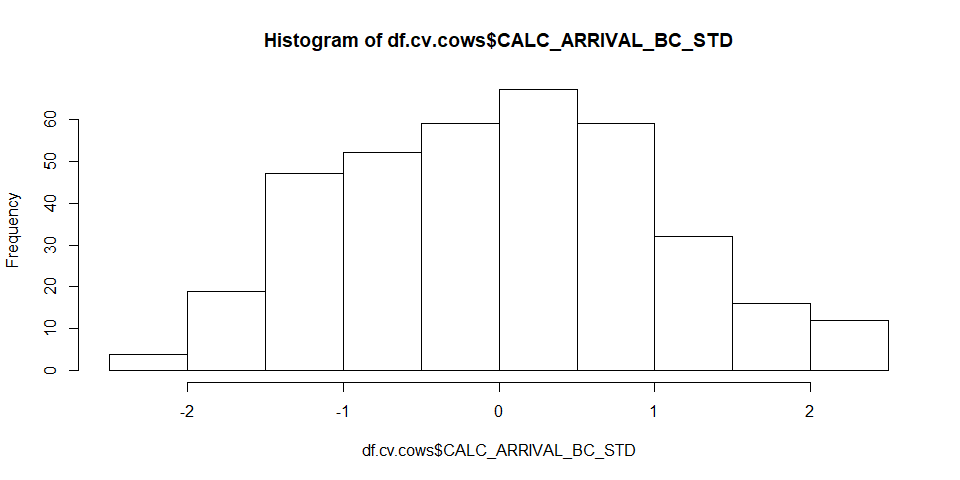
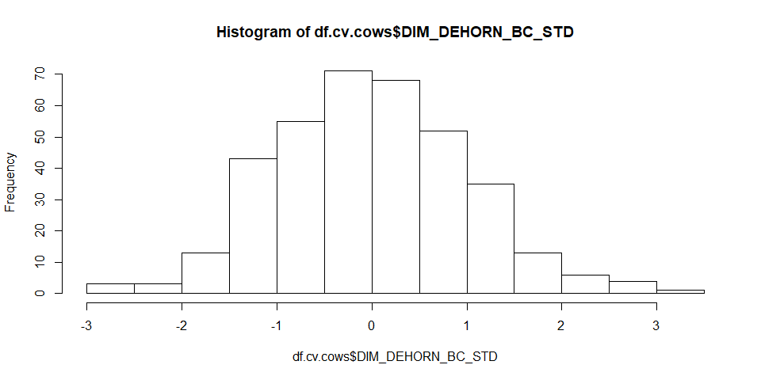
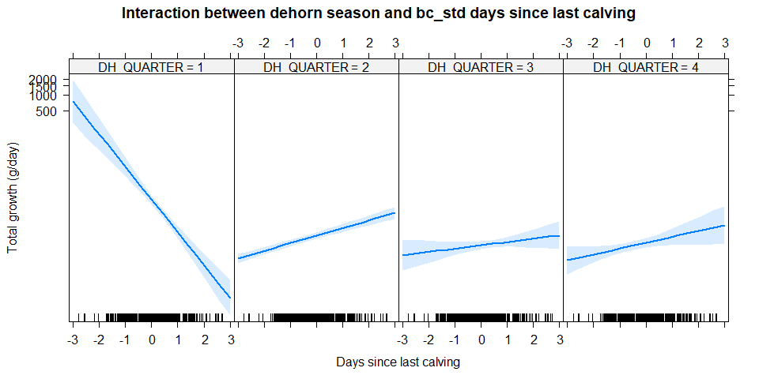

Ververs et al. (2018) - Reviewers request
================

-   [Statistical analysis preface](#statistical-analysis-preface)
-   [Main data extraction, transformation and loading](#main-data-extraction-transformation-and-loading)
-   [Hypothesis 1 - Factors influencing the total growth of the horn in reproducing females](#hypothesis-1---factors-influencing-the-total-growth-of-the-horn-in-reproducing-females)
    -   [Data preparation](#data-preparation)
    -   [Data transformations of continuous variables](#data-transformations-of-continuous-variables)
    -   [Model building](#model-building)
        -   [Generalised linear model](#generalised-linear-model)
        -   [Generalized Linear Mixed-Effects Models](#generalized-linear-mixed-effects-models)
        -   [GLM vs GLMM model comparison](#glm-vs-glmm-model-comparison)
        -   [Univariate models](#univariate-models)
        -   [Univariate model comparison](#univariate-model-comparison)
        -   [Multivariate model building](#multivariate-model-building)
    -   [Final model selection](#final-model-selection)
        -   [Interaction modelling](#interaction-modelling)
        -   [Least square means](#least-square-means)
-   [Hypothesis 2 - Factors influencing the total growth of the horn in males and females](#hypothesis-2---factors-influencing-the-total-growth-of-the-horn-in-males-and-females)
    -   [Data preparation](#data-preparation-1)
    -   [Data transformations of continuous variables](#data-transformations-of-continuous-variables-1)
    -   [Model building](#model-building-1)
        -   [Generalaised linear model](#generalaised-linear-model)
        -   [Generalized Linear Mixed-Effects Models](#generalized-linear-mixed-effects-models-1)
        -   [Model comparison](#model-comparison)
        -   [Univariate model building](#univariate-model-building)
        -   [Model comparison](#model-comparison-1)
        -   [Model building](#model-building-2)
    -   [Final model](#final-model)
        -   [Interaction modelling](#interaction-modelling-1)
        -   [Least square means](#least-square-means-1)
-   [Hypothesis 3: Factors influencing the growth of the anterior horn weight in males and females](#hypothesis-3-factors-influencing-the-growth-of-the-anterior-horn-weight-in-males-and-females)
    -   [Data preparation](#data-preparation-2)
    -   [Data transformations of continuous variables](#data-transformations-of-continuous-variables-2)
    -   [Model building](#model-building-3)
        -   [Generalaised linear model](#generalaised-linear-model-1)
        -   [Generalized Linear Mixed-Effects Models](#generalized-linear-mixed-effects-models-2)
        -   [Model comparison](#model-comparison-2)
        -   [Univariate model building](#univariate-model-building-1)
        -   [Model building](#model-building-4)
        -   [Model selection](#model-selection)
        -   [Model selection](#model-selection-1)
        -   [Interaction](#interaction)
        -   [Final model least square means](#final-model-least-square-means)
    -   [Hypothesis 4: Factors influencing the growth of the anterior horn length in males and females](#hypothesis-4-factors-influencing-the-growth-of-the-anterior-horn-length-in-males-and-females)
        -   [Data preparation](#data-preparation-3)
        -   [Model building](#model-building-5)
        -   [Model selection](#model-selection-2)
        -   [Final model selection](#final-model-selection-1)
        -   [Interaction](#interaction-1)
        -   [Final model least square means](#final-model-least-square-means-1)
    -   [Hypothesis 5: Factors influencing the growth of the anterior horn circumference (mm/day) in males and females](#hypothesis-5-factors-influencing-the-growth-of-the-anterior-horn-circumference-mmday-in-males-and-females)
        -   [Data preparation](#data-preparation-4)
        -   [Model building](#model-building-6)
        -   [Model selection](#model-selection-3)
        -   [Final model selection](#final-model-selection-2)
        -   [Interaction](#interaction-2)
        -   [Final model least square means](#final-model-least-square-means-2)

This is a notebook for the dehorning data of Ververs et al. (2018). This extra notebook shows the reviewers request to test random/repeated effects.

Statistical analysis preface
----------------------------

Currently the following R packages were loaded

    ## Loading required package: lme4

    ## Loading required package: Matrix

    ## Loading required package: effects

    ## Loading required package: carData

    ## lattice theme set by effectsTheme()
    ## See ?effectsTheme for details.

    ## Loading required package: car

    ## Loading required package: sjPlot

    ## Learn more about sjPlot with 'browseVignettes("sjPlot")'.

    ## Loading required package: lsmeans

    ## The 'lsmeans' package is being deprecated.
    ## Users are encouraged to switch to 'emmeans'.
    ## See help('transition') for more information, including how
    ## to convert 'lsmeans' objects and scripts to work with 'emmeans'.

    ## Loading required package: EnvStats

    ## 
    ## Attaching package: 'EnvStats'

    ## The following object is masked from 'package:car':
    ## 
    ##     qqPlot

    ## The following object is masked from 'package:Matrix':
    ## 
    ##     print

    ## The following objects are masked from 'package:stats':
    ## 
    ##     predict, predict.lm

    ## The following object is masked from 'package:base':
    ## 
    ##     print.default

Main data extraction, transformation and loading
------------------------------------------------

The data was read from the excel file containing all dehornings, and some

Hypothesis 1 - Factors influencing the total growth of the horn in reproducing females
======================================================================================

Data preparation
----------------

``` r
df.cv.cows <- na.omit(df.cv[!df.cv$N_DEHORNINGS == "1", c("ANIMAL","CALC_ARRIVAL", "DH_QUARTER", "DIM_DEHORN", "CALC_PARITY", "C_QUARTER", "N_DEHORNINGS", "G_TOTAL")])

#Set all number of dehornings larger then 3 equal to 3 
df.cv.cows[df.cv.cows$N_DEHORNINGS == "4",]$N_DEHORNINGS <- "3"
df.cv.cows[df.cv.cows$N_DEHORNINGS == "5",]$N_DEHORNINGS <- "3"
#Not enough animals in the 4th parity
df.cv.cows[df.cv.cows$CALC_PARITY == "4",]$CALC_PARITY <- "3"
df.cv.cows$ANIMAL <- as.factor(df.cv.cows$ANIMAL)

summary(df.cv.cows)
```

    ##      ANIMAL     CALC_ARRIVAL  DH_QUARTER   DIM_DEHORN     CALC_PARITY
    ##  5      :  2   Min.   : 252   1: 56      Min.   :   1.0   0:  0      
    ##  32     :  2   1st Qu.:1004   2:129      1st Qu.: 267.0   1:180      
    ##  249    :  2   Median :1409   3: 94      Median : 462.0   2:139      
    ##  862    :  2   Mean   :1398   4: 88      Mean   : 531.4   3: 48      
    ##  894    :  2   3rd Qu.:1761              3rd Qu.: 717.0   4:  0      
    ##  908    :  2   Max.   :2636              Max.   :2070.0              
    ##  (Other):355                                                         
    ##  C_QUARTER N_DEHORNINGS    G_TOTAL        
    ##  1:169     1:  0        Min.   : 0.00899  
    ##  2: 83     2:243        1st Qu.: 2.16535  
    ##  3: 71     3:124        Median : 2.62069  
    ##  4: 44     4:  0        Mean   : 3.78089  
    ##            5:  0        3rd Qu.: 3.32012  
    ##                         Max.   :60.06250  
    ## 

``` r
xtabs(~DH_QUARTER+N_DEHORNINGS, df.cv.cows)
```

    ##           N_DEHORNINGS
    ## DH_QUARTER  1  2  3  4  5
    ##          1  0 30 26  0  0
    ##          2  0 71 58  0  0
    ##          3  0 72 22  0  0
    ##          4  0 70 18  0  0

``` r
xtabs(~C_QUARTER+N_DEHORNINGS, df.cv.cows)
```

    ##          N_DEHORNINGS
    ## C_QUARTER   1   2   3   4   5
    ##         1   0 106  63   0   0
    ##         2   0  56  27   0   0
    ##         3   0  51  20   0   0
    ##         4   0  30  14   0   0

Data transformations of continuous variables
--------------------------------------------

``` r
df.cv.cows$CALC_ARRIVAL_BC <- boxcoxTransform(df.cv.cows$CALC_ARRIVAL, lambda = 1)
df.cv.cows$CALC_ARRIVAL_STD <- scale(df.cv.cows$CALC_ARRIVAL)
hist(df.cv.cows$CALC_ARRIVAL)
```


``` r
hist(df.cv.cows$CALC_ARRIVAL_STD)
```


``` r
hist(df.cv.cows$CALC_ARRIVAL_BC)
```



``` r
df.cv.cows$DIM_DEHORN_BC <- boxcoxTransform(df.cv.cows$DIM_DEHORN, lambda = 0.5)
df.cv.cows$DIM_DEHORN_BC_STD <- scale(df.cv.cows$DIM_DEHORN_BC)
hist(df.cv.cows$DIM_DEHORN)
```


``` r
hist(df.cv.cows$DIM_DEHORN_BC)
```


``` r
hist(df.cv.cows$DIM_DEHORN_BC_STD)
```



Model building
--------------

### Generalised linear model

For more info (here)\[<https://en.wikipedia.org/wiki/Generalized_linear_model>\]

``` r
baselineGLM <- glm(G_TOTAL ~ 1, 
                         df.cv.cows, 
                         family = gaussian(link="log"))
```

### Generalized Linear Mixed-Effects Models

For more info [here](https://en.wikipedia.org/wiki/Generalized_linear_mixed_model)

We try to take into account the effect of the repeated measures (N\_DEHORNINGS) within each animal (ANIMAL). We first want to understand

``` r
baselineGLMM <- glmer(G_TOTAL ~ 1 + (1 | ANIMAL), 
                  df.cv.cows, 
                  family = gaussian(link="log"),
                  control=glmerControl(optimizer="bobyqa")
                  )
```

### GLM vs GLMM model comparison

``` r
anova(baselineGLMM, baselineGLM, test="Chisq")
```

    ## Data: df.cv.cows
    ## Models:
    ## baselineGLM: G_TOTAL ~ 1
    ## baselineGLMM: G_TOTAL ~ 1 + (1 | ANIMAL)
    ##              Df    AIC    BIC   logLik deviance  Chisq Chi Df Pr(>Chisq)
    ## baselineGLM   2 2308.1 2315.9 -1152.06   2304.1                         
    ## baselineGLMM  3 1125.5 1137.2  -559.73   1119.5 1184.7      1  < 2.2e-16
    ##                 
    ## baselineGLM     
    ## baselineGLMM ***
    ## ---
    ## Signif. codes:  0 '***' 0.001 '**' 0.01 '*' 0.05 '.' 0.1 ' ' 1

It seems that the random effect GLMM is increasing the model fit. Hence we will proceed.

### Univariate models

    ## Generalized linear mixed model fit by maximum likelihood (Laplace
    ##   Approximation) [glmerMod]
    ##  Family: gaussian  ( log )
    ## Formula: G_TOTAL ~ N_DEHORNINGS + (1 | ANIMAL)
    ##    Data: df.cv.cows
    ## Control: glmerControl(optimizer = "bobyqa")
    ## 
    ##      AIC      BIC   logLik deviance df.resid 
    ##   1126.5   1142.2   -559.3   1118.5      363 
    ## 
    ## Scaled residuals: 
    ##     Min      1Q  Median      3Q     Max 
    ## -4.5187 -0.0994  0.0249  0.1465  4.6797 
    ## 
    ## Random effects:
    ##  Groups   Name        Variance Std.Dev.
    ##  ANIMAL   (Intercept) 0.3877   0.6226  
    ##  Residual             0.5789   0.7609  
    ## Number of obs: 367, groups:  ANIMAL, 360
    ## 
    ## Fixed effects:
    ##               Estimate Std. Error t value Pr(>|z|)    
    ## (Intercept)    0.90167    0.03678  24.513   <2e-16 ***
    ## N_DEHORNINGS3  0.05310    0.05510   0.964    0.335    
    ## ---
    ## Signif. codes:  0 '***' 0.001 '**' 0.01 '*' 0.05 '.' 0.1 ' ' 1
    ## 
    ## Correlation of Fixed Effects:
    ##             (Intr)
    ## N_DEHORNING -0.468

    ## Generalized linear mixed model fit by maximum likelihood (Laplace
    ##   Approximation) [glmerMod]
    ##  Family: gaussian  ( log )
    ## Formula: G_TOTAL ~ CALC_ARRIVAL_STD + (1 | ANIMAL)
    ##    Data: df.cv.cows
    ## Control: glmerControl(optimizer = "bobyqa")
    ## 
    ##      AIC      BIC   logLik deviance df.resid 
    ##   1127.1   1142.7   -559.5   1119.1      363 
    ## 
    ## Scaled residuals: 
    ##     Min      1Q  Median      3Q     Max 
    ## -4.5126 -0.0977  0.0278  0.1498  4.7306 
    ## 
    ## Random effects:
    ##  Groups   Name        Variance Std.Dev.
    ##  ANIMAL   (Intercept) 0.3875   0.6225  
    ##  Residual             0.5784   0.7605  
    ## Number of obs: 367, groups:  ANIMAL, 360
    ## 
    ## Fixed effects:
    ##                  Estimate Std. Error t value Pr(>|z|)    
    ## (Intercept)       0.91984    0.03263  28.193   <2e-16 ***
    ## CALC_ARRIVAL_STD -0.01789    0.02771  -0.646    0.519    
    ## ---
    ## Signif. codes:  0 '***' 0.001 '**' 0.01 '*' 0.05 '.' 0.1 ' ' 1
    ## 
    ## Correlation of Fixed Effects:
    ##             (Intr)
    ## CALC_ARRIVA -0.074

    ## Generalized linear mixed model fit by maximum likelihood (Laplace
    ##   Approximation) [glmerMod]
    ##  Family: gaussian  ( log )
    ## Formula: G_TOTAL ~ CALC_PARITY + (1 | ANIMAL)
    ##    Data: df.cv.cows
    ## Control: glmerControl(optimizer = "bobyqa")
    ## 
    ##      AIC      BIC   logLik deviance df.resid 
    ##   1125.0   1144.5   -557.5   1115.0      362 
    ## 
    ## Scaled residuals: 
    ##     Min      1Q  Median      3Q     Max 
    ## -4.5090 -0.1142  0.0343  0.1403  4.7256 
    ## 
    ## Random effects:
    ##  Groups   Name        Variance Std.Dev.
    ##  ANIMAL   (Intercept) 0.3946   0.6281  
    ##  Residual             0.5744   0.7579  
    ## Number of obs: 367, groups:  ANIMAL, 360
    ## 
    ## Fixed effects:
    ##              Estimate Std. Error t value Pr(>|z|)    
    ## (Intercept)   0.94566    0.04584  20.628   <2e-16 ***
    ## CALC_PARITY2 -0.10048    0.06479  -1.551    0.121    
    ## CALC_PARITY3  0.07440    0.09491   0.784    0.433    
    ## ---
    ## Signif. codes:  0 '***' 0.001 '**' 0.01 '*' 0.05 '.' 0.1 ' ' 1
    ## 
    ## Correlation of Fixed Effects:
    ##              (Intr) CALC_PARITY2
    ## CALC_PARITY2 -0.644             
    ## CALC_PARITY3 -0.488  0.357

    ## Generalized linear mixed model fit by maximum likelihood (Laplace
    ##   Approximation) [glmerMod]
    ##  Family: gaussian  ( log )
    ## Formula: G_TOTAL ~ DIM_DEHORN_BC_STD + (1 | ANIMAL)
    ##    Data: df.cv.cows
    ## Control: glmerControl(optimizer = "bobyqa")
    ## 
    ##      AIC      BIC   logLik deviance df.resid 
    ##   1106.7   1122.3   -549.4   1098.7      363 
    ## 
    ## Scaled residuals: 
    ##     Min      1Q  Median      3Q     Max 
    ## -4.6083 -0.1072  0.0341  0.1449  4.2016 
    ## 
    ## Random effects:
    ##  Groups   Name        Variance Std.Dev.
    ##  ANIMAL   (Intercept) 0.4277   0.6540  
    ##  Residual             0.5387   0.7339  
    ## Number of obs: 367, groups:  ANIMAL, 360
    ## 
    ## Fixed effects:
    ##                   Estimate Std. Error t value Pr(>|z|)    
    ## (Intercept)        0.90301    0.03442  26.236  < 2e-16 ***
    ## DIM_DEHORN_BC_STD  0.13445    0.03023   4.447  8.7e-06 ***
    ## ---
    ## Signif. codes:  0 '***' 0.001 '**' 0.01 '*' 0.05 '.' 0.1 ' ' 1
    ## 
    ## Correlation of Fixed Effects:
    ##             (Intr)
    ## DIM_DEHORN_ -0.092

    ## Generalized linear mixed model fit by maximum likelihood (Laplace
    ##   Approximation) [glmerMod]
    ##  Family: gaussian  ( log )
    ## Formula: G_TOTAL ~ DH_QUARTER + (1 | ANIMAL)
    ##    Data: df.cv.cows
    ## Control: glmerControl(optimizer = "bobyqa")
    ## 
    ##      AIC      BIC   logLik deviance df.resid 
    ##    937.2    960.6   -462.6    925.2      361 
    ## 
    ## Scaled residuals: 
    ##     Min      1Q  Median      3Q     Max 
    ## -3.6003 -0.0344  0.0734  0.1564  1.5285 
    ## 
    ## Random effects:
    ##  Groups   Name        Variance Std.Dev.
    ##  ANIMAL   (Intercept) 0.4649   0.6818  
    ##  Residual             0.3197   0.5654  
    ## Number of obs: 367, groups:  ANIMAL, 360
    ## 
    ## Fixed effects:
    ##             Estimate Std. Error t value Pr(>|z|)    
    ## (Intercept)  1.74075    0.07462  23.327   <2e-16 ***
    ## DH_QUARTER2 -1.13169    0.07714 -14.671   <2e-16 ***
    ## DH_QUARTER3 -0.89118    0.08269 -10.778   <2e-16 ***
    ## DH_QUARTER4 -1.01910    0.10926  -9.327   <2e-16 ***
    ## ---
    ## Signif. codes:  0 '***' 0.001 '**' 0.01 '*' 0.05 '.' 0.1 ' ' 1
    ## 
    ## Correlation of Fixed Effects:
    ##             (Intr) DH_QUARTER2 DH_QUARTER3
    ## DH_QUARTER2 -0.775                        
    ## DH_QUARTER3 -0.734  0.703                 
    ## DH_QUARTER4 -0.738  0.707       0.582

    ## Generalized linear mixed model fit by maximum likelihood (Laplace
    ##   Approximation) [glmerMod]
    ##  Family: gaussian  ( log )
    ## Formula: G_TOTAL ~ C_QUARTER + (1 | ANIMAL)
    ##    Data: df.cv.cows
    ## Control: glmerControl(optimizer = "bobyqa")
    ## 
    ##      AIC      BIC   logLik deviance df.resid 
    ##   1119.6   1143.0   -553.8   1107.6      361 
    ## 
    ## Scaled residuals: 
    ##     Min      1Q  Median      3Q     Max 
    ## -4.5932 -0.0988  0.0321  0.1404  4.7218 
    ## 
    ## Random effects:
    ##  Groups   Name        Variance Std.Dev.
    ##  ANIMAL   (Intercept) 0.3945   0.6281  
    ##  Residual             0.5645   0.7514  
    ## Number of obs: 367, groups:  ANIMAL, 360
    ## 
    ## Fixed effects:
    ##             Estimate Std. Error t value Pr(>|z|)    
    ## (Intercept)  0.83571    0.04382  19.072  < 2e-16 ***
    ## C_QUARTER2   0.08285    0.08002   1.035  0.30047    
    ## C_QUARTER3   0.21494    0.06820   3.152  0.00162 ** 
    ## C_QUARTER4   0.17187    0.09111   1.886  0.05925 .  
    ## ---
    ## Signif. codes:  0 '***' 0.001 '**' 0.01 '*' 0.05 '.' 0.1 ' ' 1
    ## 
    ## Correlation of Fixed Effects:
    ##            (Intr) C_QUARTER2 C_QUARTER3
    ## C_QUARTER2 -0.524                      
    ## C_QUARTER3 -0.444  0.225               
    ## C_QUARTER4 -0.371  0.198      0.162

### Univariate model comparison

``` r
## Comparison of basemodel and single variate models
anova(baselineGLMM, glmer1 ,glmer2, glmer3, glmer4, glmer5, glmer6,  test = "Chisq")
```

    ## Data: df.cv.cows
    ## Models:
    ## baselineGLMM: G_TOTAL ~ 1 + (1 | ANIMAL)
    ## glmer1: G_TOTAL ~ N_DEHORNINGS + (1 | ANIMAL)
    ## glmer2: G_TOTAL ~ CALC_ARRIVAL_STD + (1 | ANIMAL)
    ## glmer4: G_TOTAL ~ DIM_DEHORN_BC_STD + (1 | ANIMAL)
    ## glmer3: G_TOTAL ~ CALC_PARITY + (1 | ANIMAL)
    ## glmer5: G_TOTAL ~ DH_QUARTER + (1 | ANIMAL)
    ## glmer6: G_TOTAL ~ C_QUARTER + (1 | ANIMAL)
    ##              Df     AIC    BIC  logLik deviance    Chisq Chi Df Pr(>Chisq)
    ## baselineGLMM  3 1125.47 1137.2 -559.73  1119.47                           
    ## glmer1        4 1126.54 1142.2 -559.27  1118.54   0.9285      1     0.3353
    ## glmer2        4 1127.05 1142.7 -559.53  1119.05   0.0000      0     1.0000
    ## glmer4        4 1106.72 1122.3 -549.36  1098.72  20.3344      0     <2e-16
    ## glmer3        5 1125.01 1144.5 -557.51  1115.01   0.0000      1     1.0000
    ## glmer5        6  937.17  960.6 -462.58   925.17 189.8451      1     <2e-16
    ## glmer6        6 1119.57 1143.0 -553.78  1107.57   0.0000      0     1.0000
    ##                 
    ## baselineGLMM    
    ## glmer1          
    ## glmer2          
    ## glmer4       ***
    ## glmer3          
    ## glmer5       ***
    ## glmer6          
    ## ---
    ## Signif. codes:  0 '***' 0.001 '**' 0.01 '*' 0.05 '.' 0.1 ' ' 1

### Multivariate model building

``` r
summary(glmer10 <- glmer(G_TOTAL ~ DH_QUARTER*DIM_DEHORN_BC_STD    
                         +  (1 | ANIMAL), 
                df.cv.cows, 
                family = gaussian(link="log"),
                control=glmerControl(optimizer="bobyqa")))
```

    ## Generalized linear mixed model fit by maximum likelihood (Laplace
    ##   Approximation) [glmerMod]
    ##  Family: gaussian  ( log )
    ## Formula: G_TOTAL ~ DH_QUARTER * DIM_DEHORN_BC_STD + (1 | ANIMAL)
    ##    Data: df.cv.cows
    ## Control: glmerControl(optimizer = "bobyqa")
    ## 
    ##      AIC      BIC   logLik deviance df.resid 
    ##    752.5    791.6   -366.3    732.5      357 
    ## 
    ## Scaled residuals: 
    ##      Min       1Q   Median       3Q      Max 
    ## -1.51125 -0.00239  0.06177  0.09828  1.35443 
    ## 
    ## Random effects:
    ##  Groups   Name        Variance Std.Dev.
    ##  ANIMAL   (Intercept) 0.9786   0.9893  
    ##  Residual             0.1598   0.3998  
    ## Number of obs: 367, groups:  ANIMAL, 360
    ## 
    ## Fixed effects:
    ##                               Estimate Std. Error t value Pr(>|z|)    
    ## (Intercept)                     2.3037     0.1048  21.992  < 2e-16 ***
    ## DH_QUARTER2                    -1.5818     0.1027 -15.400  < 2e-16 ***
    ## DH_QUARTER3                    -2.0024     0.1113 -17.997  < 2e-16 ***
    ## DH_QUARTER4                    -1.8939     0.1362 -13.903  < 2e-16 ***
    ## DIM_DEHORN_BC_STD              -1.4370     0.1432 -10.031  < 2e-16 ***
    ## DH_QUARTER2:DIM_DEHORN_BC_STD   1.7712     0.1524  11.624  < 2e-16 ***
    ## DH_QUARTER3:DIM_DEHORN_BC_STD   1.5820     0.2326   6.801 1.04e-11 ***
    ## DH_QUARTER4:DIM_DEHORN_BC_STD   1.6950     0.1867   9.080  < 2e-16 ***
    ## ---
    ## Signif. codes:  0 '***' 0.001 '**' 0.01 '*' 0.05 '.' 0.1 ' ' 1
    ## 
    ## Correlation of Fixed Effects:
    ##              (Intr) DH_QUARTER2 DH_QUARTER3 DH_QUARTER4 DIM_DE
    ## DH_QUARTER2  -0.741                                           
    ## DH_QUARTER3  -0.705  0.824                                    
    ## DH_QUARTER4  -0.693  0.701       0.692                        
    ## DIM_DEHORN_  -0.404  0.427       0.704       0.420            
    ## DH_QUARTER2:  0.374 -0.357      -0.709      -0.404      -0.980
    ## DH_QUARTER3:  0.231 -0.214      -0.494      -0.255      -0.957
    ## DH_QUARTER4:  0.219 -0.364      -0.563       0.016      -0.763
    ##              DH_QUARTER2: DH_QUARTER3:
    ## DH_QUARTER2                           
    ## DH_QUARTER3                           
    ## DH_QUARTER4                           
    ## DIM_DEHORN_                           
    ## DH_QUARTER2:                          
    ## DH_QUARTER3:  0.931                   
    ## DH_QUARTER4:  0.750        0.719

``` r
Anova(glmer10)
```

    ## Analysis of Deviance Table (Type II Wald chisquare tests)
    ## 
    ## Response: G_TOTAL
    ##                                 Chisq Df Pr(>Chisq)    
    ## DH_QUARTER                    85.5501  3     <2e-16 ***
    ## DIM_DEHORN_BC_STD              0.1803  1     0.6711    
    ## DH_QUARTER:DIM_DEHORN_BC_STD 258.0871  3     <2e-16 ***
    ## ---
    ## Signif. codes:  0 '***' 0.001 '**' 0.01 '*' 0.05 '.' 0.1 ' ' 1

``` r
summary(glmer11 <- glmer(G_TOTAL ~ N_DEHORNINGS + DH_QUARTER*CALC_ARRIVAL_STD 
                         +  (1|ANIMAL), 
                df.cv.cows, 
                family = gaussian(link="log"),
                control=glmerControl(optimizer="bobyqa")))
```

    ## Generalized linear mixed model fit by maximum likelihood (Laplace
    ##   Approximation) [glmerMod]
    ##  Family: gaussian  ( log )
    ## Formula: G_TOTAL ~ N_DEHORNINGS + DH_QUARTER * CALC_ARRIVAL_STD + (1 |  
    ##     ANIMAL)
    ##    Data: df.cv.cows
    ## Control: glmerControl(optimizer = "bobyqa")
    ## 
    ##      AIC      BIC   logLik deviance df.resid 
    ##    516.6    559.6   -247.3    494.6      356 
    ## 
    ## Scaled residuals: 
    ##      Min       1Q   Median       3Q      Max 
    ## -0.95621  0.00960  0.03183  0.05917  0.62381 
    ## 
    ## Random effects:
    ##  Groups   Name        Variance Std.Dev.
    ##  ANIMAL   (Intercept) 2.08973  1.446   
    ##  Residual             0.07455  0.273   
    ## Number of obs: 367, groups:  ANIMAL, 360
    ## 
    ## Fixed effects:
    ##                              Estimate Std. Error t value Pr(>|z|)    
    ## (Intercept)                   2.92698    0.12520  23.379  < 2e-16 ***
    ## N_DEHORNINGS3                -0.54820    0.11744  -4.668 3.05e-06 ***
    ## DH_QUARTER2                  -2.87424    0.08410 -34.178  < 2e-16 ***
    ## DH_QUARTER3                  -2.54567    0.08622 -29.525  < 2e-16 ***
    ## DH_QUARTER4                  -2.94462    0.18833 -15.635  < 2e-16 ***
    ## CALC_ARRIVAL_STD              1.57967    0.06425  24.588  < 2e-16 ***
    ## DH_QUARTER2:CALC_ARRIVAL_STD -0.87258    0.05220 -16.716  < 2e-16 ***
    ## DH_QUARTER3:CALC_ARRIVAL_STD -1.60701    0.11157 -14.404  < 2e-16 ***
    ## DH_QUARTER4:CALC_ARRIVAL_STD -2.43438    0.19355 -12.577  < 2e-16 ***
    ## ---
    ## Signif. codes:  0 '***' 0.001 '**' 0.01 '*' 0.05 '.' 0.1 ' ' 1
    ## 
    ## Correlation of Fixed Effects:
    ##              (Intr) N_DEHO DH_QUARTER2 DH_QUARTER3 DH_QUARTER4 CALC_A
    ## N_DEHORNING  -0.222                                                  
    ## DH_QUARTER2  -0.378 -0.312                                           
    ## DH_QUARTER3  -0.354 -0.369  0.985                                    
    ## DH_QUARTER4  -0.451  0.098  0.330       0.311                        
    ## CALC_ARRIVA   0.494 -0.660 -0.486      -0.444      -0.341            
    ## DH_QUARTER2: -0.368 -0.256  0.919       0.945       0.302      -0.530
    ## DH_QUARTER3: -0.020 -0.869  0.700       0.737       0.089       0.229
    ## DH_QUARTER4:  0.054  0.257  0.196       0.174      -0.704      -0.389
    ##              DH_QUARTER2: DH_QUARTER3:
    ## N_DEHORNING                           
    ## DH_QUARTER2                           
    ## DH_QUARTER3                           
    ## DH_QUARTER4                           
    ## CALC_ARRIVA                           
    ## DH_QUARTER2:                          
    ## DH_QUARTER3:  0.623                   
    ## DH_QUARTER4:  0.195       -0.084

``` r
Anova(glmer11)
```

    ## Analysis of Deviance Table (Type II Wald chisquare tests)
    ## 
    ## Response: G_TOTAL
    ##                                Chisq Df Pr(>Chisq)    
    ## N_DEHORNINGS                  21.787  1  3.046e-06 ***
    ## DH_QUARTER                  2633.067  3  < 2.2e-16 ***
    ## CALC_ARRIVAL_STD            1684.102  1  < 2.2e-16 ***
    ## DH_QUARTER:CALC_ARRIVAL_STD  432.646  3  < 2.2e-16 ***
    ## ---
    ## Signif. codes:  0 '***' 0.001 '**' 0.01 '*' 0.05 '.' 0.1 ' ' 1

Final model selection
---------------------

``` r
anova(glmer10, glmer11, test = "Chisq")
```

    ## Data: df.cv.cows
    ## Models:
    ## glmer10: G_TOTAL ~ DH_QUARTER * DIM_DEHORN_BC_STD + (1 | ANIMAL)
    ## glmer11: G_TOTAL ~ N_DEHORNINGS + DH_QUARTER * CALC_ARRIVAL_STD + (1 | 
    ## glmer11:     ANIMAL)
    ##         Df    AIC    BIC  logLik deviance  Chisq Chi Df Pr(>Chisq)    
    ## glmer10 10 752.53 791.58 -366.27   732.53                             
    ## glmer11 11 516.64 559.60 -247.32   494.64 237.89      1  < 2.2e-16 ***
    ## ---
    ## Signif. codes:  0 '***' 0.001 '**' 0.01 '*' 0.05 '.' 0.1 ' ' 1

### Interaction modelling

To understand the effect of the interaction, an effects plot was created

``` r
plot(effect("DH_QUARTER:DIM_DEHORN_BC_STD", 
            glmer10, 
            #xlevels=list(CALC_ARRIVAL=900:2000), 
            multiline=TRUE),
     main = "Interaction between dehorn season and days since last dehorn",
     xlab = "Days since arrival",
     ylab = "Total growth (g/day)")
```



### Least square means

The [least square means](https://en.wikipedia.org/wiki/Least_squares) are constructed for the final variables.

This is the overal P-value per variables

    ## Analysis of Deviance Table (Type II Wald chisquare tests)
    ## 
    ## Response: G_TOTAL
    ##                                 Chisq Df Pr(>Chisq)    
    ## DH_QUARTER                    85.5501  3     <2e-16 ***
    ## DIM_DEHORN_BC_STD              0.1803  1     0.6711    
    ## DH_QUARTER:DIM_DEHORN_BC_STD 258.0871  3     <2e-16 ***
    ## ---
    ## Signif. codes:  0 '***' 0.001 '**' 0.01 '*' 0.05 '.' 0.1 ' ' 1

Least square means, Tukey adjusted

    ## NOTE: Results may be misleading due to involvement in interactions

    ## $lsmeans
    ##  DH_QUARTER  response        SE df asymp.LCL asymp.UCL
    ##  1          10.011295 1.0487128 NA  8.153131 12.292951
    ##  2           2.058454 0.1537949 NA  1.778053  2.383075
    ##  3           1.351652 0.1125234 NA  1.148162  1.591206
    ##  4           1.506568 0.1487748 NA  1.241458  1.828292
    ## 
    ## Confidence level used: 0.95 
    ## Intervals are back-transformed from the log scale 
    ## 
    ## $contrasts
    ##  contrast response.ratio         SE df z.ratio p.value
    ##  1 - 2         4.8635016 0.49955205 NA  15.400  <.0001
    ##  1 - 3         7.4067122 0.82409589 NA  17.997  <.0001
    ##  1 - 4         6.6451000 0.90520090 NA  13.903  <.0001
    ##  2 - 3         1.5229176 0.09741949 NA   6.575  <.0001
    ##  2 - 4         1.3663201 0.13315263 NA   3.203  0.0074
    ##  3 - 4         0.8971727 0.08947347 NA  -1.088  0.6969
    ## 
    ## P value adjustment: tukey method for comparing a family of 4 estimates 
    ## Tests are performed on the log scale

    ## Loading required package: multcompView
    ## NOTE: Results may be misleading due to involvement in interactions

    ##  DH_QUARTER    lsmean         SE df  asymp.LCL asymp.UCL .group
    ##  3          0.3013274 0.08324881 NA 0.09396165 0.5086931  a    
    ##  4          0.4098343 0.09875082 NA 0.16385437 0.6558142  a    
    ##  2          0.7219553 0.07471376 NA 0.53584969 0.9080610   b   
    ##  1          2.3037140 0.10475296 NA 2.04278328 2.5646447    c  
    ## 
    ## Results are given on the log (not the response) scale. 
    ## Confidence level used: 0.95 
    ## Conf-level adjustment: sidak method for 4 estimates 
    ## P value adjustment: tukey method for comparing a family of 4 estimates 
    ## significance level used: alpha = 0.05

Hypothesis 2 - Factors influencing the total growth of the horn in males and females
====================================================================================

Data preparation
----------------

``` r
#Make sure to drop the extemely low growth which are caused by dirty data
df.cv.all <- na.omit(df.cv[df.cv$G_TOTAL < 100,
                           (names(df.cv) %in% c("ANIMAL",
                                                "CALC_AGE", 
                                                "DH_QUARTER", 
                                                "GENDER", 
                                                "G_TOTAL",
                                                "N_DEHORNINGS",
                                                "B_QUARTER"
                                                ))])
df.cv.all$ANIMAL <- as.factor(df.cv.all$ANIMAL)
df.cv.all[df.cv.all$N_DEHORNINGS == "4",]$N_DEHORNINGS <- "3"
df.cv.all[df.cv.all$N_DEHORNINGS == "5",]$N_DEHORNINGS <- "3"

summary(df.cv.all)
```

    ##      ANIMAL     GENDER     CALC_AGE      DH_QUARTER B_QUARTER N_DEHORNINGS
    ##  59     :   3   F:498   Min.   :  58.0   1:154      1:397     1:597       
    ##  91     :   3   M:588   1st Qu.: 921.8   2:297      2:313     2:315       
    ##  105    :   3           Median :1375.0   3:275      3:183     3:174       
    ##  120    :   3           Mean   :1552.5   4:360      4:193     4:  0       
    ##  168    :   3           3rd Qu.:1964.0                        5:  0       
    ##  281    :   3           Max.   :5909.0                                    
    ##  (Other):1068                                                             
    ##     G_TOTAL        
    ##  Min.   : 0.01195  
    ##  1st Qu.: 0.73166  
    ##  Median : 1.27254  
    ##  Mean   : 1.99431  
    ##  3rd Qu.: 2.74384  
    ##  Max.   :33.02857  
    ## 

``` r
xtabs(~DH_QUARTER+N_DEHORNINGS, df.cv.all)
```

    ##           N_DEHORNINGS
    ## DH_QUARTER   1   2   3   4   5
    ##          1  86  43  25   0   0
    ##          2 156 100  41   0   0
    ##          3 143  76  56   0   0
    ##          4 212  96  52   0   0

``` r
xtabs(~B_QUARTER+N_DEHORNINGS, df.cv.all)
```

    ##          N_DEHORNINGS
    ## B_QUARTER   1   2   3   4   5
    ##         1 228 110  59   0   0
    ##         2 159  93  61   0   0
    ##         3  91  58  34   0   0
    ##         4 119  54  20   0   0

Data transformations of continuous variables
--------------------------------------------

``` r
df.cv.all$CALC_AGE_BC <- boxcoxTransform(df.cv.all$CALC_AGE, lambda = .25)
df.cv.all$CALC_AGE_BC_STD <- scale(df.cv.all$CALC_AGE_BC)
hist(df.cv.all$CALC_AGE)
```


``` r
hist(df.cv.all$CALC_AGE_BC_STD)
```


Model building
--------------

### Generalaised linear model

For more info [here](%5Bhttps://en.wikipedia.org/wiki/Generalized_linear_model)

``` r
baselineGLM <- glm(G_TOTAL ~ 1, 
                         df.cv.all, 
                         family = gaussian(link="log"))
```

### Generalized Linear Mixed-Effects Models

For more info [here](https://en.wikipedia.org/wiki/Generalized_linear_mixed_model)

We try to take into account the effect of the repeated measures (N\_DEHORNINGS) within each animal (ANIMAL). We first want to understand

``` r
baselineGLMM <- glmer(G_TOTAL ~ 1 + (1 | ANIMAL), 
                  df.cv.all, 
                  family = gaussian(link="log"),
                  control=glmerControl(optimizer="bobyqa")
                  )
```

### Model comparison

``` r
anova(baselineGLMM, baselineGLM, test="Chisq")
```

    ## Data: df.cv.all
    ## Models:
    ## baselineGLM: G_TOTAL ~ 1
    ## baselineGLMM: G_TOTAL ~ 1 + (1 | ANIMAL)
    ##              Df    AIC    BIC  logLik deviance  Chisq Chi Df Pr(>Chisq)
    ## baselineGLM   2 4594.3 4604.3 -2295.2   4590.3                         
    ## baselineGLMM  3 4225.9 4240.8 -2109.9   4219.9 370.47      1  < 2.2e-16
    ##                 
    ## baselineGLM     
    ## baselineGLMM ***
    ## ---
    ## Signif. codes:  0 '***' 0.001 '**' 0.01 '*' 0.05 '.' 0.1 ' ' 1

The GLMM performs better

### Univariate model building

### Model comparison

``` r
## Comparison of basemodel and single variate models
anova(baselineGLMM, glmer1 ,glmer2, glmer3, glmer4, glmer5, test = "Chisq")
```

    ## Data: df.cv.all
    ## Models:
    ## baselineGLMM: G_TOTAL ~ 1 + (1 | ANIMAL)
    ## glmer2: G_TOTAL ~ CALC_AGE_BC_STD + (1 | ANIMAL)
    ## glmer5: G_TOTAL ~ GENDER + (1 | ANIMAL)
    ## glmer1: G_TOTAL ~ N_DEHORNINGS + (1 | ANIMAL)
    ## glmer3: G_TOTAL ~ DH_QUARTER + (1 | ANIMAL)
    ## glmer4: G_TOTAL ~ B_QUARTER + (1 | ANIMAL)
    ##              Df    AIC    BIC  logLik deviance    Chisq Chi Df Pr(>Chisq)
    ## baselineGLMM  3 4225.9 4240.8 -2109.9   4219.9                           
    ## glmer2        4 3627.9 3647.9 -1810.0   3619.9  599.957      1     <2e-16
    ## glmer5        4 4185.0 4204.9 -2088.5   4177.0    0.000      0          1
    ## glmer1        5 2056.7 2081.7 -1023.4   2046.7 2130.230      1     <2e-16
    ## glmer3        6 4228.2 4258.2 -2108.1   4216.2    0.000      1          1
    ## glmer4        6 4208.9 4238.9 -2098.5   4196.9   19.298      0     <2e-16
    ##                 
    ## baselineGLMM    
    ## glmer2       ***
    ## glmer5          
    ## glmer1       ***
    ## glmer3          
    ## glmer4       ***
    ## ---
    ## Signif. codes:  0 '***' 0.001 '**' 0.01 '*' 0.05 '.' 0.1 ' ' 1

### Model building

``` r
glmer10 <- glmer(G_TOTAL ~ CALC_AGE_BC_STD + N_DEHORNINGS + B_QUARTER    
                         +  (1| ANIMAL), 
                df.cv.all, 
                family = gaussian(link="log"),
                control=glmerControl(optimizer="bobyqa"))
summary(glmer10)
```

    ## Generalized linear mixed model fit by maximum likelihood (Laplace
    ##   Approximation) [glmerMod]
    ##  Family: gaussian  ( log )
    ## Formula: 
    ## G_TOTAL ~ CALC_AGE_BC_STD + N_DEHORNINGS + B_QUARTER + (1 | ANIMAL)
    ##    Data: df.cv.all
    ## Control: glmerControl(optimizer = "bobyqa")
    ## 
    ##      AIC      BIC   logLik deviance df.resid 
    ##   2030.3   2075.2  -1006.2   2012.3     1077 
    ## 
    ## Scaled residuals: 
    ##     Min      1Q  Median      3Q     Max 
    ## -3.8994 -0.3564 -0.0099  0.3679  4.6312 
    ## 
    ## Random effects:
    ##  Groups   Name        Variance Std.Dev.
    ##  ANIMAL   (Intercept) 0.1224   0.3499  
    ##  Residual             0.2948   0.5430  
    ## Number of obs: 1086, groups:  ANIMAL, 758
    ## 
    ## Fixed effects:
    ##                 Estimate Std. Error t value Pr(>|z|)    
    ## (Intercept)     -0.22208    0.03062  -7.252 4.09e-13 ***
    ## CALC_AGE_BC_STD  0.05110    0.01668   3.063  0.00219 ** 
    ## N_DEHORNINGS2    1.29229    0.02844  45.444  < 2e-16 ***
    ## N_DEHORNINGS3    1.33154    0.03377  39.429  < 2e-16 ***
    ## B_QUARTER2      -0.13685    0.03055  -4.480 7.47e-06 ***
    ## B_QUARTER3      -0.01154    0.03805  -0.303  0.76166    
    ## B_QUARTER4      -0.08253    0.03681  -2.242  0.02496 *  
    ## ---
    ## Signif. codes:  0 '***' 0.001 '**' 0.01 '*' 0.05 '.' 0.1 ' ' 1
    ## 
    ## Correlation of Fixed Effects:
    ##               (Intr) CALC_A N_DEHORNINGS2 N_DEHORNINGS3 B_QUARTER2
    ## CALC_AGE_BC    0.264                                              
    ## N_DEHORNINGS2 -0.543 -0.451                                       
    ## N_DEHORNINGS3 -0.488 -0.589  0.768                                
    ## B_QUARTER2    -0.426  0.010 -0.045        -0.081                  
    ## B_QUARTER3    -0.397 -0.099  0.000         0.019         0.436    
    ## B_QUARTER4    -0.452 -0.072  0.071         0.104         0.466    
    ##               B_QUARTER3
    ## CALC_AGE_BC             
    ## N_DEHORNINGS2           
    ## N_DEHORNINGS3           
    ## B_QUARTER2              
    ## B_QUARTER3              
    ## B_QUARTER4     0.351

``` r
Anova(glmer10)
```

    ## Analysis of Deviance Table (Type II Wald chisquare tests)
    ## 
    ## Response: G_TOTAL
    ##                     Chisq Df Pr(>Chisq)    
    ## CALC_AGE_BC_STD    9.3817  1   0.002192 ** 
    ## N_DEHORNINGS    2114.9003  2  < 2.2e-16 ***
    ## B_QUARTER         23.7139  3  2.866e-05 ***
    ## ---
    ## Signif. codes:  0 '***' 0.001 '**' 0.01 '*' 0.05 '.' 0.1 ' ' 1

``` r
glmer11 <- glmer(G_TOTAL ~ N_DEHORNINGS*CALC_AGE_BC_STD + B_QUARTER    
                         +  (1| ANIMAL), 
                df.cv.all, 
                family = gaussian(link="log"),
                control=glmerControl(optimizer="bobyqa"))
summary(glmer11)
```

    ## Generalized linear mixed model fit by maximum likelihood (Laplace
    ##   Approximation) [glmerMod]
    ##  Family: gaussian  ( log )
    ## Formula: 
    ## G_TOTAL ~ N_DEHORNINGS * CALC_AGE_BC_STD + B_QUARTER + (1 | ANIMAL)
    ##    Data: df.cv.all
    ## Control: glmerControl(optimizer = "bobyqa")
    ## 
    ##      AIC      BIC   logLik deviance df.resid 
    ##   1972.7   2027.6   -975.4   1950.7     1075 
    ## 
    ## Scaled residuals: 
    ##     Min      1Q  Median      3Q     Max 
    ## -3.5356 -0.3275 -0.0175  0.3512  4.0980 
    ## 
    ## Random effects:
    ##  Groups   Name        Variance Std.Dev.
    ##  ANIMAL   (Intercept) 0.1179   0.3433  
    ##  Residual             0.2851   0.5339  
    ## Number of obs: 1086, groups:  ANIMAL, 758
    ## 
    ## Fixed effects:
    ##                               Estimate Std. Error t value Pr(>|z|)    
    ## (Intercept)                   -0.24619    0.03054  -8.061 7.57e-16 ***
    ## N_DEHORNINGS2                  1.24694    0.02905  42.919  < 2e-16 ***
    ## N_DEHORNINGS3                  1.18073    0.04035  29.261  < 2e-16 ***
    ## CALC_AGE_BC_STD               -0.02864    0.01977  -1.448   0.1475    
    ## B_QUARTER2                    -0.12281    0.02949  -4.165 3.12e-05 ***
    ## B_QUARTER3                    -0.03007    0.03761  -0.800   0.4239    
    ## B_QUARTER4                    -0.07226    0.03592  -2.012   0.0442 *  
    ## N_DEHORNINGS2:CALC_AGE_BC_STD  0.22954    0.03358   6.835 8.20e-12 ***
    ## N_DEHORNINGS3:CALC_AGE_BC_STD  0.27145    0.03836   7.077 1.47e-12 ***
    ## ---
    ## Signif. codes:  0 '***' 0.001 '**' 0.01 '*' 0.05 '.' 0.1 ' ' 1
    ## 
    ## Correlation of Fixed Effects:
    ##                (Intr) N_DEHORNINGS2 N_DEHORNINGS3 CALC_A B_QUARTER2
    ## N_DEHORNINGS2  -0.533                                              
    ## N_DEHORNINGS3  -0.367  0.689                                       
    ## CALC_AGE_BC     0.349 -0.350        -0.269                         
    ## B_QUARTER2     -0.415 -0.049        -0.072        -0.028           
    ## B_QUARTER3     -0.374  0.021         0.038        -0.054  0.414    
    ## B_QUARTER4     -0.434  0.077         0.033        -0.056  0.449    
    ## N_DEHORNINGS2: -0.138 -0.147        -0.238        -0.502  0.065    
    ## N_DEHORNINGS3: -0.147 -0.067        -0.504        -0.440  0.027    
    ##                B_QUARTER3 B_QUARTER4 N_DEHORNINGS2:
    ## N_DEHORNINGS2                                      
    ## N_DEHORNINGS3                                      
    ## CALC_AGE_BC                                        
    ## B_QUARTER2                                         
    ## B_QUARTER3                                         
    ## B_QUARTER4      0.325                              
    ## N_DEHORNINGS2: -0.076     -0.036                   
    ## N_DEHORNINGS3: -0.031      0.071      0.625

``` r
Anova(glmer11)
```

    ## Analysis of Deviance Table (Type II Wald chisquare tests)
    ## 
    ## Response: G_TOTAL
    ##                                 Chisq Df Pr(>Chisq)    
    ## N_DEHORNINGS                 1987.219  2  < 2.2e-16 ***
    ## CALC_AGE_BC_STD                 9.114  1  0.0025366 ** 
    ## B_QUARTER                      18.486  3  0.0003491 ***
    ## N_DEHORNINGS:CALC_AGE_BC_STD   59.630  2  1.126e-13 ***
    ## ---
    ## Signif. codes:  0 '***' 0.001 '**' 0.01 '*' 0.05 '.' 0.1 ' ' 1

Final model
-----------

Test interaction fit

``` r
anova(glmer10, glmer11, test="Chisq")
```

    ## Data: df.cv.all
    ## Models:
    ## glmer10: G_TOTAL ~ CALC_AGE_BC_STD + N_DEHORNINGS + B_QUARTER + (1 | ANIMAL)
    ## glmer11: G_TOTAL ~ N_DEHORNINGS * CALC_AGE_BC_STD + B_QUARTER + (1 | ANIMAL)
    ##         Df    AIC    BIC   logLik deviance  Chisq Chi Df Pr(>Chisq)    
    ## glmer10  9 2030.3 2075.2 -1006.15   2012.3                             
    ## glmer11 11 1972.7 2027.6  -975.37   1950.7 61.563      2  4.282e-14 ***
    ## ---
    ## Signif. codes:  0 '***' 0.001 '**' 0.01 '*' 0.05 '.' 0.1 ' ' 1

The model with the interaction fits best, lowest AIC

### Interaction modelling

To understand the effect of the interaction, an effects plot was created

``` r
plot(effect("N_DEHORNINGS:CALC_AGE_BC_STD", 
            glmer11, 
            #xlevels=list(CALC_ARRIVAL=900:2000), 
            multiline=TRUE),
     main = "Interaction between number of dehornings and days at farm",
     xlab = "Days since arrival",
     ylab = "Total growth (g/day)")
```


Next piece is used to show it on non transformed scale

``` r
glmer11b <- glmer(G_TOTAL ~ N_DEHORNINGS*CALC_AGE + B_QUARTER    
                         +  (1| ANIMAL), 
                df.cv.all, 
                family = gaussian(link="log"),
                control=glmerControl(optimizer="bobyqa"))
```

    ## Warning in checkConv(attr(opt, "derivs"), opt$par, ctrl = control
    ## $checkConv, : Model failed to converge with max|grad| = 180.845 (tol =
    ## 0.001, component 1)

    ## Warning in checkConv(attr(opt, "derivs"), opt$par, ctrl = control$checkConv, : Model is nearly unidentifiable: very large eigenvalue
    ##  - Rescale variables?;Model is nearly unidentifiable: large eigenvalue ratio
    ##  - Rescale variables?

``` r
plot(effect("N_DEHORNINGS:CALC_AGE", 
            glmer11b, 
            #xlevels=list(CALC_ARRIVAL=900:2000), 
            multiline=TRUE),
     main = "Interaction between number of dehornings and days at farm",
     xlab = "Days since arrival",
     ylab = "Total growth (g/day)")
```


### Least square means

The [least square means](https://en.wikipedia.org/wiki/Least_squares) are constructed for the final variables.

This is the overal P-value per variables

    ## Analysis of Deviance Table (Type II Wald chisquare tests)
    ## 
    ## Response: G_TOTAL
    ##                                 Chisq Df Pr(>Chisq)    
    ## N_DEHORNINGS                 1987.219  2  < 2.2e-16 ***
    ## CALC_AGE_BC_STD                 9.114  1  0.0025366 ** 
    ## B_QUARTER                      18.486  3  0.0003491 ***
    ## N_DEHORNINGS:CALC_AGE_BC_STD   59.630  2  1.126e-13 ***
    ## ---
    ## Signif. codes:  0 '***' 0.001 '**' 0.01 '*' 0.05 '.' 0.1 ' ' 1

Least square means, Tukey adjusted

    ## NOTE: Results may be misleading due to involvement in interactions

    ## $lsmeans
    ##  N_DEHORNINGS  response         SE df asymp.LCL asymp.UCL
    ##  1            0.7389862 0.01938610 NA 0.7019505 0.7779761
    ##  2            2.5714228 0.06389985 NA 2.4491824 2.6997643
    ##  3            2.4066859 0.09073169 NA 2.2352662 2.5912516
    ## 
    ## Results are averaged over the levels of: B_QUARTER 
    ## Confidence level used: 0.95 
    ## Intervals are back-transformed from the log scale 
    ## 
    ## $contrasts
    ##  contrast response.ratio          SE df z.ratio p.value
    ##  1 - 2         0.2873842 0.008349513 NA -42.919  <.0001
    ##  1 - 3         0.3070555 0.012390163 NA -29.261  <.0001
    ##  2 - 3         1.0684497 0.031272123 NA   2.262  0.0613
    ## 
    ## Results are averaged over the levels of: B_QUARTER 
    ## P value adjustment: tukey method for comparing a family of 3 estimates 
    ## Tests are performed on the log scale

    ## $lsmeans
    ##  B_QUARTER response         SE df asymp.LCL asymp.UCL
    ##  1         1.755982 0.04872903 NA  1.663026  1.854135
    ##  2         1.553054 0.04409713 NA  1.468986  1.641933
    ##  3         1.703962 0.06328984 NA  1.584324  1.832634
    ##  4         1.633575 0.05644781 NA  1.526602  1.748043
    ## 
    ## Results are averaged over the levels of: N_DEHORNINGS 
    ## Confidence level used: 0.95 
    ## Intervals are back-transformed from the log scale 
    ## 
    ## $contrasts
    ##  contrast response.ratio         SE df z.ratio p.value
    ##  1 - 2         1.1306640 0.03333938 NA   4.165  0.0002
    ##  1 - 3         1.0305292 0.03875403 NA   0.800  0.8546
    ##  1 - 4         1.0749323 0.03860925 NA   2.012  0.1835
    ##  2 - 3         0.9114372 0.03368811 NA  -2.509  0.0585
    ##  2 - 4         0.9507089 0.03303821 NA  -1.455  0.4653
    ##  3 - 4         1.0430877 0.04457728 NA   0.987  0.7568
    ## 
    ## Results are averaged over the levels of: N_DEHORNINGS 
    ## P value adjustment: tukey method for comparing a family of 4 estimates 
    ## Tests are performed on the log scale

    ## NOTE: Results may be misleading due to involvement in interactions

    ##  N_DEHORNINGS     lsmean         SE df  asymp.LCL  asymp.UCL .group
    ##  1            -0.3024760 0.02623337 NA -0.3651144 -0.2398376  a    
    ##  3             0.8782507 0.03769985 NA  0.7882333  0.9682680   b   
    ##  2             0.9444594 0.02485000 NA  0.8851241  1.0037946   b   
    ## 
    ## Results are averaged over the levels of: B_QUARTER 
    ## Results are given on the log (not the response) scale. 
    ## Confidence level used: 0.95 
    ## Conf-level adjustment: sidak method for 3 estimates 
    ## P value adjustment: tukey method for comparing a family of 3 estimates 
    ## significance level used: alpha = 0.05

    ##  B_QUARTER    lsmean         SE df asymp.LCL asymp.UCL .group
    ##  2         0.4402234 0.02839382 NA 0.3694968 0.5109500  a    
    ##  4         0.4907708 0.03455477 NA 0.4046977 0.5768438  ab   
    ##  3         0.5329560 0.03714276 NA 0.4404366 0.6254755  ab   
    ##  1         0.5630285 0.02775030 NA 0.4939048 0.6321521   b   
    ## 
    ## Results are averaged over the levels of: N_DEHORNINGS 
    ## Results are given on the log (not the response) scale. 
    ## Confidence level used: 0.95 
    ## Conf-level adjustment: sidak method for 4 estimates 
    ## P value adjustment: tukey method for comparing a family of 4 estimates 
    ## significance level used: alpha = 0.05

Hypothesis 3: Factors influencing the growth of the anterior horn weight in males and females
=============================================================================================

Data preparation
----------------

``` r
df.cv.all.f <- na.omit(df.cv[df.cv$G_AH_W < 100,
                             (names(df.cv) %in% c("ANIMAL",
                                                  "CALC_AGE",
                                                  "DH_QUARTER", 
                                                  "GENDER", 
                                                  "G_AH_W",
                                                  "N_DEHORNINGS",
                                                  "B_QUARTER"))])
summary(df.cv.all.f)
```

    ##      ANIMAL       GENDER     CALC_AGE      DH_QUARTER B_QUARTER
    ##  Min.   :   7.0   F:495   Min.   :  58.0   1:154      1:395    
    ##  1st Qu.: 350.0   M:588   1st Qu.: 922.5   2:294      2:312    
    ##  Median : 551.0           Median :1376.0   3:275      3:183    
    ##  Mean   : 543.4           Mean   :1553.6   4:360      4:193    
    ##  3rd Qu.: 754.0           3rd Qu.:1965.5                       
    ##  Max.   :1021.0           Max.   :5909.0                       
    ##  N_DEHORNINGS     G_AH_W       
    ##  1:595        Min.   : 0.1148  
    ##  2:314        1st Qu.: 0.6573  
    ##  3:140        Median : 1.1052  
    ##  4: 31        Mean   : 1.5912  
    ##  5:  3        3rd Qu.: 2.2017  
    ##               Max.   :23.4286

``` r
df.cv.all.f[df.cv.all.f$N_DEHORNINGS == "4",]$N_DEHORNINGS <- "3"
df.cv.all.f[df.cv.all.f$N_DEHORNINGS == "5",]$N_DEHORNINGS <- "3"
#create histogram of the front horn weiht
op = par(mfrow=c(1, 2))
hist((df.cv.all.f$G_AH_W), 
     main = "Anterior horn weight growth (g/day)",
     xlab ="")
hist(log10(df.cv.all.f$G_AH_W),
      main = "Log10",
     xlab ="")
```


Data transformations of continuous variables
--------------------------------------------

``` r
df.cv.all.f$CALC_AGE_BC <- boxcoxTransform(df.cv.all.f$CALC_AGE, lambda = .25)
df.cv.all.f$CALC_AGE_BC_STD <- scale(df.cv.all.f$CALC_AGE_BC)
hist(df.cv.all.f$CALC_AGE)
```


``` r
hist(df.cv.all.f$CALC_AGE_BC_STD)
```


Model building
--------------

### Generalaised linear model

For more info [here](%5Bhttps://en.wikipedia.org/wiki/Generalized_linear_model)

``` r
baselineGLM <- glm(G_AH_W ~ 1, 
                         df.cv.all.f, 
                         family = gaussian(link="log"))
```

### Generalized Linear Mixed-Effects Models

For more info [here](https://en.wikipedia.org/wiki/Generalized_linear_mixed_model)

We try to take into account the effect of the repeated measures (N\_DEHORNINGS) within each animal (ANIMAL). We first want to understand

``` r
baselineGLMM <- glmer(G_AH_W ~ 1 + (1 | ANIMAL), 
                  df.cv.all.f, 
                  family = gaussian(link="log"),
                  control=glmerControl(optimizer="bobyqa")
                  )
```

### Model comparison

``` r
anova(baselineGLMM, baselineGLM, test="Chisq")
```

    ## Data: df.cv.all.f
    ## Models:
    ## baselineGLM: G_AH_W ~ 1
    ## baselineGLMM: G_AH_W ~ 1 + (1 | ANIMAL)
    ##              Df    AIC    BIC  logLik deviance  Chisq Chi Df Pr(>Chisq)
    ## baselineGLM   2 3887.7 3897.7 -1941.9   3883.7                         
    ## baselineGLMM  3 3318.1 3333.1 -1656.0   3312.1 571.65      1  < 2.2e-16
    ##                 
    ## baselineGLM     
    ## baselineGLMM ***
    ## ---
    ## Signif. codes:  0 '***' 0.001 '**' 0.01 '*' 0.05 '.' 0.1 ' ' 1

The GLMM performs better

### Univariate model building

### Model building

    ## Generalized linear mixed model fit by maximum likelihood (Laplace
    ##   Approximation) [glmerMod]
    ##  Family: gaussian  ( log )
    ## Formula: G_AH_W ~ N_DEHORNINGS + (1 | ANIMAL)
    ##    Data: df.cv.all.f
    ## 
    ##      AIC      BIC   logLik deviance df.resid 
    ##   1324.6   1349.6   -657.3   1314.6     1078 
    ## 
    ## Scaled residuals: 
    ##     Min      1Q  Median      3Q     Max 
    ## -3.7564 -0.3632 -0.0182  0.4041  3.8441 
    ## 
    ## Random effects:
    ##  Groups   Name        Variance Std.Dev.
    ##  ANIMAL   (Intercept) 0.09675  0.3110  
    ##  Residual             0.18106  0.4255  
    ## Number of obs: 1083, groups:  ANIMAL, 757
    ## 
    ## Fixed effects:
    ##               Estimate Std. Error t value Pr(>|z|)    
    ## (Intercept)   -0.40927    0.02203  -18.58   <2e-16 ***
    ## N_DEHORNINGS2  1.20394    0.02294   52.49   <2e-16 ***
    ## N_DEHORNINGS3  1.26751    0.02522   50.26   <2e-16 ***
    ## ---
    ## Signif. codes:  0 '***' 0.001 '**' 0.01 '*' 0.05 '.' 0.1 ' ' 1
    ## 
    ## Correlation of Fixed Effects:
    ##               (Intr) N_DEHORNINGS2
    ## N_DEHORNINGS2 -0.578              
    ## N_DEHORNINGS3 -0.498  0.638

    ## Generalized linear mixed model fit by maximum likelihood (Laplace
    ##   Approximation) [glmerMod]
    ##  Family: gaussian  ( log )
    ## Formula: G_AH_W ~ CALC_AGE_BC_STD + (1 | ANIMAL)
    ##    Data: df.cv.all.f
    ## 
    ##      AIC      BIC   logLik deviance df.resid 
    ##   2840.3   2860.3  -1416.2   2832.3     1079 
    ## 
    ## Scaled residuals: 
    ##     Min      1Q  Median      3Q     Max 
    ## -4.1196 -0.3802  0.0243  0.3879  6.6875 
    ## 
    ## Random effects:
    ##  Groups   Name        Variance Std.Dev.
    ##  ANIMAL   (Intercept) 0.2762   0.5255  
    ##  Residual             0.5403   0.7350  
    ## Number of obs: 1083, groups:  ANIMAL, 757
    ## 
    ## Fixed effects:
    ##                 Estimate Std. Error t value Pr(>|z|)    
    ## (Intercept)      0.22089    0.02951   7.485 7.16e-14 ***
    ## CALC_AGE_BC_STD  0.50418    0.02510  20.091  < 2e-16 ***
    ## ---
    ## Signif. codes:  0 '***' 0.001 '**' 0.01 '*' 0.05 '.' 0.1 ' ' 1
    ## 
    ## Correlation of Fixed Effects:
    ##             (Intr)
    ## CALC_AGE_BC -0.321

    ## Generalized linear mixed model fit by maximum likelihood (Laplace
    ##   Approximation) [glmerMod]
    ##  Family: gaussian  ( log )
    ## Formula: G_AH_W ~ DH_QUARTER + (1 | ANIMAL)
    ##    Data: df.cv.all.f
    ## 
    ##      AIC      BIC   logLik deviance df.resid 
    ##   3321.0   3351.0  -1654.5   3309.0     1077 
    ## 
    ## Scaled residuals: 
    ##     Min      1Q  Median      3Q     Max 
    ## -3.6116 -0.5786 -0.2007  0.4880  4.3644 
    ## 
    ## Random effects:
    ##  Groups   Name        Variance Std.Dev.
    ##  ANIMAL   (Intercept) 0.3159   0.5621  
    ##  Residual             0.7939   0.8910  
    ## Number of obs: 1083, groups:  ANIMAL, 757
    ## 
    ## Fixed effects:
    ##             Estimate Std. Error t value Pr(>|z|)    
    ## (Intercept)  0.37369    0.05301   7.050 1.79e-12 ***
    ## DH_QUARTER2 -0.05535    0.06378  -0.868   0.3855    
    ## DH_QUARTER3 -0.03500    0.05884  -0.595   0.5520    
    ## DH_QUARTER4 -0.10146    0.06069  -1.672   0.0945 .  
    ## ---
    ## Signif. codes:  0 '***' 0.001 '**' 0.01 '*' 0.05 '.' 0.1 ' ' 1
    ## 
    ## Correlation of Fixed Effects:
    ##             (Intr) DH_QUARTER2 DH_QUARTER3
    ## DH_QUARTER2 -0.715                        
    ## DH_QUARTER3 -0.702  0.592                 
    ## DH_QUARTER4 -0.726  0.612       0.606

    ## Generalized linear mixed model fit by maximum likelihood (Laplace
    ##   Approximation) [glmerMod]
    ##  Family: gaussian  ( log )
    ## Formula: G_AH_W ~ B_QUARTER + (1 | ANIMAL)
    ##    Data: df.cv.all.f
    ## 
    ##      AIC      BIC   logLik deviance df.resid 
    ##   3310.1   3340.0  -1649.0   3298.1     1077 
    ## 
    ## Scaled residuals: 
    ##     Min      1Q  Median      3Q     Max 
    ## -3.5714 -0.5814 -0.1994  0.5018  4.4404 
    ## 
    ## Random effects:
    ##  Groups   Name        Variance Std.Dev.
    ##  ANIMAL   (Intercept) 0.3162   0.5623  
    ##  Residual             0.7869   0.8871  
    ## Number of obs: 1083, groups:  ANIMAL, 757
    ## 
    ## Fixed effects:
    ##              Estimate Std. Error t value Pr(>|z|)    
    ## (Intercept)  0.317646   0.041047   7.739 1.01e-14 ***
    ## B_QUARTER2   0.008718   0.054825   0.159   0.8737    
    ## B_QUARTER3   0.118875   0.063793   1.863   0.0624 .  
    ## B_QUARTER4  -0.147686   0.065633  -2.250   0.0244 *  
    ## ---
    ## Signif. codes:  0 '***' 0.001 '**' 0.01 '*' 0.05 '.' 0.1 ' ' 1
    ## 
    ## Correlation of Fixed Effects:
    ##            (Intr) B_QUARTER2 B_QUARTER3
    ## B_QUARTER2 -0.592                      
    ## B_QUARTER3 -0.534  0.413               
    ## B_QUARTER4 -0.495  0.420      0.387

    ## Generalized linear mixed model fit by maximum likelihood (Laplace
    ##   Approximation) [glmerMod]
    ##  Family: gaussian  ( log )
    ## Formula: G_AH_W ~ GENDER + (1 | ANIMAL)
    ##    Data: df.cv.all.f
    ## 
    ##      AIC      BIC   logLik deviance df.resid 
    ##   3290.3   3310.3  -1641.2   3282.3     1079 
    ## 
    ## Scaled residuals: 
    ##     Min      1Q  Median      3Q     Max 
    ## -3.5336 -0.5694 -0.2426  0.5201  4.4555 
    ## 
    ## Random effects:
    ##  Groups   Name        Variance Std.Dev.
    ##  ANIMAL   (Intercept) 0.2919   0.5402  
    ##  Residual             0.7913   0.8896  
    ## Number of obs: 1083, groups:  ANIMAL, 757
    ## 
    ## Fixed effects:
    ##             Estimate Std. Error t value Pr(>|z|)    
    ## (Intercept)  0.19520    0.03747   5.210 1.89e-07 ***
    ## GENDERM      0.22970    0.04238   5.421 5.94e-08 ***
    ## ---
    ## Signif. codes:  0 '***' 0.001 '**' 0.01 '*' 0.05 '.' 0.1 ' ' 1
    ## 
    ## Correlation of Fixed Effects:
    ##         (Intr)
    ## GENDERM -0.647

### Model selection

    ## Data: df.cv.all.f
    ## Models:
    ## baselineGLMM: G_AH_W ~ 1 + (1 | ANIMAL)
    ## glmer2: G_AH_W ~ CALC_AGE_BC_STD + (1 | ANIMAL)
    ## glmer5: G_AH_W ~ GENDER + (1 | ANIMAL)
    ## glmer1: G_AH_W ~ N_DEHORNINGS + (1 | ANIMAL)
    ## glmer3: G_AH_W ~ DH_QUARTER + (1 | ANIMAL)
    ## glmer4: G_AH_W ~ B_QUARTER + (1 | ANIMAL)
    ##              Df    AIC    BIC   logLik deviance    Chisq Chi Df Pr(>Chisq)
    ## baselineGLMM  3 3318.1 3333.1 -1656.05   3312.1                           
    ## glmer2        4 2840.3 2860.3 -1416.17   2832.3  479.745      1     <2e-16
    ## glmer5        4 3290.3 3310.3 -1641.17   3282.3    0.000      0          1
    ## glmer1        5 1324.6 1349.6  -657.31   1314.6 1967.717      1     <2e-16
    ## glmer3        6 3321.0 3351.0 -1654.52   3309.0    0.000      1          1
    ## glmer4        6 3310.1 3340.0 -1649.03   3298.1   10.978      0     <2e-16
    ##                 
    ## baselineGLMM    
    ## glmer2       ***
    ## glmer5          
    ## glmer1       ***
    ## glmer3          
    ## glmer4       ***
    ## ---
    ## Signif. codes:  0 '***' 0.001 '**' 0.01 '*' 0.05 '.' 0.1 ' ' 1

### Model selection

    ## 
    ## Call:
    ## glm(formula = G_AH_W ~ N_DEHORNINGS + CALC_AGE + GENDER, family = gaussian(link = "log"), 
    ##     data = df.cv.all.f)
    ## 
    ## Deviance Residuals: 
    ##     Min       1Q   Median       3Q      Max  
    ## -1.7836  -0.3680  -0.0907   0.1817  20.7565  
    ## 
    ## Coefficients:
    ##                 Estimate Std. Error t value Pr(>|t|)    
    ## (Intercept)   -5.269e-01  6.992e-02  -7.535 1.03e-13 ***
    ## N_DEHORNINGS2  1.146e+00  6.479e-02  17.692  < 2e-16 ***
    ## N_DEHORNINGS3  1.330e+00  6.856e-02  19.403  < 2e-16 ***
    ## CALC_AGE       6.165e-05  2.388e-05   2.582  0.00995 ** 
    ## GENDERM        2.598e-01  3.749e-02   6.930 7.23e-12 ***
    ## ---
    ## Signif. codes:  0 '***' 0.001 '**' 0.01 '*' 0.05 '.' 0.1 ' ' 1
    ## 
    ## (Dispersion parameter for gaussian family taken to be 1.126531)
    ## 
    ##     Null deviance: 2288.6  on 1082  degrees of freedom
    ## Residual deviance: 1214.4  on 1078  degrees of freedom
    ## AIC: 3209.4
    ## 
    ## Number of Fisher Scoring iterations: 6

    ## Analysis of Deviance Table
    ## 
    ## Model: gaussian, link: log
    ## 
    ## Response: G_AH_W
    ## 
    ## Terms added sequentially (first to last)
    ## 
    ## 
    ##              Df Deviance Resid. Df Resid. Dev  Pr(>Chi)    
    ## NULL                          1082     2288.6              
    ## N_DEHORNINGS  2  1006.85      1080     1281.8 < 2.2e-16 ***
    ## CALC_AGE      1     9.18      1079     1272.6  0.004312 ** 
    ## GENDER        1    58.19      1078     1214.4 6.606e-13 ***
    ## ---
    ## Signif. codes:  0 '***' 0.001 '**' 0.01 '*' 0.05 '.' 0.1 ' ' 1

### Interaction

``` r
summary(glm8 <- glm(G_AH_W~ N_DEHORNINGS*CALC_AGE +
                      GENDER*CALC_AGE, df.cv.all.f, family = gaussian(link="log")))
```

    ## 
    ## Call:
    ## glm(formula = G_AH_W ~ N_DEHORNINGS * CALC_AGE + GENDER * CALC_AGE, 
    ##     family = gaussian(link = "log"), data = df.cv.all.f)
    ## 
    ## Deviance Residuals: 
    ##     Min       1Q   Median       3Q      Max  
    ## -2.0286  -0.3541  -0.0859   0.1601  20.7772  
    ## 
    ## Coefficients:
    ##                          Estimate Std. Error t value Pr(>|t|)    
    ## (Intercept)            -2.718e-01  1.278e-01  -2.127   0.0336 *  
    ## N_DEHORNINGS2           9.261e-01  1.281e-01   7.229 9.19e-13 ***
    ## N_DEHORNINGS3           1.046e+00  1.601e-01   6.538 9.63e-11 ***
    ## CALC_AGE               -1.231e-04  9.075e-05  -1.357   0.1751    
    ## GENDERM                 1.697e-01  9.764e-02   1.738   0.0825 .  
    ## N_DEHORNINGS2:CALC_AGE  1.691e-04  9.133e-05   1.852   0.0643 .  
    ## N_DEHORNINGS3:CALC_AGE  1.921e-04  9.877e-05   1.945   0.0520 .  
    ## CALC_AGE:GENDERM        4.389e-05  4.740e-05   0.926   0.3547    
    ## ---
    ## Signif. codes:  0 '***' 0.001 '**' 0.01 '*' 0.05 '.' 0.1 ' ' 1
    ## 
    ## (Dispersion parameter for gaussian family taken to be 1.122788)
    ## 
    ##     Null deviance: 2288.6  on 1082  degrees of freedom
    ## Residual deviance: 1207.0  on 1075  degrees of freedom
    ## AIC: 3208.8
    ## 
    ## Number of Fisher Scoring iterations: 7

``` r
anova(glm8, test = "Chisq")
```

    ## Analysis of Deviance Table
    ## 
    ## Model: gaussian, link: log
    ## 
    ## Response: G_AH_W
    ## 
    ## Terms added sequentially (first to last)
    ## 
    ## 
    ##                       Df Deviance Resid. Df Resid. Dev  Pr(>Chi)    
    ## NULL                                   1082     2288.6              
    ## N_DEHORNINGS           2  1006.85      1080     1281.8 < 2.2e-16 ***
    ## CALC_AGE               1     9.18      1079     1272.6  0.004248 ** 
    ## GENDER                 1    58.19      1078     1214.4 6.051e-13 ***
    ## N_DEHORNINGS:CALC_AGE  2     6.44      1076     1208.0  0.056912 .  
    ## CALC_AGE:GENDER        1     0.97      1075     1207.0  0.352644    
    ## ---
    ## Signif. codes:  0 '***' 0.001 '**' 0.01 '*' 0.05 '.' 0.1 ' ' 1

``` r
plot(effect("N_DEHORNINGS:CALC_AGE", 
            glm8, 
            #xlevels=list(CALC_ARRIVAL=900:2000), 
            multiline=TRUE),
     main= "Interaction between number of dehornings and age",
     ylab = "Anterior horn Weight growth (g/day)",
     xlab = "Age")
```


### Final model least square means

    ## NOTE: Results may be misleading due to involvement in interactions

    ## $lsmeans
    ##  N_DEHORNINGS  response         SE df asymp.LCL asymp.UCL
    ##  1            0.7087916 0.04899477 NA 0.6189846 0.8116286
    ##  2            2.3272105 0.06244837 NA 2.2079769 2.4528829
    ##  3            2.7203770 0.12365851 NA 2.4884937 2.9738677
    ## 
    ## Results are averaged over the levels of: GENDER 
    ## Confidence level used: 0.95 
    ## Intervals are back-transformed from the log scale 
    ## 
    ## $contrasts
    ##  contrast response.ratio         SE df z.ratio p.value
    ##  1 - 2         0.3045670 0.02245851 NA -16.123  <.0001
    ##  1 - 3         0.2605490 0.02143324 NA -16.350  <.0001
    ##  2 - 3         0.8554735 0.04469707 NA  -2.988  0.0079
    ## 
    ## Results are averaged over the levels of: GENDER 
    ## P value adjustment: tukey method for comparing a family of 3 estimates 
    ## Tests are performed on the log scale

    ## NOTE: Results may be misleading due to involvement in interactions

    ##  CALC_AGE response         SE df asymp.LCL asymp.UCL
    ##  1553.608 1.649407 0.04843013 NA  1.557165  1.747113
    ## 
    ## Results are averaged over the levels of: N_DEHORNINGS, GENDER 
    ## Confidence level used: 0.95 
    ## Intervals are back-transformed from the log scale

    ##  N_DEHORNINGS CALC_AGE  response         SE df asymp.LCL asymp.UCL
    ##  1            1553.608 0.7087916 0.04899477 NA 0.6189846 0.8116286
    ##  2            1553.608 2.3272105 0.06244837 NA 2.2079769 2.4528829
    ##  3            1553.608 2.7203770 0.12365851 NA 2.4884937 2.9738677
    ## 
    ## Results are averaged over the levels of: GENDER 
    ## Confidence level used: 0.95 
    ## Intervals are back-transformed from the log scale

    ## NOTE: Results may be misleading due to involvement in interactions

    ## $lsmeans
    ##  GENDER response         SE df asymp.LCL asymp.UCL
    ##  F      1.464446 0.05714883 NA  1.356613  1.580851
    ##  M      1.857728 0.06014383 NA  1.743510  1.979428
    ## 
    ## Results are averaged over the levels of: N_DEHORNINGS 
    ## Confidence level used: 0.95 
    ## Intervals are back-transformed from the log scale 
    ## 
    ## $contrasts
    ##  contrast response.ratio         SE df z.ratio p.value
    ##  F - M         0.7882999 0.03244028 NA   -5.78  <.0001
    ## 
    ## Results are averaged over the levels of: N_DEHORNINGS 
    ## Tests are performed on the log scale

Hypothesis 4: Factors influencing the growth of the anterior horn length in males and females
---------------------------------------------------------------------------------------------

### Data preparation

``` r
df.cv.all.f.l <- na.omit(df.cv[df.cv$G_AH_L < 10,
                               (names(df.cv) %in% c("CALC_AGE", 
                                                    "DH_QUARTER", 
                                                    "GENDER", 
                                                    "G_AH_L",
                                                    "N_DEHORNINGS",
                                                    "B_QUARTER"
                                                    ))])
df.cv.all.f.l[df.cv.all.f.l$N_DEHORNINGS == "4",]$N_DEHORNINGS <- "3"
df.cv.all.f.l[df.cv.all.f.l$N_DEHORNINGS == "5",]$N_DEHORNINGS <- "3"
summary(df.cv.all.f.l)
```

    ##  GENDER     CALC_AGE      DH_QUARTER B_QUARTER N_DEHORNINGS
    ##  F:494   Min.   :  58.0   1:152      1:394     1:590       
    ##  M:584   1st Qu.: 926.2   2:294      2:308     2:314       
    ##          Median :1381.0   3:273      3:183     3:174       
    ##          Mean   :1557.9   4:359      4:193     4:  0       
    ##          3rd Qu.:1966.8                        5:  0       
    ##          Max.   :5909.0                                    
    ##      G_AH_L       
    ##  Min.   :0.01447  
    ##  1st Qu.:0.18539  
    ##  Median :0.23081  
    ##  Mean   :0.22936  
    ##  3rd Qu.:0.26828  
    ##  Max.   :2.71429

``` r
op = par(mfrow=c(1, 2))
hist(df.cv.all.f.l$G_AH_L,
     main = "Anterior horn length growth (mm/day)",
     xlab ="")
hist(log10(df.cv.all.f.l$G_AH_L),
     main = "LOG10",
     xlab ="")
```


### Model building

    ## 
    ## Call:
    ## glm(formula = G_AH_L ~ 1, family = gaussian(link = "log"), data = df.cv.all.f.l)
    ## 
    ## Deviance Residuals: 
    ##      Min        1Q    Median        3Q       Max  
    ## -0.21489  -0.04397   0.00145   0.03892   2.48493  
    ## 
    ## Coefficients:
    ##             Estimate Std. Error t value Pr(>|t|)    
    ## (Intercept) -1.47247    0.01617  -91.06   <2e-16 ***
    ## ---
    ## Signif. codes:  0 '***' 0.001 '**' 0.01 '*' 0.05 '.' 0.1 ' ' 1
    ## 
    ## (Dispersion parameter for gaussian family taken to be 0.01482908)
    ## 
    ##     Null deviance: 15.971  on 1077  degrees of freedom
    ## Residual deviance: 15.971  on 1077  degrees of freedom
    ## AIC: -1477.4
    ## 
    ## Number of Fisher Scoring iterations: 5

    ## 
    ## Call:
    ## glm(formula = G_AH_L ~ N_DEHORNINGS, family = gaussian(link = "log"), 
    ##     data = df.cv.all.f.l)
    ## 
    ## Deviance Residuals: 
    ##      Min        1Q    Median        3Q       Max  
    ## -0.17756  -0.04458  -0.00398   0.03403   2.43691  
    ## 
    ## Coefficients:
    ##               Estimate Std. Error t value Pr(>|t|)    
    ## (Intercept)   -1.65007    0.02459 -67.092  < 2e-16 ***
    ## N_DEHORNINGS2  0.36770    0.03391  10.845  < 2e-16 ***
    ## N_DEHORNINGS3  0.33793    0.04060   8.324 2.56e-16 ***
    ## ---
    ## Signif. codes:  0 '***' 0.001 '**' 0.01 '*' 0.05 '.' 0.1 ' ' 1
    ## 
    ## (Dispersion parameter for gaussian family taken to be 0.01316085)
    ## 
    ##     Null deviance: 15.971  on 1077  degrees of freedom
    ## Residual deviance: 14.148  on 1075  degrees of freedom
    ## AIC: -1604.1
    ## 
    ## Number of Fisher Scoring iterations: 6

    ## 
    ## Call:
    ## glm(formula = G_AH_L ~ CALC_AGE, family = gaussian(link = "log"), 
    ##     data = df.cv.all.f.l)
    ## 
    ## Deviance Residuals: 
    ##      Min        1Q    Median        3Q       Max  
    ## -0.17340  -0.05523  -0.00348   0.04441   2.49038  
    ## 
    ## Coefficients:
    ##               Estimate Std. Error t value Pr(>|t|)    
    ## (Intercept) -1.257e+00  3.384e-02 -37.139  < 2e-16 ***
    ## CALC_AGE    -1.426e-04  2.166e-05  -6.585 7.09e-11 ***
    ## ---
    ## Signif. codes:  0 '***' 0.001 '**' 0.01 '*' 0.05 '.' 0.1 ' ' 1
    ## 
    ## (Dispersion parameter for gaussian family taken to be 0.01415496)
    ## 
    ##     Null deviance: 15.971  on 1077  degrees of freedom
    ## Residual deviance: 15.231  on 1076  degrees of freedom
    ## AIC: -1526.6
    ## 
    ## Number of Fisher Scoring iterations: 6

    ## 
    ## Call:
    ## glm(formula = G_AH_L ~ DH_QUARTER, family = gaussian(link = "log"), 
    ##     data = df.cv.all.f.l)
    ## 
    ## Deviance Residuals: 
    ##      Min        1Q    Median        3Q       Max  
    ## -0.21022  -0.04639   0.00033   0.03941   2.48683  
    ## 
    ## Coefficients:
    ##             Estimate Std. Error t value Pr(>|t|)    
    ## (Intercept) -1.40023    0.04005 -34.961   <2e-16 ***
    ## DH_QUARTER2 -0.09277    0.05102  -1.819   0.0693 .  
    ## DH_QUARTER3 -0.08059    0.05151  -1.564   0.1180    
    ## DH_QUARTER4 -0.08103    0.04902  -1.653   0.0986 .  
    ## ---
    ## Signif. codes:  0 '***' 0.001 '**' 0.01 '*' 0.05 '.' 0.1 ' ' 1
    ## 
    ## (Dispersion parameter for gaussian family taken to be 0.01482025)
    ## 
    ##     Null deviance: 15.971  on 1077  degrees of freedom
    ## Residual deviance: 15.917  on 1074  degrees of freedom
    ## AIC: -1475.1
    ## 
    ## Number of Fisher Scoring iterations: 6

    ## 
    ## Call:
    ## glm(formula = G_AH_L ~ B_QUARTER, family = gaussian(link = "log"), 
    ##     data = df.cv.all.f.l)
    ## 
    ## Deviance Residuals: 
    ##      Min        1Q    Median        3Q       Max  
    ## -0.21718  -0.04344   0.00136   0.03939   2.48281  
    ## 
    ## Coefficients:
    ##               Estimate Std. Error t value Pr(>|t|)    
    ## (Intercept) -1.4625120  0.0265117 -55.165   <2e-16 ***
    ## B_QUARTER2  -0.0127100  0.0403131  -0.315    0.753    
    ## B_QUARTER3  -0.0370174  0.0482954  -0.766    0.444    
    ## B_QUARTER4  -0.0007536  0.0462590  -0.016    0.987    
    ## ---
    ## Signif. codes:  0 '***' 0.001 '**' 0.01 '*' 0.05 '.' 0.1 ' ' 1
    ## 
    ## (Dispersion parameter for gaussian family taken to be 0.01486108)
    ## 
    ##     Null deviance: 15.971  on 1077  degrees of freedom
    ## Residual deviance: 15.961  on 1074  degrees of freedom
    ## AIC: -1472.1
    ## 
    ## Number of Fisher Scoring iterations: 6

    ## 
    ## Call:
    ## glm(formula = G_AH_L ~ GENDER, family = gaussian(link = "log"), 
    ##     data = df.cv.all.f.l)
    ## 
    ## Deviance Residuals: 
    ##      Min        1Q    Median        3Q       Max  
    ## -0.21377  -0.04322   0.00189   0.03817   2.47871  
    ## 
    ## Coefficients:
    ##             Estimate Std. Error t value Pr(>|t|)    
    ## (Intercept) -1.50506    0.02465 -61.050   <2e-16 ***
    ## GENDERM      0.05934    0.03262   1.819   0.0692 .  
    ## ---
    ## Signif. codes:  0 '***' 0.001 '**' 0.01 '*' 0.05 '.' 0.1 ' ' 1
    ## 
    ## (Dispersion parameter for gaussian family taken to be 0.01479734)
    ## 
    ##     Null deviance: 15.971  on 1077  degrees of freedom
    ## Residual deviance: 15.921  on 1076  degrees of freedom
    ## AIC: -1478.8
    ## 
    ## Number of Fisher Scoring iterations: 5

### Model selection

    ## Analysis of Deviance Table
    ## 
    ## Model 1: G_AH_L ~ 1
    ## Model 2: G_AH_L ~ N_DEHORNINGS
    ## Model 3: G_AH_L ~ CALC_AGE
    ## Model 4: G_AH_L ~ DH_QUARTER
    ## Model 5: G_AH_L ~ B_QUARTER
    ## Model 6: G_AH_L ~ GENDER
    ##   Resid. Df Resid. Dev Df Deviance  Pr(>Chi)    
    ## 1      1077     15.971                          
    ## 2      1075     14.148  2  1.82272 < 2.2e-16 ***
    ## 3      1076     15.231 -1 -1.08274 < 2.2e-16 ***
    ## 4      1074     15.917  2 -0.68628              
    ## 5      1074     15.961  0 -0.04377              
    ## 6      1076     15.921 -2  0.03937              
    ## ---
    ## Signif. codes:  0 '***' 0.001 '**' 0.01 '*' 0.05 '.' 0.1 ' ' 1

    ## Analysis of Deviance Table
    ## 
    ## Model 1: G_AH_L ~ 1
    ## Model 2: G_AH_L ~ N_DEHORNINGS
    ##   Resid. Df Resid. Dev Df Deviance  Pr(>Chi)    
    ## 1      1077     15.971                          
    ## 2      1075     14.148  2   1.8227 < 2.2e-16 ***
    ## ---
    ## Signif. codes:  0 '***' 0.001 '**' 0.01 '*' 0.05 '.' 0.1 ' ' 1

    ## Analysis of Deviance Table
    ## 
    ## Model 1: G_AH_L ~ 1
    ## Model 2: G_AH_L ~ CALC_AGE
    ##   Resid. Df Resid. Dev Df Deviance  Pr(>Chi)    
    ## 1      1077     15.971                          
    ## 2      1076     15.231  1  0.73998 4.819e-13 ***
    ## ---
    ## Signif. codes:  0 '***' 0.001 '**' 0.01 '*' 0.05 '.' 0.1 ' ' 1

    ## Analysis of Deviance Table
    ## 
    ## Model 1: G_AH_L ~ 1
    ## Model 2: G_AH_L ~ DH_QUARTER
    ##   Resid. Df Resid. Dev Df Deviance Pr(>Chi)
    ## 1      1077     15.971                     
    ## 2      1074     15.917  3 0.053701   0.3051

    ## Analysis of Deviance Table
    ## 
    ## Model 1: G_AH_L ~ 1
    ## Model 2: G_AH_L ~ B_QUARTER
    ##   Resid. Df Resid. Dev Df  Deviance Pr(>Chi)
    ## 1      1077     15.971                      
    ## 2      1074     15.961  3 0.0099274   0.8807

    ## Analysis of Deviance Table
    ## 
    ## Model 1: G_AH_L ~ 1
    ## Model 2: G_AH_L ~ GENDER
    ##   Resid. Df Resid. Dev Df Deviance Pr(>Chi)  
    ## 1      1077     15.971                       
    ## 2      1076     15.921  1 0.049302  0.06795 .
    ## ---
    ## Signif. codes:  0 '***' 0.001 '**' 0.01 '*' 0.05 '.' 0.1 ' ' 1

### Final model selection

    ## 
    ## Call:
    ## glm(formula = G_AH_L ~ N_DEHORNINGS + CALC_AGE + GENDER, family = gaussian(link = "log"), 
    ##     data = df.cv.all.f.l)
    ## 
    ## Deviance Residuals: 
    ##      Min        1Q    Median        3Q       Max  
    ## -0.17248  -0.04321  -0.01186   0.02387   2.43545  
    ## 
    ## Coefficients:
    ##                 Estimate Std. Error t value Pr(>|t|)    
    ## (Intercept)   -1.217e+00  3.726e-02  -32.66   <2e-16 ***
    ## N_DEHORNINGS2  5.326e-01  3.442e-02   15.47   <2e-16 ***
    ## N_DEHORNINGS3  7.036e-01  4.976e-02   14.14   <2e-16 ***
    ## CALC_AGE      -3.838e-04  2.975e-05  -12.90   <2e-16 ***
    ## GENDERM        5.222e-02  2.692e-02    1.94   0.0527 .  
    ## ---
    ## Signif. codes:  0 '***' 0.001 '**' 0.01 '*' 0.05 '.' 0.1 ' ' 1
    ## 
    ## (Dispersion parameter for gaussian family taken to be 0.01080129)
    ## 
    ##     Null deviance: 15.971  on 1077  degrees of freedom
    ## Residual deviance: 11.589  on 1073  degrees of freedom
    ## AIC: -1815.1
    ## 
    ## Number of Fisher Scoring iterations: 7

    ## Analysis of Deviance Table
    ## 
    ## Model: gaussian, link: log
    ## 
    ## Response: G_AH_L
    ## 
    ## Terms added sequentially (first to last)
    ## 
    ## 
    ##              Df Deviance Resid. Df Resid. Dev Pr(>Chi)    
    ## NULL                          1077     15.971             
    ## N_DEHORNINGS  2  1.82272      1075     14.148  < 2e-16 ***
    ## CALC_AGE      1  2.51740      1074     11.630  < 2e-16 ***
    ## GENDER        1  0.04102      1073     11.589  0.05131 .  
    ## ---
    ## Signif. codes:  0 '***' 0.001 '**' 0.01 '*' 0.05 '.' 0.1 ' ' 1

### Interaction

``` r
summary(glm8 <- glm(G_AH_L~ N_DEHORNINGS*CALC_AGE + 
                      GENDER, df.cv.all.f.l, family = gaussian(link="log")))
```

    ## 
    ## Call:
    ## glm(formula = G_AH_L ~ N_DEHORNINGS * CALC_AGE + GENDER, family = gaussian(link = "log"), 
    ##     data = df.cv.all.f.l)
    ## 
    ## Deviance Residuals: 
    ##      Min        1Q    Median        3Q       Max  
    ## -0.18121  -0.03726  -0.00993   0.01848   2.43027  
    ## 
    ## Coefficients:
    ##                          Estimate Std. Error t value Pr(>|t|)    
    ## (Intercept)            -9.875e-01  5.089e-02 -19.405  < 2e-16 ***
    ## N_DEHORNINGS2           4.118e-02  8.136e-02   0.506    0.613    
    ## N_DEHORNINGS3          -3.404e-03  1.429e-01  -0.024    0.981    
    ## CALC_AGE               -6.250e-04  5.204e-05 -12.010  < 2e-16 ***
    ## GENDERM                 3.807e-02  2.632e-02   1.446    0.148    
    ## N_DEHORNINGS2:CALC_AGE  4.165e-04  6.477e-05   6.431 1.91e-10 ***
    ## N_DEHORNINGS3:CALC_AGE  4.708e-04  7.946e-05   5.925 4.21e-09 ***
    ## ---
    ## Signif. codes:  0 '***' 0.001 '**' 0.01 '*' 0.05 '.' 0.1 ' ' 1
    ## 
    ## (Dispersion parameter for gaussian family taken to be 0.01032666)
    ## 
    ##     Null deviance: 15.971  on 1077  degrees of freedom
    ## Residual deviance: 11.060  on 1071  degrees of freedom
    ## AIC: -1861.5
    ## 
    ## Number of Fisher Scoring iterations: 6

``` r
anova(glm8, test = "Chisq")
```

    ## Analysis of Deviance Table
    ## 
    ## Model: gaussian, link: log
    ## 
    ## Response: G_AH_L
    ## 
    ## Terms added sequentially (first to last)
    ## 
    ## 
    ##                       Df Deviance Resid. Df Resid. Dev  Pr(>Chi)    
    ## NULL                                   1077     15.971              
    ## N_DEHORNINGS           2  1.82272      1075     14.148 < 2.2e-16 ***
    ## CALC_AGE               1  2.51740      1074     11.630 < 2.2e-16 ***
    ## GENDER                 1  0.04102      1073     11.589   0.04625 *  
    ## N_DEHORNINGS:CALC_AGE  2  0.52973      1071     11.060 7.259e-12 ***
    ## ---
    ## Signif. codes:  0 '***' 0.001 '**' 0.01 '*' 0.05 '.' 0.1 ' ' 1

``` r
plot(effect("N_DEHORNINGS:CALC_AGE", 
            glm8, 
            multiline=TRUE))
```


### Final model least square means

    ## NOTE: Results may be misleading due to involvement in interactions

    ## $lsmeans
    ##  N_DEHORNINGS  response          SE df asymp.LCL asymp.UCL
    ##  1            0.1433888 0.006034328 NA 0.1320364 0.1557173
    ##  2            0.2859036 0.005889743 NA 0.2745898 0.2976835
    ##  3            0.2975482 0.014046665 NA 0.2712525 0.3263931
    ## 
    ## Results are averaged over the levels of: GENDER 
    ## Confidence level used: 0.95 
    ## Intervals are back-transformed from the log scale 
    ## 
    ## $contrasts
    ##  contrast response.ratio         SE df z.ratio p.value
    ##  1 - 2         0.5015286 0.02348277 NA -14.739  <.0001
    ##  1 - 3         0.4819011 0.03048490 NA -11.540  <.0001
    ##  2 - 3         0.9608646 0.04950446 NA  -0.775  0.7185
    ## 
    ## Results are averaged over the levels of: GENDER 
    ## P value adjustment: tukey method for comparing a family of 3 estimates 
    ## Tests are performed on the log scale

    ## NOTE: Results may be misleading due to involvement in interactions

    ##  CALC_AGE  response         SE df asymp.LCL asymp.UCL
    ##  1557.904 0.2301958 0.00510341 NA 0.2204075 0.2404188
    ## 
    ## Results are averaged over the levels of: N_DEHORNINGS, GENDER 
    ## Confidence level used: 0.95 
    ## Intervals are back-transformed from the log scale

    ##  N_DEHORNINGS CALC_AGE  response          SE df asymp.LCL asymp.UCL
    ##  1            1557.904 0.1433888 0.006034328 NA 0.1320364 0.1557173
    ##  2            1557.904 0.2859036 0.005889743 NA 0.2745898 0.2976835
    ##  3            1557.904 0.2975482 0.014046665 NA 0.2712525 0.3263931
    ## 
    ## Results are averaged over the levels of: GENDER 
    ## Confidence level used: 0.95 
    ## Intervals are back-transformed from the log scale

    ## $lsmeans
    ##  GENDER  response          SE df asymp.LCL asymp.UCL
    ##  F      0.2258551 0.005893147 NA 0.2145952 0.2377059
    ##  M      0.2346199 0.005975375 NA 0.2231959 0.2466286
    ## 
    ## Results are averaged over the levels of: N_DEHORNINGS 
    ## Confidence level used: 0.95 
    ## Intervals are back-transformed from the log scale 
    ## 
    ## $contrasts
    ##  contrast response.ratio         SE df z.ratio p.value
    ##  F - M         0.9626428 0.02533976 NA  -1.446  0.1481
    ## 
    ## Results are averaged over the levels of: N_DEHORNINGS 
    ## Tests are performed on the log scale

Hypothesis 5: Factors influencing the growth of the anterior horn circumference (mm/day) in males and females
-------------------------------------------------------------------------------------------------------------

### Data preparation

``` r
df.cv.all.f.c <- na.omit(df.cv[df.cv$G_AH_C < 100,(names(df.cv) %in% c("CALC_AGE", 
                                                                     "DH_QUARTER", 
                                                                     "GENDER", 
                                                                     "G_AH_C",
                                                                     "N_DEHORNINGS",
                                                                     "B_QUARTER"
                                                                     ))])
df.cv.all.f.c[df.cv.all.f.c$N_DEHORNINGS == "4",]$N_DEHORNINGS <- "3"
df.cv.all.f.c[df.cv.all.f.c$N_DEHORNINGS == "5",]$N_DEHORNINGS <- "3"
summary(df.cv.all.f.c)
```

    ##  GENDER     CALC_AGE      DH_QUARTER B_QUARTER N_DEHORNINGS
    ##  F:488   Min.   :  94.0   1:148      1:390     1:573       
    ##  M:572   1st Qu.: 932.8   2:290      2:304     2:314       
    ##          Median :1394.0   3:266      3:179     3:173       
    ##          Mean   :1567.0   4:356      4:187     4:  0       
    ##          3rd Qu.:1967.5                        5:  0       
    ##          Max.   :5909.0                                    
    ##      G_AH_C        
    ##  Min.   : 0.07313  
    ##  1st Qu.: 0.46831  
    ##  Median : 0.67344  
    ##  Mean   : 0.79161  
    ##  3rd Qu.: 0.99375  
    ##  Max.   :13.28571

``` r
op = par(mfrow=c(1, 2))
hist(df.cv.all.f.c$G_AH_C,
     main = "Anterior horn circumference growth(mm/day)",
     xlab ="")
hist(log10(df.cv.all.f.c$G_AH_C),
     main = "Log10",
     xlab ="")
```


### Model building

    ## 
    ## Call:
    ## glm(formula = G_AH_C ~ 1, family = gaussian(link = "log"), data = df.cv.all.f.c)
    ## 
    ## Deviance Residuals: 
    ##     Min       1Q   Median       3Q      Max  
    ## -0.7185  -0.3233  -0.1182   0.2021  12.4941  
    ## 
    ## Coefficients:
    ##             Estimate Std. Error t value Pr(>|t|)    
    ## (Intercept) -0.23368    0.02389   -9.78   <2e-16 ***
    ## ---
    ## Signif. codes:  0 '***' 0.001 '**' 0.01 '*' 0.05 '.' 0.1 ' ' 1
    ## 
    ## (Dispersion parameter for gaussian family taken to be 0.3792266)
    ## 
    ##     Null deviance: 401.6  on 1059  degrees of freedom
    ## Residual deviance: 401.6  on 1059  degrees of freedom
    ## AIC: 1983.4
    ## 
    ## Number of Fisher Scoring iterations: 6

    ## 
    ## Call:
    ## glm(formula = G_AH_C ~ N_DEHORNINGS, family = gaussian(link = "log"), 
    ##     data = df.cv.all.f.c)
    ## 
    ## Deviance Residuals: 
    ##     Min       1Q   Median       3Q      Max  
    ## -0.9903  -0.2164  -0.0506   0.1059  12.1381  
    ## 
    ## Coefficients:
    ##               Estimate Std. Error t value Pr(>|t|)    
    ## (Intercept)   -0.72912    0.04476  -16.29   <2e-16 ***
    ## N_DEHORNINGS2  0.86682    0.05147   16.84   <2e-16 ***
    ## N_DEHORNINGS3  0.88599    0.05595   15.83   <2e-16 ***
    ## ---
    ## Signif. codes:  0 '***' 0.001 '**' 0.01 '*' 0.05 '.' 0.1 ' ' 1
    ## 
    ## (Dispersion parameter for gaussian family taken to be 0.2670236)
    ## 
    ##     Null deviance: 401.60  on 1059  degrees of freedom
    ## Residual deviance: 282.24  on 1057  degrees of freedom
    ## AIC: 1613.5
    ## 
    ## Number of Fisher Scoring iterations: 6

    ## 
    ## Call:
    ## glm(formula = G_AH_C ~ CALC_AGE, family = gaussian(link = "log"), 
    ##     data = df.cv.all.f.c)
    ## 
    ## Deviance Residuals: 
    ##     Min       1Q   Median       3Q      Max  
    ## -0.8552  -0.2962  -0.0942   0.1779  12.4897  
    ## 
    ## Coefficients:
    ##               Estimate Std. Error t value Pr(>|t|)    
    ## (Intercept) -3.238e-01  5.020e-02  -6.451 1.69e-10 ***
    ## CALC_AGE     5.691e-05  2.676e-05   2.127   0.0337 *  
    ## ---
    ## Signif. codes:  0 '***' 0.001 '**' 0.01 '*' 0.05 '.' 0.1 ' ' 1
    ## 
    ## (Dispersion parameter for gaussian family taken to be 0.377804)
    ## 
    ##     Null deviance: 401.60  on 1059  degrees of freedom
    ## Residual deviance: 399.72  on 1058  degrees of freedom
    ## AIC: 1980.4
    ## 
    ## Number of Fisher Scoring iterations: 6

    ## 
    ## Call:
    ## glm(formula = G_AH_C ~ DH_QUARTER, family = gaussian(link = "log"), 
    ##     data = df.cv.all.f.c)
    ## 
    ## Deviance Residuals: 
    ##     Min       1Q   Median       3Q      Max  
    ## -0.7325  -0.3252  -0.1068   0.2030  12.4649  
    ## 
    ## Coefficients:
    ##             Estimate Std. Error t value Pr(>|t|)    
    ## (Intercept) -0.21618    0.06283  -3.441 0.000603 ***
    ## DH_QUARTER2  0.01238    0.07690   0.161 0.872176    
    ## DH_QUARTER3  0.01874    0.07787   0.241 0.809872    
    ## DH_QUARTER4 -0.07897    0.07661  -1.031 0.302880    
    ## ---
    ## Signif. codes:  0 '***' 0.001 '**' 0.01 '*' 0.05 '.' 0.1 ' ' 1
    ## 
    ## (Dispersion parameter for gaussian family taken to be 0.3791523)
    ## 
    ##     Null deviance: 401.60  on 1059  degrees of freedom
    ## Residual deviance: 400.38  on 1056  degrees of freedom
    ## AIC: 1986.1
    ## 
    ## Number of Fisher Scoring iterations: 7

    ## 
    ## Call:
    ## glm(formula = G_AH_C ~ B_QUARTER, family = gaussian(link = "log"), 
    ##     data = df.cv.all.f.c)
    ## 
    ## Deviance Residuals: 
    ##     Min       1Q   Median       3Q      Max  
    ## -0.7402  -0.3195  -0.1140   0.1962  12.5024  
    ## 
    ## Coefficients:
    ##             Estimate Std. Error t value Pr(>|t|)    
    ## (Intercept) -0.25833    0.04041  -6.394 2.43e-10 ***
    ## B_QUARTER2   0.02823    0.06010   0.470    0.639    
    ## B_QUARTER3   0.08094    0.06825   1.186    0.236    
    ## B_QUARTER4   0.01414    0.07030   0.201    0.841    
    ## ---
    ## Signif. codes:  0 '***' 0.001 '**' 0.01 '*' 0.05 '.' 0.1 ' ' 1
    ## 
    ## (Dispersion parameter for gaussian family taken to be 0.3797963)
    ## 
    ##     Null deviance: 401.60  on 1059  degrees of freedom
    ## Residual deviance: 401.06  on 1056  degrees of freedom
    ## AIC: 1987.9
    ## 
    ## Number of Fisher Scoring iterations: 7

    ## 
    ## Call:
    ## glm(formula = G_AH_C ~ GENDER, family = gaussian(link = "log"), 
    ##     data = df.cv.all.f.c)
    ## 
    ## Deviance Residuals: 
    ##     Min       1Q   Median       3Q      Max  
    ## -0.7722  -0.3295  -0.1140   0.2066  12.4356  
    ## 
    ## Coefficients:
    ##             Estimate Std. Error t value Pr(>|t|)    
    ## (Intercept) -0.32430    0.03837  -8.452  < 2e-16 ***
    ## GENDERM      0.16192    0.04879   3.319 0.000935 ***
    ## ---
    ## Signif. codes:  0 '***' 0.001 '**' 0.01 '*' 0.05 '.' 0.1 ' ' 1
    ## 
    ## (Dispersion parameter for gaussian family taken to be 0.3755656)
    ## 
    ##     Null deviance: 401.60  on 1059  degrees of freedom
    ## Residual deviance: 397.35  on 1058  degrees of freedom
    ## AIC: 1974.1
    ## 
    ## Number of Fisher Scoring iterations: 6

### Model selection

    ## Analysis of Deviance Table
    ## 
    ## Model 1: G_AH_C ~ 1
    ## Model 2: G_AH_C ~ N_DEHORNINGS
    ## Model 3: G_AH_C ~ CALC_AGE
    ## Model 4: G_AH_C ~ DH_QUARTER
    ## Model 5: G_AH_C ~ B_QUARTER
    ## Model 6: G_AH_C ~ GENDER
    ##   Resid. Df Resid. Dev Df Deviance  Pr(>Chi)    
    ## 1      1059     401.60                          
    ## 2      1057     282.24  2  119.357 < 2.2e-16 ***
    ## 3      1058     399.72 -1 -117.475 < 2.2e-16 ***
    ## 4      1056     400.38  2   -0.666              
    ## 5      1056     401.06  0   -0.680              
    ## 6      1058     397.35 -2    3.717              
    ## ---
    ## Signif. codes:  0 '***' 0.001 '**' 0.01 '*' 0.05 '.' 0.1 ' ' 1

    ## Analysis of Deviance Table
    ## 
    ## Model 1: G_AH_C ~ 1
    ## Model 2: G_AH_C ~ N_DEHORNINGS
    ##   Resid. Df Resid. Dev Df Deviance  Pr(>Chi)    
    ## 1      1059     401.60                          
    ## 2      1057     282.24  2   119.36 < 2.2e-16 ***
    ## ---
    ## Signif. codes:  0 '***' 0.001 '**' 0.01 '*' 0.05 '.' 0.1 ' ' 1

    ## Analysis of Deviance Table
    ## 
    ## Model 1: G_AH_C ~ 1
    ## Model 2: G_AH_C ~ CALC_AGE
    ##   Resid. Df Resid. Dev Df Deviance Pr(>Chi)  
    ## 1      1059     401.60                       
    ## 2      1058     399.72  1   1.8821  0.02562 *
    ## ---
    ## Signif. codes:  0 '***' 0.001 '**' 0.01 '*' 0.05 '.' 0.1 ' ' 1

    ## Analysis of Deviance Table
    ## 
    ## Model 1: G_AH_C ~ 1
    ## Model 2: G_AH_C ~ DH_QUARTER
    ##   Resid. Df Resid. Dev Df Deviance Pr(>Chi)
    ## 1      1059     401.60                     
    ## 2      1056     400.38  3    1.216   0.3608

    ## Analysis of Deviance Table
    ## 
    ## Model 1: G_AH_C ~ 1
    ## Model 2: G_AH_C ~ B_QUARTER
    ##   Resid. Df Resid. Dev Df Deviance Pr(>Chi)
    ## 1      1059     401.60                     
    ## 2      1056     401.06  3  0.53628   0.7027

    ## Analysis of Deviance Table
    ## 
    ## Model 1: G_AH_C ~ 1
    ## Model 2: G_AH_C ~ GENDER
    ##   Resid. Df Resid. Dev Df Deviance  Pr(>Chi)    
    ## 1      1059     401.60                          
    ## 2      1058     397.35  1   4.2532 0.0007648 ***
    ## ---
    ## Signif. codes:  0 '***' 0.001 '**' 0.01 '*' 0.05 '.' 0.1 ' ' 1

### Final model selection

    ## 
    ## Call:
    ## glm(formula = G_AH_C ~ N_DEHORNINGS + CALC_AGE + GENDER, family = gaussian(link = "log"), 
    ##     data = df.cv.all.f.c)
    ## 
    ## Deviance Residuals: 
    ##     Min       1Q   Median       3Q      Max  
    ## -0.6879  -0.1597  -0.0535   0.0764  12.0577  
    ## 
    ## Coefficients:
    ##                 Estimate Std. Error t value Pr(>|t|)    
    ## (Intercept)   -5.799e-01  5.869e-02  -9.881  < 2e-16 ***
    ## N_DEHORNINGS2  9.310e-01  5.251e-02  17.730  < 2e-16 ***
    ## N_DEHORNINGS3  1.032e+00  6.505e-02  15.860  < 2e-16 ***
    ## CALC_AGE      -1.744e-04  3.322e-05  -5.250 1.84e-07 ***
    ## GENDERM        1.475e-01  3.723e-02   3.963 7.90e-05 ***
    ## ---
    ## Signif. codes:  0 '***' 0.001 '**' 0.01 '*' 0.05 '.' 0.1 ' ' 1
    ## 
    ## (Dispersion parameter for gaussian family taken to be 0.2564954)
    ## 
    ##     Null deviance: 401.6  on 1059  degrees of freedom
    ## Residual deviance: 270.6  on 1055  degrees of freedom
    ## AIC: 1572.8
    ## 
    ## Number of Fisher Scoring iterations: 7

    ## Analysis of Deviance Table
    ## 
    ## Model: gaussian, link: log
    ## 
    ## Response: G_AH_C
    ## 
    ## Terms added sequentially (first to last)
    ## 
    ## 
    ##              Df Deviance Resid. Df Resid. Dev  Pr(>Chi)    
    ## NULL                          1059     401.60              
    ## N_DEHORNINGS  2  119.357      1057     282.24 < 2.2e-16 ***
    ## CALC_AGE      1    7.477      1056     274.77 6.690e-08 ***
    ## GENDER        1    4.166      1055     270.60 5.578e-05 ***
    ## ---
    ## Signif. codes:  0 '***' 0.001 '**' 0.01 '*' 0.05 '.' 0.1 ' ' 1

### Interaction

``` r
summary(glm8 <- glm(G_AH_C~ N_DEHORNINGS*CALC_AGE + GENDER
                      , df.cv.all.f.c, family = gaussian(link="log")))
```

    ## 
    ## Call:
    ## glm(formula = G_AH_C ~ N_DEHORNINGS * CALC_AGE + GENDER, family = gaussian(link = "log"), 
    ##     data = df.cv.all.f.c)
    ## 
    ## Deviance Residuals: 
    ##     Min       1Q   Median       3Q      Max  
    ## -0.6649  -0.1317  -0.0121   0.0679  12.0569  
    ## 
    ## Coefficients:
    ##                          Estimate Std. Error t value Pr(>|t|)    
    ## (Intercept)             0.0541441  0.1071084   0.506 0.613308    
    ## N_DEHORNINGS2           0.1367875  0.1251797   1.093 0.274763    
    ## N_DEHORNINGS3           0.1996959  0.1810393   1.103 0.270256    
    ## CALC_AGE               -0.0008225  0.0001181  -6.964 5.82e-12 ***
    ## GENDERM                 0.1389965  0.0364645   3.812 0.000146 ***
    ## N_DEHORNINGS2:CALC_AGE  0.0007488  0.0001238   6.046 2.06e-09 ***
    ## N_DEHORNINGS3:CALC_AGE  0.0007407  0.0001346   5.504 4.65e-08 ***
    ## ---
    ## Signif. codes:  0 '***' 0.001 '**' 0.01 '*' 0.05 '.' 0.1 ' ' 1
    ## 
    ## (Dispersion parameter for gaussian family taken to be 0.2472339)
    ## 
    ##     Null deviance: 401.60  on 1059  degrees of freedom
    ## Residual deviance: 260.34  on 1053  degrees of freedom
    ## AIC: 1535.9
    ## 
    ## Number of Fisher Scoring iterations: 7

``` r
anova(glm8, test = "Chisq")
```

    ## Analysis of Deviance Table
    ## 
    ## Model: gaussian, link: log
    ## 
    ## Response: G_AH_C
    ## 
    ## Terms added sequentially (first to last)
    ## 
    ## 
    ##                       Df Deviance Resid. Df Resid. Dev  Pr(>Chi)    
    ## NULL                                   1059     401.60              
    ## N_DEHORNINGS           2  119.357      1057     282.24 < 2.2e-16 ***
    ## CALC_AGE               1    7.477      1056     274.77 3.809e-08 ***
    ## GENDER                 1    4.166      1055     270.60 4.047e-05 ***
    ## N_DEHORNINGS:CALC_AGE  2   10.265      1053     260.34 9.636e-10 ***
    ## ---
    ## Signif. codes:  0 '***' 0.001 '**' 0.01 '*' 0.05 '.' 0.1 ' ' 1

``` r
plot(effect("N_DEHORNINGS:CALC_AGE", 
            glm8, 
            #xlevels=list(CALC_ARRIVAL=900:2000), 
            multiline=TRUE),
            main= "Interaction between number of dehornings and age",
            ylab = "Circular growth of the front horn",
            xlab = "Age")
```


### Final model least square means

    ## NOTE: Results may be misleading due to involvement in interactions

    ## $lsmeans
    ##  N_DEHORNINGS  response         SE df asymp.LCL asymp.UCL
    ##  1            0.3118471 0.03024745 NA 0.2578575 0.3771408
    ##  2            1.1559800 0.02895225 NA 1.1006049 1.2141412
    ##  3            1.2155102 0.06486600 NA 1.0947981 1.3495320
    ## 
    ## Results are averaged over the levels of: GENDER 
    ## Confidence level used: 0.95 
    ## Intervals are back-transformed from the log scale 
    ## 
    ## $contrasts
    ##  contrast response.ratio         SE df z.ratio p.value
    ##  1 - 2         0.2697686 0.02698305 NA -13.099  <.0001
    ##  1 - 3         0.2565565 0.02838728 NA -12.295  <.0001
    ##  2 - 3         0.9510245 0.05598836 NA  -0.853  0.6700
    ## 
    ## Results are averaged over the levels of: GENDER 
    ## P value adjustment: tukey method for comparing a family of 3 estimates 
    ## Tests are performed on the log scale

    ## NOTE: Results may be misleading due to involvement in interactions

    ##  CALC_AGE  response         SE df asymp.LCL asymp.UCL
    ##  1567.043 0.7595392 0.02879569 NA 0.7051466 0.8181275
    ## 
    ## Results are averaged over the levels of: N_DEHORNINGS, GENDER 
    ## Confidence level used: 0.95 
    ## Intervals are back-transformed from the log scale

    ##  N_DEHORNINGS CALC_AGE  response         SE df asymp.LCL asymp.UCL
    ##  1            1567.043 0.3118471 0.03024745 NA 0.2578575 0.3771408
    ##  2            1567.043 1.1559800 0.02895225 NA 1.1006049 1.2141412
    ##  3            1567.043 1.2155102 0.06486600 NA 1.0947981 1.3495320
    ## 
    ## Results are averaged over the levels of: GENDER 
    ## Confidence level used: 0.95 
    ## Intervals are back-transformed from the log scale

    ## $lsmeans
    ##  GENDER  response         SE df asymp.LCL asymp.UCL
    ##  F      0.7085451 0.03074814 NA 0.6507716 0.7714475
    ##  M      0.8142034 0.03313567 NA 0.7517813 0.8818085
    ## 
    ## Results are averaged over the levels of: N_DEHORNINGS 
    ## Confidence level used: 0.95 
    ## Intervals are back-transformed from the log scale 
    ## 
    ## $contrasts
    ##  contrast response.ratio         SE df z.ratio p.value
    ##  F - M         0.8702311 0.03173252 NA  -3.812  0.0001
    ## 
    ## Results are averaged over the levels of: N_DEHORNINGS 
    ## Tests are performed on the log scale
